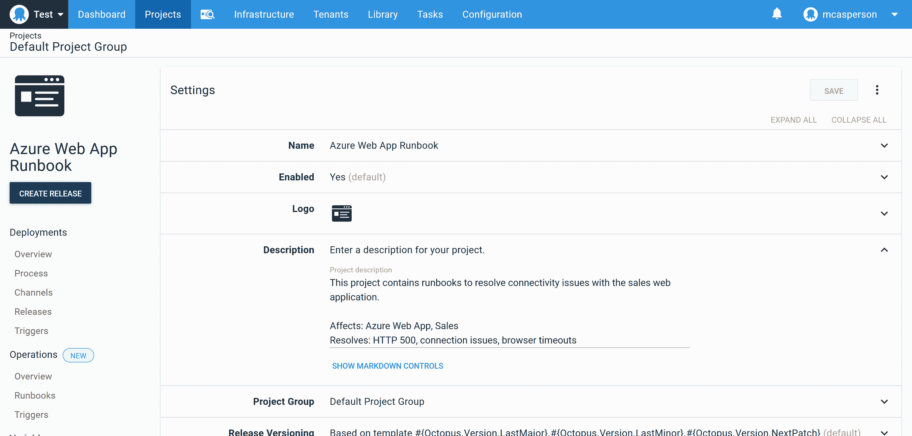
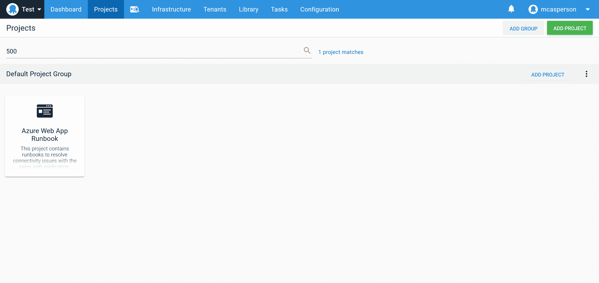
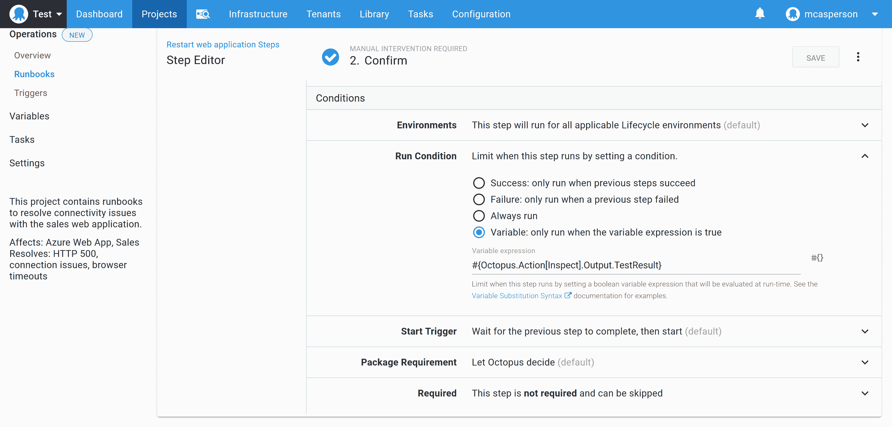
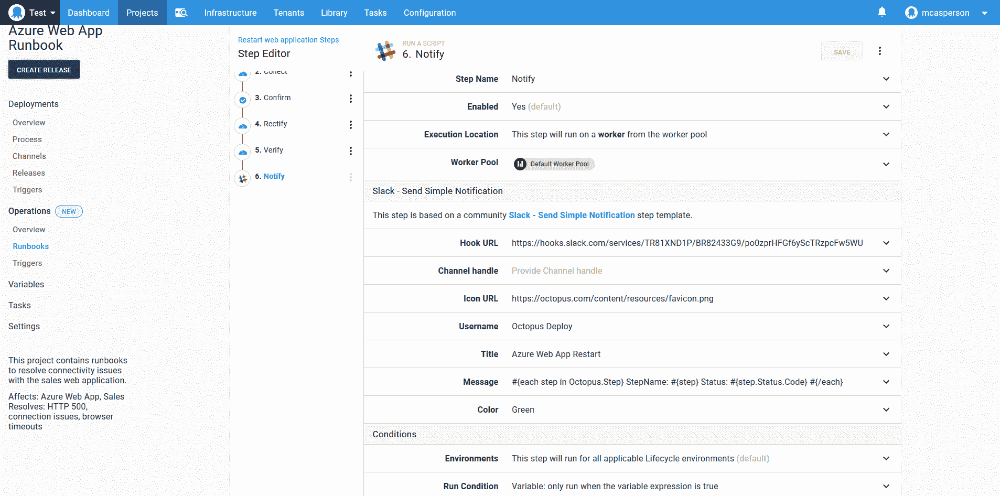
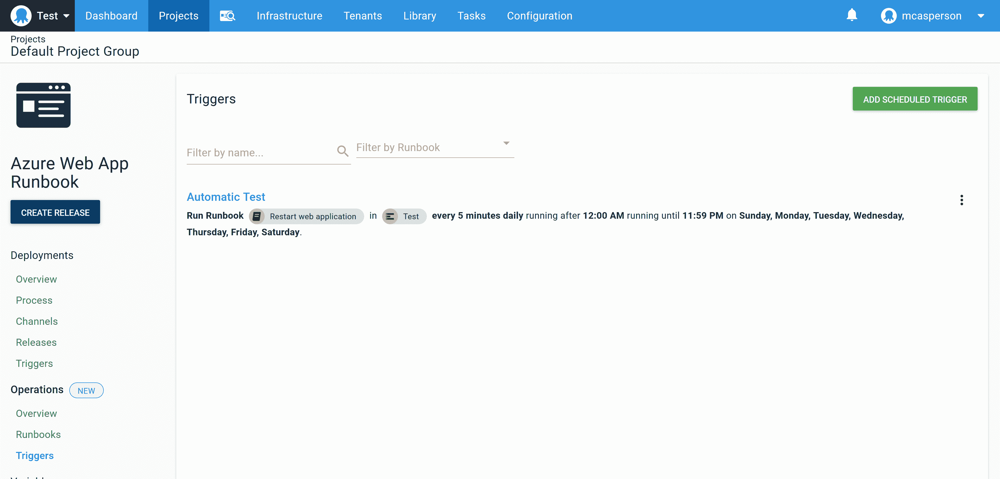

# 操作手册最佳实践- Octopus 部署

> 原文：<https://octopus.com/blog/runbooks-best-practices>

瀑布、敏捷或极限编程。不管你是实现它们还是同意它们，不可否认的是开发人员总是在寻求优化他们的工作流程。虽然具体的方法不同，但它们都归结为保持高速度和高质量。要实现这一点，你需要自动化。

然而，运营领域并没有像开发人员那样受到青睐，让运营团队去入侵 CI 服务器以实现任务自动化。CI 服务器是为自动化软件开发而构建的，而运营团队永远是次要考虑因素。

通过 runbooks，Octopus 将运营任务提升到了一个顶级概念，为运营团队提供了一个专为其需求而设计的工作流程。

在本帖中，我们将探讨设计操作手册的最佳实践，为运营团队从手动工作流程转向自动化工作流程提供模板。例如，我们创建了一个 runbook 来重启 Azure web 应用程序。

## 形容

现在是凌晨 1 点，你的寻呼机响了，让你知道你的网站关闭了。你最不想做的事情就是费力地阅读一页页的项目和脚本，以找到解决问题的方法。这使得可发现性对运行手册至关重要。

每个 Octopus 项目都有一个描述字段。runbook 应该利用该字段来记录 runbook 的目标服务以及 run book 解决的问题。描述字段可从主 Octopus 仪表板进行搜索，允许运营和支持人员根据关键字搜索找到合适的项目，而不是对所有可用脚本的死记硬背。

在下面的屏幕截图中，您可以看到示例项目包括几个关键字，如“500”和“Azure Web App ”,它们与 runbook 的预期使用场景相匹配:

[](#)

在 Octopus dashboard 中搜索这些关键字会返回 runbook 项目:

[](#)

## 检查

操作手册的第一步是检查系统的当前状态，以确定它是否降级。

对于我们的示例 runbook，我们将使用**运行 Azure PowerShell 脚本**步骤向网站发出 HTTP 请求并检查响应代码。HTTP 调用的结果保存在 Octopus 变量`TestResult`中。

下面的脚本测试 HTTP 响应代码:

```
[System.Net.ServicePointManager]::SecurityProtocol = [System.Net.SecurityProtocolType]::Tls12;

$status = [int]([System.Net.WebRequest]::Create("https://$Hostname").GetResponse().StatusCode)
Set-OctopusVariable `
  -name "TestResult" `
  -value ($status -eq 200)

Write-Host "Web application returned HTTP status code $status" 
```

## 收集

为了补充上一步，我们需要收集诊断信息，以便日后确定问题的根本原因。

此处收集的信息也可用于下一步，以便支持人员确定系统是否降级，而不管上一步中返回的 HTTP 响应代码。

下面的脚本捕获 Azure Web App 日志文件，并将其保存为 Octopus 工件:

```
[System.Net.ServicePointManager]::SecurityProtocol = [System.Net.SecurityProtocolType]::Tls12;

az webapp log download `
    --name MySalesWebApp `
    --resource-group SalesResourceGroup `
    --log-file logs.zip

New-OctopusArtifact "logs.zip" 
```

## 确认

web 应用程序关闭的原因有很多。例如，内存泄漏和资源高峰可能导致站点不可用，但偶尔仍会返回有效的 HTTP 响应代码。

如果 inspect 步骤未能识别出问题，我们会显示一个提示，询问运行手册是否应该继续，让支持人员有机会运行手动测试或查看在 collect 步骤中检索到的诊断信息，并决定是否继续。

实际上，这个步骤是作为一个手动干预步骤来实现的，该步骤在最后一个步骤中创建的`TestResult`变量为真的条件下运行(换句话说，如果 inspect 步骤成功地联系了 web 应用程序，因此没有发现问题)。

[](#)

值得注意的是确认步骤出现的频率。如果手动进行是正常的，这意味着检查步骤不能准确地识别系统的错误状态。准确地确定系统是否降级是自动化该过程的一个重要要求。

## 整流

纠正步骤是 runbook 的核心，在我们的例子中，Azure web 应用程序就是在这里重启的。这是通过**运行 Azure PowerShell 脚本**步骤实现的，该步骤调用以下脚本来重新启动 web 应用程序:

```
az webapp restart 
```

在我们的行业里，时断时续是一个笑话，但这仅仅是因为它非常有效。

## 核实

验证步骤类似于检查步骤，除了这里实现的检查有望通过校正步骤。

在我们的示例中，verify 步骤进入一个循环，在五分钟内检查 HTTP 状态代码。一旦返回 200 响应代码，我们就认为应用程序正在运行。该步骤的代码如下所示:

```
[System.Net.ServicePointManager]::SecurityProtocol = [System.Net.SecurityProtocolType]::Tls12;

for ($x = 0; $x -lt 30; ++$x)
{
  $status = [int]([System.Net.WebRequest]::Create("https://$Hostname").GetResponse().StatusCode)
  if ($status -eq 200) {
    exit 0
  }
  Start-Sleep 10
}

# We didn't get a good response in 5 mins, so we failed
exit 1 
```

## 通知

通知团队的其他成员执行了重启是很有用的。Octopus 有通过几个通信平台发送消息的步骤，这里我们使用了**Slack-Send Simple Notification**社区步骤来报告每个进行步骤的状态。

下面的文本循环运行操作手册的步骤，并打印它们的状态:

```
#{each step in Octopus.Step}
StepName: #{step}
Status: #{step.Status.Code}
#{/each} 
```

[](#)

## 试验

如果你有一个坏的系统和一个未经测试的手册来修复它，你有两个问题。

部署的环境进展的想法从一开始就是 Octopus 的核心租户，runbooks 可以访问所有相同的环境。正如您在进入生产环境之前部署到测试环境一样，在测试环境中执行操作手册允许流程在用于生产中断之前得到验证。

## 使自动化

实施前面的步骤意味着您的操作手册可以准确地识别系统何时未按预期工作，纠正问题，并验证系统是否回到了所需的状态。您还将在生产环境之外测试该操作手册。这种方法是专为在操作手册流程中注入高度信心而设计的。

此时，您有能力定期自动触发 runbook。为此，确认步骤被禁用或删除，对剩余步骤使用运行条件`#{unless Octopus.Action[Inspect].Output.TestResult}true#{/unless}`,并根据需要创建一个预定触发器来执行运行手册:

[](#)

## 结论

无论您喜欢哪种方法，实现高速度和高质量都需要自动化。本帖中概述的步骤旨在生成一本可以自信地自动运行的运行手册。

可靠地识别系统何时未处于预期状态，纠正问题，验证修复，并在测试环境中验证整个过程，确保您的操作手册与您的软件部署具有相同的质量。

阅读我们的 [Runbooks 系列](https://octopus.com/blog/tag/Runbooks%20Series)的其余部分。

愉快的部署！