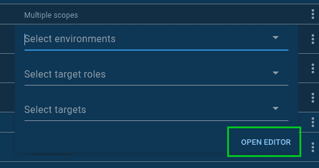
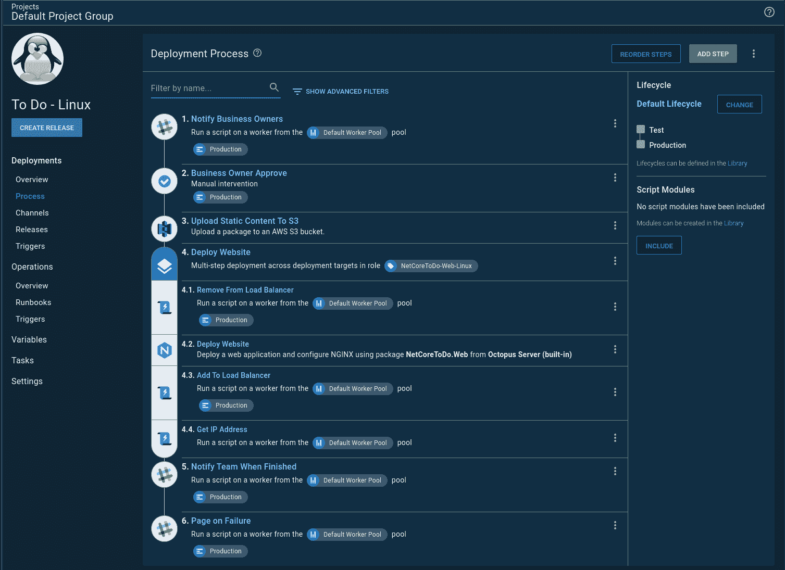

# 将基础设施用作运营手册代码- Octopus Deploy

> 原文：<https://octopus.com/blog/runbooks-with-infrastructure-as-code>

基础设施即代码(IaC)是一种现代的声明性基础设施配置方法。在这篇文章中，我分享了一些关于 Runbooks 如何帮助您以简洁明了的方式管理基础设施安装和拆卸的经验教训。

在准备 [Octopus 2020.1 发布网上研讨会](https://www.youtube.com/watch?v=M5ejzd8KdbQ&feature=youtu.be)时，我需要为我的演示上下旋转基础设施。在 runbooks 之前，我有一个单独的*基础设施作为代码*项目来处理这个问题。我不想再这样做了，Operations Runbooks 就是根据这种情况设计的。网上研讨会的准备工作使我能够将我的过程移植到一本操作手册上，并且它给了我一个机会来调整我如何在 Octopus Deploy 中处理基础设施代码。

## 什么是作为代码的基础设施？

基础设施作为代码是一种在文件中建模所需基础设施的方式，通常用 YAML、JSON 或 Hashcorp 语言(HCL)编写。云提供商拥有接收该文件并调配您所请求的基础架构的机制，但每个提供商都有自己的基础架构定义:

使用云提供商提供的工具有其优势；例如，他们通常有一个 UI 来帮助调试。该过程由 CLI 启动，但是当出现问题时，您可以通过用户界面中的日志来查找根本原因。此外，为了帮助学习曲线，它们要么提供示例，要么让您在 UI 中定义所需的基础结构并将其导出到文件中。顺便说一下，这就是我如何创建 ARM 模板。

使用所提供的工具的不利方面是锁定的风险。AWS Cloudformation 的术语不能翻译成 Azure ARM 模板。这就是第三方工具如 [Hashcorp 的 Terraform](https://www.terraform.io/) 有用的地方。它们提供了一个通用的框架，可以跨所有云提供商使用。

## 基础设施作为运行手册之前的代码

在 runbooks 之前，我的基础设施代码流程是一个正常的部署流程，尽管我没有*部署*任何东西，而是针对云提供商运行脚本。我的过程目标很简单；只有一个项目可以摧毁我的基础设施。

这种方法导致了一些怪癖。首先，我必须创建一个生命周期，因为我正在使用一个部署过程，而部署过程有生命周期。在这个例子中，我有两个环境，`Test`和`Production`。然而，我需要一个环境来摧毁一切。这导致了我的第二个怪癖。我需要另一个叫做`Teardown`的环境。

我的部署过程有点复杂，因为它包括以下步骤:

*   作用于除`Teardown`之外的任何环境
*   范围扩大到`Teardown`

你会注意到在我的生命周期中`Test`和`Production`是可选的。这让我想到了我的下一个怪癖。第一次配置 IaC，无论是对于 AWS CloudFormation，Azure ARM Templates，GCP 部署管理器，还是 Hashicorp 的 Terraform，都需要大量的试错。通常，我在一两次尝试后就创建好了基础设施，但之后的一切都令人头疼。创建了一个虚拟机，但引导脚本遗漏了一些内容。正确测试修复需要拆除和旋转基础设施。有时错误发生在`Test`而其他时间发生在`Production`。如果部署真的失败了，我需要一个到达`Teardown`的方法。因此，`Test`和`Production`是可选的。

## AWS 区域特定设置

对于本文，我使用 AWS CloudFormation 来启动一个 Ubuntu VM，在该 VM 上安装一个触手，并向 Octopus Deploy 注册触手。在选择 AWS 时，我无意中发现了另一个怪癖:每个地区都是隔离的。绝大多数情况下，资源不能在地区之间共享；这包括:

*   虚拟机的 SSH 密钥
*   AMI 图像
*   子网
*   安全组

这不是一份包罗万象的清单。

我*并不*希望每个地区都有一个环境(可扩展性很差)，但是我需要一种方法来进行特定地区的设置，所以我使用了 [Octopus Deploy 的多租户](https://octopus.com/docs/deployment-patterns/multi-tenant-deployments)功能。租户可以是:

*   SaaS 应用程序的客户
*   每个开发人员一个沙箱
*   数据中心
*   AWS 区域

我最喜欢的租户特性之一是，每个环境中的每个租户都可以有一个唯一的变量值。这对于数据库连接字符串来说是有意义的，但是在我的 IaC 例子中，这会导致大量的重复值。我不想在`Test`、`Production`、`Teardown`上定义同一个 AMI。幸运的是，可以配置特定于租户的变量，以便在所有环境中使用。

### 备选方案 1。利用租户标签集

首先，我创建了一个名为`AWS Region`的租户标签集:

我这样做是因为租户标签的作用域可以是一个变量。您可以通过点击`Open Editor`链接来访问该变量范围:

这将打开一个模态窗口，让您选择租户标记:

我创建了一个名为`AWS`的变量集，其中填充了我的 CloudFormation 模板所需的变量:

### 选项 2。利用变量集变量模板

我选择了选项 1，因为它可以更容易地创建截图并向新用户演示。我发现大多数人*看到上面的截图就明白了*。它对于显示每个 AWS 区域的差异也很有用。但是，您必须复制租户名称作为租户标记。

另一个选择是利用变量集变量模板。在变量集中，有一个`Variable Templates`选项卡。首先，添加一个变量模板:

在租户变量屏幕上，您会看到一个`Common Templates`选项卡。将出现您添加到变量集中的变量模板。加州地区给了我最大的心痛，这就是为什么它有一个阿诺德尖叫加州的图像:

租户必须连接到与变量集相连的项目。

如果我在企业环境中设置 Octopus Deploy，我会使用这个选项。

## 将部署过程移植到运行手册

我很快意识到我不应该从部署过程直接移植到 runbooks。我需要重新思考如何配置我的 IaC 进程。如前所述，我想要一个单一的进程来启动和关闭我的基础设施。我的*基础设施即代码*项目的过程反映了这个目标。然而，这个单一的项目目标让我做出了一些次优的配置。

这些次优配置是:

*   一个`Teardown`环境的整个概念以及随后的生命周期。
*   必须确定一个步骤的范围，要么在`Teardown`中运行，要么在除`Teardown`之外的所有环境中运行。换句话说，我把两个进程挤成了一个。
*   那个`Teardown`环境要求我写脚本同时拆掉`Test`和`Production`。
*   因为我需要同时分解所有东西，所以我的变量范围变得更加复杂。

让我们花一点时间来讨论变量范围，因为它很好地揭示了我的过程中的多个问题。在`Test`和`Production`中，虚拟机名称的变量模板遵循以下格式`[Application Name]-[Component]-[Environnment Abbreviation]`。例如，`todo-web-t`用于待办应用的 web 服务器。`Teardown`变量不包括环境缩写。刚好是`[Application Name]-[Component]`。为所有环境取消注册虚拟机所需的`Teardown`流程。该注销脚本找到并删除了所有以`[Application Name]-[Component]`开头的目标。这是一个简单的例子；添加区域变得更加复杂。想出一个不会导致意外删除错误目标的变量模板花了相当多的时间。

### 拆分流程

我做的第一个改变是将 IaC 过程分成两个操作手册。一个运行手册启动了基础设施，另一个则删除了它。

由于这种分离，我不再需要`Teardown`环境。这反过来简化了变量。我还了解到我可以将变量的范围扩展到特定的操作手册。这意味着我不会将未使用的变量传递到部署中。换句话说，我可以有简单的变量，它们只用于特定的操作手册:

这个过程也让我更容易理解。我并没有试图将两个过程混为一谈:

### 房客

我仍然希望保持我的租户按区域配置。然而，我的示例应用程序不是多租户的；它是小号的。NET 核心 web 应用程序运行在 NGINX 与 NoSQL 后端。它不需要任何东西，只需要在一些地区进行拆分。做一些类似金丝雀部署或蓝/绿部署的事情是多余的。

我想要的是:

*   当我部署测试时，部署到`Ohio`区域中的服务器。
*   当我部署到生产环境时，使用滚动部署部署到`Ohio`、`California`和`Oregon`地区的所有服务器:

这是我发现一个项目可能不允许租用部署，但是一个操作手册可以要求它们。在我的项目设置中，我将其设置为禁用租用部署:

但是，我将每个 runbook 设置为需要一个租户:

因为操作手册没有生命周期，所以概览屏幕看起来与您可能习惯的常见项目概览屏幕略有不同:

### 按计划启动和关闭基础架构

虚拟机需要钱。对于本例，我不需要虚拟机全天候运行。我宁愿让它们只在工作日运行。您可能对您的测试环境有类似的需求。如果没有任何东西在使用虚拟机，为什么要花钱让它们运行呢？

这让我想到了一个小问题。runbooks 的预定触发器允许我选择 1 到 N 个环境:

触发器将启动两个任务，每个任务对应我指定的一个环境。对于两个环境，这并不是什么大问题，但是当我配置另一个示例时遇到了瓶颈，我想要四个环境。正在运行的并发任务的数量将呈指数级增长。我不想让我的任务队列因我的基础设施上下旋转而过载。我的第一个想法是，我可以安排触发间隔 15 分钟。例如:

*   项目 A 启动`Development`基础设施:早上 6:00
*   项目 A 启动`Test`基础设施:上午 6:15
*   项目 B 启动`Test`基础设施:早上 6:30
*   项目 A 启动`Staging`基础设施:上午 6:45
*   项目 A 启动`Production`基础设施:早上 7:00
*   项目 B 启动基础设施:上午 7:15

这并不能很好地扩展。尤其是当我添加更多项目时。有时需要 5 分钟来启动基础设施，有时需要 20 分钟，我不想浪费时间等待，但同时，我希望避免任务队列过载。

我需要的是一本操作手册，它可以有序地启动我的所有基础架构。如果你熟悉 JQuery 承诺，本质上我想把我的承诺串起来。一次运行一本操作手册，完成后，开始下一本。

一个 runbook 启动另一个 run book 没有内置的步骤，所以我写了这个[步骤模板](https://library.octopus.com/step-templates/0444b0b3-088e-4689-b755-112d1360ffe3/actiontemplate-run-octopus-deploy-runbook)。现在，我可以让一本操作手册有条不紊地在我的基础架构上运行。我把那本手册叫做`Unleash the Kraken`:

我有两个预定的触发器，一个用来启动一切，另一个用来摧毁一切。您会注意到拆除触发器每天都在运行，而旋转触发器只在周末运行。这只是以防任何基础设施在周末启动:

## 结论

从使用部署流程构建基础设施到使用操作手册，有一些变化。总的来说，我对这些变化感到高兴，一切都感觉干净了许多。

关于 runbooks，我最喜欢的部分是不必为每次运行创建一个版本。为了让我的 CloudFormation 模板和 bootstrap 脚本正确，我不得不在成功之前做了大量的运行。不用跳释放舞感觉很好。