# 在基于 Windows 的 Docker 容器中运行 SQL Server Developer-Octopus Deploy

> 原文：<https://octopus.com/blog/running-sql-server-developer-install-with-docker>

[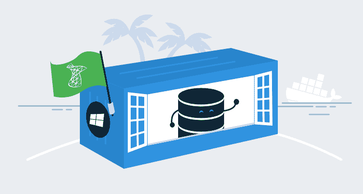](#)

在开发机器上运行 SQL Server 是自动化数据库部署的一个关键部分。通常，在本地运行 SQL Server 是通过[安装 SQL Server Developer edition](https://octopus.com/blog/automate-sql-server-install) 来完成的。这样做的缺点是 SQL Server Windows 服务需要一直运行，这会消耗资源，安装程序会添加一堆额外的应用程序，开发人员负责升级它。

有可能两全其美吗？在本地运行 SQL Server，但仅在需要时运行，并使其易于升级？很长一段时间以来，SQL Server 一直是 Docker 映像，看起来它可以解决这些令人头痛的问题。真正的问题是，建立起来有多难？在本文中，我旨在回答这个问题，并帮助您让 SQL Server 在 Docker 容器中运行。

## 基于 Windows 的容器

我从大学开始就一直在 Windows 上开发。我知道 Linux 的核心概念，但我绝不是专家。同时学习 Linux 和 Docker 是一件很困难的事情。Docker 提供了运行基于 Linux 和 Windows 的容器的能力。微软为 SQL Server Developer Edition 提供了一个[基于 Windows 的容器，所以为了让学习更容易，我将在本文中使用这个容器。](https://hub.docker.com/r/microsoft/mssql-server-windows-developer)

## 准备工作

本文假设您对 Docker 有一定的了解。如果你不熟悉 Docker 的核心概念，我鼓励你阅读 [Docker 概述页面](https://docs.docker.com/engine/docker-overview/)。

我的笔记本电脑运行的是 Windows 10 专业版。我将使用 Docker 桌面，有时被称为 Docker for Windows。在我开始使用 Docker 之前，需要做一些准备工作。

### 启用 CPU 虚拟化

归根结底，Docker 是一个虚拟化主机。就像任何其他虚拟化主机一样，CPU 必须支持虚拟化，并且必须启用该功能。通常情况下，虚拟化是在 BIOS 中启用的，这意味着您必须在 Google 上搜索如何在您的计算机制造商的 BIOS 中启用它。英特尔称他们的虚拟化技术[为英特尔 VT](https://www.intel.com/content/www/us/en/virtualization/virtualization-technology/intel-virtualization-technology.html) ，以及英特尔 VTx。AMD 称他们的虚拟化技术为 [AMD V](https://www.amd.com/en/technologies/virtualization) ，有时你会看到它被称为 VDI 或 SVM。

### 安装 Docker for Windows

在快速 BIOS 更新之后，是时候安装 Docker Desktop 了，它包括 Docker Compose 和 Docker CLI。安装 Docker for Windows 的整个过程被很好地记录了下来。无需在此重复。

有一点要注意，如果你没有启用 Hyper-V，安装程序会为你启用它。那将需要重新启动计算机。

如前所述，我将使用基于 Windows 的容器。安装 Docker 桌面后，我需要切换到 Windows 容器。右键单击任务栏中的 Docker 桌面图标并选择`Switch to Windows containers...`即可完成。

[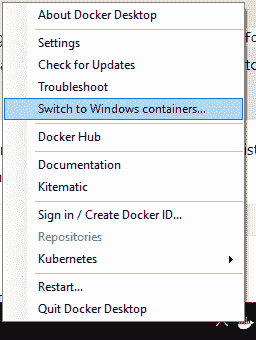](#)

### 设置文件夹以与 Docker 容器共享

默认情况下，Docker 将所有容器视为无状态的。预计对容器所做的任何更改(如创建数据库)都将被销毁。这个问题可以通过利用 Docker 中的卷来解决。我在硬盘上建立了一个文件夹 C:\Docker\Volumes 来存储这些卷。

[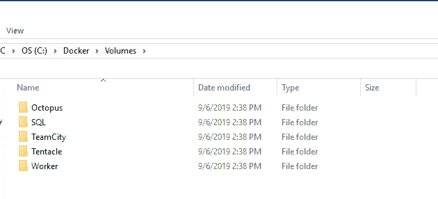](#)

值得注意的是，如果我将这些作为基于 Linux 的容器运行，我需要遵循 [Docker 文档中列出的关于共享驱动器的步骤](https://docs.docker.com/docker-for-windows/#shared-drives)。

### 防病毒配置

运行 Windows 容器的一个缺点是(除了空间开销之外)，反病毒软件可能会阻止它们下载。发生这种阻塞是因为 Docker 在 Windows 文件系统上存储图像的方式。实际上，另一个名为 Windows 的文件夹将出现在一个看似随机的位置。当反病毒扫描仪发现它们时。确保您使用的是最新版本的防病毒软件。如果你不得不将`C:\ProgramData\Docker`排除在扫描之外，不要感到惊讶。

[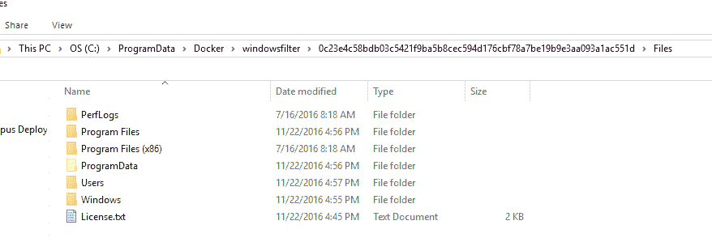](#)

## 配置 SQL Server 开发人员容器

启动并运行一个容器很容易，甚至是 SQL Server。我想将它用于实际的开发工作，这意味着我需要解决以下问题:

1.  无需额外配置即可启动并运行容器。
2.  通过 SSMS 连接到它。
3.  持久化在容器中创建的数据库。
4.  保存映像配置供他人使用。

### 首次运行 SQL Server Developer 容器

这份清单看起来令人望而生畏，尤其是如果你是 Docker 的新手。我想一步一步来。首先，让我们运行一个简单的命令，从 Docker Hub 下载 SQL Server Windows 开发人员映像:

```
docker pull microsoft/mssql-server-windows-developer 
```

如果你是一步一步地跟着做，沏些茶或咖啡，然后坐下来，因为这可能需要一段时间来完成。它不仅下载该映像，还下载所有的依赖项。

[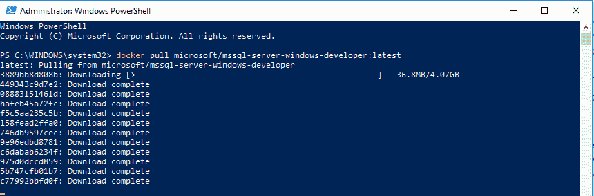](#)

既然已经下载了映像，现在是启动它并运行一些 SQL 脚本的时候了。幸运的是，微软添加到 Docker Hub 的文档[让这变得很容易。请记下正在发送的`--name`参数。该参数将使以后的工作更加容易。在命名实例的同时，我将端口设置为默认的 SQL Server 端口，`1433`:](https://hub.docker.com/r/microsoft/mssql-server-windows-developer)

```
docker run --name SQLServer -d -p 1433:1433 -e sa_password=Password_01 -e ACCEPT_EULA=Y microsoft/mssql-server-windows-developer 
```

[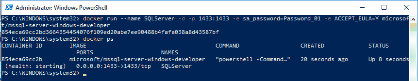](#)

### 从主机上的 SSMS 连接到容器

SQL Server 容器正在运行，但是我们如何从主机通过 SSMS 连接到它呢？在 run 命令中，我使用了开关`-p`，它是 publish 的缩写。本质上，端口 1433 被发布给主机，这意味着我们可以通过`localhost`访问它。要将 SSMS 连接到我的 Docker SQL Sever，我需要做的就是输入`localhost`，以及上面定义的用户名/密码`sa`。

[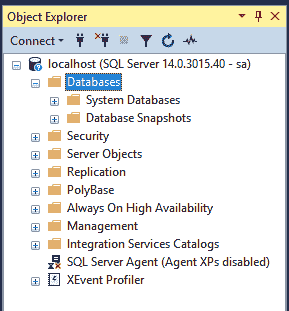](#)

就像普通的 SQL Server 一样，一切都按预期运行。我可以毫无问题地创建一个数据库和表格。

[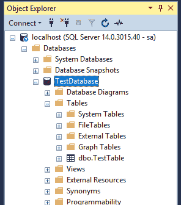](#)

### 持久化在容器中创建的数据库

如果容器需要重启会怎么样？

```
docker stop SQLServer
docker start SQLServer 
```

重启后，数据库和所有表仍然存在。

[](#)

如果需要重新创建容器呢？通常，这是在容器配置更改或发布新版本时完成的。除了`stop`命令，我还需要运行`rm`命令来删除容器:

```
docker stop SQLServer
docker rm SQLServer
docker run --name SQLServer -d -p 1433:1433 -e sa_password=Password_01 -e ACCEPT_EULA=Y microsoft/mssql-server-windows-developer 
```

在这种情况下，所有数据库都被删除了。

[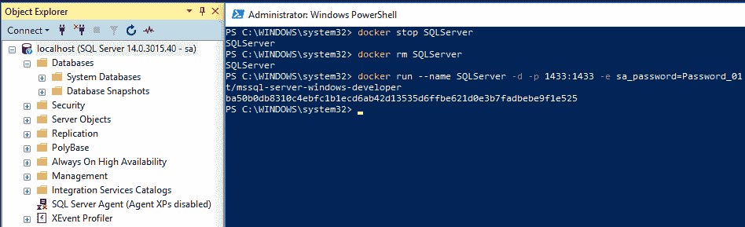](#)

我们需要一种持久化数据的方法来处理容器的重启和容器的重建。

数据库文件需要持久化。这是使用卷完成的，将指向`C:\Docker \Volumes\SQLServer`。还有[多](https://blog.sixeyed.com/docker-volumes-on-windows-the-case-of-the-g-drive/)，[多](https://github.com/docker/labs/blob/master/windows/sql-server/part-3.md)篇关于 [Docker 卷](https://docs.docker.com/storage/volumes/)。TL；DR；就是把`--volume`开关加到`docker run`来加一个卷。如果容器已经在运行，则需要在添加卷之前将其销毁:

```
docker stop SQLServer
docker rm SQLServer
docker run --name SQLServer -d -p 1433:1433 --volume c:\Docker\Volumes\SQLServer:c:\SQLData -e sa_password=Password_01 -e ACCEPT_EULA=Y microsoft/mssql-server-windows-developer 
```

所有数据库创建命令都需要指定`C:\SQLData\`作为数据的目录。假设我希望这个 SQL Server 容器托管 Octopus Deploy 和 TeamCity 的数据库。这些命令是:

```
CREATE DATABASE [OctopusDeploy]
 CONTAINMENT = NONE
 ON  PRIMARY
( NAME = N'OctopusDeploy', FILENAME = N'C:\SQLData\OctopusDeploy.mdf' , SIZE = 8192KB , FILEGROWTH = 65536KB )
 LOG ON
( NAME = N'OctopusDeploy_log', FILENAME = N'C:\SQLData\OctopusDeploy_log.ldf' , SIZE = 8192KB , FILEGROWTH = 65536KB )
GO
CREATE DATABASE [TeamCity]
 CONTAINMENT = NONE
 ON  PRIMARY
( NAME = N'TeamCity', FILENAME = N'C:\SQLData\TeamCity.mdf' , SIZE = 8192KB , FILEGROWTH = 65536KB )
 LOG ON
( NAME = N'TeamCity_log', FILENAME = N'C:\SQLData\TeamCity_log.ldf' , SIZE = 8192KB , FILEGROWTH = 65536KB )
GO 
```

毫无疑问，数据库创建成功。

[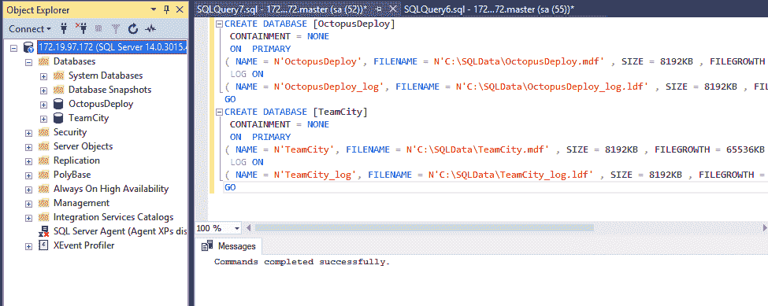](#)

它们现在显示在主机系统的目录中。

[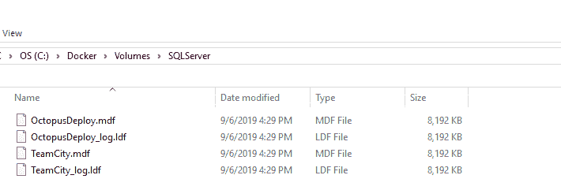](#)

这些数据库的名称和路径可以使用`attach_dbs`环境变量传递给容器。可以使用 PowerShell 脚本引导所有这一切。对于本文，我没有这样做，因为我只需要创建数据库一次。我看不出花费精力写一个脚本来解决一个我只需要做一次的问题有什么意义。

```
docker stop SQLServer
docker rm SQLServer
$attachDbs = "[{'dbName':'OctopusDeploy','dbFiles':['C:\\SQLData\\OctopusDeploy.mdf','C:\\SQLData\\OctopusDeploy_log.ldf']},{'dbName':'TeamCity','dbFiles':['C:\\SQLData\\TeamCity.mdf','C:\\SQLData\\TeamCity_log.ldf']}]"
docker run --name SQLServer -d -p 1433:1433 --volume c:\Docker\Volumes\SQLServer:c:\SQLData -e sa_password=Password_01 -e ACCEPT_EULA=Y -e attach_dbs=$attachDbs microsoft/mssql-server-windows-developer 
```

现在，当重新创建容器时，这些数据库被装载。

[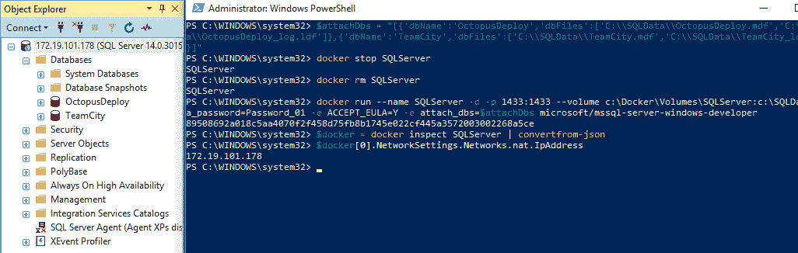](#)

### 在 Docker Compose 中保存配置

到目前为止，我一直在大量使用命令行，特别是`docker stop`、`docker rm`和`docker run`。老实说，我一直在复制和粘贴上面的命令，而不是重新键入它们。一种选择是利用 [Docker Compose](https://docs.docker.com/compose/) 。Docker 容器配置存储在 YAML 文件中，而不是脚本文件中。

```
version: '3.7'
services:
  SQLServer:
   image: microsoft/mssql-server-windows-developer
   environment:
     - ACCEPT_EULA=Y
     - SA_PASSWORD=Password_01   
     - attach_dbs=[{'dbName':'OctopusDeploy','dbFiles':['C:\\SQLData\\OctopusDeploy.mdf','C:\\SQLData\\OctopusDeploy_log.ldf']},{'dbName':'TeamCity','dbFiles':['C:\\SQLData\\TeamCity.mdf','C:\\SQLData\\TeamCity_log.ldf']}]
   ports:
     - '1433:1433'
   volumes:
     - c:\Docker\Volumes\SQLServer:c:\SQLData 
```

我将 docker-compose 文件保存在硬盘上 C:\Docker 文件夹中:

[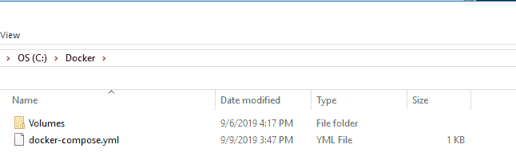](#)

然后我在 PowerShell 中运行了这个命令:

```
Set-Location C:\Docker
docker-compose up -d 
```

我得到了同样的结果。我更喜欢用这个，因为它更容易阅读，因此也更容易修改。跑起来也很轻松。

[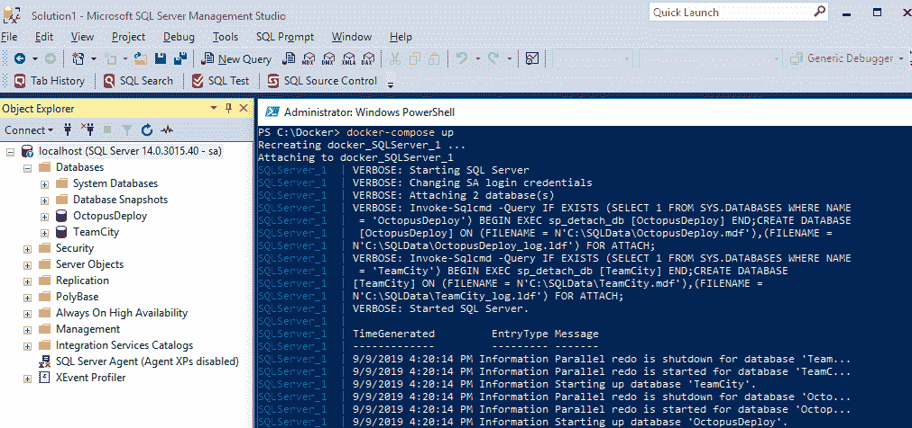](#)

## 结论

让 SQL Server 在 Docker 中运行比我想象的要容易得多。我期待着一小时又一小时的工作，但最终，我在一小时内就完成了一些工作。公平地说，这不包括对 Docker 如何工作的研究。我的希望是这篇文章给了你足够的指导，让你自己深入 Docker，并意识到它并没有那么大和可怕。也许，仅仅是也许，您将使用 Docker 在您的开发机器上托管 SQL Server，而不是安装 SQL Server Developer。

下次再见，愉快的部署！