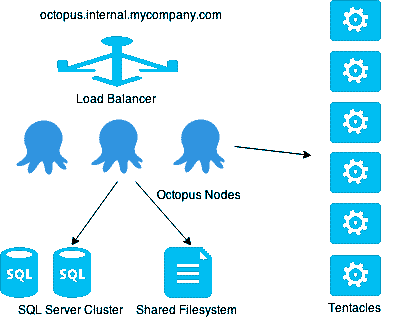
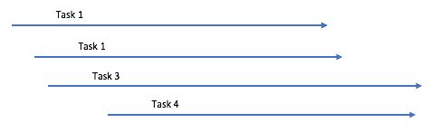
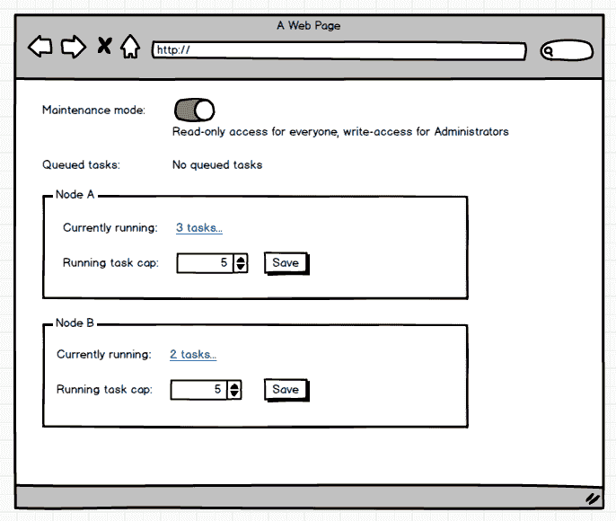

# 运行任务上限和高可用性- Octopus 部署

> 原文：<https://octopus.com/blog/running-task-cap-and-high-availability>

很快我们将推出 **Octopus:高可用性(HA)版**。五月份，Damian 写了一篇关于高可用性旨在支持的[类场景的文章。最近，Shane 一直在将 Octopus 服务器推向极限，以确保节点分配负载并找到瓶颈。为了准备高可用性，我们正在做一些改变，这将使管理 Octopus 服务器工作负载更容易。](https://octopusdeploy.com/blog/octopus-deploy-high-availability)

首先，快速回顾一下:在 Octopus: HA 中，负载均衡器在多个 Octopus 服务器之间分配请求。每个 Octopus 服务器处理 web 请求，但也会执行后台任务(比如部署和健康检查)。Octopus 服务器的背后是共享存储——一个共享的 SQL Server 数据库和一个用于任务日志、工件和 NuGet 包的共享文件系统。

## 部署速度与延迟

Octopus 服务器在部署期间做了大量的工作，主要是围绕包的获取:

*   下载软件包(网络绑定)
*   验证包哈希(受 CPU 限制)
*   计算程序包之间的增量(I/O 和 CPU 限制)
*   上传软件包到触须(网络绑定)
*   监控触角的工作状态，并收集日志

当执行非常大的部署时(许多大的包分发到数百台机器上)，很明显，在某个时候，硬件将会限制一台 Octopus 服务器可以同时做多少这样的事情。如果服务器过量使用并达到这些限制，超时(网络或 SQL 连接)将开始发生，部署可能开始失败。

当然，Octopus: HA 通过拥有多个 Octopus 服务器来帮助解决这个问题。注意，共享存储实际上并不是部署过程中的瓶颈——在部署过程中受影响更大的是 Octopus 服务器上的本地硬件。

理想的情况是 Octopus 服务器能够执行尽可能多的并行部署，同时保持在这些限制之下。实际上，这很难预测。我们尝试了各种实验，试图通过查看系统指标来告诉我们是否应该继续消耗新任务，或者退出，但是很难可靠地做到这一点。现在可能有大量的 CPU/内存/I/O 可用，所以我们又选择了一个任务，突然，我们正在运行的其他任务开始了一个需要在数百台机器上运行的步骤，突然，我们又一次超负荷了。

为了让这种“自动调整”方法发挥作用，我们意识到我们需要不断地重新调整并行运行的任务数量。如果部署 A 突然窃取所有 CPU 来计算 SHA1 散列，部署 B 可能需要等待一会儿才能继续。有各种方法可以在这里工作——为某些活动指定专用的工作线程，或者调节执行并行活动的线程。至少最终会是美好而公平的，就像这样:

乍一看，好像比这个好吧？

我们在这条路上走得越多，我们就意识到这是错误的权衡——我们冒着降低部署速度的风险，只是为了尝试并行执行更多部署。鉴于 Octopus 是一个部署自动化工具，部署期间的停机时间是一个重要的考虑因素！如果您在 10 台机器上进行生产部署，我们希望它们快速完成，而不是因为其他人排队部署而慢慢退出。我们应该牺牲整体延迟来换取速度。

## 运行任务上限

到目前为止，我们想到的最简单、最可靠的方法是限制一个节点上一次可以运行的任务数量，并使其可由用户配置。为了管理这一点，我们有一个新的设置，您可以在每个节点的基础上进行配置。

这个运行任务上限将被设置为一个默认值，您可以将它提高或降低到任何适合您的值。这可能不是一个“智能”的解决方案，但是考虑到在更多的场景中部署速度可能比并发性更重要，我认为这是一个很好的权衡。该设置将基于每个节点，也可用于非 HA 设置。

## 服务器排水

这个设置还免费提供了另一个功能。当需要重新启动 Octopus 服务器或安装 Windows 更新时，能够优雅地关闭服务器并允许其他节点来收拾残局是很好的。

为此，我们需要:

1.  停止运行任何新排队的任务，但让已经运行的任务继续运行，直到它们完成
2.  继续处理 web 请求
3.  从池中删除服务器
4.  一旦流量不再流向服务器，并且所有正在运行的任务都已完成，请停止服务并应用任何更改

相同的运行任务上限设置可用于执行这种“消耗”——我们需要做的就是将其设置为 0！已经在运行的任务将继续运行，但排队的任务将保持排队状态，除非另一台服务器将它们取走。