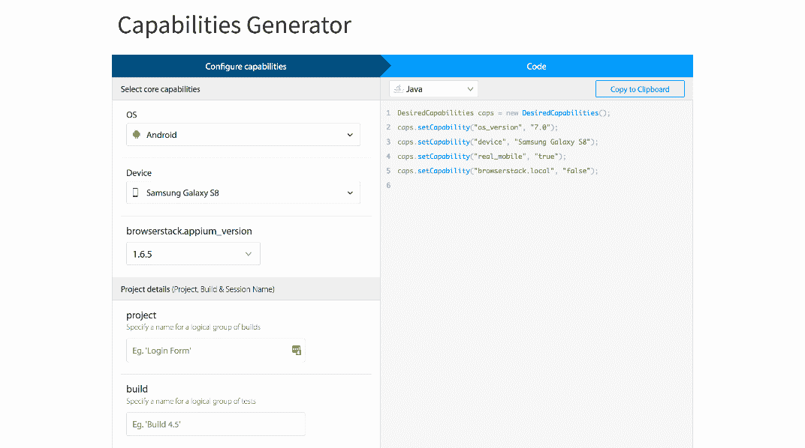
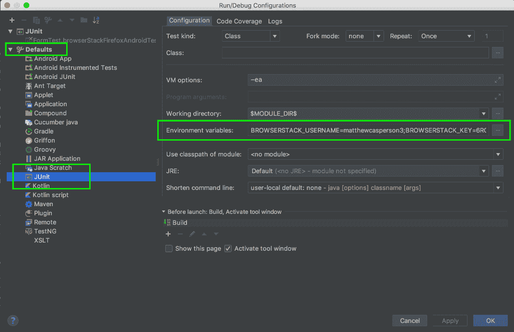
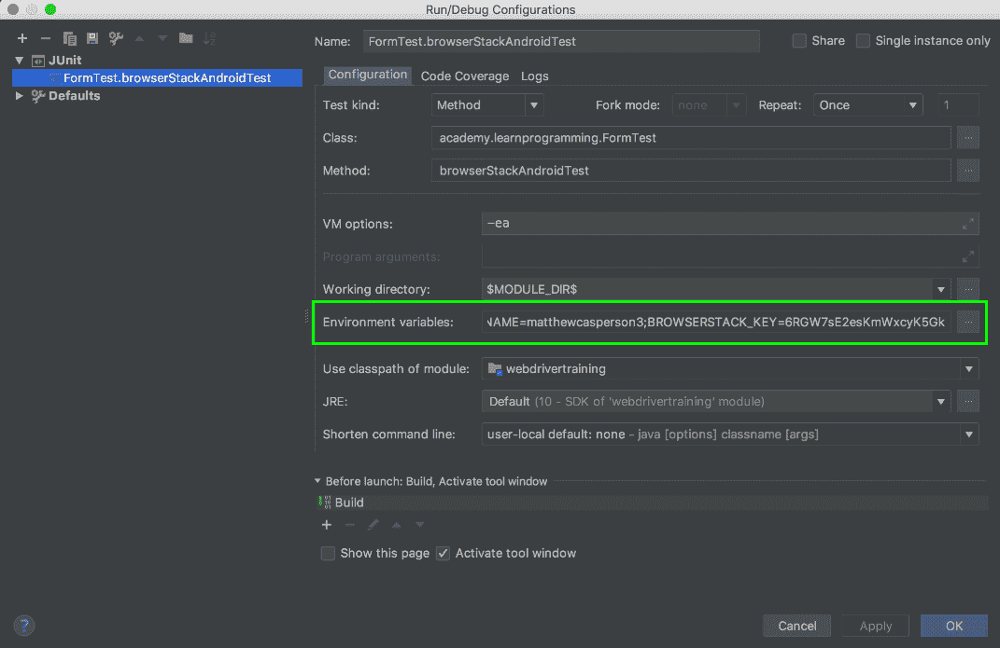

# Selenium 系列:在移动设备上运行测试- Octopus Deploy

> 原文：<https://octopus.com/blog/selenium/18-running-tests-on-mobile-devices/running-tests-on-mobile-devices>

这篇文章是关于[创建 Selenium WebDriver 测试框架](/blog/selenium/0-toc/webdriver-toc)的系列文章的一部分。

到目前为止，我们的测试仅限于桌面浏览器，但是如果没有测试移动浏览器的方法，任何测试策略都是不完整的。移动浏览器测试是 BrowserStack 等服务的主要功能之一。使用我们在桌面浏览器上开发和运行的相同代码，在各种各样的移动浏览器上运行测试是非常容易的。

让我们看看如何在三星 Galaxy Note 8 移动设备上测试 Chrome。

首先，我们需要构建所需的 capabilities 对象来指示 BrowserStack 对 Samsung 设备运行测试。如前所述，我们可以通过在[https://www.browserstack.com/automate/capabilities](https://www.browserstack.com/automate/capabilities)提供的表格获得这些细节。

[](#)

然后我们获取这些设置，并使用它们来构建一个名为`BrowserStackAndroidDecorator`的新装饰器类:

```
package com.octopus.decorators;

import com.octopus.AutomatedBrowser;
import com.octopus.decoratorbase.AutomatedBrowserBase;
import org.openqa.selenium.remote.DesiredCapabilities;

public class BrowserStackAndroidDecorator extends AutomatedBrowserBase {
  public BrowserStackAndroidDecorator(final AutomatedBrowser automatedBrowser) {

  super(automatedBrowser);

  }

  @Override
  public DesiredCapabilities getDesiredCapabilities() {

    final DesiredCapabilities caps = getAutomatedBrowser().getDesiredCapabilities();

    caps.setCapability("os_version", "7.1");
    caps.setCapability("device", "Samsung Galaxy Note 8");
    caps.setCapability("real_mobile", "true");
    caps.setCapability("browserstack.local", "false");

    return caps;
  }
} 
```

然后我们在`AutomatedBrowserFactory`中使用这个类:

```
package com.octopus;

import com.octopus.decorators.*;

public class AutomatedBrowserFactory {

  public AutomatedBrowser getAutomatedBrowser(String browser) {

  // ...

  if ("BrowserStackAndroid".equalsIgnoreCase(browser)) {
      return getBrowserStackAndroid();
  }

  if ("BrowserStackAndroidNoImplicitWait".equalsIgnoreCase(browser)) {
      return getBrowserStackAndroidNoImplicitWait();
  }

  throw new IllegalArgumentException("Unknown browser " + browser);

  }

  // ...

  private AutomatedBrowser getBrowserStackAndroid() {
    return new BrowserStackDecorator(
      new BrowserStackAndroidDecorator(
        new ImplicitWaitDecorator(10,
          new WebDriverDecorator()
        )
      )
    );
  }

  private AutomatedBrowser getBrowserStackAndroidNoImplicitWait() {
    return new BrowserStackDecorator(
      new BrowserStackAndroidDecorator(
        new WebDriverDecorator()
      )
    );
  }
} 
```

然后，我们可以在测试中使用这个新的`AutomatedBrowser`实例:

```
@Test
public void browserStackAndroidTest() {

  final AutomatedBrowser automatedBrowser =
    AUTOMATED_BROWSER_FACTORY.getAutomatedBrowser("BrowserStackAndroid");

  final String formButtonLocator = "button_element";
  final String formTextBoxLocator = "text_element";
  final String formTextAreaLocator = "textarea_element";
  final String formDropDownListLocator = "[name=select_element]";
  final String formCheckboxLocator = "//*[@name=\"checkbox1_element\"]";
  final String messageLocator = "message";

  try {
    automatedBrowser.init();

    automatedBrowser.goTo("https://s3.amazonaws.com/webdriver-testing-website/form.html");

    automatedBrowser.clickElement(formButtonLocator);
    assertEquals("Button Clicked", automatedBrowser.getTextFromElement(messageLocator));

    automatedBrowser.populateElement(formTextBoxLocator, "test text");
    assertEquals("Text Input Changed", automatedBrowser.getTextFromElement(messageLocator));

    automatedBrowser.populateElement(formTextAreaLocator, "test text");
    assertEquals("Text Area Changed", automatedBrowser.getTextFromElement(messageLocator));

    automatedBrowser.selectOptionByTextFromSelect("Option 2.1",
    formDropDownListLocator);
    assertEquals("Select Changed", automatedBrowser.getTextFromElement(messageLocator));

    automatedBrowser.clickElement(formCheckboxLocator);
    assertEquals("Checkbox Changed", automatedBrowser.getTextFromElement(messageLocator));
  } finally {
    automatedBrowser.destroy();
  }
} 
```

如果我们运行这个测试，可能会再次生成关于无效凭据的异常。如果您还记得，我们之前将 BrowserStack 凭证定义为环境变量，但是我们只针对单个测试这样做。将这些变量添加到每一个新的测试配置中会很繁琐，所以要将这些环境变量添加到所有测试中，我们需要为 IntelliJ 运行的所有 JUnit 测试配置默认设置。

点击配置下拉列表并选择`Edit Configurations...`

[](#)

这一次，我们没有将环境变量添加到单个测试的配置中，而是将它们添加为任何 JUnit 配置的缺省值。

展开左侧的`Defaults`菜单，选择`JUnit`选项，将`BROWSERSTACK_USERNAME`和`BROWSERSTACK_KEY`添加到`Environment variables`中。

[](#)

您可能需要删除运行测试时创建的 JUnit 配置。这将在左侧菜单中的`JUnit`选项下找到。选择配置，然后单击减号按钮。

[](#)

当您再次运行单元测试时，IntelliJ 将创建一个新的 JUnit 配置，这将使用默认值填充环境变量。

[](#)

再次运行测试，将创建一个新的 BrowserStack 会话，可通过点击 BrowserStack 中的产品➜自动化进行查看。该测试将在三星移动设备上运行。

在大量设备上运行我们的测试的能力显示了 WebDriver 是多么的灵活。通过几个简单的装饰器，我们可以配置我们的测试在 BrowserStack 支持的数百个设备上运行。但是在编写跨桌面和移动浏览器的测试时，我们仍然需要注意一些边缘情况，在下一篇文章中，我们将看到一个例子，我们需要解决环境之间的一些差异。

这篇文章是关于[创建 Selenium WebDriver 测试框架](/blog/selenium/0-toc/webdriver-toc)的系列文章的一部分。