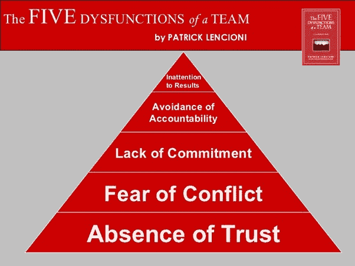

# 安全的模式更新——松散耦合减轻了人为问题——Octopus 部署

> 原文：<https://octopus.com/blog/safe-schema-updates-5-loose-coupling-mitigates-human-problems>

这篇博文是我的安全模式更新系列的第 5 部分。

本系列其他文章的链接如下:

**批评现有系统:**

**想象更好的系统:**

**构建更好的系统:**

> “不管是什么问题，都是人的问题。” *杰拉尔德·温伯格*

在前一篇文章(第 4 部分)中，我们关注了与软件/数据库架构相关的技术问题。在这篇文章中，我们关注人类的问题。

康威定律规定，组织只能设计反映其内部沟通模式的系统。正如 Eric S Raymond 在[《新黑客词典》](https://www.goodreads.com/book/show/104746.The_New_Hacker_s_Dictionary)、*中所言，“如果你有四个团队在开发一个编译器，你会得到一个 4 遍编译器”*。

我们的团队结构显著地影响着我们的软件架构…但是反过来也是正确的:复杂的架构会滋生痛苦和有害的官僚主义和工作文化。如果任其发展，它们可能会形成恶性循环。

当关键但复杂的整体出了问题，并且很难确定原因和结果时，人们通常会迅速指责并掩盖自己的过失。如果我们对自己诚实，我们可能都会想起自己采取自卫行动的时候，即使我们不知道自己是否有错。我们都是有价值但不完美的人类，我们都有自我保护的本能。

帕特里克·兰西奥尼在团队的五大功能障碍中谈到了冲突、承诺和责任。他的第四个功能障碍明确指出逃避责任不利于有效的团队合作:

*图片来源:[https://medium . com/task world-blog/lencionis-5-dysfunctions-of-a-team-330 d58 B2 CD 81](https://medium.com/taskworld-blog/lencionis-5-dysfunctions-of-a-team-330d58b2cd81)*

在本系列的第 2 部分中，作为我们对可靠性和健壮性讨论的一部分，我们讨论了 Richard Cook 对[复杂系统如何失败](https://how.complexsystems.fail/)的深刻研究。

特别是，我们研究了复杂系统中关于责任或责备以及“根本原因分析”的传统观点的问题，在复杂系统中，故障通常是由许多看似不相关的因素引起的。这些挑战是不可避免的，但我们可以通过设计更容易观察、关系、依赖和期望定义更清晰的系统来帮助自己。

当我们将复杂的整体架构分解成更小、更松散耦合的系统时，这有助于每个人对自己的子系统负责。这些子系统应设计为独立于其他系统运行，这样，如果一个系统出现故障，故障通常会被隔离到该系统。没有必要浪费时间调查更广泛的系统或指责。一个合适的工程师团队可以将他们的注意力直接集中在行为不当的子系统上，而其他人可以监控其他子系统，以确保他们按照预期应对中断。

产生反效果的政治机会少得多，人们更容易专注于解决问题、学习和改进。每个人都受益:股东、经理和工程师都一样。

## 服务水平目标(SLO)和停机时间预算

DevOps 运动拒绝了开发团队应该以交付速度为目标，而独立的运营团队以稳定性为目标的想法。这些团队的目标之间的冲突不会激励合作或系统思考。

通过将大块分割成独立的服务，它允许更小的、跨职能的团队负责交付速度*和*他们自己服务的稳定性。当速度/稳定性目标之间存在冲突时，可以由最了解客户需求和技术细节的人来权衡，他们共同拥有速度和稳定性目标。

为了支持这一点，可以给每个服务一组特定的公共服务水平目标(SLO)。下游服务将会意识到这些 SLO，并可以根据这些 SLO 有针对性地设计自己的服务。例如，如果销售服务(来自前一篇文章)承诺 99.9%的正常运行时间，那么支持服务将不会被设计为期望 99.99%。

但是这些 SLO 是双向的。99.9%的正常运行时间，也意味着 0.1%的停机时间(大约 43 分钟/月)。了解这些限制对于设计任何 HA/DR 策略和规划部署/风险管理都是必要的。通过使用具体的数字，我们可以做出实际的、明智的决定。

“停机时间预算”为各方设定了现实的期望，无论他们是相关系统的开发者，还是最终用户。明确的 SLO 鼓励团队计划维护和设计部署模式，将停机时间保持在可接受和可行的范围内。这些停机时间预算还允许团队平衡他们对创新/风险的偏好和他们的稳定性责任。

例如，如果一个团队在一个月的第一周内用完了大部分的月度停机预算，那么现在可能是时候将他们的精力集中在与提高稳定性相关的任务上，而不是推进有风险的新功能。同样，如果他们的业绩经常比他们的 SLO 高出几个数量级，也许他们应该优先考虑下一个面向客户的特性，而不是进一步的稳定性投资。

通过发布每个服务的 SLO 和性能度量，团队对他们自己的工作负责。如果经常错过特定的 SLO，这应该会引发一场关于业务如何支持团队改进的对话。也许 SLO 是不合理的？也许团队需要一点支持？无论哪种情况，它都允许组织将精力和投资集中在最需要的地方。

## 有界上下文支持有限自治

在理想的世界中，评审是必要的，评审应该由能够在代码还新鲜的时候阅读代码、理解结果并提供有见地的改进建议的人来执行。就法规遵从性而言，审查应(至少)由对系统有足够了解的工程师进行，以发现任何潜在的欺诈性变更。(注意:这通常需要大量的技术技能以及一些使用代码库的实践经验。)毕竟，防止欺诈是萨班斯-奥克斯利法案的全部目的。

由于持续集成教导我们优先考虑合并而不是分离(参见第 3 部分)，评审者也应该优先考虑代码评审(合并)而不是他们当前正在进行的任何新的变更(分离)。理想情况下，在提交变更以供批准的几分钟内，审阅者应该暂停他们正在做的任何事情并审阅变更。

没错。应该*期望*评审人员从任何新的开发工作中休息一下，以便优先考虑“开发完成”工作的合并和部署。

从这个角度来看，每周召开变革顾问委员会(CAB)会议的想法听起来应该是有害且低效的。任何出租车成员都大胆地认为任何 WIP 都应该无所事事，腐烂一周，以适应他们自己的时间表，这应该被认为是极其傲慢的。他们还在做什么比合并一周的腐败分歧更重要的事情呢？交付可靠的更新是*字面上的工作重点*——不是一项可以推迟到周末的任务。(我去年已经更详细地讨论了为什么[变更顾问委员会不起作用](https://octopus.com/blog/change-advisory-boards-dont-work)，所以我在这里不再赘述。)

很明显，高级经理不应该审查部署。每当有人提交新的拉取请求时，他们可能无法放下他们正在处理的任何事情。他们的角色是支持健康的评审实践，而不是亲自进行评审。

幸运的是，通过分离我们的系统，任何特定系统的利益相关者的数量都会显著减少。为什么销售系统的工程师应该关心支持系统的发布(反之亦然)？这只会破坏他们的注意力，分散他们对自己的子系统所负责的工作的注意力。API 依赖应该在测试框架中进行编码。如果一个依赖被破坏了，那应该被自动标记，如果一个测试丢失了，那是依赖它的团队的责任。

拥有任何给定服务的速度和稳定性目标的人应该生活在团队内部。他们不需要 CAB 或任何其他外部批准者。他们是实现目标最有效的人。

通过将审查引入给定服务的跨职能团队，我们可以使审查更加及时。这并不一定意味着它们是由开发人员自己完成的，或者甚至是由具有相同角色的人完成的。毕竟，这个团队是跨职能的。也许是高级开发人员或基础设施工程师进行审查？对于数据库变更，可能是数据库专家，甚至是数据库管理员？

修订后的审核流程将更有可能发现错误和/或欺诈性变更，并保持任何“职责分离”要求。如果说有什么不同的话，那就是*比传统的基于出租车的审批做法更符合我迄今为止遇到的任何立法，并且它支持高质量 it 服务的交付，而不是阻碍它。它还支持负责交付和维护服务的团队内部的协作和知识共享。*

人们对放弃 CAB 的一个常见担忧是，高级管理人员或安全团队可能会失去控制、权威或监督。这种看法是没有根据的。对于那些关心的人，我鼓励你们想象这样一个世界:每个服务的状态，就其 SLO 而言，都可以在一个实时仪表板上看到。

任何经常错过 SLO 的服务都会向传统上坐在出租车上的人强调。这将是一个开始对话的线索，讨论为什么会遗漏 SLO，以及可以做些什么来提供帮助。这将允许所有那些非常关心最小化风险的高级管理人员将他们的注意力和精力集中在他们能够在提高安全性方面提供最大价值的人员和服务上。

最后，对于那些反对根据更高层次的商业需求或营销目标来安排发布时间或向客户/用户透露更新的读者，我恐怕要放弃这种想法了。您将在第 7 部分:接近零停机时间的部署中找到该异议的答案。

## 来自高层的坚定的文化领导不是可有可无的

起初，采用公开报道的 SLO 会让工程师感到脆弱。当事情不顺利时，坦诚面对失败需要勇气。如果他们已经在政治有毒的工作文化中工作，尤其如此，在这种文化中，失败通常会导致替罪羊和负面影响。如果我搞砸了大家都能看到，我会不会一出错就被开除？我的意思是，我们都会犯错误，经常令人尴尬。我肯定迟早会被解雇，这是不可避免的。

我想我最好在我的简历上下点功夫，试探一下。

(有趣的事实:当我开始这个系列的时候，我以为会是单篇博文！然后它变成了一个三部曲…现在它变得更大了，我已经远远落后于我最初的出版计划了！我非常感谢八达通公司令人敬畏的人们的耐心和理解！)

向有限责任的转变会带来巨大的好处，但前提是团队感到安全和支持，*尤其是*失败了。这是一件只有通过明确、诚实和真诚的指导才能实现的事情——来自高层的指导。如果你想得到一点帮助来想象那会是什么样子，戴上耳机，然后点按“播放”:

创建一个安全的架构，从技术上来说是安全的，对于交付可靠的服务来说是至关重要的。然而，除非你也有鼓舞人心的领导者，他们培养一种重视所有团队成员心理安全的文化，否则这一点都没用。

## 下次

我们从传统的数据库交付地狱，以及强化导致技术债务奇点的恶性循环的各种因素开始了这个系列。然后，我们继续设想一种更好的方式，涵盖弹性、持续集成和松散耦合的理论基础。然而，当我们进入一些细节想象一个更好的系统可能是什么样子的时候，我还没有写任何关于如何从一个架构过渡到另一个架构的技术细节。

在我的下一篇文章(第 6 部分)中，我们将改变思路。我们将从理论转向实践，三篇技术文章中的第一篇旨在帮助您开发三种重要的能力，支持您向松耦合架构的过渡。

在这三篇文章的第一篇中，我们将讨论用可用的和符合法规的开发/测试环境的自助服务和按需供应来替换共享的开发/测试实例。

在那之后，我们将用两篇讨论接近零停机时间的发布和将大块业务分解成小块业务的安全过程的文章来结束这个系列。

虽然这些功能中的每一项都很有价值，但只有将这三项结合起来，每项功能的优势才会成倍增加。

本系列其他文章的链接如下:

**批评现有系统:**

**想象更好的系统:**

**打造更好的系统:**

## 观看网络研讨会

我们的第一次网络研讨会讨论了松耦合架构如何带来可维护性、创新性和安全性。第二部分讨论了如何将一个成熟的系统从一种架构转换到另一种架构。

### 数据库开发:想象更好的系统

[https://www.youtube.com/embed/oJAbUMZ6bQY](https://www.youtube.com/embed/oJAbUMZ6bQY)

VIDEO

### 数据库开发:构建更好的系统

[https://www.youtube.com/embed/joogIAcqMYo](https://www.youtube.com/embed/joogIAcqMYo)

VIDEO

愉快的部署！