# 计划的重复部署 RFC - Octopus 部署

> 原文：<https://octopus.com/blog/scheduled-recurring-deployments-rfc>

> 在我们的用户呼声中，第五高的投票项目是能够[安排重复部署](https://octopusdeploy.uservoice.com/forums/170787-general/suggestions/6599104-recurring-scheduled-deployments)。

这篇文章是对我们现阶段想法的征求意见。

## 我们要解决什么？

我们有很多客户告诉我们，他们希望能够制定一个计划，让 Octopus 自动向某个环境推广或部署一个版本。

目前有很多方法可以通过使用我们全面的 API 来做到这一点。但是它涉及到设置一个调度任务，该任务调用一个脚本(或者创建一个 Azure 函数),该脚本调用 Octopus API 来升级/部署有问题的版本。对于许多其他 CI/CD 工具现成提供的东西来说，这可能是一个相当麻烦的解决方案。

根据我们的内部讨论和对 UserVoice 项目发表评论的客户，我们确定我们有几个如何实现该功能的选项。

### 项目触发器

项目触发器的优势在于，您可以指定在决定推广或部署哪个版本时应该使用哪个渠道，并且可用的环境也将由渠道中使用的生命周期决定。项目触发器也有不好的一面，因为您必须在每个项目上指定触发器。

计划的重复部署配置位于项目的`Triggers`选项卡下:

[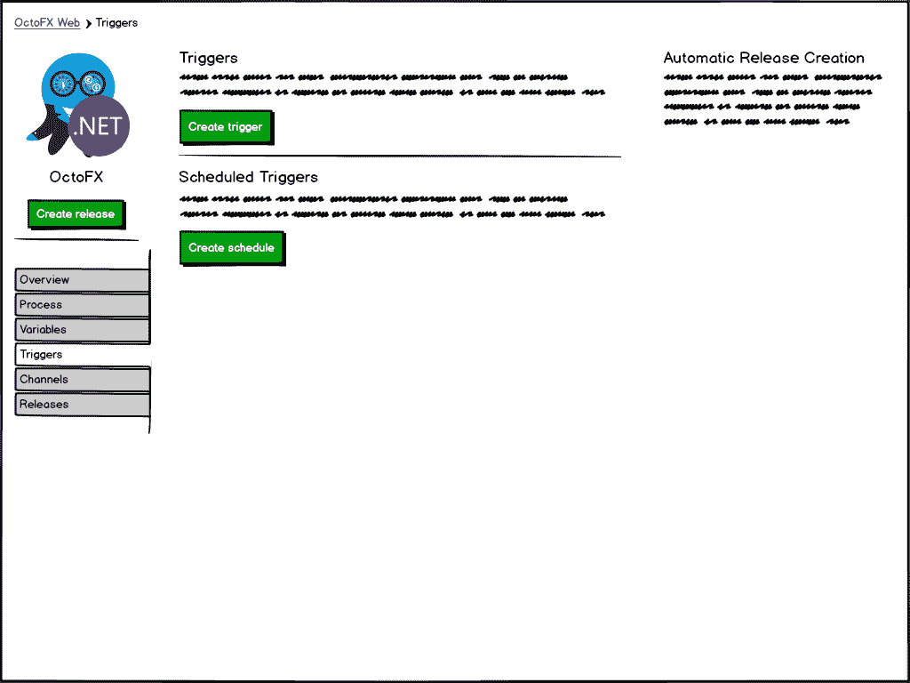](#)

创建新的调度部署触发器会将您带到一个新页面，在该页面中，您可以配置调度详细信息以及触发器运行时应该执行的操作。

[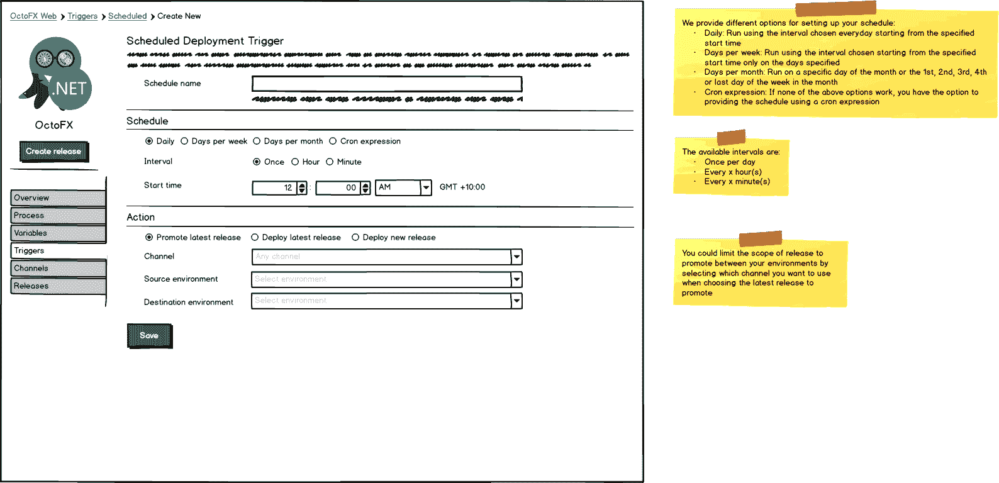](#)

添加新触发器后，它将出现在已配置的触发器列表中，并允许您编辑、禁用、克隆或删除触发器。

[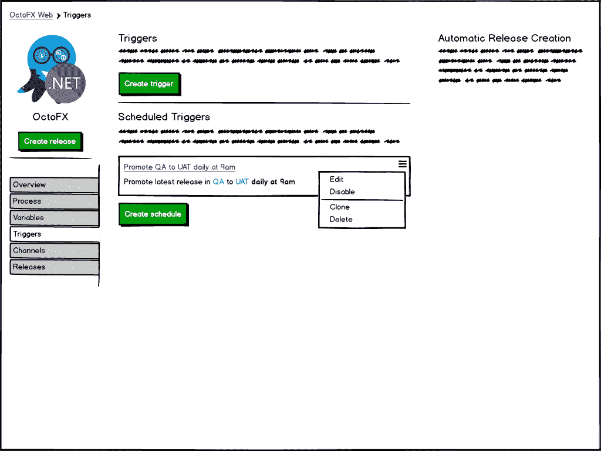](#)

### 生命周期触发器

如果您的项目使用通道，则生命周期触发器将只能部署到默认通道(因为通道是特定于项目的)。另一方面，生命周期触发器的优点是您可以在许多项目中共享相同的计划，而不是必须在每个项目中指定它。

定期重复部署配置将位于生命周期的右侧。

【T2 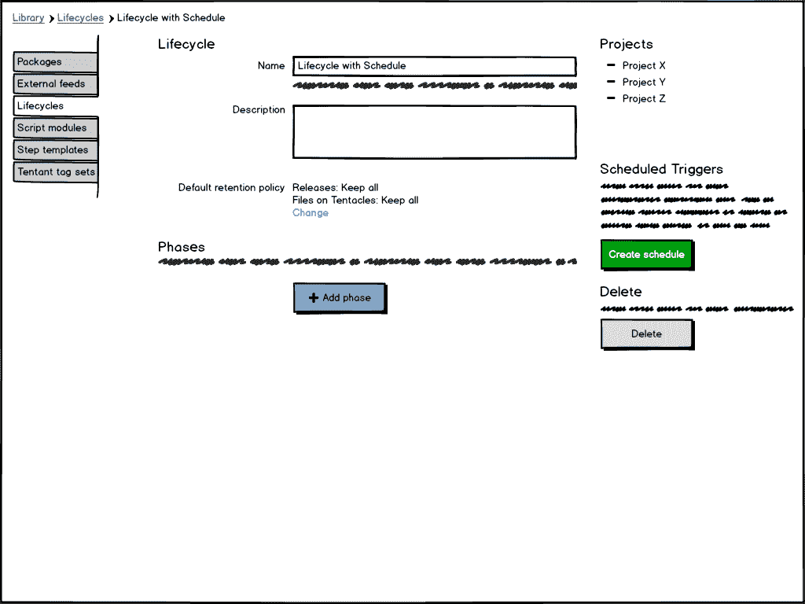

创建新的计划部署触发器将打开一个对话框，您可以在其中配置计划详细信息以及在触发器运行时应该采取的操作。

[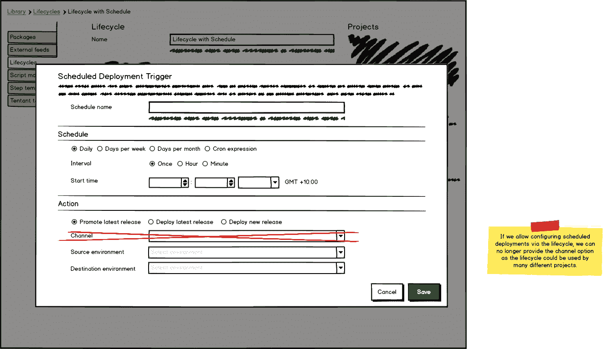](#)

### 触发计划

以下触发器计划用于配置触发器运行的时间

*   每天地；天天地
*   每周天数
*   每月天数
*   自定义`CRON`表达式

每日和每周天数计划允许选择时间间隔，可用的时间间隔有:

*   每天一次
*   每隔 x 小时
*   每隔 x 分钟

#### 每日计划

从指定的开始时间开始，按照每天选择的时间间隔跑步。

[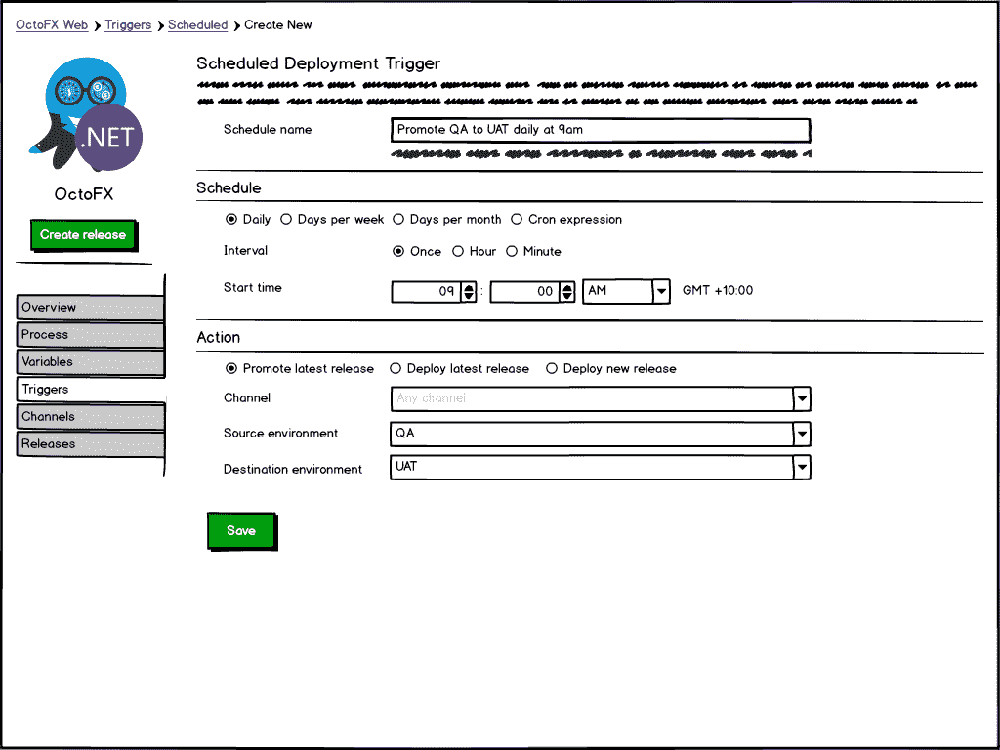](#)

#### 每周天数计划

从指定的开始时间开始，使用在指定日期选择的时间间隔跑步。

[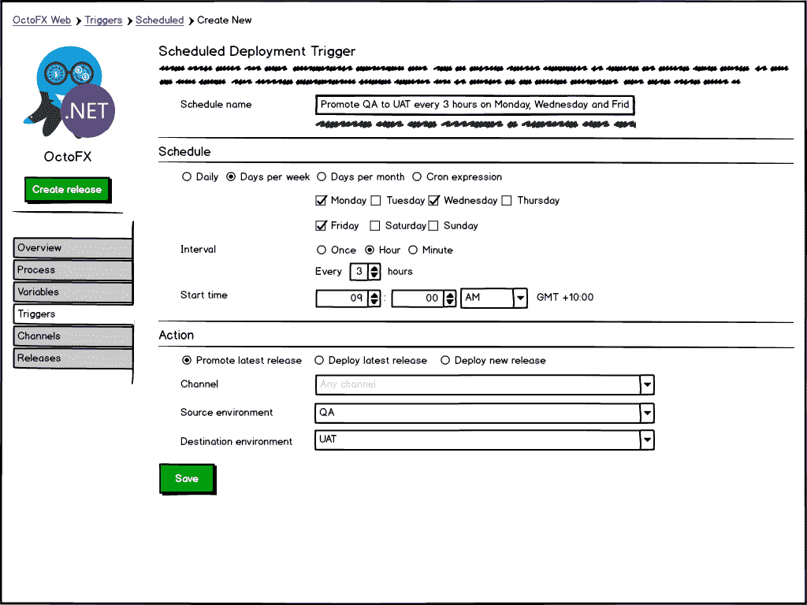](#)

#### 每月天数计划

在一个月中的某一天，或一个月中的第 n 个特定工作日，在指定的开始时间运行。

[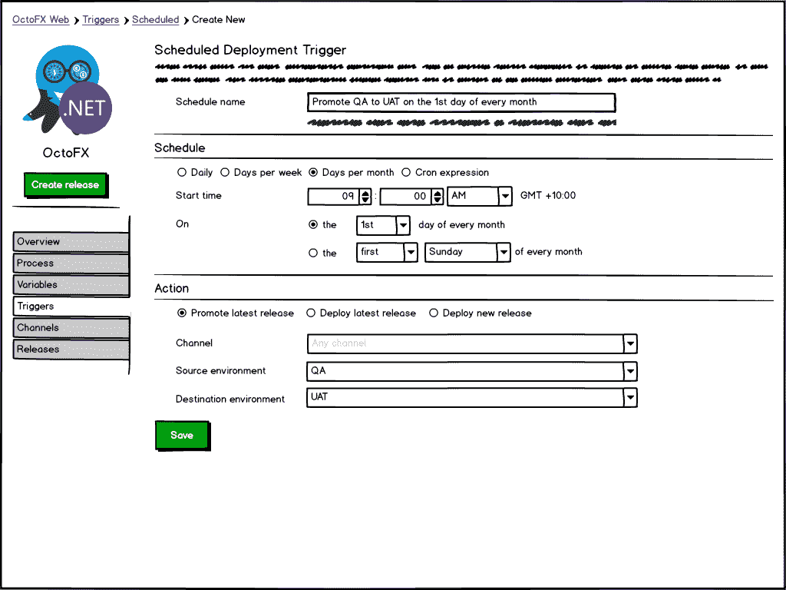](#)

#### 自定义`CRON`表达式

根据一个 [CRON 表达式](https://en.wikipedia.org/wiki/Cron#CRON_expression)运行。

> CRON 表达式是一个字符串，包含由空格分隔的五或六个字段，表示一组时间，通常作为执行某个例程的时间表。

[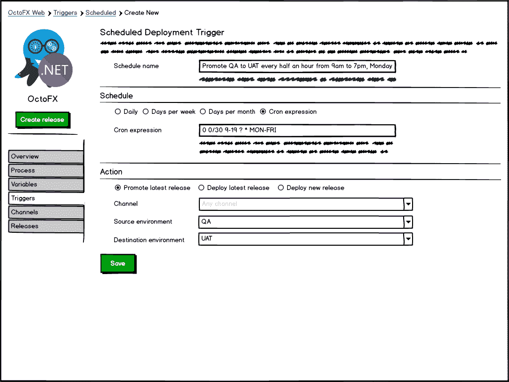](#)

### 触发动作

以下触发操作可用于配置运行计划部署时应该发生的情况:

*   推广最新版本
*   部署最新版本
*   部署新版本

将所选源环境中最新的**成功的**版本升级到所选目标环境。

#### 部署最新版本

将项目中最新的**成功**版本部署到所选的环境中。

[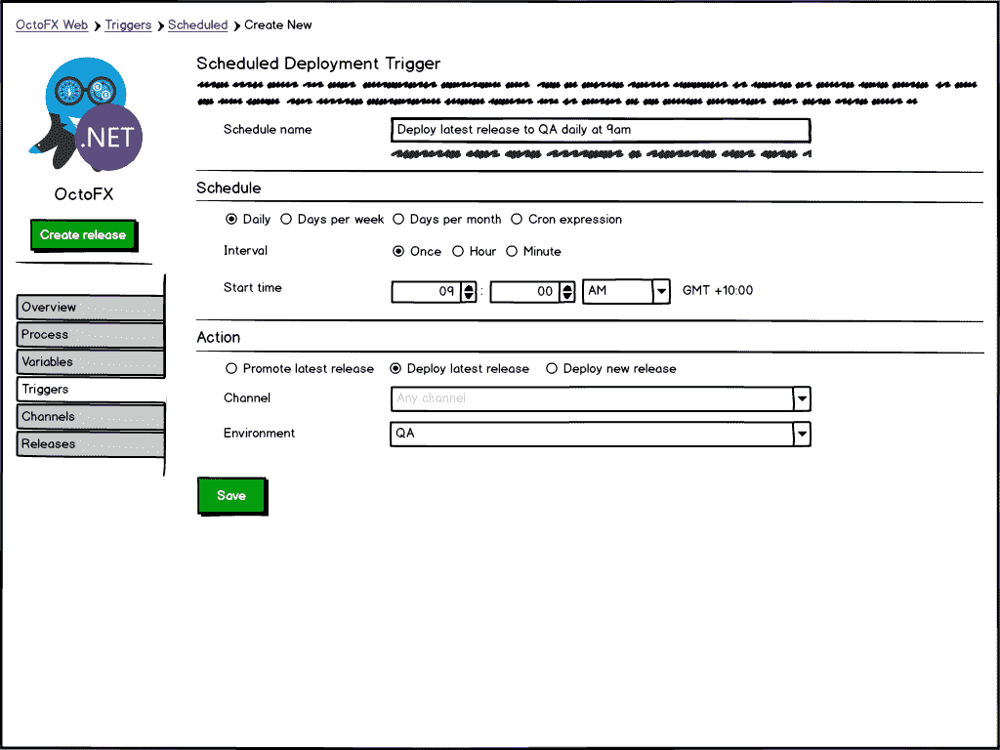](#)

#### 创建和部署新版本

创建一个新版本，并将其部署到所选的环境中。

[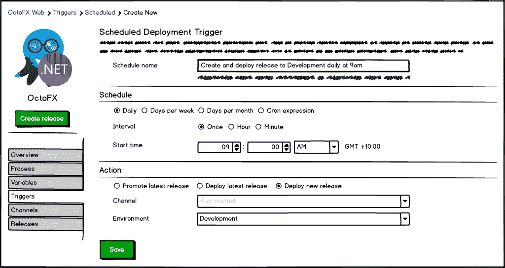](#)

**部署带有提示值(如包版本和提示变量)的新版本** [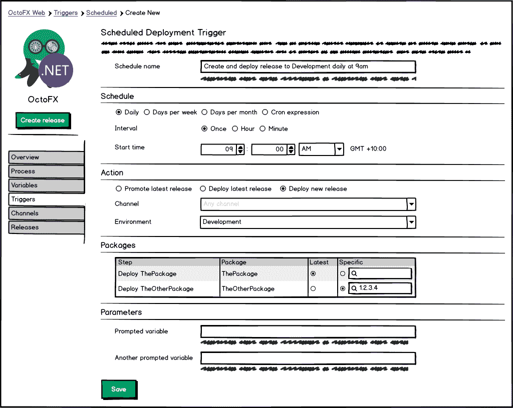](#)

## 反馈

**我们非常希望收到您的来信！也许我们在你的场景中遗漏了一些拼图？**

如果您对计划的周期性部署有任何其他想法或意见，请在下面添加您的评论或评论并关注开放的 [GitHub 标签#3363](https://github.com/OctopusDeploy/Issues/issues/3633) 。