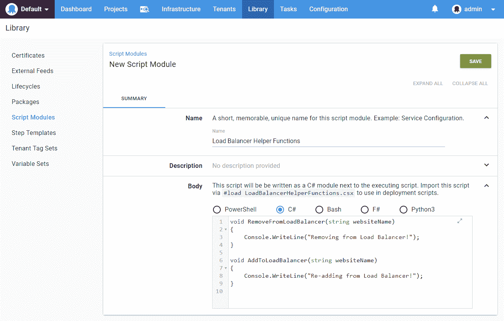
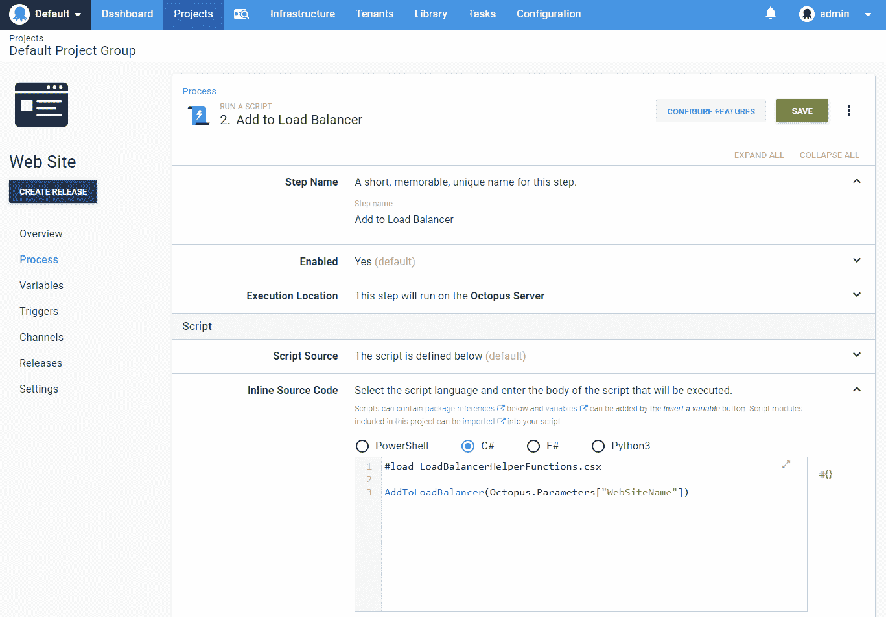
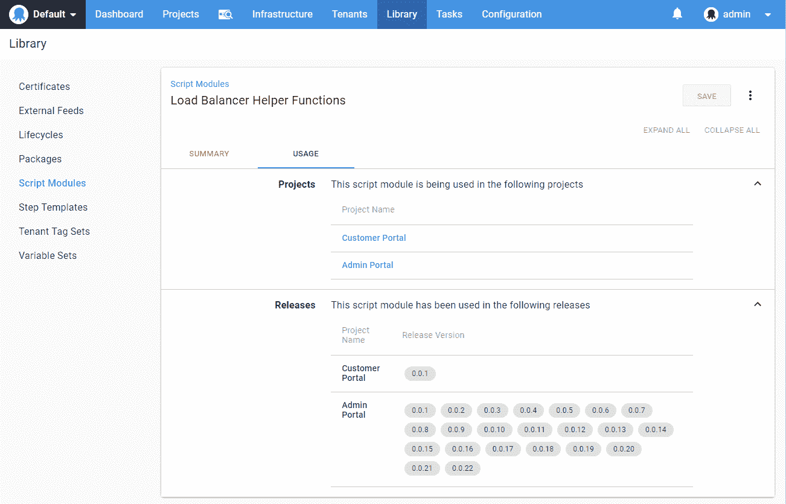

# 扩展的脚本模块支持- Octopus 部署

> 原文：<https://octopus.com/blog/script-modules>

很长一段时间以来，我们一直听到要求[脚本模块](https://octopus.com/docs/deployment-examples/custom-scripts/script-modules)支持 PowerShell 之外的语言。我们很高兴地分享这刚刚在我们的最新版本- 2019.5.0 中发布！

对一些人来说，这是个好消息。对于其他人，你可能会问*“什么是脚本模块？”*

脚本模块是可以在多个项目之间共享的功能集合。通过允许集中定义和管理功能，而不是在项目之间复制和粘贴代码，这些可以使您的生活更加轻松。在库->脚本模块下找到它们。

一旦定义了脚本模块，就可以在项目中使用它。需要注意的一点是，新语言需要显式导入；它们不会像 PowerShell 脚本模块那样自动导入。这有利于使脚本模块的依赖性更加明确，并防止命名冲突和意外行为。

在 C#中，这是通过脚本顶部的`#load <scriptmodulefilename.csx>`调用来实现的:

脚本模块主体上方的帮助文本将显示您需要的确切语法。

## 使用

另一个我们引以为豪的特性是脚本模块的使用。我们已经展示了您的脚本模块被使用的地方，因此很容易看到哪些项目可能会受到您的更改的影响。这将意味着在部署过程中减少意外，这总是一件好事。我们现在显示哪些项目和版本有参考:

我们还计划很快在变量集上展示这种用法。敬请期待！

看看[脚本模块文档](https://octopus.com/docs/deployment-examples/custom-scripts/script-modules)中每种语言的演练和示例。

愉快的部署！