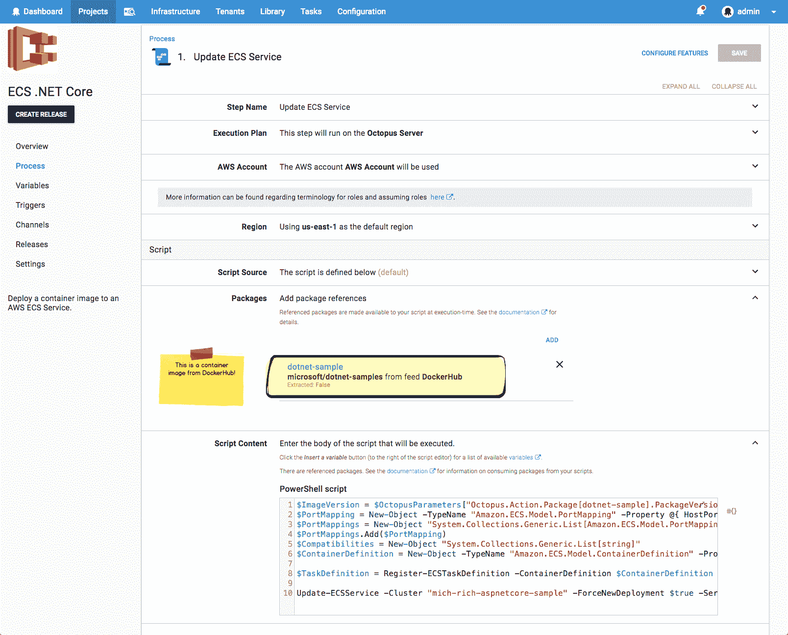
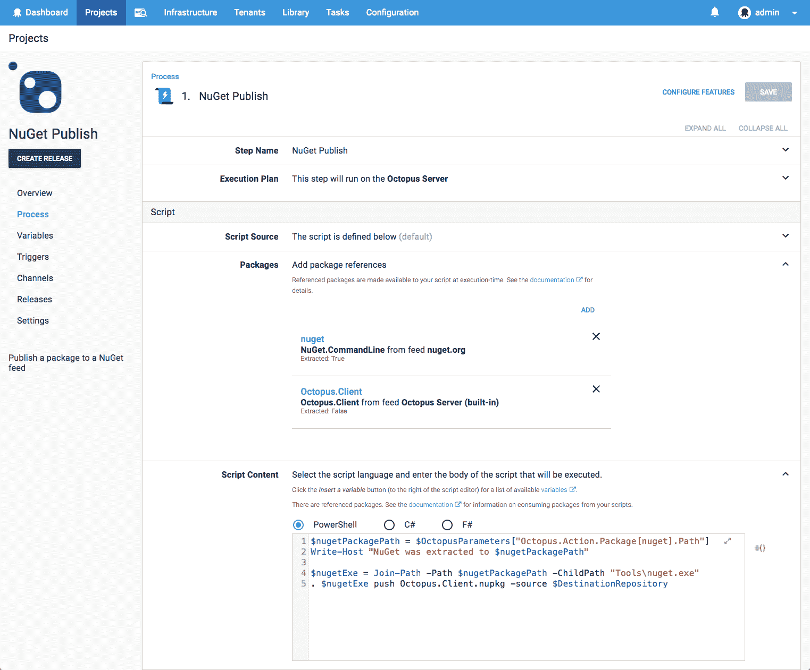
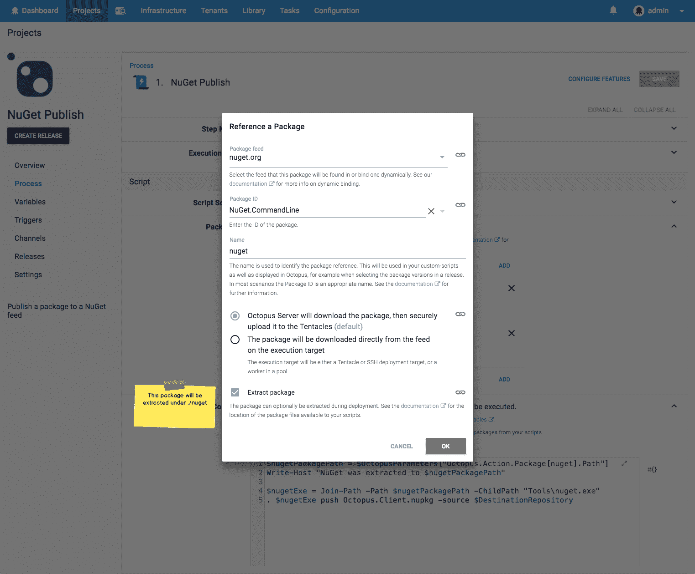
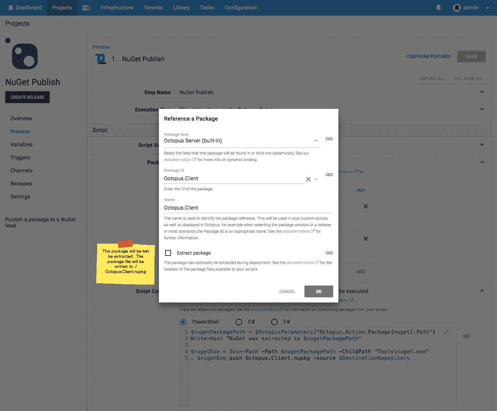
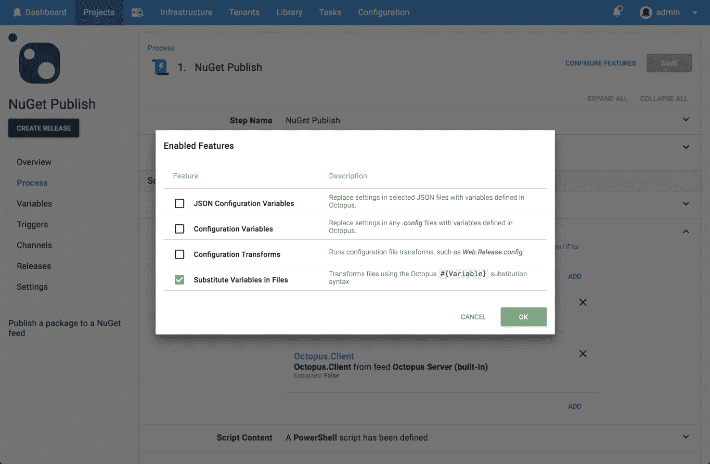

# 脚本步骤中的包- Octopus 部署

> 原文：<https://octopus.com/blog/script-step-packages>

在 [Octopus 2018.8](https://octopus.com/blog/octopus-release-2018.8) 脚本步骤正在进化，并获得一些新的超能力。

## 软件包++

我们增加了向脚本步骤家族添加包引用的能力:

*   `Run a Script`
*   `Run an Azure PowerShell Script`
*   `Run an AWS CLI Script`

以前，这些步骤能够引用包含要运行的脚本的单个包。他们现在也可以引用不包含脚本的包。是的，包裹，*复数*。哦，当我们说*包装*时，我们包括集装箱图片(见下面的[)。](#container-images)

## 为什么？

脚本经常需要与包进行交互。他们可能需要读取/写入包中的文件(例如执行包中包含的另一个脚本)，或者在某些情况下只需要包元数据(例如更新 AWS ECS 服务使用的映像版本)。

以前，当从脚本访问文件时，有两种模式:

### 1)“包装”包装

Octopus 早就有能力使用一个包作为要执行的脚本的源。这样做的一个副作用是，包首先被提取，然后里面的文件与正在运行的脚本文件放在一起。这使得许多精明的用户意识到他们可以将他们的脚本嵌入到他们想要使用的包中，或者反过来将包嵌入到脚本所在的包中。

这是可行的，但是我们不希望强制创建这些人为的包装包。

### 2)“首先部署包”模式

在这种模式中，一个或多个*部署包*或*传输包*步骤被配置为将包推送到目标服务器上的某个位置。然后，脚本步骤简单地假设已经部署了包。

这种方法的主要缺点是它只能用于在目标机器上执行脚本。它不能用于运行在 Octopus 服务器或工作程序上。这也使得部署过程变得更加复杂。


### 容器图像

您现在可以从脚本步骤中以一流的方式引用容器图像了！

[](#)

这意味着图像的版本(图像标签)将在发布创建时被捕获，就像任何其他包一样。

容器映像可以配置为在执行目标上获取，或者根本不获取。例如，在上图中，我们正在更新 AWS ECS 服务使用的容器映像的版本。因为我们只是简单地使用元数据，所以我们不需要承担本地提取图像的成本。

## 一个例子:NuGet Push

我们在 Octopus 总部的一个真实示例场景是将包推送到 NuGet。

我们章鱼的释放过程。客户。NET 库将把包推送到一个 NuGet 库。对于我们的`Test`环境，我们推送到一个私有的 MyGet 提要，然后对于我们的`Production`发布，我们推送到[nuget.org](https://www.nuget.org/packages/Octopus.Client/)

这涉及两个包:

*   来自 nuget.org 的`NuGet.CommandLine`，我们需要提取它来运行`nuget.exe push`
*   `Octopus.Client`哪一个是我们刚刚构建的包，我们想把它解压缩到一个 NuGet 存储库中

我们之前跳了“首先部署包”舞。借助新的脚本步骤功能，部署流程变成了:

[](#)

当我们添加`NuGet.CommandLine`包引用时，我们指定它应该被提取。我们还给它起了一个名字`nuget`，方便从我们的自定义脚本中使用。

[](#)

对比一下`Octopus.Client`包引用，我们指定*而不是*被提取。

[](#)

我们发布包的脚本变成了:

```
# Build the path to nuget.exe
$nugetPackagePath = $OctopusParameters["Octopus.Action.Package[nuget].ExtractedPath"]
$nugetExe = Join-Path -Path $nugetPackagePath -ChildPath "Tools\nuget.exe"

# nuget push
. $nugetExe push Octopus.Client.nupkg -source $DestinationRepository 
```

自定义脚本可以通过两种方式使用引用的包。

### 包文件

如果包引用被配置为提取，那么包将被提取到脚本工作目录下的子目录中。该目录将被命名为与包引用相同的名称。在上面的例子中，名为`nuget`的包引用将被提取到类似于`C:\Octopus\Work\20180821060923-7117-31\nuget`的目录中(这显然是一个 Windows 目录；在 Linux 目标上执行的脚本可能有一个路径，比如`/home/ubuntu/.octopus/Work/20180821062148-7121-35/nuget`。

如果包引用被*而不是*配置为提取，那么未提取的包文件将被放置在工作目录中。该文件将被命名为包引用名，扩展名与原始包文件相同。在 abolve 示例中，`Octopus.Client`包引用解析为一个 nupkg 包，文件将被复制到一个路径，比如`C:\Octopus\Work\20180821060923-7117-31\Octopus.Client.nupkg`(对于 Linux: `/home/ubuntu/.octopus/Work/20180821062148-7121-35/Octopus.Client.nupkg`)。

这些位置被设计成便于从定制脚本中使用，因为相对路径可以预测，例如`./nuget`。如果需要绝对路径，可以使用变量(见下文)。

### 包变量

包引用贡献变量，这些变量可以像任何其他变量一样使用。这些变量是(使用`nuget`示例):

| 可变的 | 描述 | 示例值 |
| --- | --- | --- |
| 章鱼。Action.Package[nuget]。PackageId | 包 ID | 努杰。命令行 |
| 章鱼。Action.Package[nuget]。FeedId | 订阅源 ID | feeds-nuget-org |
| 章鱼。Action.Package[nuget]。包版本 | 发行版中包含的软件包版本 | 4.7.1 |
| 章鱼。Action.Package[nuget]。提取路径 | 提取目录的绝对路径 | c:\ Octopus \ Work \ 2018 0821060923-7117-31 \ n 获取 |
| 章鱼。Action.Package[nuget]。PackageFilePath | 包文件的绝对路径(不会为`nuget`示例设置，因为它被配置为提取) | c:\章鱼\工作\ 2018 08 21060923-7117-31 \章鱼。Client.nupkg |
| 章鱼。Action.Package[nuget]。包文件名 | 包文件的名称(不会为`nuget`示例设置) | 章鱼。Client.nupkg |

## 变量替换

还有一点...

我们已经为脚本步骤启用了文件变量替换特性。

[](#)

这允许将 Octopus 变量替换到引用包中包含的文件中。

## 当...的时候

Octopus 2018.8 中提供了脚本步骤的包引用，当您阅读本文时，该版本将可供下载。

*多套餐部署愉快！*