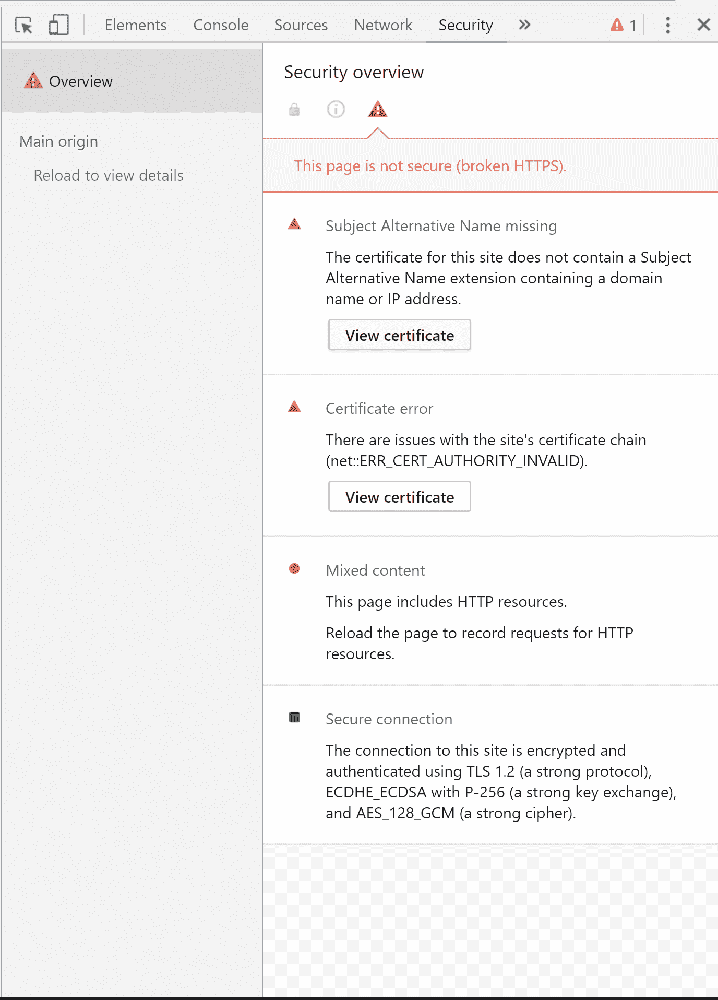
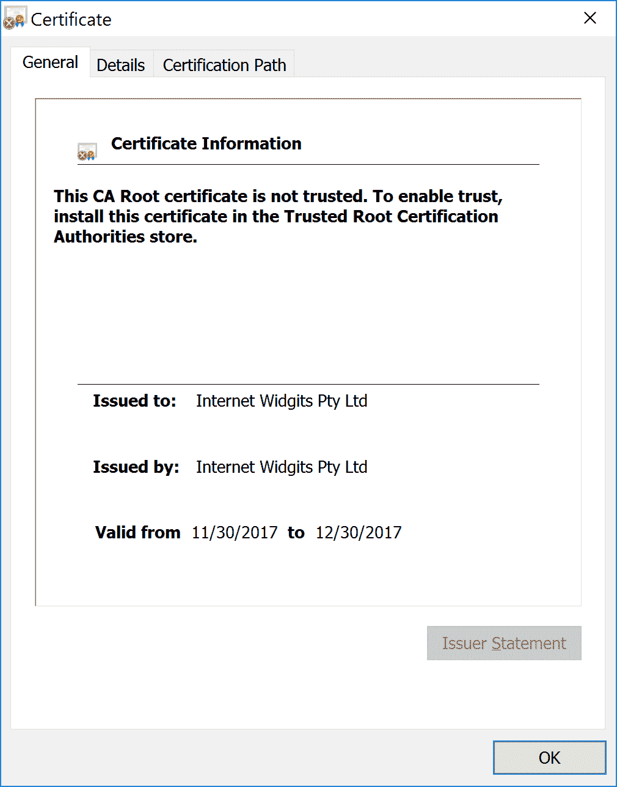

# 使用 Octopus - Octopus Deploy 将安全的 Web 应用程序部署到 Tomcat

> 原文：<https://octopus.com/blog/secured-tomcat-from-scratch>

有了 Octopus 4.1，您现在可以从 Maven 资源库部署应用程序，并配置由 Octopus 管理的证书。在这篇博文中，我们将看看如何使用这些新步骤在 Tomcat 中部署和保护 web 应用程序。

## 下载 Tomcat 9

在这个演示中，我们将在 Windows 2016 上使用 Tomcat 9。你可以从[这里](https://tomcat.apache.org/download-90.cgi)下载 Tomcat 9。获取 Windows installer，因为这是将 Tomcat 配置为 Windows 服务的最简单的方法。

默认情况下，Tomcat 9 会安装到`C:\Program Files\Apache Software Foundation\Tomcat 9.0`。这个目录在后面的步骤中称为`CATALINA_HOME`。

## 下载八达通部署 4.1

从[下载页面](https://octopus.com/downloads)获取 Octopus Deploy 4.1 的副本。4.1 版包括许多新的步骤和功能，用于集成 Maven repos 和部署证书。你可以从[文档](https://octopus.com/docs/installation)中找到更多关于安装 Octopus 的信息。

Octopus 4.1 目前处于测试阶段，所以如果现在还不能从下载页面获得，那也很快了。看好这个空间！

## 将 Maven Central 配置为外部提要

Maven central 是 Maven 构建的默认存储库，也是大多数公共 Maven 工件最终部署的地方。在 https://repo.maven.apache.org/maven2/可以找到它。我们将在 Octopus 中添加这个存储库作为名为`Maven Central`的外部提要，以允许我们在部署过程中使用它的工件。

[](#)

当配置外部 Maven 存储库时，我们需要链接到存储库本身，而不是用来搜索存储库的服务。例如，像 https://search.maven.org/的[、https://mvnrepository.com/的](https://search.maven.org/)或者 T2 的这样的网址是无法进入的，因为这些是用于搜索知识库的网站，而不是知识库本身。

## 添加证书

运行以下命令来生成自签名 ECDSA 证书。

```
openssl ecparam -genkey -out ecdsa.key -name prime256v1
openssl req -x509 -new -key ecdsa.key -out ecdsa.crt
openssl pkcs12 -export -out ecdsa.pfx -inkey ecdsa.key -in ecdsa.crt 
```

然后把 PFX 的文件上传到 Octopus。

[](#)

阅读博客文章[Tomcat 中的组合键](https://octopus.com/blog/mixing-keys-in-tomcat)以获得关于这些键如何在 Tomcat 中工作的更多信息。

## 创建部署项目

在 Octopus 中创建新项目，并添加`Deploy to Tomcat via Manager`步骤。

在这一步中，我们将部署`com.github.gwtmaterialdesign:gwt-material-demo` WAR 文件。这个 web 应用程序是 [GWT 材料](https://github.com/GwtMaterialDesign/gwt-material)项目的一个演示，该项目方便地将一个样例应用程序作为 WAR 文件发布到中央 Maven 存储库中。我们将利用这一点来演示如何将 Maven 存储库中托管的 web 应用程序直接部署到 Tomcat。

将`Context path`设置为`/demoapp`。这是我们将用来在 Tomcat 上打开应用程序的路径。

[](#)

## 部署证书

创建一个变量来引用之前创建的 ECDSA 证书。我们需要在证书部署步骤中使用这个变量。

[](#)

接下来添加`Deploy a certificate to Tomcat`步骤。选择证书变量，将`CATALINA_HOME`字段设置为`C:\Program Files\Apache Software Foundation\Tomcat 9.0`，选择`NIO2` SSL 实现，并将端口设置为`8443`。

[](#)

在生产场景中，您不会将证书与应用程序一起重新部署。一旦部署了证书，通常只需在证书更新时每年重新部署一次。我们将证书部署包含在同一个项目中，只是为了演示如何配置这些步骤。

## 重新启动服务

最后一步是重新启动 Tomcat 服务，让它获得新的证书配置。

添加一个`Run a Script`步骤，并运行一个 PowerShell 脚本来重启`Tomcat9`服务。

```
Restart-Service Tomcat9 
```

[](#)

`Tomcat9`是 Tomcat 安装程序为我们创建的服务。

[](#)

部署应用程序后，Tomcat 不需要重新启动。运行这个脚本是为了让 Tomcat 获得证书。

## 运行部署

部署运行时，Octopus 会自动确定 Maven 工件是 WAR 文件，并选择最新版本进行部署。

[](#)

部署完成后，您会发现下面的 XML 已经添加到 Tomcat `conf/server.xml`文件中。这就是 Tomcat 支持 HTTPS 的配置方式。

```
<Connector SSLEnabled="true" port="8443" protocol="org.apache.coyote.http11.Http11Nio2Protocol">
  <SSLHostConfig>
    <Certificate certificateKeyAlias="octopus" certificateKeystoreFile="${catalina.base}\conf\Internet_Widgits_Pty_Ltd1.keystore" certificateKeystorePassword="changeit" type="EC"/>
  </SSLHostConfig>
</Connector> 
```

## 测试结果

打开[https://localhost:8443/demo app/index . html](http://localhost:8443/demoapp/index.html)。您将看到正在显示的演示应用程序。

[](#)

然后我们可以通过打开 Chrome 开发者工具并查看`Security`标签来验证证书。

[](#)

单击`View certificate`确认 Tomcat 现在已经配置了自签名证书。

[](#)

## 结论

有了 Octopus 4.1，您现在可以通过内置的步骤管理您的应用程序和证书部署生命周期，同时无缝地使用 Maven 存储库中的工件。

如果您对 Java 应用程序的自动化部署感兴趣，[下载 Octopus Deploy](https://octopus.com/downloads) 的试用版，并查看一下[我们的文档](https://octopus.com/docs/deployments/java/deploying-java-applications)。