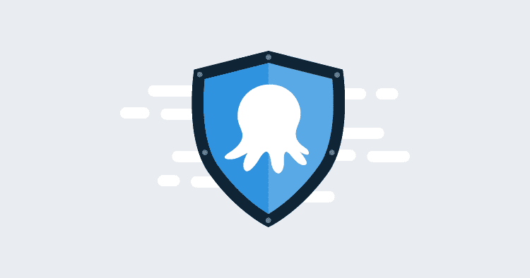

# 介绍八达通保安建议-八达通部署

> 原文：<https://octopus.com/blog/security-advisories>

不足为奇的是，软件产品有安全漏洞，或者当它们确实发生时，对于供应商来说，重要的是要有有效的沟通策略来确保系统是安全的，用户不会容易受到攻击。

目前八达通产品的安全漏洞被披露在 CVE 数据库和我们的产品发布说明，但是，我们相信我们可以加强这种沟通，以更好地保护我们的客户。

## 我们目前如何通知客户产品安全漏洞

当我们发现或被告知我们产品中的安全漏洞时，我们会修补漏洞，创建 CVE，创建 [GitHub 问题](https://github.com/OctopusDeploy/Issues)，并使用补丁和 CVE 号更新我们的发行说明。

在通知我们的客户安全漏洞方面，我们总是假设我们的客户要么正在阅读发行说明，要么正在定期检查 CVE 数据库中的任何安全漏洞。但是，我们相信我们可以做得更多，来帮助我们的客户获得他们需要的信息，以确保他们的环境保持安全。

为了解决这个问题，我们推出了八达通安全咨询。

## 八达通安全咨询

Octopus 安全公告本质上是发行说明、CVE 详细信息和我们希望在一个地方向客户提供的额外信息的集合，这样客户就不必去寻找信息。

安全咨询中提供的一些信息包括:

*   基于 Octopus 部署评估的漏洞严重性。
*   关于漏洞的详细信息，包括受影响的版本、已修复的版本和其他相关信息。
*   是否有任何已知的漏洞利用。

## 八达通什么时候会发布安全公告？

八达通保安小组会在下列情况下发出保安通告:

*   在存在影响多个 Octopus 产品的严重或高风险漏洞的情况下，将发布初步建议。
*   发布了 CVE 和修补程序来修复 Octopus 产品中的特定漏洞。
*   如果我们认为我们的客户可能会成为不良分子的目标，例如提供识别假 Octopus Deploy 电子邮件的指导。

## 八达通安全警告将张贴在哪里？

安全建议将被发布到[advisories.octopus.com](https://advisories.octopus.com)，安全建议的链接将被发布到[Octopus Deploy Twitter](https://twitter.com/OctopusDeploy)feed。

## 更多信息

有关 Octopus Deploy 2021 年安全之旅的更多信息，您可以查看我们的[信托&安全路线图](https://github.com/OctopusDeploy/Issues/issues/6523)。

如果您需要报告漏洞，请通过[security@octopus.com](mailto:security@octopus.com)联系我们。