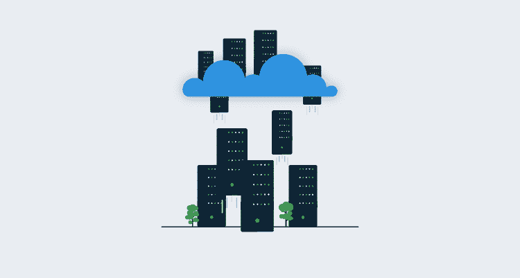
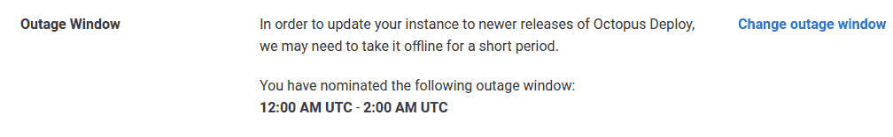
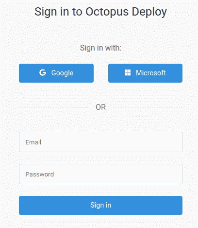
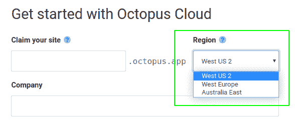

# 云虚拟机中的自托管 Octopus 与 Octopus 云- Octopus 部署

> 原文：<https://octopus.com/blog/self-hosted-octopus-cloud-vm-vs-octopus-cloud>

考虑将 Octopus 迁移到云基础架构的客户向我们提出的一个常见问题是:

> 我应该迁移到虚拟机上的 Octopus 服务器还是托管的 Octopus 云？

在本帖中，我们来看看为什么你会选择其中一个。成本和安全是主要考虑因素，但我们也会考虑你如何使用八达通。

**章鱼云**是指 Octopus Deploy 提供的章鱼云 [SaaS](https://en.wikipedia.org/wiki/Software_as_a_service) 和**章鱼云服务器**是指 Octopus Deploy 的自托管版本。在本文的上下文中， **Octopus 服务器**位于云中的一个虚拟机上。

## 体系结构

在我进入细节之前，让我们看一下我们正在讨论的 Octopus 的两个化身的架构。

**服务器**

Octopus 服务器作为 Windows 服务运行；这提供了对 [Octopus REST API](https://octopus.com/docs/octopus-rest-api) 和 [Octopus 门户网站](https://octopus.com/docs/getting-started#the-octopus-web-portal)的访问。它连接到一个 SQL Server 数据库，并使用[文件共享](https://g.octopushq.com/MovingOctopusComponents)来存储任务日志、工件和包。

**云**

Octopus Cloud 使用一个运行在 [AKS](https://octopus.com/blog/octopus-cloud-v2-why-kubernetes) 上的 Linux 容器，数据库托管在 Azure SQL 中。文件共享使用 Azure 云存储。

## 管理

选择 Octopus Cloud 减少了您必须在 Octopus 实例上执行的管理任务的数量；然而，出于某些原因，您可能希望 Octopus 服务器提供更大的控制。

### 保留策略和存储

Octopus [保留策略](https://g.octopushq.com/RetentionPolicies)在所有 Octopus 实例上都有一个默认配置，我们建议查看它们以满足您的需求。

**服务器**

当您在虚拟机上配置 Octopus 服务器时，您选择 Octopus 用于服务器文件夹的存储。这意味着您可以为这些文件夹设置适合您的存储限制，并相应地配置保留策略。

**云**

章鱼云为大多数企业提供了充足的存储；然而，你可以使用的存储量有一个[限制](ttp://g.octopushq.com/AcceptableUsage)。在法规遵从性要求长期保留的情况下，您可能会发现这是选择 Octopus Server 而不是 Octopus Cloud 的原因。

我们在 Octopus 实例管理页面的技术部分添加了监控。要查看详细信息，请登录您的 Octopus 帐户，然后在您的实例上，选择管理➜资源使用。这是每 24 小时更新一次。

Octopus 有一个对所有实例都可用的内置包存储库，除此之外，可以配置外部存储库提要来为您的[部署包](https://g.octopushq.com/OnboardingPackageRepositoriesLearnMore)服务。您可能会选择使用外部 feed 来帮助进行[多区域部署](#regional-package-feeds)，或者如果您的包 feed 存储需求相当大的话。

### 维护窗口

**云**

章鱼云的一个伟大之处在于，你不必担心如何以及何时进行系统维护和升级。Octopus 为您管理这些，您可以选择适合您的业务和地区的维护窗口。

中断窗口信息位于 Octopus 实例管理页面的技术部分:

**服务器**

Octopus Server 允许您更具体地确定何时执行系统维护和升级。如果您实施了[高可用性](https://g.octopushq.com/HighAvailability)，那么您就可以在进行维护时实现零停机。一些客户选择通过使用章鱼的另一个实例[中的](https://g.octopushq.com/UpgradeOctopusWithOctopus)[run book](https://g.octopushq.com/OnboardingRunbooksLearnMore)来自动化维护和升级任务。一个免费的 Octopus Cloud 实例适合这个任务。

### 管理基础设施

**服务器**

有了 Octopus Server，您可以使用适合您企业运营架构的基础设施，并且任何基础设施管理流程和策略都可以用于您的 Octopus 实例。因为您托管您的 Octopus 服务器，所以您有责任确保[基础设施](https://g.octopushq.com/ManagingInfrastructure)运行良好、得到维护、可恢复并具有扩展能力。

**云**

使用 Octopus Cloud 可以让您从基础架构管理中后退一步。我们有责任确保基础架构的强健，并根据您的使用情况进行扩展。

#### 工人

Octopus 服务器的[默认工作池](https://g.octopushq.com/OnboardingWorkersLearnMore)和 Octopus Cloud 有明显的区别。

**服务器**

在 Octopus Server 中，[默认工作器](https://g.octopushq.com/BuiltinWorker)是 Octopus 服务器本身，而 Octopus Cloud 不允许服务器执行外部操作。

当您使用 Octopus 服务器时，我们建议尽可能使用 Worker 来减少 Octopus 服务器上的资源使用，并且由于 Octopus 是在特权帐户下执行的，如果您可以以 Worker 的形式将工作卸载到另一台机器，那么为了增加安全性，这样做是明智的。

**云**

章鱼云从特定于其区域的工人池中租赁一台[动态工人](https://g.octopushq.com/DynamicWorkerPools)机器。

### 备份

**云**

备份是 Octopus Cloud 托管服务的一部分。备份数据库、内置软件包存储库和配置。如果您使用外部程序包馈送，则您有责任确保配置备份。

**服务器**

当作为 Octopus 服务器安装的一部分管理您的基础设施时，您可以设计您的[备份](https://g.octopushq.com/BackupRestore)和恢复计划来匹配您现有的基础设施计划。

### 监视

Octopus [订阅](https://g.octopushq.com/Subscriptions)在 Octopus Cloud 和 Octopus Server 中都可以使用。您可以配置通知来通知您 Octopus 中的更改，例如，特定项目流程的更改、用户修改、部署目标的添加。有一个很长的名单。

[REST API](https://g.octopushq.com/RestAPI) 有一个[报告](https://g.octopushq.com/Reporting)端点，您可以用它来创建一个仪表板，在 Octopus 云和 Octopus 服务器中都可用。

使用 Octopus Server，您还可以通过向 *nlog config* 文件添加一个日志目标来[向中央日志工具](https://help.octopus.com/t/how-can-i-configure-octopus-deploy-to-write-logs-to-a-centralized-logger-such-as-seq-splunk-or-papertrail/24551)发送日志。

## 数据库ˌ资料库

**云**

客户无法访问 Octopus 云数据库，因此与 Octopus 的所有交互都必须使用 web 界面或 API 来完成。最棒的是数据库维护、安全和修补都是由我们完成的。

**服务器**

云虚拟机上的 Octopus 服务器为您提供了几个数据库托管选项:

管理数据库的好处是，您可以选择更宽松的[保留策略](https://g.octopushq.com/RetentionPolicies)，能够使用集群数据库，并管理自己的备份。

## 安全性

**云**

借助 Octopus Cloud，我们可以保护基础设施并进行渗透测试，以确保 Octopus 实例的安全性和完整性。但是，您仍然要负责:

*   如何将 Octopus 连接到您的基础设施。
*   你如何识别你的用户和控制他们在八达通的活动。
*   你如何处理八达通内的敏感信息。

**服务器**

当你使用 Octopus 服务器时，你有责任[强化](https://octopus.com/docs/security/hardening-octopus)Octopus 实例基础设施。如果您需要遵守特定行业的法规，这种级别的控制可能是有益的。在这种情况下，您还需要承担以下责任:

*   如何强化底层服务器操作系统。
*   如何保护操作系统上的 Octopus 服务器文件。
*   你如何储存八达通服务器生成的文件。
*   你如何保护你的 SQL 数据库和八达通服务器产生的数据。
*   你如何将你的 Octopus 服务器暴露给你的基础设施？
*   你如何识别你的用户和控制他们在八达通的活动。
*   你如何处理八达通内的敏感信息。

当向 Octopus 云或 Octopus 服务器基础设施添加部署目标和工作机时，它们的安全性和完整性是您的责任。

### 身份验证提供商

**云**

章鱼云[认证](https://g.octopushq.com/AuthenticationProviders)使用[章鱼 ID](https://g.octopushq.com/AuthOctopusID) ，允许你使用在[octopus.com](https://octopus.com)登录时使用的同一个账户。Octopus ID 支持用户名和密码，也可以使用谷歌或微软账户。

Octopus ID 允许 Octopus 用户映射到 Google 或 Microsoft 帐户，但是它不允许映射到外部组，这在 Active Directory 中是可能的。

**服务器**

Octopus 服务器有几个可用的身份验证提供程序:

可以同时配置多个提供程序。

### IP 限制

**云**

一个 Octopus 云实例有一系列在同一个 Azure 区域的客户之间共享的静态 IP 地址。这些可以在 Octopus 实例管理页面的技术部分找到:

**服务器**

当您在虚拟机上使用 Octopus 服务器时，您可以配置适合您业务需求的 IP 和 DNS。您可以选择配置一个负载平衡器来处理 Octopus web 接口的流量；如果您配置了[高可用性](#high-availability)，这将非常有用。

### 组织项目和环境

[空间](https://octopus.com/docs/administration/spaces)在八达通云和八达通服务器上都可用。空间在项目和基础设施之间建立了一堵硬墙，因此您的每个团队只能访问他们需要的项目和基础设施。

**服务器**

并发许可证是 Octopus Server 的一个额外好处。每个许可证可以使用三个实例，这意味着您可以运行一个 Octopus Deploy 服务用于生产，并为开发或测试设置额外的服务。或者，您可以使用两个单独的 Octopus 部署实例来隔离生产和生产前部署。

## 建立工作关系网

通过 WebSockets 将[轮询触角](https://g.octopushq.com/PollingTentacle)连接到 Octopus Cloud 目前是不可能的，但我们确实计划很快支持轮询触角连接到 443 端口。

### 代理支持

章鱼服务器和章鱼云都支持[代理](https://g.octopushq.com/ProxySupport)。您可以为 Octopus 指定一个代理服务器，以便在与触手或 SSH 目标通信时使用。当触手和 Octopus 服务器向其他服务器发出 web 请求时，您也可以指定一个代理服务器。

## 地区

**服务器**

在虚拟机上使用 Octopus 服务器可以让您在自己选择的地理区域托管 Octopus 实例。

**云**

Octopus Cloud 还为您提供了在适合您的地区托管实例的选项。我们使用 Microsoft Azure 托管 Octopus Cloud，在撰写本文时，我们提供以下区域:

*   美国西部 2
*   西欧
*   澳大利亚东部

当您第一次创建 Octopus 云实例时，会选择该区域。

如果我们推出更适合您需求的新区域，请联系我们，以便我们将您的实例转移到该区域。

### 区域套餐订阅源

如果您在多个地区运营，并且担心在部署期间传输大型包时出现网络延迟问题，我们建议您选择外部[包馈送](https://g.octopushq.com/OnboardingPackageRepositoriesLearnMore)并在多个地区复制它。通过 DNS 别名，您可以让触手从地理上本地的包存储库中获取包。或者您可以拥有两个独立但相同的包存储库，并使用一个[变量作为提要 ID](https://g.octopushq.com/DynamicPackageFeeds) 。对于 **Octopus Server** 和 **Octopus Cloud** ，包存储库都以这种方式工作。

## 高可用性

[可以为 Octopus 服务器配置高可用性](https://g.octopushq.com/HighAvailability) (HA)来运行多个 Octopus 服务器，在它们之间分配负载和任务。

Octopus HA 不可用于 Octopus Cloud，但所有实例都被配置为运行在 AKS (Azure 的托管 Kubernetes)上的 [Linux 容器。](https://octopus.com/blog/octopus-cloud-v2-why-kubernetes) [Kubernetes](https://kubernetes.io/) 帮助我们实现章鱼云的弹性和伸缩灵活性。

## 其他考虑

### 触须

章鱼触手机器可以配置为[轮询](https://g.octopushq.com/PollingTentacle)或[监听](https://g.octopushq.com/ListeningTentacle)通信模式。您为部署选择的触角类型将取决于您的业务需求。您还应该考虑这些机器的配置是否对您的 Octopus 实例所选择的基础设施有任何影响。

#### 触手防火墙规则

你使用的触手类型将取决于你的防火墙规则。侦听触手必须具有入站防火墙规则，以允许通过 TCP 端口 10933 进行访问。轮询触手不需要触手上的任何防火墙规则，但是 Octopus 服务器必须允许通过 TCP 端口 10943 上的防火墙入站访问。侦听触手使用较少的资源，但是如果您使用动态 IPs 或者触手位于 NAT 之后，轮询触手将是必需的。

您需要将这些规则应用于任何中间防火墙。

### 容器中的章鱼

在虚拟机上运行 Octopus 服务器的另一种方法是在容器中运行它。事实上，这就是我们管理 Octopus 云实例的方式。用于 Octopus 的 [Windows 容器](https://g.octopushq.com/DockerWindows)得到了完全支持，而 [Linux 容器](https://g.octopushq.com/DockerLinux)在撰写本文时是我们早期访问计划的一部分。

## 结论

这篇文章有望为您迁移到云基础设施的决策过程提供清晰的思路。无论您的业务需求是什么，Octopus Deploy 使发布管理变得容易，并且简化了即使是最复杂的部署，无论您在哪里部署您的软件。Runbook automation 最大限度地减少停机，并让您能够控制基础架构和应用。

如果你有任何问题或者想知道如何让八达通为你服务，请给我们写信，地址是[advice@octopus.com](mailto:advice@octopus.com)

## 更多信息