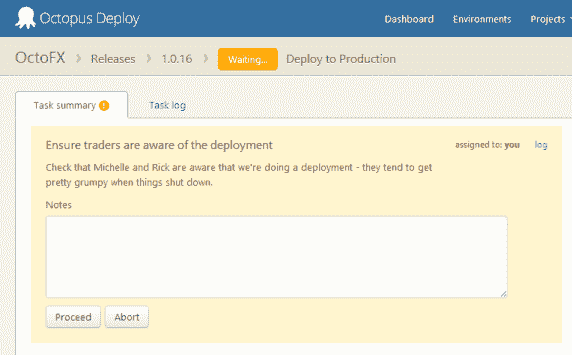
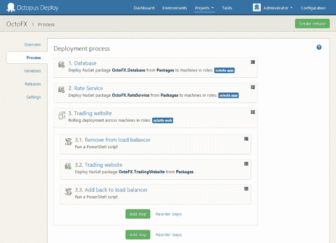
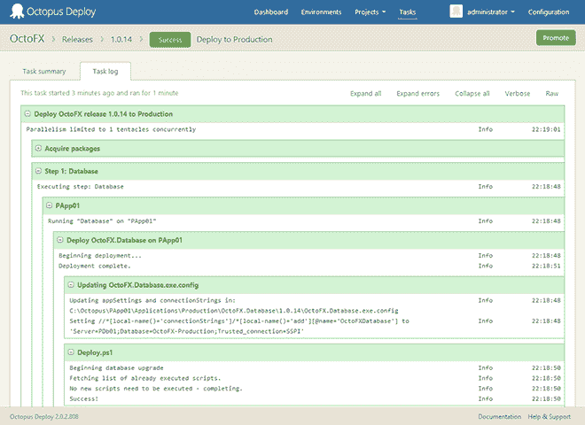
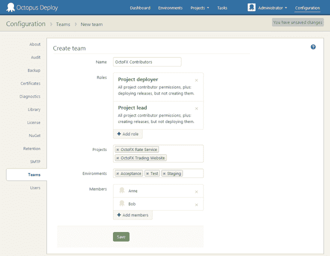

# 让您的团队实现自助式应用部署- Octopus Deploy

> 原文：<https://octopus.com/blog/self-service-deployments>

自助应用程序部署是增加可部署到生产前环境的团队成员数量的一种方式。例子可能包括:

*   允许开发人员部署到开发环境中。
*   允许测试人员部署到测试环境中。
*   允许支持团队成员部署到重现生产缺陷的环境中。

自助部署有两个主要优势:

1.  它使团队能够部署到生产前环境。
2.  它减少了对发布经理能够部署的依赖。

要让自助式部署发挥作用，最基本的要素是**信任**；我们不想让每个人都开始不一致地修补、更改和修改服务器，因为这只会保证下一个生产部署会出现可怕的错误。

在本文中，我想谈谈规划自助服务部署时要考虑的重要事项。

# 首先，一个故事...

在全职从事 Octopus Deploy 之前，我在英国的一家投资银行工作。在那里，我们有一个发布经理，我叫他迈克。Mike 负责部署了我们各种应用程序的 1000 多台服务器的发布管理。

迈克很聪明。他不害怕 PowerShell 或编写代码来自动化他的工作，他是我所知道的少数几个真正能够阅读 Perl 的人之一。尽管有大量的服务器，他还是设法将部署过程从开始到结束缩减到大约六个步骤，这一点他非常了解。

我的团队在 Mike 服务的团队中是一个较小的团队，我们喜欢快速迭代。有时我们会每周部署一次，如果有问题，我们会修复它们并在几小时后重新部署。部署到我们的开发和测试服务器并不是一个问题，因为我们最终获得了远程桌面访问。然而，生产总是需要 Mike 的参与:部分原因是只有 Mike 有权部署，部分原因是只有 Mike 知道如何完成所有需要的步骤，以及如何在失败时进行恢复。

虽然我们可以部署到开发和测试自己，这导致了问题。有时我们会安装一个新的组件或运行一个迁移脚本，却忘记为 Mike 记录下来。它在测试中运行良好，但是当他部署到生产中时，这个步骤就会被错过，我们就有大麻烦了。迈克也可能相当可怕！

迈克很聪明，但他是一个瓶颈。我喜欢认为我们也很聪明，但我们做事情的方式与迈克不同，不是故意的，只是因为人类不同。

当生产部署出错时，没有人会高兴，如果它发生得太频繁，可能会导致冲突和不团结。

为了增加我们成功进行生产部署的机会，有三种选择:

1.  让 Mike 做所有的部署，甚至是开发和测试。
2.  让我们开发人员部署到生产环境中。
3.  花更多的时间在文档上。
4.  自动化部署，以便始终一致地运行部署，并实施自助服务模式。

选项 1 是不可行的；迈克实在是太忙了。选项 2...我们只能说那是不可能发生的！选项 3 通常是大型组织默认的，但是不会起作用，因为 a)我们仍然会忘记事情，b)反正没有人阅读文档。

所以只剩下第四种选择。

# 自助部署的工作要求

要使自助部署成功，并保持团队的信任和团结，有一些基本要求:

*   部署必须自动化。
*   部署过程应该在不同的环境中保持一致。
*   需要某种程度的审计、集中日志记录和可见性。
*   强大的权限系统限制谁可以在哪里部署什么。

让我们详细检查这些。

## 规则 1:部署必须自动化

如果您的部署过程涉及某人打开远程桌面、复制文件夹、编辑配置文件或修改服务，自助部署将不起作用。无论您记录得多好，总有人会忘记一个步骤，或者忘记记录一个新的步骤(比如运行 SQL 迁移脚本)。这意味着在部署到生产环境时，成功部署的机会会减少，因为很容易错过任何一个步骤。这将导致不信任和冲突。

在步骤不能自动化的情况下，您可能希望使用手动步骤来暂停部署，并提供关于需要做什么的非常非常具体的指示。

## 规则 2:部署过程应该是一致的

与上面类似，部署脚本必须在不同的环境中保持一致。两个或更多不同的人将执行部署。这些场景中哪一个更有可能成功？

1.  开发人员和测试人员已经为他们的部署运行了一个脚本，并且运行良好。一个完全不同的脚本将在生产中运行。
2.  开发人员和测试人员已经为他们的部署运行了一个脚本，并且运行良好。相同的脚本(参数略有不同)将在生产中运行。

当然，环境之间会有差异，但这些应该是部署脚本的参数/配置变量；剧本本身应该是一样的。

## 规则 3:审计、集中记录和可见性

如果所有的部署都由一个人完成，他们知道在哪里部署了什么版本。一旦多人开始部署，对可见性的需求——例如仪表板——就变得非常重要。理想情况下，这个仪表板不应该要求某人在部署后记得更新它。

同样，审计提供了一些责任:谁更改了部署脚本？谁触发了那次部署？谁取消的？

最后，集中日志记录是必不可少的。如果在部署过程中出现问题，团队成员能够很容易地看到这一点，而不需要请求访问所有相关的服务器，这一点很重要。在 Octopus 中，一个页面显示了来自所有服务器的整个部署的日志。

## 规则 4:强大的权限

这不言而喻。自助部署是给予人们将特定应用程序部署到特定环境的权限，而不是让营销实习生将任务关键型应用程序部署到生产环境中。

在 Octopus 中，您可以使用[团队](http://docs.octopusdeploy.com/display/OD/Managing+users+and+teams)来控制谁有权将特定的应用程序部署到特定的环境中。

# 摘要

自助部署非常强大，我认为所有团队都可以从中受益。但是，要让自助部署发挥作用，需要有信任。发布工程师需要相信所有环境都遵循相同的流程，并且人们不会随意配置服务器。还需要增加可见性和问责制，以确保每个人都在同一页上，没有惊讶。最后，需要有限制，让运营团队进行生产部署可能是个好主意。

还有什么我遗漏的基本要求吗？下面留言评论！