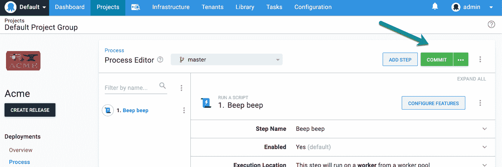
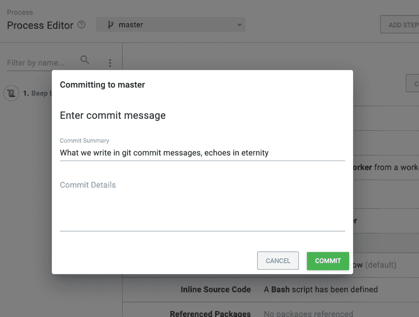
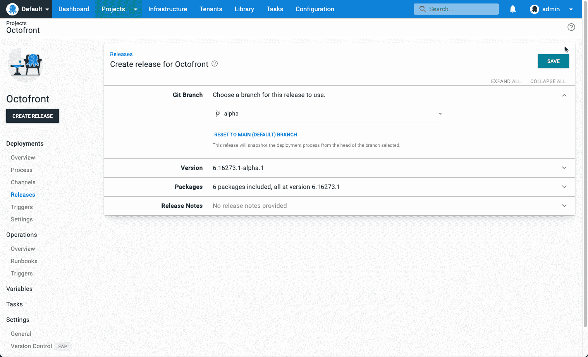

# 代码- Octopus 部署时的形状配置

> 原文：<https://octopus.com/blog/shaping-config-as-code>

我们最近一直忙于为 Octopus Deploy 构建配置代码(Config as Code)支持。在本帖中，我们来看看形成这一特征的一些因素:

*   为什么我们将配置构建为代码
*   我们想要避免的反模式
*   设计决策

然而，首先我们应该定义我们所说的“配置为代码”是什么意思。我们指的是 Octopus 项目的版本控制(Git)文本表示。今天，当您在 Octopus 中配置一个项目时，配置被存储为关系数据库中的记录。该特性获取一些数据，并将其作为文件保存在 Git 存储库中，而不是数据库中。

## 为什么配置为代码？

在过去的几年里，版本控制 Octopus 配置一直是我们最需要的特性。我们明白为什么。这些优势极具吸引力，包括:

*   历史 : Git 是代码的时间机器。能够在应用程序代码旁边查看 Octopus 配置的内容、时间和人员无疑是有用的。
*   **分支**:现在，部署流程只有一个实例。这使得测试变更变得困难，因为当一个版本被创建时，它将使用当前的部署过程。Git 分支使得部署过程可以有任意多的版本。这允许在不影响稳定性的情况下迭代变更。
*   **单一事实来源**:让应用程序代码、构建脚本和部署配置生活在一起，让每个人都感到温暖和模糊。
*   **克隆**:想象一下能够将一个`.octopus`文件夹复制到一个新的 Git 存储库(可能改变一些变量)并使用它作为 Octopus 项目的启动程序。

有两个投票率很高的用户声音建议( [1](https://octopusdeploy.uservoice.com/forums/170787-general/suggestions/15698781-version-control-configuration) 、 [2](https://octopusdeploy.uservoice.com/forums/170787-general/suggestions/35362726-allow-variables-to-be-version-controlled) )，但更有说服力的是许多客户对话。

最后，我们想要这个！我们使用 Octopus Deploy 来交付 Octopus Deploy，对一个特性的第一个试金石是我们是否对此感到兴奋。我们是。

## 反模式

我们当然不是第一个实现这一功能的产品。我们生态系统中的许多工具都集成了 Git。这让我们有机会尝试各种不同的实现，并感觉到是什么让一个愉快的体验和不那么愉快的体验有所不同。

很明显，有一些模式是我们想要避免的。

### 反模式#1: Git DB

人们很容易把 Git 想象成“另一个数据库”，简单地把一个持久层换成另一个。因此，更改被保存在 Git 存储库中，但是 Git 的真正功能却没有发挥出来。不支持分支，不能提供提交消息，文本记录不可读，等等。

在这种情况下，Git 的唯一好处是历史记录，这当然不是什么都没有，但即使这样也是有危害的。

用`gitRepo.Push()`替换`dbTransaction.Commit()`可能是最快的方法，但作为用户，这相当令人失望。

### 反模式 2:婴儿洗澡水

在这种反模式中，用户可以选择加入 Git 集成，但前提是他们愿意放弃其他特性。

花了几个月的时间构建这个特性，很容易看出这是如何发生的，有时这是不可避免的。

对于构建在关系数据库上的应用程序来说，当大量应用程序数据不再存储在数据库中并且不再有单一版本时，很难确保所有不同的功能仍然起作用。

简单地禁用它们并说服自己这是用户的选择是很有诱惑力的。老实说，在这个特性的早期版本中，我们会禁用一些功能，但是只要有可能，我们会努力确保启用 Git 的决定带来尽可能少的妥协。

### 反模式#3:通过抽象混淆

在这种模式中，Git 概念在应用程序中被抽象出来。一个例子可能是，分支暴露为一个“草稿”隐喻。

这没什么不好，如果做对了，它会非常强大。但是对于像 Octopus 这样的应用程序来说，这是有风险的，因为用户可能对 Git 概念有所了解。

在可能的情况下，我们使用 Git 术语和概念，而不是试图将它们隐藏在抽象之下。

### 反模式#4: YAMSONXML 地狱

我们坚信想要 Git 集成并不意味着想要放弃所有的 UI 帮助。我们很早就决定不强迫在 Git 集成和良好的 UX 之间做出选择。

让您的配置具有人类可读的文本表示，您可以查看历史、分支、比较和合并，这是一种授权。盯着空文本文件中闪烁的光标可不是。

Octopus 不仅仅是一个*自动化*工具，它还是一个*协作*工具。将编辑文本文件作为进行更改的唯一方式将许多人拒之门外。

感觉像是倒退了一步。

## 设计决策

我们决定要两全其美:Git 的超级能力和 Octopus 的可用性。让我们来看看一些具体的设计决策:

### 作为核心概念的分支

分支是 Git 的超能力，我们希望尽可能充分地利用它们。我们在 Octopus UI 中展示了切换分支的能力:

[](#)

这允许轻松地切换到新的分支，以便对部署过程进行更改，而不会影响主分支。查看特定步骤时，它允许在分支之间快速切换。

### 保存时提交消息

遵循*公开 Git 概念*的原则，当为项目启用配置为代码时，我们将`Save`按钮重新标记为`Commit`。

[](#)

我们还观察到有两种类型的变化。这些例子有:

1.  对现有部署流程进行大规模更改
2.  对你在过去三个小时里一直努力工作的流程进行第四十九次调整

在第一种情况下，我们认为您可能想要输入一个有意义的提交消息。

在情况#2 中，被提示*另一个*提交消息不太可能导致有意义的描述(或者至少一个安全的工作)。

我们想迎合这两种情况，所以我们引入了一个分割按钮，当点击它时会使用默认消息而不提示，但是`...`提供了输入提交消息的能力。

[](#)

### Releases 和 Git:完美的匹配

Config as Code 完全符合 Octopus 中[版本](https://octopus.com/docs/releases)的概念。

今天，当您创建一个版本时，它会对当前的部署过程、变量和其他一些东西进行快照。

启用 Config as Code 后，当创建一个发布时，它将允许选择包含部署过程的 Git 分支(很快会选择 commit 或 tag ):

[](#)

从这一点上来说，您的版本不会随着项目生命周期中的环境的进展而改变，就像今天一样。

### 不是 YAML，不是 JSON，不是 XML

一个明显的问题是*我们将使用哪种配置语言*？YAML，JSON，XML？在过去的几年里，我们询问了许多人的意见。我们的结论是，大家都讨厌他们所有人。感觉就像在问*你更喜欢喝哪种清洁产品*？也许这是因为每个人做出的权衡是如此明显。我们承认没有任何选择接近多数人的接受。

对于我们的配置语言，我们使用基于[哈希公司的 HCL](https://github.com/hashicorp/hcl) 的语言。

```
step "Greetings World" {
    script_action {
        channels = ["Release", "Beta"]
        environments = ["Production"]
        worker_pool = "Ubuntu 2018.4"
        syntax = "Bash"
        body = <<EOT
            echo "#{Greeting} World!"
        EOT
    }
}
step "Test Status Page" {
    http_test_url_action {
        url = "https://#{Domain}/status"
        expected_code = 200
        timeout_seconds = 60
    }
} 
```

我们的主要考虑是:

*   人类可读性:在 Git 中存储配置的全部目的是让人类能够阅读和比较它。
*   **复杂文档**:部署流程不是琐碎的文档。它们通常有几十个步骤(或者更多)，并且可以嵌套得很深。我们不设想人们从头开始创作这些，但我们相信人们会编辑它们，复制粘贴步骤，添加环境范围等。我们希望尽可能地支持这些类型的编辑。

其他明显的竞争者是 YAML、JSON 和 XML。

*   我们排除了 JSON，因为它是为表示序列化对象而设计的，并且不是特别友好(引用太多了！).
*   我们排除了 XML 尽管逆水行舟很有趣，但是 XML 太冗长了(有太多的尖括号！).
*   YAML 勾选了人类可读框，但是编辑复杂文档很痛苦，我们觉得更适合简单的文档(太多空白了！).

我们喜欢盐酸。我们认为它是这项工作的合适工具。尽管我们已经公开使用 HCL 作为起点，但我们将我们的实现称为**章鱼配置语言(OCL)** 。

我们已经构建了自己的[解析器/串行化器](https://github.com/OctopusDeploy/Ocl)，我们没有义务遵循 Hashicorp 对 HCL 的任何指示，也没有任何东西阻止我们做出改变。

老实说，我们觉得配置语言的选择远不是最重要的部分。不管我们选择哪一种，好处都是相似的。

## 下一步是什么？

下一步是把这个交到你手里。我们在 2021 年推出了 Config as Code 的早期访问预览版。它将退出早期访问，并很快可用于生产。

## 观看我们的网络研讨会:在 Octopus 中将配置作为代码引入

德里克·坎贝尔和皮特·加拉格尔将带你了解在 Octopus 中配置为代码的入门知识，以及在大规模使用配置为代码时的最佳实践。

[https://www.youtube.com/embed/Z4DgiJ630FU](https://www.youtube.com/embed/Z4DgiJ630FU)

VIDEO

我们定期举办网络研讨会。请参见[网络研讨会第](https://octopus.com/events)页，了解有关即将举行的活动和实时流媒体录制的详细信息。

愉快的部署！