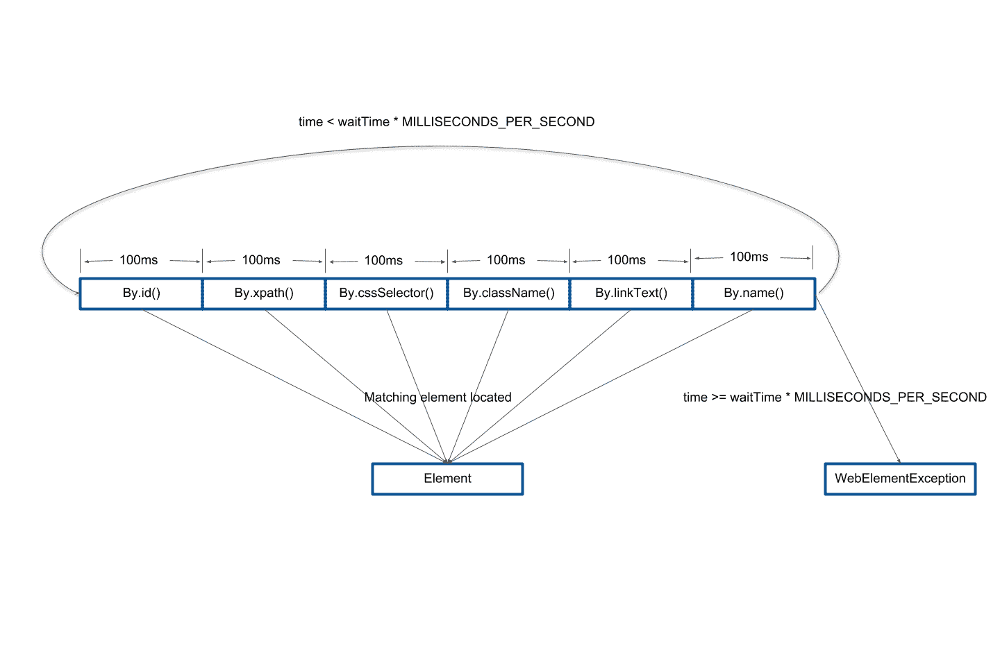

# Selenium 系列:简化的元素位置- Octopus 部署

> 原文：<https://octopus.com/blog/selenium/9-simplified-element-location/simplified-element-location>

这篇文章是关于[创建 Selenium WebDriver 测试框架](/blog/selenium/0-toc/webdriver-toc)的系列文章的一部分。

在上一篇文章中，我们研究了在网页中定位元素的各种方法，以便测试与它们进行交互。我们构建了允许我们与通过 ID、XPath 和 CSS 选择器找到的元素进行交互的方法。

但是如果我们可以用元素标识符调用一组方法，并让 WebDriver 计算出哪些元素匹配，那就更好了。

假设您正在使用测试驱动的开发方法开发一个 web 应用程序。您可以编写如下所示的测试:

```
public void formTestWithSimpleBy() throws URISyntaxException {

  final AutomatedBrowser automatedBrowser =
  AUTOMATED_BROWSER_FACTORY.getAutomatedBrowser("ChromeNoImplicitWait");

  // Populate these variables when it is known how to locate the elements
  final String formButtonLocator = "";
  final String formTextBoxLocator = "";
  final String formTextAreaLocator = "";
  final String formDropDownListLocator = "";
  final String formCheckboxLocator = "";
  final String messageLocator = "";

  try {
    automatedBrowser.init();

    automatedBrowser.goTo(FormTest.class.getResource("/form.html").toURI().toString());

    automatedBrowser.clickElement(formButtonLocator, 10);
    assertEquals("Button Clicked", automatedBrowser.getTextFromElement(messageLocator));

    automatedBrowser.populateElement(formTextBoxLocator, "test text", 10);
    assertEquals("Text Input Changed", automatedBrowser.getTextFromElement(messageLocator));

    automatedBrowser.populateElement(formTextAreaLocator, "test text",
    10);
    assertEquals("Text Area Changed", automatedBrowser.getTextFromElement(messageLocator));

    automatedBrowser.selectOptionByTextFromSelect("Option 2.1", formDropDownListLocator, 10);
    assertEquals("Select Changed", automatedBrowser.getTextFromElement(messageLocator));

    automatedBrowser.clickElement(formCheckboxLocator, 10);
    assertEquals("Checkbox Changed", automatedBrowser.getTextFromElement(messageLocator));
  } finally {
    automatedBrowser.destroy();
  }
} 
```

注意，测试调用了类似于`automatedBrowser.clickElement()`或`automatedBrowser.populateElement()`的方法。这些方法并不指定通过 ID、XPath 或 CSS 选择器来查找元素。事实上，使用测试驱动的开发方法，您很可能不知道选择这些元素的最佳方式，因为 web 页面还没有被编写。作为一名测试人员，我们所关心的是有*某种*方法来定位元素，当这些值已知时，实际的定位器是我们稍后填充的东西。

通过一些技巧，编写这样的测试是可能的。

我们将从创建一个名为`SimpleBy`的接口开始。它有一个名为`getElement()`的方法。该方法将返回匹配定位器字符串的第一个元素，无论该定位器是 ID、XPath、CSS 选择器、名称还是任何其他搜索元素的方式:

```
package com.octopus.utils;

import org.openqa.selenium.WebDriver;
import org.openqa.selenium.WebElement;

public interface SimpleBy {
  WebElement getElement(WebDriver webDriver,
    String locator,
    int waitTime,
    ExpectedConditionCallback expectedConditionCallback);
} 
```

`ExpectedConditionCallback`接口定义了一个方法，它接受一个`By`对象，并返回一个`ExpectedCondition`对象。我们将利用这一点来建立一个显式的等待条件:

```
package com.octopus.utils;

import org.openqa.selenium.By;
import org.openqa.selenium.WebElement;
import org.openqa.selenium.support.ui.ExpectedCondition;

@FunctionalInterface
public interface ExpectedConditionCallback {
  ExpectedCondition<WebElement> getExpectedCondition(By by);
} 
```

为了表示使用通用定位器定位元素时遇到的错误，我们创建了`WebElementException`类:

```
package com.octopus.exceptions;

public class WebElementException extends RuntimeException {

  public WebElementException() {

  }

  public WebElementException(final String message) {
    super(message);
  }

  public WebElementException(final String message, final Throwable ex) {
    super(message, ex);
  }

  public WebElementException(final Exception ex) {
    super(ex);
  }
} 
```

实现`SimpleBy`接口的是`SimpleByImpl`类。这就是奇迹发生的地方:

```
package com.octopus.utils.impl;

import com.octopus.exceptions.WebElementException;
import com.octopus.utils.ExpectedConditionCallback;
import com.octopus.utils.SimpleBy;
import org.openqa.selenium.By;
import org.openqa.selenium.WebDriver;
import org.openqa.selenium.WebElement;
import org.openqa.selenium.support.ui.ExpectedCondition;
import java.util.concurrent.TimeUnit;

public class SimpleByImpl implements SimpleBy {

  private static final int MILLISECONDS_PER_SECOND = 1000;
  private static final int TIME_SLICE = 100;

  @Override
  public WebElement getElement(
    WebDriver webDriver,
    String locator,
    int waitTime,
    ExpectedConditionCallback expectedConditionCallback) {

    final By[] byInstances = new By[] {
      By.id(locator),
      By.xpath(locator),
      By.cssSelector(locator),
      By.className(locator),
      By.linkText(locator),
      By.name(locator)
    };

    long time = -1;

    while (time < waitTime * MILLISECONDS_PER_SECOND) {
      for (final By by : byInstances) {
        try {
          final WebDriverWaitEx wait = new WebDriverWaitEx(
          webDriver,
          TIME_SLICE,
          TimeUnit.MILLISECONDS);
          final ExpectedCondition<WebElement> condition =
          expectedConditionCallback.getExpectedCondition(by);
          return wait.until(condition);
        } catch (final Exception ignored) {
          /*
            Do nothing
          */
        }

        time += TIME_SLICE;
      }
    }

    throw new WebElementException("All attempts to find element failed");
  }
} 
```

让我们来分解这个类。

在`getElement()`方法中，我们创建了许多`By`实例，传递通用定位器字符串。定位器字符串可以是任何东西:XPath、ID 或 CSS 选择器。我们不知道我们有哪种定位器，但是通过用它构建`By`类的多个不同实现，我们有多种不同的方法来尝试找到匹配的元素:

```
@Override
public WebElement getElement(
  WebDriver webDriver,
  String locator,
  int waitTime,

  ExpectedConditionCallback expectedConditionCallback) {
    final By[] byInstances = new By[] {
      By.id(locator),
      By.xpath(locator),
      By.cssSelector(locator),
      By.className(locator),
      By.linkText(locator),
      By.name(locator)
  }; 
```

然后我们进入一个`while`循环。这个循环至少会运行一次，因为我们从`-1`开始`time`变量。当循环中花费的时间少于我们分配的查找匹配元素的时间时，循环将继续:

```
long time = -1;

while (time < waitTime * MILLISECONDS_PER_SECOND) { 
```

接下来，我们遍历之前创建的`By`类的每个实例。我们这里的目的是找到一个`By`实例，它可以使用所提供的定位器来实际匹配一个元素:

```
for (final By by : byInstances) { 
```

在`try`块中，我们执行了一个显式等待，只是这次我们等待的时间很短。`TIME_SLICE`被设置为一秒钟的`0.1`，这意味着循环的这次迭代所使用的`By`的每个实现都有几分之一秒的时间来寻找匹配元素。

注意，我们调用传递给`expectedConditionCallback`参数的函数接口，将`By`类的实例转换成期望的条件。这允许方法的调用方决定元素应该处于什么状态才能被认为是匹配的。

WebDriver API 不是线程安全的，所以我们必须像这样按顺序执行代码，而不是在单独的线程中运行每个测试。

`catch`块什么也不做，因为我们预计大多数寻找具有`By`类的给定实现的元素的尝试都会失败。例如，如果定位器字符串被设置为类似于`//*[@name="button_element"]`的 XPath，定位器`By.cssSelector(locator)`将永远找不到匹配，因为它只适用于 CSS 选择器。

然而，定位器`By.xpath(locator)`很可能找到匹配，在这种情况下`return` ait.until(condition)`将退出循环并返回匹配元素:

```
try {
  final WebDriverWaitEx wait = new WebDriverWaitEx(
  webDriver,
  TIME_SLICE,
  TimeUnit.MILLISECONDS);
  final ExpectedCondition<WebElement> condition = expectedConditionCallback.getExpectedCondition(by);

  return wait.until(condition);
} catch (final Exception ignored) {
  /*
    Do nothing
  */
} 
```

如果`By`的当前实现没有成功找到匹配的元素，我们将时间(找到元素所花费的总时间)增加`TIME_SLICE`(我们分配给`By`的这个实现的时间)，并进入下一个搜索:

```
time += TIME_SLICE; 
```

如果在分配的时间内所有寻找元素的尝试都失败了，我们抛出一个异常:

```
throw new WebElementException("All attempts to find element failed"); 
```

这段代码的最终结果是给每个`By`的实现一小段时间来找到与所提供的定位器字符串相匹配的东西。第一个找到匹配的返回它，否则抛出一个异常。

[](#)

您可能想知道如果两个`By`的实现可以返回一个匹配会发生什么。如果一个元素的`id`属性与另一个元素的`name`属性相同，就会发生这种情况。在这种情况下，第一个匹配项获胜并被返回。

但是在实践中，这种冲突很少发生，并且可以通过传递 XPath 或 CSS 选择器作为定位器来轻松解决。您的 web 页面在`id`、`name`或`class`属性中嵌入 XPath 或 CSS 选择器的几率非常小，因此它们不会匹配多个元素。

如果你有敏锐的眼光，你可能已经注意到我们创建了一个`WebDriverWaitEx`的实例，而不是通常的`WebDriverWait`。`WebDriverWaitEx`扩展了`WebDriverWait`并添加了一个额外的构造函数，允许它被配置为等待亚秒量的时间(`WebDriverWait`可以等待不少于 1 秒)。这对我们很重要，因为如果我们测试的每个`By`类的实例需要 1 秒钟完成，那么整个循环至少需要 6 秒钟来处理，这太长了:

```
package com.octopus.utils.impl;

import org.openqa.selenium.WebDriver;
import org.openqa.selenium.support.ui.Clock;
import org.openqa.selenium.support.ui.Sleeper;
import org.openqa.selenium.support.ui.SystemClock;
import org.openqa.selenium.support.ui.WebDriverWait;

import java.util.concurrent.TimeUnit;

public class WebDriverWaitEx extends WebDriverWait {
    public static final long DEFAULT_SLEEP_TIMEOUT = 10;

    public WebDriverWaitEx(final WebDriver driver, final long timeOutInSeconds) {
        this(driver, new SystemClock(), Sleeper.SYSTEM_SLEEPER, timeOutInSeconds, DEFAULT_SLEEP_TIMEOUT);
    }

    public WebDriverWaitEx(final WebDriver driver, final long timeOut, final TimeUnit time) {
        this(driver, new SystemClock(), Sleeper.SYSTEM_SLEEPER, timeOut, DEFAULT_SLEEP_TIMEOUT, time);
    }

    public WebDriverWaitEx(final WebDriver driver, final long timeOutInSeconds, final long sleepInMillis) {
        this(driver, new SystemClock(), Sleeper.SYSTEM_SLEEPER, timeOutInSeconds, sleepInMillis);
    }

    public WebDriverWaitEx(
            final WebDriver driver,
            final Clock clock,
            final Sleeper sleeper,
            final long timeOutInSeconds,
            final long sleepTimeOut) {

        this(driver, clock, sleeper, timeOutInSeconds, sleepTimeOut, TimeUnit.SECONDS);
    }

    public WebDriverWaitEx(
            final WebDriver driver,
            final Clock clock,
            final Sleeper sleeper,
            final long timeOut,
            final long sleepTimeOut,
            final TimeUnit time) {

        // Call the WebDriverWait constructor with a timeout of 0
        super(driver, clock, sleeper, 0, sleepTimeOut);
        // Now set the timeout, possibly as a sub-second duration
        withTimeout(timeOut, time);
    }
} 
```

我们现在能够基于任何类型的定位器找到元素。为了利用这一点，我们向`AutomatedBrowser`接口添加了以下方法:

```
void clickElement(String locator);

void clickElement(String locator, int waitTime);

void selectOptionByTextFromSelect(String optionText, String locator);

void selectOptionByTextFromSelect(String optionText, String locator, int waitTime);

void populateElement(String locator, String text);

void populateElement(String locator, String text, int waitTime);

String getTextFromElement(String locator);

String getTextFromElement(String locator, int waitTime); 
```

常用的默认方法被添加到`AutomatedBrowserBase`:

```
@Override
public void clickElement(final String locator) {
  if (getAutomatedBrowser() != null) {
    getAutomatedBrowser().clickElement(locator);
  }
}

@Override
public void clickElement(final String locator, final int waitTime) {
  if (getAutomatedBrowser() != null) {
    getAutomatedBrowser().clickElement(locator, waitTime);
  }
}

@Override
public void selectOptionByTextFromSelect(final String optionText, final String locator) {
  if (getAutomatedBrowser() != null) {
    getAutomatedBrowser().selectOptionByTextFromSelect(optionText, locator);
  }
}

@Override
public void selectOptionByTextFromSelect(final String optionText, final String locator, final int waitTime) {
  if (getAutomatedBrowser() != null) {
    getAutomatedBrowser().selectOptionByTextFromSelect(optionText, locator, waitTime);
  }
}

@Override
public void populateElement(final String locator, final String text) {
  if (getAutomatedBrowser() != null) {
    getAutomatedBrowser().populateElement(locator, text);
  }
}

@Override
public void populateElement(final String locator, final String text, final int waitTime) {
  if (getAutomatedBrowser() != null) {
    getAutomatedBrowser().populateElement(locator, text, waitTime);
  }
}

@Override
public String getTextFromElement(final String locator) {
  if (getAutomatedBrowser() != null) {
    return getAutomatedBrowser().getTextFromElement(locator);
  }
  return null;
}

@Override
public String getTextFromElement(final String locator, final int waitTime) {
  if (getAutomatedBrowser() != null) {
    return getAutomatedBrowser().getTextFromElement(locator, waitTime);
  }
  return null;
} 
```

并且在`WebDriverDecorator`中增加了以下实现:

```
private static final SimpleBy SIMPLE_BY = new SimpleByImpl();

@Override
public void clickElement(final String locator) {
  clickElement(locator, 0);
}

@Override
public void clickElement(final String locator, final int waitTime) {
SIMPLE_BY.getElement(
  getWebDriver(),
  locator,
  waitTime,
  by -> ExpectedConditions.elementToBeClickable(by))
  .click();
}

@Override
public void selectOptionByTextFromSelect(final String optionText, final String locator) {
  selectOptionByTextFromSelect(optionText, locator, 0);
}

@Override
public void selectOptionByTextFromSelect(final String optionText, final String locator, final int waitTime) {
new Select(SIMPLE_BY.getElement(
  getWebDriver(),
  locator,
  waitTime,
  by -> ExpectedConditions.elementToBeClickable(by)))
  .selectByVisibleText(optionText);
}

@Override
public void populateElement(final String locator, final String text) {
  populateElement(locator, text, 0);
}

@Override
public void populateElement(final String locator, final String text, final int waitTime) {
  SIMPLE_BY.getElement(
    getWebDriver(),
    locator,
    waitTime,
    by -> ExpectedConditions.elementToBeClickable(by))
    .sendKeys(text);
}

@Override
public String getTextFromElement(final String locator) {
  return getTextFromElement(locator, 0);
}

@Override
public String getTextFromElement(final String locator, final int waitTime) {
  return SIMPLE_BY.getElement(
    getWebDriver(),
    locator,
    waitTime,
    by -> ExpectedConditions.presenceOfElementLocated(by))
    .getText();
} 
```

现在我们可以混合使用 IDs、CSS 选择器和 XPaths 来完成测试。新方法将自动找到任何匹配的元素，我们不需要担心将正确的定位器匹配到正确的方法。

这里使用`ChromeNoImplicitWait`配置非常重要。如果您还记得上一篇文章，混合隐式和显式等待会导致一些不良结果，这就是曾经的情况。如果我们使用一个启用了隐式等待的配置，对我们上面实现的方法的调用可能需要将近一分钟才能完成，因为 6 个显式等待中的每一个都要等待我们为隐式等待配置的 10 秒。通过使用`ChromeNoImplicitWait`配置，我们确保`SimpleByImpl`类中的显式等待只需要几分之一秒:

```
@Test
public void formTestWithSimpleBy() throws URISyntaxException {
  final AutomatedBrowser automatedBrowser = AUTOMATED_BROWSER_FACTORY.getAutomatedBrowser("ChromeNoImplicitWait");

  final String formButtonLocator = "button_element";
  final String formTextBoxLocator = "text_element";
  final String formTextAreaLocator = "textarea_element";
  final String formDropDownListLocator = "[name=select_element]";

  final String formCheckboxLocator = "//*[@name=\"checkbox1_element\"]";

  final String messageLocator = "message";

  try {
    automatedBrowser.init();

    automatedBrowser.goTo(FormTest.class.getResource("/form.html").toURI().toString());

    automatedBrowser.clickElement(formButtonLocator, 10);
    assertEquals("Button Clicked", automatedBrowser.getTextFromElement(messageLocator));

    automatedBrowser.populateElement(formTextBoxLocator, "test text", 10);
    assertEquals("Text Input Changed", automatedBrowser.getTextFromElement(messageLocator));

    automatedBrowser.populateElement(formTextAreaLocator, "test text", 10);
    assertEquals("Text Area Changed", automatedBrowser.getTextFromElement(messageLocator));

    automatedBrowser.selectOptionByTextFromSelect("Option 2.1", formDropDownListLocator, 10);
    assertEquals("Select Changed", automatedBrowser.getTextFromElement(messageLocator));

    automatedBrowser.clickElement(formCheckboxLocator, 10);
    assertEquals("Checkbox Changed", automatedBrowser.getTextFromElement(messageLocator));
  } finally {
    automatedBrowser.destroy();
  }
} 
```

根据我自己的经验，我们添加到`AutomatedBrowser`接口的这些新方法比绑定到特定定位器的方法要方便得多。它们消除了手动保持定位器和它们被传递到的方法同步的需要，并且代码可读性也更好。由于这个原因，未来的帖子将几乎只使用这些新方法。

这篇文章是关于[创建 Selenium WebDriver 测试框架](/blog/selenium/0-toc/webdriver-toc)的系列文章的一部分。