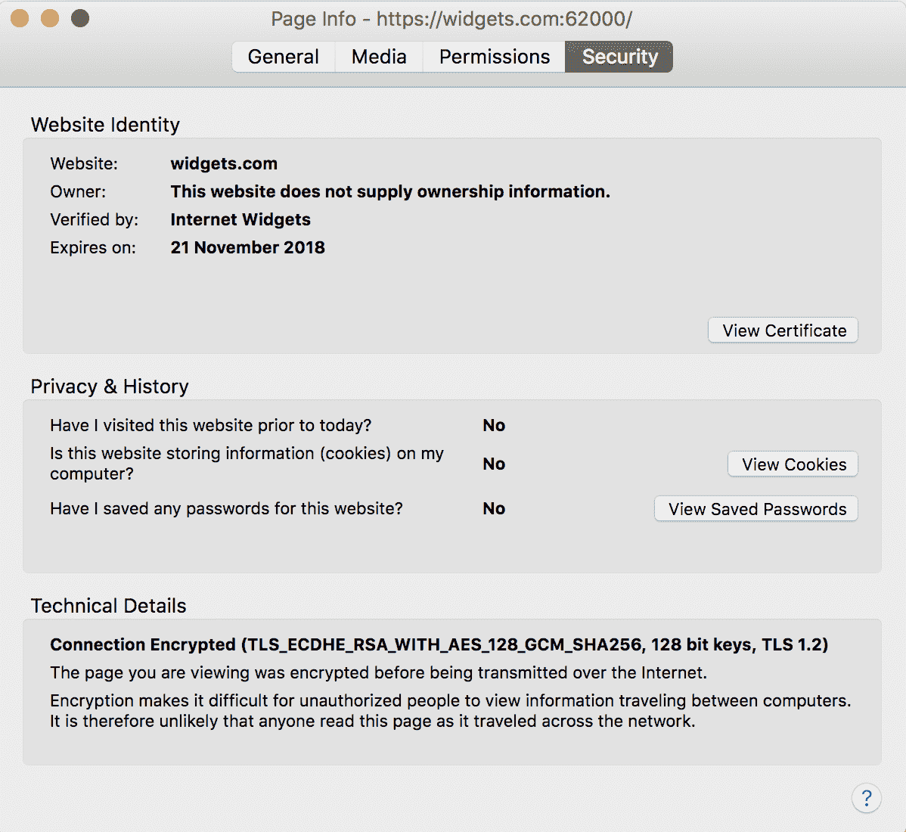
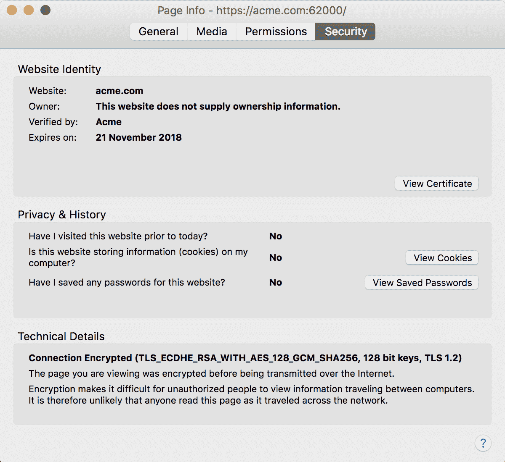
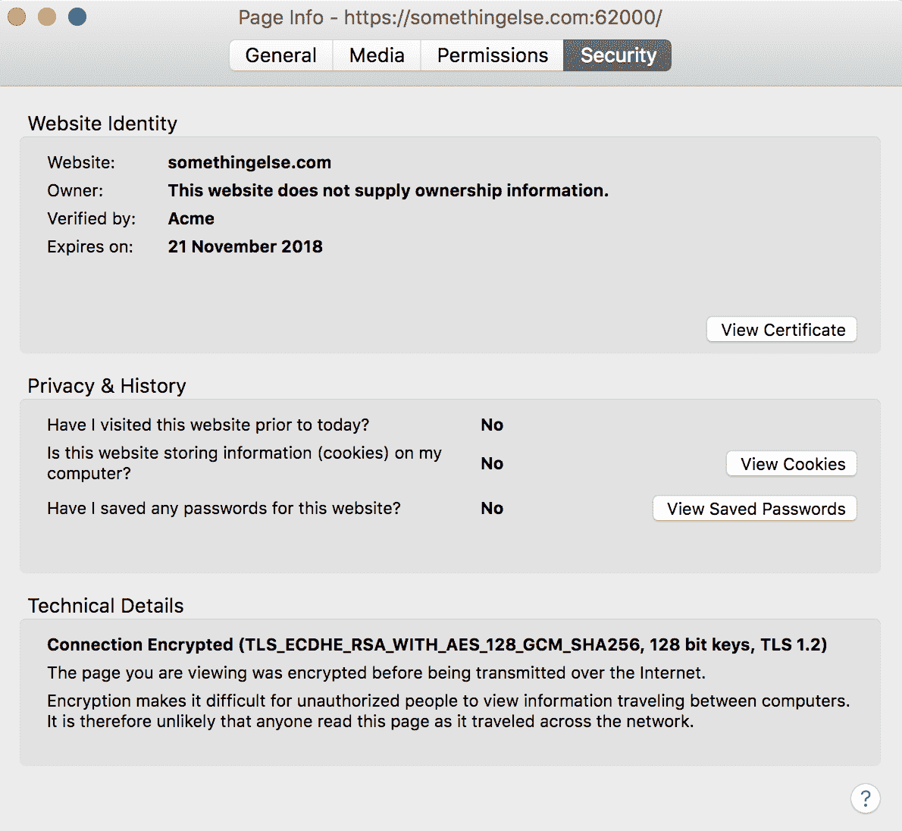

# SNI 在 Tomcat -章鱼部署

> 原文：<https://octopus.com/blog/sni-in-tomcat>

服务器名称指示(SNI)已经在 Tomcat 8.5 和 9 中实现，这意味着证书可以映射到传入请求的主机名。这允许 Tomcat 在单个 HTTPS 端口上使用不同的证书进行响应。

这篇博客文章着眼于如何在 Tomcat 9 中配置 SNI。

## 创建自签名证书

在本例中，我们将创建两个自签名证书。这是通过`openssl`命令完成的。

下面的输出显示了如何为“Internet Widgets”公司创建第一个自签名证书。

```
$ openssl req -x509 -newkey rsa:4096 -keyout widgets.key -out widgets.crt -days 365
Generating a 4096 bit RSA private key
......++
........++
writing new private key to 'widgets.key'
Enter PEM pass phrase:
Verifying - Enter PEM pass phrase:
-----
You are about to be asked to enter information that will be incorporated
into your certificate request.
What you are about to enter is what is called a Distinguished Name or a DN.
There are quite a few fields but you can leave some blank
For some fields there will be a default value,
If you enter '.', the field will be left blank.
-----
Country Name (2 letter code) []:AU
State or Province Name (full name) []:QLD
Locality Name (eg, city) []:Brisbane
Organization Name (eg, company) []:Internet Widgets
Organizational Unit Name (eg, section) []:
Common Name (eg, fully qualified host name) []:
Email Address []:
Octopuss-MBP-2:Development matthewcasperson$ ls
widgets.crt     widgets.key 
```

然后，我们为“Acme”公司创建第二个自签名证书。

```
$ openssl req -x509 -newkey rsa:4096 -keyout acme.key -out acme.crt -days 365
Generating a 4096 bit RSA private key
..............................++
.....................................................................++
writing new private key to 'acme.key'
Enter PEM pass phrase:
Verifying - Enter PEM pass phrase:
-----
You are about to be asked to enter information that will be incorporated
into your certificate request.
What you are about to enter is what is called a Distinguished Name or a DN.
There are quite a few fields but you can leave some blank
For some fields there will be a default value,
If you enter '.', the field will be left blank.
-----
Country Name (2 letter code) []:Au
State or Province Name (full name) []:QLD
Locality Name (eg, city) []:Brisbane
Organization Name (eg, company) []:Acme
Organizational Unit Name (eg, section) []:
Common Name (eg, fully qualified host name) []:
Email Address []:
Octopuss-MBP-2:Development matthewcasperson$ ls
acme.crt        acme.key        widgets.crt     widgets.key 
```

将文件`acme.crt`、`acme.key`、`widgets.crt`和`widgets.key`复制到 Tomcat 9 `conf`目录中。

## 配置`<Connector>`

在`conf/server.xml`文件中，我们将添加一个新的`<Connector>`元素来引用这些证书。

```
<Connector SSLEnabled="true" defaultSSLHostConfigName="acme.com" port="62000" protocol="org.apache.coyote.http11.Http11AprProtocol">
  <SSLHostConfig hostName="acme.com">
    <Certificate certificateFile="${catalina.base}/conf/acme.crt" certificateKeyFile="${catalina.base}/conf/acme.key" certificateKeyPassword="Password01!" type="RSA"/>
  </SSLHostConfig>
  <SSLHostConfig hostName="widgets.com">
    <Certificate certificateFile="${catalina.base}/conf/widgets.crt" certificateKeyFile="${catalina.base}/conf/widgets.key" certificateKeyPassword="Password01!" type="RSA"/>
  </SSLHostConfig>
</Connector> 
```

这个配置块有几个重要的方面，所以我们将逐一介绍。

`defaultSSLHostConfigName="acme.com"`属性已经将`<SSLHostConfig hostName="acme.com">`定义为默认值。这意味着，当请求来自不是`acme.com`或`widgets.com`的主机时，将使用`acme.com`证书生成响应。您必须至少配置一台默认主机。

`protocol="org.apache.coyote.http11.Http11AprProtocol"`属性将 Tomcat 配置为使用 Apache Portable Runtime (APR ),这意味着在生成 HTTPS 响应时将使用 openssl 引擎。通常，使用 openssl 会比使用原生 Java 协议获得更好的性能。Tomcat 文档有更多关于可用协议的细节。

然后，我们有了每个主机名的证书配置。这是`acme.com`主机名的配置。

```
<SSLHostConfig hostName="acme.com">
  <Certificate certificateFile="${catalina.base}/conf/acme.crt" certificateKeyFile="${catalina.base}/conf/acme.key" certificateKeyPassword="Password01!" type="RSA"/>
</SSLHostConfig> 
```

`certificateFile="${catalina.base}/conf/acme.crt"`和`certificateKeyFile="${catalina.base}/conf/acme.key"`属性定义了证书和私钥相对于 CATALINA_BASE 目录的位置。 [Tomcat 文档](https://tomcat.apache.org/tomcat-9.0-doc/RUNNING.txt)有关于 CATALINA_BASE 引用的更多细节:

> CATALINA_HOME 环境变量应该设置为 Tomcat 的“二进制”发行版的根目录位置。
> 
> CATALINA_BASE 环境变量指定 Tomcat 的“活动配置”的根目录的位置。它是可选的。默认等于 CATALINA_HOME。

## 测试连接

由于我们实际上并不拥有`acme.com`或`widgets.com`域名，我们将编辑`hosts`文件以将这些地址解析为`localhost`。在 Mac 和 Linux 操作系统上，这个文件位于`/etc/hosts`下。

将下面几行添加到`hosts`文件中会将这些域指向 localhost。我们还将抛出`somethingelse.com`主机名来查看一个未映射的主机返回哪个证书。

```
127.0.0.1 acme.com
127.0.0.1 widgets.com
127.0.0.1 somethingelse.com 
```

我们现在可以打开链接[https://widgets.com:62000](https://widgets.com:62000)。在 Firefox 中，我们可以看到这个请求有以下证书细节。注意显示`Internet Widgets`的`Verified by`字段。

[](#)

然后打开[https://acme.com:62000](https://acme.com:62000)。`Verified by`字段现在显示`Acme`。

[](#)

现在打开 https://somethingelse.com:62000。`Verified by`字段仍然显示`Acme`，因为该证书是默认的，用于任何没有定义特定映射的主机。

[](#)

## 结论

因此我们可以看到，单个端口上的单个 Tomcat 实例可以根据被请求的主机使用多个不同的证书进行响应。这就是 SNI 给 web 服务器带来的好处。

如果您对 Java 应用程序的自动化部署感兴趣，[下载 Octopus Deploy](https://octopus.com/downloads) 的试用版，并查看我们的文档。