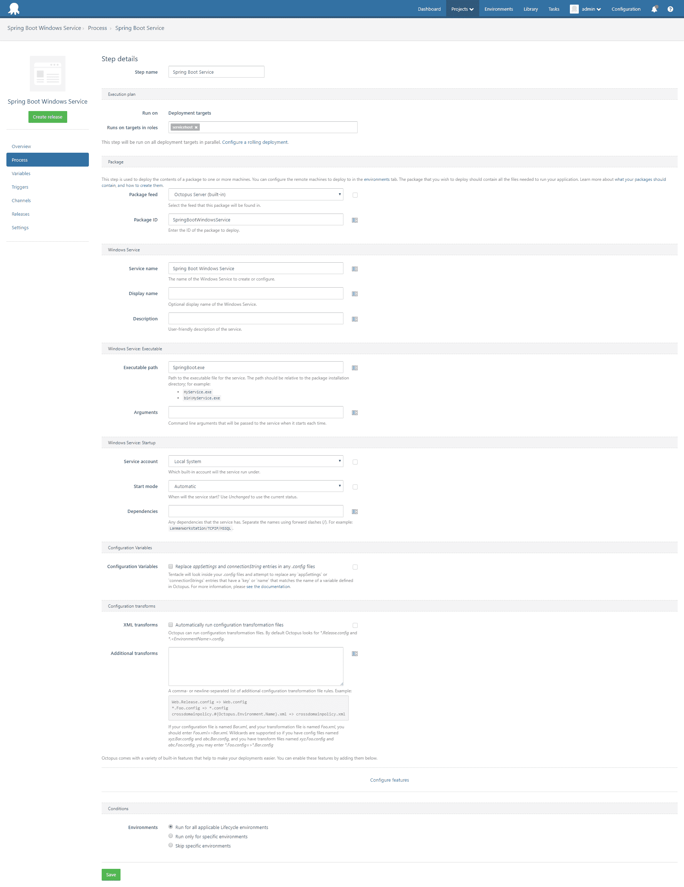
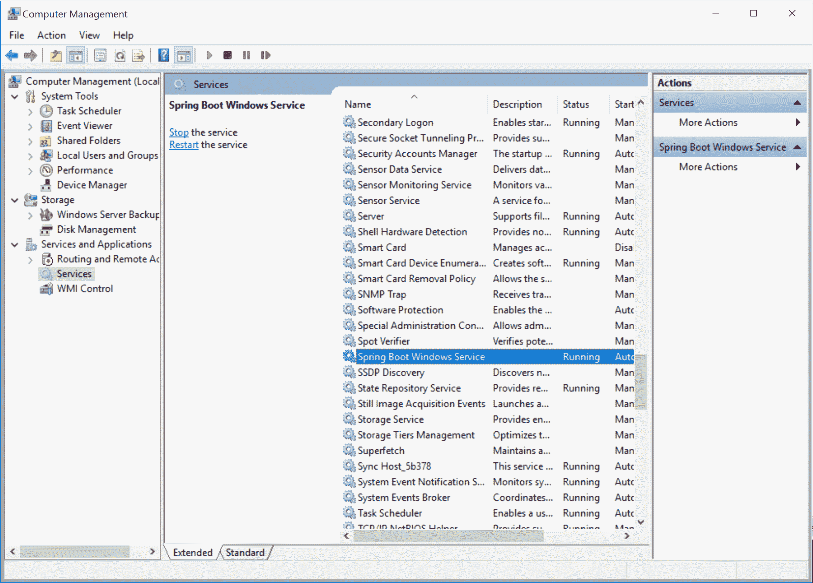

# 将 Spring Boot 应用程序部署为 Windows 服务- Octopus Deploy

> 原文：<https://octopus.com/blog/spring-boot-windows-services>

一位客户最近询问是否可以使用 Octopus Deploy 将 Spring Boot 应用程序部署为 Windows 服务。Spring 文档确实简要提到了一种将 Spring Boot 应用程序作为 Windows 服务运行的方法，但是很多细节还是留给读者去解决。所以在这篇博文中，我将向你展示如何快速运行一个标准的 Spring Boot 应用程序服务。

## Java 和 Windows 服务

要将 Spring Boot UberJAR 作为 Windows 服务运行，我们需要两件东西。

第一个是 Windows 可以作为服务运行的可执行文件。这是由 [winsw](https://github.com/kohsuke/winsw) 项目提供的。Winsw 并没有特别绑定到 Java，但是它可以用来执行`java.exe`，这是我们启动 Spring Boot JAR 文件所需要的。

第二件事是以某种方式优雅地关闭在后台运行的 Java 应用程序。为此我们有一个简单的项目叫做 [Spring Boot 停止器](https://github.com/OctopusDeploy/SpringBootStopper)(基于从 Spring 文档链接的 [Spring Boot 守护进程](https://github.com/snicoll-scratches/spring-boot-daemon)项目)。该应用程序将通过 JMX 与 Spring Boot 应用程序通信，并指示它关闭。

## 把所有的放在一起

这个[演示项目](https://github.com/OctopusDeploy/SpringBootWindowsService)是一个相当普通的 Spring Boot REST MVC 应用程序，使用 [Spring Initializr](https://start.spring.io/) 网站生成。该项目没有以特殊的方式配置，当构建时将产生一个股票 Spring Boot JAR 文件。

在项目的`dist`文件夹中，你会发现一些文件。

XML 配置文件是最神奇的地方。在里面，您会发现以下设置:

```
<executable>java</executable>
<startargument>-Dspring.application.admin.enabled=true</startargument>
<startargument>-Dcom.sun.management.jmxremote.port=50201</startargument>
<startargument>-Dcom.sun.management.jmxremote.authenticate=false</startargument>
<startargument>-Dcom.sun.management.jmxremote.ssl=false</startargument>
<startargument>-jar</startargument>
<startargument>SpringBootWindowsService.jar</startargument> 
```

这些设置定义了启动 Windows 服务时 winsw 可执行文件将运行的内容。在这种情况下，我们用一些配置 JMX 的附加系统属性来启动 Spring Boot UberJAR `SpringBootWindowsService.jar`。这些系统属性启用 [Spring Boot 管理功能](https://docs.spring.io/spring-boot/docs/current/reference/html/boot-features-spring-application.html#boot-features-application-admin)，将 JMX 端口设置为`50201`，禁用 SSL 并禁用 JMX 认证。

由于 JMX 端口上没有身份验证和 SSL，作为一项安全措施，该端口应该被防火墙阻止。

然后，我们有一些额外的设置来定义当 Windows 服务停止时 winsw 可执行文件将运行什么。

```
<stopexecutable>java</stopexecutable>
<stopargument>-jar</stopargument>
<stopargument>SpringBootStopper.jar</stopargument>
<stopargument>50201</stopargument> 
```

这里，我们运行`SpringBootStopper.jar`应用程序，传递启动 Spring Boot 应用程序时使用的同一个 JMX 端口。这些设置允许`SpringBootStopper.jar`连接到正在运行的 Spring Boot 实例并正常关闭它。

## 打包服务

要为 Octopus Deploy 打包这些文件，请使用 [CLI 工具](https://octopus.com/docs/packaging-applications/create-packages/octopack)。

```
octo pack --format=zip --id=SpringBootWindowsService --version=1.0.0 
```

这将产生一个名为`SpringBootWindowsService.1.0.0.zip`的文件，然后您可以使用以下命令将该文件推送到 Octopus 服务器:

```
octo push --server=http://my.octopus.server --apiKey=API-xxxxxxxxxxxxx --package=SpringBootWindowsService.1.0.0.zip 
```

## 部署服务

此时，您可以将该包部署为执行`SpringBoot.exe`可执行文件的传统 Windows 服务。

[](#)

部署后，该服务将像任何其他 Windows 服务一样出现。

[](#)

## 结论

启动服务，并打开浏览器到 http://localhost:8080/greeting。您的 Spring Boot 应用程序现在作为 Windows 服务运行！

## 了解更多信息