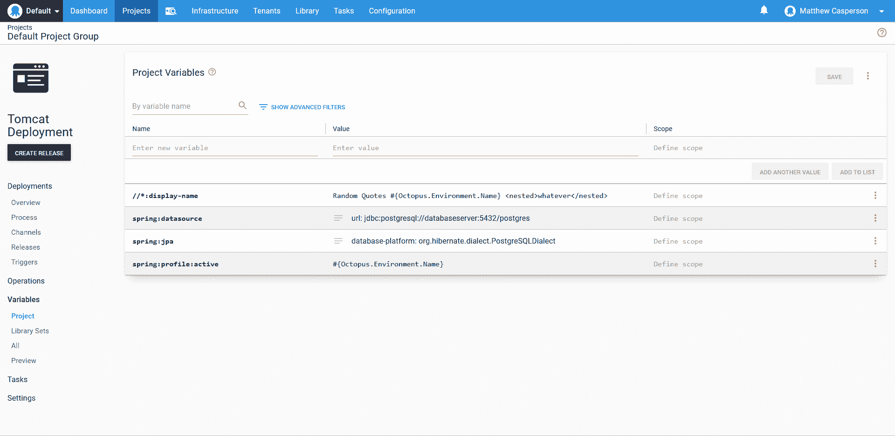

# 跨环境的 Spring 配置策略——Octopus 部署

> 原文：<https://octopus.com/blog/spring-environment-configuration>

[](#)

Spring 对复杂配置有丰富的支持。对概要文件和[外部化配置](https://docs.spring.io/spring-boot/docs/current/reference/html/spring-boot-features.html#boot-features-external-config)的内置支持为您提供了很好的自由度来构建特定于环境的配置，这些配置可以捆绑到一个独立的应用程序档案中。

但是大多数开发人员仍将面临一个基本问题，即如何在本地开发应用程序，然后将该应用程序部署到一个配置值(如数据库连接字符串(尤其是它们可能嵌入的密码))必须保密的环境中。

一种解决方案是以环境变量的形式将特定于环境的配置推入环境中。这是一个非常合理的选择，但是当一个应用服务器托管多个应用程序时，必须特别注意环境变量名，以确保特定于应用程序的配置不会冲突。

另一种解决方案是在部署应用程序时对其进行修改，以注入应用程序和环境特定的配置。例如，您可以将`localhost`上数据库的连接字符串保存到配置文件中。这种配置可以安全地签入源代码控制，为开发人员提供了在本地克隆、构建和运行的能力。但是在部署期间，特定环境的连接字符串会覆盖缺省值，从而导致特定于环境的部署，其凭证不会被窥探。

Octopus 很早就支持这种配置文件修改。NET 配置文件和 JSON 文件。这是通过理解。NET XML 文件，以便进行适当的修改，或者允许专门命名的变量将值推入 JSON 文件。

不过，Java 和 Spring 应用程序通常在 YAML、XML 或属性文件中定义配置。在 Octopus 2020.4.0 中，增加了将变量推入 XML、YAML 和属性文件的支持，使 Java 和 Spring 开发人员能够从通用应用程序档案创建特定于环境的部署。

在这篇博文中，我们将探讨一些将环境无关的 Spring 应用程序部署到特定环境的常见策略。

## 修改 Spring application.yml 文件

让我们从一个简单的例子开始，在这个例子中，我们改变了活动概要文件的名称以匹配环境。下面显示的代码来自[随机引用](https://github.com/OctopusSamples/RandomQuotes-Java)示例应用程序。

在下面的`application.yml`文件中，我们将`spring.profiles.active`属性设置为`local`,以表明我们正在本地开发环境中工作:

```
# The configuration defines the settings used in a local development environment
# to give developers the ability to clone, develop and build without any
# additional configuration.

server:
  port : 5555

spring:
  profiles:
    active: local
  h2:
    console:
      enabled: true
  jpa:
    database-platform: org.hibernate.dialect.H2Dialect
  datasource:
    url: jdbc:h2:mem:testdb
    dbcp2:
      driver-class-name: org.h2.Driver
  flyway:
    locations: classpath:db/migration/{vendor} 
```

这个配置文件中没有秘密，直接提交到源代码控制是安全的，开发人员可以删除任何额外的本地配置来开始处理代码。

通过使用 [SpEL](https://docs.spring.io/spring/docs/4.3.10.RELEASE/spring-framework-reference/html/expressions.html) 表达式注入一个值，可以将活动概要文件公开为 Spring 对象上的一个属性:

```
@Value("${spring.profiles.active:unknown}")
private String activeProfile; 
```

最终，该值显示在应用程序公开的网页中:

[](#)

假设我们想要用应用程序将被部署的环境的名称替换`spring.profiles.active`属性值。我们首先在步骤上启用**结构化配置变量**特性。

这个特性以前被称为 **JSON 配置变量**，但是在 2020.4.0 中，我们扩展了这个特性以支持许多新的配置文件:

[](#)

然后我们配置这个步骤，用 glob `**/application.yml`将值注入到`application.yml`文件中:

[](#)

最后，我们用值`#{Octopus.Environment.Name}`定义一个名为`spring:profiles:active`的变量:

[](#)

在部署期间，Octopus 将提取应用程序档案(通常是一个 JAR 或 WAR 文件)，将名为`spring:profiles:active`的变量值注入到 YAML 文件中，重新打包应用程序，并将生成的档案上传到应用服务器或保存在磁盘上，这取决于所使用的特定步骤。我们可以看到应用程序现在报告它正在 **Dev** 环境中运行:

[](#)

## 修改 web.xml 文件

Spring 定义配置文件的能力非常灵活，但是传统的 Java XML 配置文件在引用外部数据(如环境变量)或采用不同文件名的能力方面非常有限。比如传统 Java web 应用中用来定义应用设置的`web.xml`文件，只能叫做`web.xml`，不包含任何表达式语言来加载外部值或者有条件地定义设置。

在过去，这使得`web.xml`文件成为定义环境特定配置的一种特别困难的方式，但是有了向 XML 文件注入值的新能力，Octopus 现在可以在部署过程中用环境特定的值修改这个文件。

下面是我们的示例应用程序中的`web.xml`文件:

```
<web-app
        version="3.0"

        xmlns:xsi="http://www.w3.org/2001/XMLSchema-instance"
        xsi:schemaLocation="http://java.sun.com/xml/ns/javaee http://java.sun.com/xml/ns/javaee/web-app_3_0.xsd">

    <distributable />
    <display-name>Random Quotes</display-name>

</web-app> 
```

为了修改这个文件，我们使用 glob `**/web.xml`将它添加到**结构化配置变量**特性中，然后定义一个名为`//*:display-name`和值为`Random Quotes #{Octopus.Environment.Name}`的变量，这将把 Octopus 环境嵌入到应用程序的显示名称中。我们可以在 Tomcat 管理器中看到这个应用程序名:

`//*:display-name`的 XPath 使用版本 2 风格的名称空间选择。这比通常看起来像`//*[local-name()='display-name']`的版本 1 选择器要方便得多，但是两种样式都可以使用。

[](#)

## 复杂的配置更改

到目前为止，我们已经以一对一的方式将变量注入到配置文件的现有值中。这对于简单的配置更改来说很好，但是在某些情况下，特定于环境的配置会导致一些重大的更改，全新的字段和旧的设置会被删除。例如，下面是一个`application.yml`文件，它配置了一个外部 Postgres 数据库，而不是在本地开发时使用的内存中的 H2 数据库:

```
server:
  port : 5555

spring:
  profiles:
    active: Dev
  jpa:
    database-platform: org.hibernate.dialect.PostgreSQLDialect
    properties:
      hibernate:
        default_schema: randomquotes
  datasource:
    url: jdbc:postgresql://databaseserver:5432/postgres
    username: postgres
    password: docker
  flyway:
    locations: classpath:db/migration/{vendor} 
```

所有 H2 配置都已删除，JPA 配置包括新的嵌套属性。那么我们如何创建这个新的配置文件呢？

我们可以通过用新的 YAML 对象替换`jpa`和`datasource`属性的主体来获得足够的接近。

下面是名为`spring:datasource`的变量的值:

```
url: jdbc:postgresql://databaseserver:5432/postgres
username: postgres
password: docker 
```

这里是变量`spring:jpa`的值:

```
database-platform: org.hibernate.dialect.PostgreSQLDialect
properties:
  hibernate:
    default_schema: randomquotes 
```

[](#)

请注意，变量值是独立的 YAML 文档。然后，在部署过程中，这些文档被用来替换`spring.datasource`和`spring.jpa`属性的子属性。最终结果是一个看起来像这样的`application.yml`文件:

```
# The configuration defines the settings used in a local development environment
# to give developers the ability to clone, develop and build without any
# additional configuration.
server:
  port: 5555
spring:
  profiles:
    active: Dev
  h2:
    console:
      enabled: true
  jpa:
    database-platform: org.hibernate.dialect.PostgreSQLDialect
    properties:
      hibernate:
        default_schema: randomquotes
  datasource:
    url: jdbc:postgresql://databaseserver:5432/postgres
    username: postgres
    password: docker
  flyway:
    locations: classpath:db/migration/{vendor} 
```

这可能会得到我们需要的结果，但是`h2`设置仍然被定义。我们当然可以替换`spring`属性的全部内容来删除不需要的属性，但是对于更彻底的转换，更好的解决方案可能是在部署期间用第二个文件来替换`application.yml`文件。

## 配置文件和脚本挂钩

鉴于我们的环境特定的配置需要混合添加和删除内容，我们将创建第二个模板文件来表示这个名为`postgres-application.yml`的新结构。该文件包含我们期望的结构，但它包含任何敏感内容的占位符值:

```
server:
  port : 5555

spring:
  profiles:
    active: Dev
  jpa:
    database-platform: org.hibernate.dialect.PostgreSQLDialect
    properties:
      hibernate:
        default_schema: randomquotes
  datasource:
    url: jdbc:postgresql://replaceme:5432/postgres
    username: replaceme
    password: replaceme
  flyway:
    locations: classpath:db/migration/{vendor} 
```

我们可以使用一个定制的部署脚本将该模板复制到原始的`application.yml`文件上，该脚本作为一个特性启用:

[](#)

然后，`cp WEB-INF\classes\postgres-application.yml WEB-INF\classes\application.yml`的**预部署脚本**复制特定于环境的模板，覆盖默认模板:

[](#)

然后像往常一样将变量注入到`application.yml`中，结果是环境特定的配置文件，其中只有我们想要的值。

## 模板

到目前为止，我们一直在将变量放入配置文件中。这允许我们拥有一个用于本地开发的配置文件，然后用任何特定于环境的变量替换它。

现在我们已经了解了如何在部署时使用定制部署脚本来替换配置文件，我们可以选择创建模板，利用 Octopus 变量替换将变量放入文件中。例如，我们可能有一个特定于环境的配置文件，如下所示:

```
server:
  port : 5555

spring:
  profiles:
    active: Dev
  jpa:
    database-platform: org.hibernate.dialect.PostgreSQLDialect
    properties:
      hibernate:
        default_schema: randomquotes
  datasource:
    url: jdbc:postgresql://#{DatabaseServer}:5432/postgres
    username: '#{DatabaseUsername | YamlSingleQuoteEscape}'
    password: "#{DatabasePassword | YamlDoubleQuoteEscape}"
  flyway:
    locations: classpath:db/migration/{vendor} 
```

该模板期望在 Octopus 中定义`DatabaseServer`、`DatabaseUsername`和`DatabasePassword`变量。使用新的[过滤器](https://octopus.com/docs/projects/variables/variable-filters#VariableSubstitutionSyntax-Providedfilters) `YamlSingleQuoteEscape`和`YamlDoubleQuoteEscape`将这些值嵌入到 YAML 中，以确保它们在给定的上下文中被正确转义。

然后我们启用`Substitute Variables in Templates`特性，允许变量被处理:

[](#)

我们现在在**模板中的替代变量**部分匹配文件，而不是在**结构化配置变量**部分匹配文件:

[](#)

## 结论

创建支持本地开发而无需特殊工具的环境不可知的应用程序包为开发人员提供了直接的克隆、构建、运行工作流，同时还允许将单个编译的应用程序部署在许多需要任何特定配置的环境中。在这篇文章中，我们看了一个将变量推入 XML 和 YAML 文件，并将变量拉入 YAML 模板的典型例子。我们还看到了如何使用定制部署脚本将本地开发配置文件替换为特定于环境的文件。

借助 Octopus 2020.4 将变量推入 XML、YAML 和属性文件的能力，创建与环境无关的 Java 包比以往任何时候都更容易。同时，新的[八进制过滤器](https://octopus.com/docs/projects/variables/variable-filters#VariableSubstitutionSyntax-Providedfilters) `YamlSingleQuoteEscape`、`YamlDoubleQuoteEscape`、`PropertiesKeyEscape`和`PropertiesValueEscape`允许将变量放入模板中，处理所需的任何格式特定的转义。

我们希望这一新功能将通过使多种环境的部署变得流畅和轻松来增强您的 Java 部署。

愉快的部署！