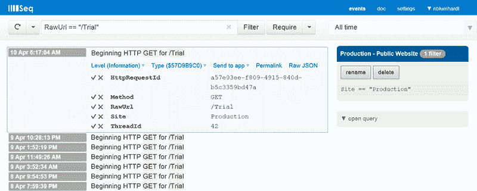

# 使用 Seq - Octopus 部署的结构化日志记录

> 原文：<https://octopus.com/blog/structured-logging-with-seq>

在一个新项目的第一天，许多团队安装一个 CI 服务器来构建和测试他们的应用程序，并安装一个部署服务器(如 Octopus)来将新版本应用到他们的测试和生产环境中。

这种设置缺少的是团队在应用程序到达时对其进行监控的方法。 [Seq](http://getseq.net) 是来自 [Nick 的公司](http://continuousit.com)的一个项目，[刚刚达到 1.0](http://nblumhardt.com/2014/03/seq-is-ready-for-prime-time/) ，旨在填补这一空白，从开发到生产一路平稳地提高可见性。

已经有了强大的日志收集工具，但是很少有适合 Windows 和。NET 工具链足够好，他们可以在“第一天”的几分钟内安装。Seq 附带了一个用于 Windows Server 的 MSI，以及与流行的。NET 日志框架。

如果你用像 [p & p 的 SLAB](http://slab.codeplex.com) 或 [Serilog](http://serilog.net) 这样的框架编写结构化日志，那么 Seq 的一些特性也使得过滤和关联事件变得特别好。

我最喜欢 Seq 的一点是，它让收集应用程序中发生的事件变得像写日志一样简单。这意味着在开发过程中，您可以使用结构化日志记录来记录正在发生的事情，而不必太担心以后如何使用它。然后只需打开 Seq，这些日志突然变得比磁盘上的日志文件更有用、更容易访问。这是一个非常值得使用的工具。

Seq 有几个受支持的专业版和一个免费的开发者版，你可以从 Seq 网站下载。希望您会发现结构化日志和 Seq 是开发和操作您的应用程序的有用工具！