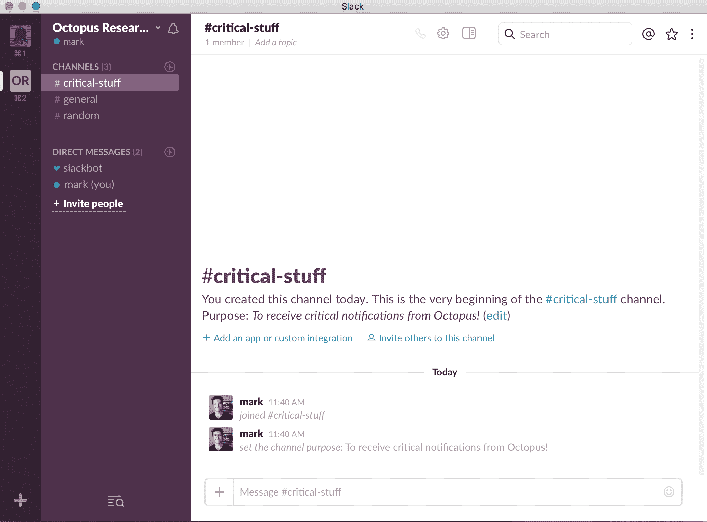
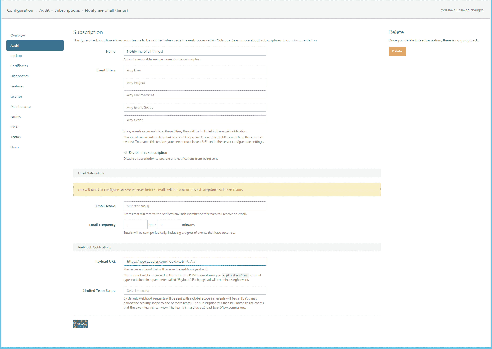
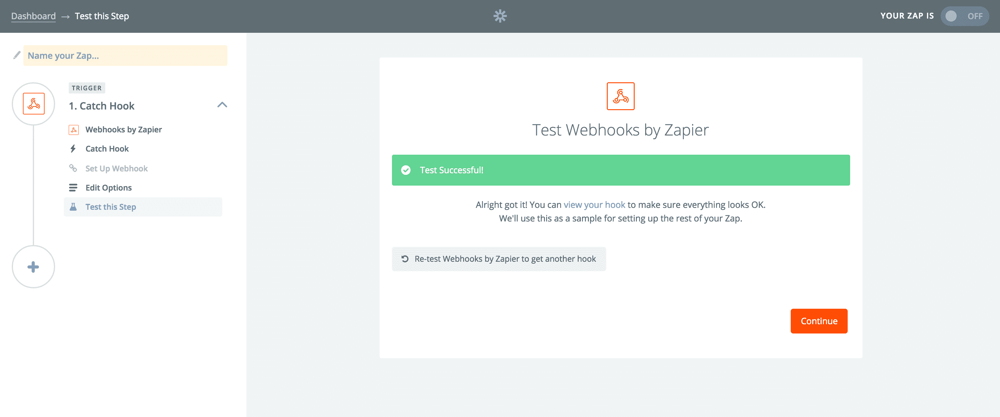
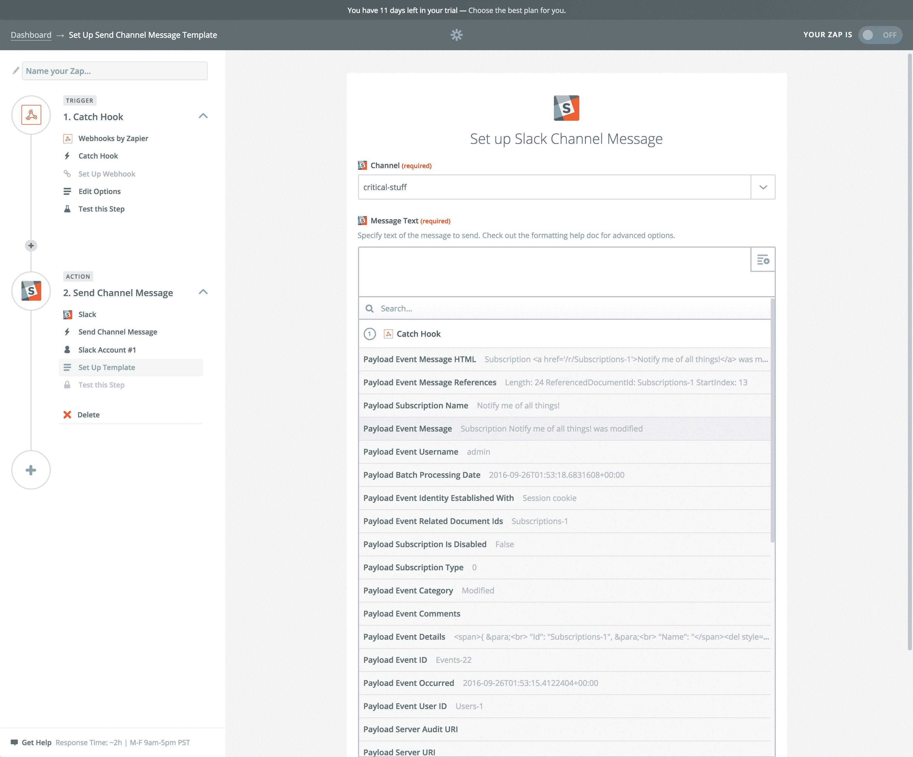
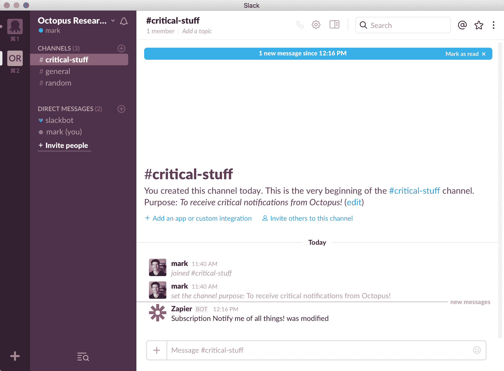
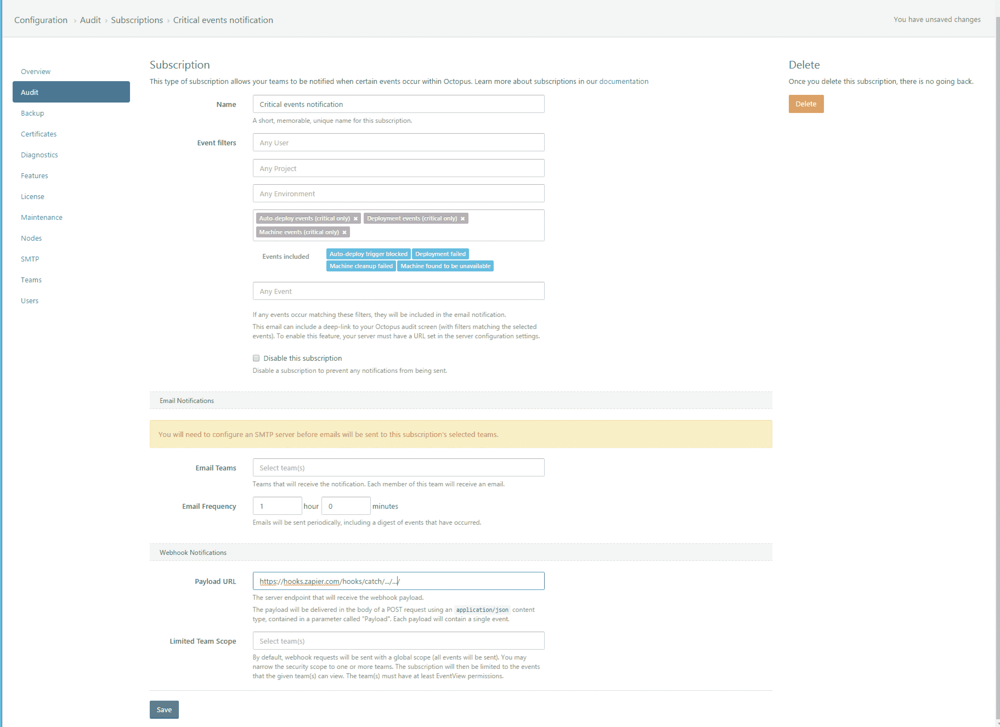

# 使用八达通订阅-八达通部署

> 原文：<https://octopus.com/blog/subscriptions>

* * *

为了介绍新的 [Octopus Subscriptions](http://g.octopushq.com/Subscriptions) 特性，我们认为展示一个简单的例子是有用的，这个例子可以在 Octopus 内部发生重大事件时通知一个空闲通道。

为此，我们需要以下内容:

*   一只章鱼 3.5。*支持[订阅](http://g.octopushq.com/Subscriptions)的实例
*   一个 Zapier 帐户，用于捕获 Octopus 的 webhooks 并通知我们的 Slack 频道
*   用于接收通知的备用帐户和通道

我们将通过这些步骤来展示如何构建一个基本的订阅通知。

## 松弛的

在 Octopus，我们喜欢 Slack，当重要事情发生时，它是通知我们的最佳人选(因为我们几乎不再检查我们的电子邮件:)。

对于这个例子，我们设置了一个名为“critical-stuff”的通道，我们希望在这里接收我们的关键通知。

## 扎皮尔

我们将使用 [Zapier](https://zapier.com/) 为我们托管一个 webhook。Zapier 将包含一个触发器(webhook)，然后运行一个操作(通知 Slack)。这个想法是，Octopus 将调用这个 webhook，无论何时发生关键事件，Slack 都会得到通知。

注意:我们使用 Zapier 的试用帐户来说明我们的例子。你可以选择编写自己的 webhook，自己集成 Slack API，但是 Zapier 让这变得非常简单，可以快速启动并运行，节省了我们的时间。

要创建触发器，请执行以下操作:

*   登录 Zapier 并创建一个新的 Zap。
*   从内置应用列表中选择“Webhooks ”,然后创建一个等待新帖子的“Catch Hook”。
*   在 webhook 设置的最后一步，Zapier 会给你一个 webhook 的 URL。记住这个值以便以后使用！我们将在 Octopus 订阅中使用该值。它看起来会像这样:`https://hooks.zapier.com/hooks/catch/.../.../`

为了测试这个 webhook 的连接性和有效负载，您现在需要进入 Octopus 并设置您的第一个订阅。但是请确保您的 Zapier 屏幕保持打开，以便我们可以确认测试工作，并在稍后继续添加我们的 Slack 操作。

## 章鱼 3.5。*

你可以从我们的[下载页面](https://octopus.com/downloads)下载 Octopus 的最新版本。像往常一样，在升级之前确保你有一个[备份](http://docs.octopusdeploy.com/display/OD/Backup+and+restore)。

一旦你安装了 Octopus 3.5，你可以从*配置>审计>订阅*菜单访问[订阅](http://g.octopushq.com/Subscriptions)。我们现在可以创建一个订阅，一旦事件可用，它就调用 Zapier webhooks。

首先，我们将创建一个名为“通知我所有事情”的订阅，请务必粘贴您的 Zapier webhook URL:

一旦我们保存此记录，Octopus 将记录一个订阅已创建的事件。Octopus 中的订阅调度程序将处理这个事件并触发 Zapier webhook。

如果您现在跳回 Zapier 屏幕(最多等待 30 秒，让 Octopus 进行处理)，您的 Zapier 测试应该已经成功接收到来自 Octopus 的有效载荷:

## 回到扎皮尔整合我们的懈怠行动

现在 Octopus 已经成功地通过我们的 webhook 与 Zapier 进行了对话，我们可以集成 Slack 操作了。

现在，您可以继续设置您的操作:

*   在 Zapier 的侧边菜单中添加一个动作。
*   从流行应用列表中选择“Slack”(或使用搜索功能查找 Slack)。
*   从操作列表中选择“发送频道消息”。
*   将您的 Slack 帐户连接到 Zapier(按照提示操作)。
*   到达编辑步骤屏幕后，您可以选择想要接收通知的松弛通道。在本例中，我们选择了之前创建的“关键材料”通道。

现在最酷的部分来了:我们将向 Slack 发送的消息:)

Zapier 知道 Octopus 将在其 webhook 中发送的有效负载(因为我们之前发送了一个测试)，所以我们可以为消息插入一个字段，并从 Octopus 为每个事件交付的有效负载对象中进行选择。例如:

在我们的例子中，我们想知道“有效负载事件消息”。

我们现在可以继续保存 Zapier 操作，并继续进行测试，就像这样，当 Octopus 发生活动时，我们现在会在 Slack 中收到通知:

记住保存我们的 Zap 并给它一个名字(确保它已启用)，我们现在可以返回到 Octopus 并修改我们的订阅，以便只根据某些标准通知我们。

## 回到 Octopus(完成我们的订阅)

在这种情况下，我们只想知道关键事件，如部署失败或自动部署被阻止。我们可以很容易地修改我们之前所做的订阅来实现这一点:

*   用八达通开通我们的订阅。
*   选择“通知我所有事情！”我们之前做的订阅。
*   将订阅的名称编辑为“关键事件通知”。
*   使用事件组过滤器仅选择关键事件。
*   保存。

现在，只要 Octopus 内部发生重大事件，Octopus 就会通知我们的 Slack 频道(通过我们的 Zapier webhook)

您可以在我们的[订阅](http://g.octopushq.com/Subscriptions)文档中了解更多关于订阅的信息，包括向特定团队发送电子邮件和确定订阅范围。