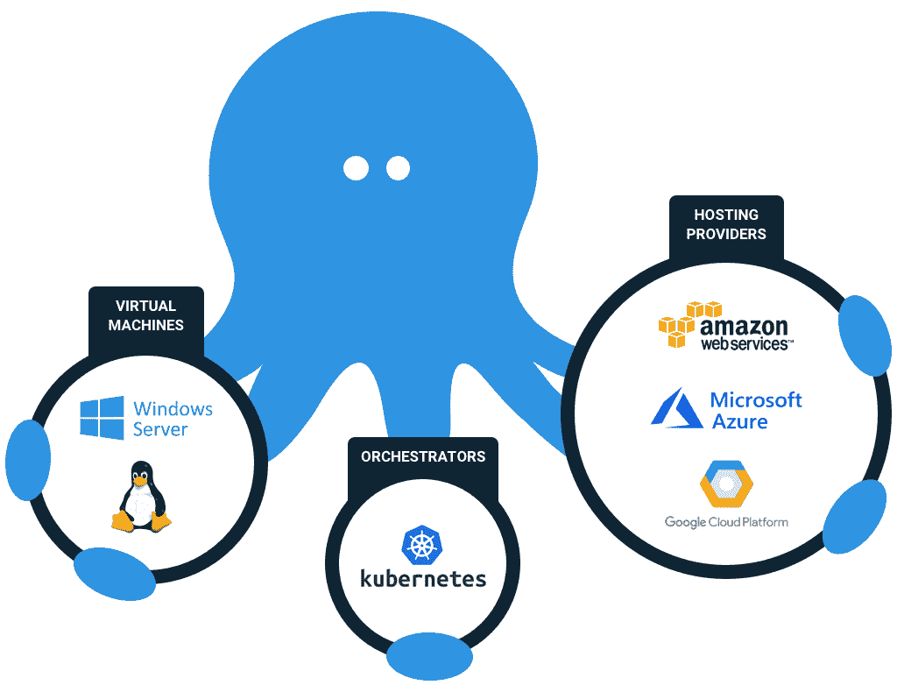
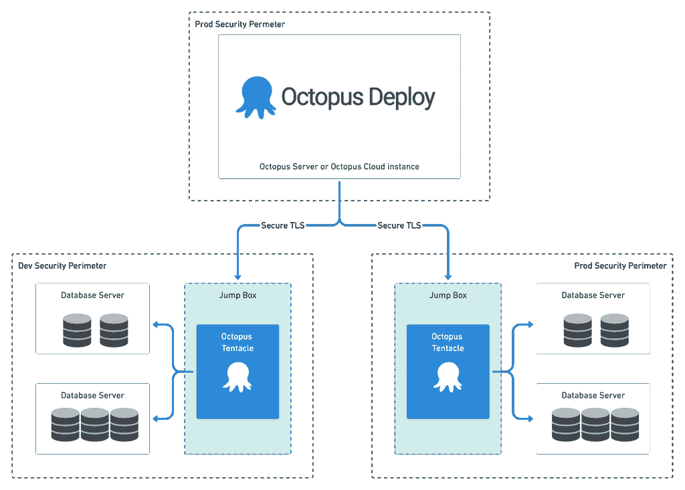
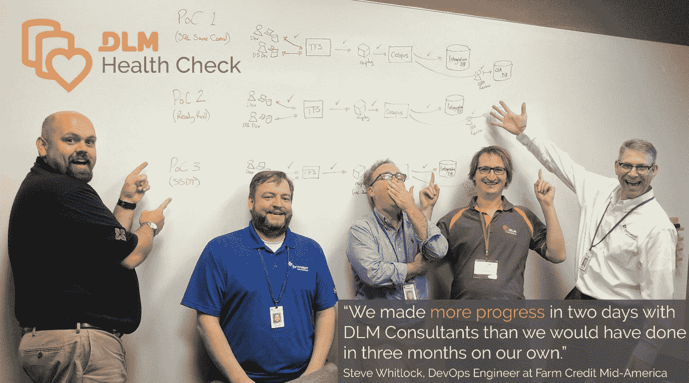

# 驯服北海巨妖:如何保护您的数据-八达通部署

> 原文：<https://octopus.com/blog/tame-the-kraken-protect-your-data>

已经决定:您的公司将开始使用 Octopus Deploy 进行数据库部署。

也许你有这个想法，也许没有，但是船已经起航了。频繁发布的海啸正向您的数据库袭来，您的工作是确保数据安全存放并避免违规。

在这篇文章中，我将直接向数据守护者解释他们需要知道什么来确保数据的安全。我的希望是，虽然这些数据守护者可能最初阅读了这个标题，并想象章鱼部署为一个具有威胁性的怪物，执意攻击他们的数据，但在这篇文章的结尾，他们会想象克拉肯是一个强大而忠诚的仆人，警惕地保护他们珍贵的数据，并使用其可怕的力量来解锁之前无法想象的财富。

## 在我们开始之前:呼吸。一切都会好的。

Octopus Deploy 的主要目标是使部署更容易、更可靠、更安全。通过使用 Octopus Deploy 进行更改，您可以获得一些重要的安全好处:

1.  **更可靠的部署:**许多部署因人为错误而失败。当人们转向自动化部署时，大多数人会看到故障率和“平均恢复时间”(MTTR)有一个数量级的改善。
2.  **锁定生产:**当通过 Octopus 进行常规部署时，很可能会对生产数据库用户进行筛选。
3.  **职责分离:**如果职责分离对您很重要，您可以配置您的 Octopus Deploy 用户，以便(例如)同一用户不可能创建发布并将其部署到生产中，或者在没有特定组或个人的审计批准的情况下执行任何生产部署。在走这条路之前，请阅读[更改咨询板不起作用](https://octopus.com/blog/change-advisory-boards-dont-work)。
4.  **审计:**Octopus Deploy 完成的每一项任务都进行了有效的版本控制和日志记录。审计员喜欢这个。

也就是说，任何工具都取决于使用它的人。Octopus Deploy 是一种强大的野兽，但当它的训练者理解它并有效控制它的力量时，它将是最有效的。

亲爱的 data guardian，无论您是 DBA、开发人员、架构师、系统管理员、CISO、DPO 还是其他人，如果您了解您的数据并热衷于保护它的安全，您都希望积极参与了解 Octopus Deploy 是如何配置和保护的。你可能是唯一有资格保持 Octopus 部署诚实的人，方法是审查实施/安全计划，并确保重要的检查作为管道的一部分进行，一开始可能是手动的，但从长远来看最好是自动的。

作为数据守护者，您比任何人都更了解部署失败的原因以及您的数据会受到怎样的危害。您的团队需要您的专业知识来确保避免这些错误，不仅仅是在单个部署中，而是在每个部署中。

## 步骤 1:理解 Octopus Deploy 如何工作

为了有助于 Octopus Deploy 的安全实施，首先理解它的工作原理是很重要的——特别关注安全性。

Octopus Deploy 之所以得名，是因为它的体系结构类似于 Octopus，以“服务器”为中心，将包和部署脚本发送到部署文件和执行命令的各种目标。

Octopus 用户可以通过 Octopus 门户网站或脚本与服务器交互，通常使用 PowerShell、REST API 或 T2 Octopus CLI。

有各种类型的[部署目标](https://octopus.com/docs/infrastructure/deployment-targets)。最常见的是 Octopus“触手”(或代理)，这是一种运行在目标机器上的服务。例如，在服务器、虚拟机或容器等上。Tentacles 可以在你自己的基础设施或你喜欢的云提供商的 Windows 或 Linux 上运行。

Octopus 服务器和触手之间的通信使用特定端口上的安全 TLS 连接，使用公钥加密。[更多详情请点击此处](https://octopus.com/docs/security/octopus-tentacle-communication)。这避免了使用密码的需要。只要私钥保持安全，另一个系统就不可能冒充服务器或触手。

Octopus 服务器可能位于您的生产安全边界之外，因为它可能还负责部署到较低的环境(开发、测试等)。).关于在哪里安装你的八达通服务器的更多信息可以在这里找到。

然而，触角需要生活在每个环境(开发、测试、生产)的安全边界内，以便它们可以自由地与您的目标数据库通信；您可能需要在特定端口上设置防火墙规则，以允许 Octopus 服务器和 Octopus 触手之间的通信。

如果您担心服务器或代理的安全受到威胁，可以通过删除防火墙规则来切断它们之间的通信。

Octopus Deploy 服务器还需要自己的 SQL Server 数据库。应将此数据库视为生产数据库，并像管理包含关键管理数据的任何其他生产数据库一样对其进行管理。了解更多关于[章鱼数据库](https://octopus.com/docs/administration/data/octopus-database)的信息。

大多数 Octopus Deploy 配置数据以纯文本形式存储在 Octopus Deploy 数据库中，但是敏感数据使用“主密钥”进行了[加密，该密钥可以在 Octopus Deploy 服务器本身上获得。没有此主密钥，无法恢复 Octopus Deploy backup 的备份，因此必须:](https://octopus.com/docs/security/data-encryption)

*   将主密钥保存在安全的密码管理器中，以防您的八达通服务器死机。
*   管理谁可以访问 Octopus Deploy 数据库，就像它是您的一个生产数据库一样。
*   严格管理对运行 Octopus Deploy 软件的机器的访问，因为这是存储主密钥的地方。请注意，这不同于管理谁注册为 Octopus Deploy 的常规用户并可以访问 Web 门户。

## 第二步:使用跳转框

对于大多数东西，人们倾向于将触手安装在托管你的东西的服务器上。这使得文件的传输和脚本的执行更加简单，非常适合部署 web 应用程序。然而，对于数据库，通常使用“跳转框”。jump-box 是一台独立的机器，它位于目标数据库附近，安装了执行部署所需的所有工具。

跳转框对于数据库部署非常有用，因为数据库部署通常是通过执行部署脚本来驱动的，而不是复制文件。因为这些部署脚本不需要从数据库服务器本身执行，所以在数据库服务器上运行触角没有优势。相比之下，使用跳转框有一些好处:

1.  **一个额外的安全层:**在跳转框上运行触手的用户需要访问目标数据库来运行脚本，以便执行部署。然而，通过使用跳转框，Octopus 组件(服务器或触手)都不需要访问数据库服务器的主机。这使得数据库管理员可以更细致地分配他们授予 Octopus Deploy 的权限，并且允许管理员通过对数据库服务器本身的简单设置来撤销该访问，而无需直接处理防火墙或 Octopus。
2.  **改进的数据库性能和保护:**复杂、高风险或资源密集型操作(如模式比较)可以在跳转框上执行，而不是在数据库服务器上执行。这避免了占用数据库主机服务器上的系统资源，并防止数据库出现故障。如果出现问题，让跳转框崩溃要比数据库服务器崩溃好得多！

您需要授予触手更新数据库的权限。通常，这是通过创建一个“octopus”用户(或类似用户)来完成的，该用户拥有部署数据库的适当凭证。对于运行在 Windows 上的 SQL Server，这可能是一个对适当的目标数据库具有`db_owner`权限的 Active Directory 用户，并且它将使用 Windows 身份验证进行身份验证。然而，如果您可以对您的用例使用较少的权限，那就太好了。

整个过程可能如下所示:

## 第三步:锁定它

我前面提到过，Octopus Deploy 服务器可能位于您的生产安全边界之外，但是眼尖的读者会注意到上图将其列在自己的“PROD”安全边界之内。Octopus 服务器需要能够部署到所有环境中，因此它不能完全生活在一个环境中。但是，由于它可用于更新生产，因此也应被视为生产资产，并按此进行保护。

这提出了几个需要解决的问题。

*   **Octopus Deploy 既不是单纯的“开发工具”，也不是单纯的“运营工具”**根据定义，DevOps 是关于不同职能部门之间的协作。它是关于“整体优化”，而不是任何特定的功能筒仓，这使得这篇博客文章的主人公数据守护者有必要在 Octopus Deploy 服务器的安全中发挥积极作用，并与他们可能不经常密切合作的人合作，以确保它的设置既安全又实用，便于人们进行定期部署。
*   **推动环境的过度隔离是一种有害和不成熟的症状[零风险偏见](https://en.wikipedia.org/wiki/Zero-risk_bias)** 虽然将您的环境相互隔离无疑是一个明智的安全措施，但有时过分热心的安全人员会犯拒绝服务器/触手通过防火墙进行通信的错误。这使得不可能向每个环境传输和执行一组一致的部署资源。这导致了不一致、头痛和失败。这也使得部署更有可能由对隔离环境具有适当访问权限的个人手动处理，从而增加了人为错误的风险，并造成部署瓶颈和延迟。与其将统一部署服务视为风险因素，不如将其视为风险缓解者。

您需要管理谁有权使用 Octopus Deploy [用户和角色功能](https://octopus.com/docs/security/users-and-teams/user-roles)进行这些更改。这些角色可以[映射到 Active Directory 用户帐户和组](https://octopus.com/docs/security/authentication/active-directory#:%7E:text=Octopus%20Deploy%20can%20use%20Windows,or%20can%20be%20configured%20later.&text=When%20you%20go%20through%20the,Windows%20as%20a%20domain%20user.)。例如，您可以对其进行配置，以便不同的用户被授予部署到不同环境的权限，从而强制执行职责分离。

虽然在某些方面，Octopus 打开了大门，允许新人以新的方式对您的数据库进行更改，但它也提供了关闭大门的机会。一旦所有或大部分部署都通过 Octopus Deploy，人们直接访问生产数据库的需求就会大大减少。推出 Octopus Deploy 的一个常见步骤是在生产中对用户进行大规模筛选。

这是一个权衡。一方面，我们给予用户更多的自由来在较小的迭代中进行部署，只要所有的变更都已经通过了自动化测试，并且它们已经被成功地部署到较低的环境中。更重要的是，所有的部署都是经过审计的，失败会敲响警钟。另一方面，我们取消了人们以不受控制的方式直接登录服务器的权限，他们可以运行他们一起设法破解的任何 SQL。

我们正在创造一种环境，在这种环境中，开发人员的“懒惰路线”是做正确的事情，而不是做错误的事情。新世界比旧世界安全得多。

## 步骤 4:了解部署过程

Octopus Deploy 不具备部署现成数据库的智能。相反，Octopus Deploy 充当一个协调器，将所有需要的文件转移到跳转框，并运行任何需要的命令来指示您的首选数据库部署工具执行数据库更新。

有几种工具和技术可以用来执行部署。回到三月份[，我回顾了 Octopus Deploy 用户部署 SQL Server 数据库的最流行选项](https://octopus.com/blog/sql-server-deployment-options-for-octopus-deploy)。对于 SQL Server，有一些微软、第三方和开放源代码选项可供选择，这些选项通常可以归类为“基于迁移”或“基于模型”的解决方案。

无论您使用哪种工具，您都可能希望在跳转框上预先安装数据库工具，或者希望在部署过程中自动安装/更新。预安装工具在短期内可能更容易，并且可以加快您的部署，但是它也带来了管理开销，并且使您的部署过程不太容易移植。出于这个原因，我通常提倡安装和更新您作为部署的一部分使用的任何数据库部署工具，或者定期使用 [Octopus Runbook](https://octopus.com/docs/runbooks) 。注意，这可能需要在跳转框上有一定程度的互联网接入。

如果您经常需要在一个环境中同时部署到多个数据库，您可能想要考虑使用 [workers](https://octopus.com/docs/infrastructure/workers) 作为您的跳转框。例如，如果您在同一个安全范围内运行生产数据库的许多拷贝，您可能会发现在每个环境中拥有一个工作人员池是有益的。这允许跨多个部署跳转框高效地横向扩展数据库部署。然而，在这个场景中，每个跳转框都需要访问每个目标数据库。

## 步骤 5:检查部署

上个月，我讲述了一个 DBA 的故事，每当生产数据库出现问题时，他都会受到责备。为了保持它的运行，DBA 希望每次部署时都能得到咨询。由于这将 DBA 变成了一个瓶颈,“摇滚明星”开发人员对缓慢的过程感到沮丧，并试图绕过 DBA。同时，开发人员对“DBA 的东西”不感兴趣，他们缺乏 DBA 的知识和经验。

那是一场火车事故。但是很多人都知道这是一场火车事故。我们中许多人在过去的某个时候都曾经是 DBA 或“摇滚明星”开发人员。

事实是，当人们开始定期执行人工批准和目测脚本时，他们会发现大多数时候，他们只是通过测试和检查的心理清单来工作。例如，[看看这条推文的回复](https://twitter.com/_AlexYates_/status/1298940180418752512)。

我也鼓励你听听 Jeffery Smith 今年早些时候在《云中尖叫》中与 Corey Quinn 谈论变更管理反模式，他将手动变更评审过程描述为一个思维剧本(6:30-9:30 ),这可能比你想象的更容易自动化。这引发了一场与刻薄主持人的精彩辩论！

在你研究了 twitter 上的回复或者听了 Jeffery 和 Corey 关于 DevOps 的“争论”之后，[读一读 Bob Walker 三月份关于自动化审批的博文](https://octopus.com/blog/autoapprove-database-deployments)。数据监护人倾向于寻找的许多东西(例如单词“DROP”、“TRUNCATE”、“CURSOR”、“NOLOCK”或成功回滚部署的能力)可以被自动检查和验证(通过在部署管道内执行模拟运行或代码分析)。如果这些检查中的任何一个失败了，那么自动化的过程要么被设置为失败，要么请求人工审查。

这种方法同时也是一种持续捕捉这些常见问题的更可靠的方式，以及一种更有效的日常变更生产途径。这也可能证明是一种有效的方式来教导开发人员什么样的东西部署起来是安全的，什么样的东西是危险的。

这种方法实际上比许多 ITIL 从业者愿意承认的更符合 ITIL。ITIL 区分了“标准的”和“正常的”变更，在“正常的”变更上花费了大量的评审工作。相比之下,“标准”变化被认为是例行公事，可以绕过官僚机构。ITIL 框架认识到“正常的”变更有很大的开销，并主张采取措施降低特定类型变更的风险，以便将它们重新归类为“标准的”变更。这正是我们努力实现的目标。

然而，这需要数据监护人的专业知识来有效地做到这一点。这是对所有数据守护者的一次战斗召唤，让他们停止考虑手动目测每个单独的部署，开始考虑如何更有效、更彻底地验证*所有*部署。从长远来看，这将节省您的时间，您可以致力于向部署管道添加更多的测试，进一步强化它，或者对风险最大的部署进行更彻底的手动审查。

## 案例研究:希望的理由

最后，我想通过一个案例研究来展示自动化数据库部署和跨职能协作的相对安全性。

早在 2017 年，Farm Credit Mid-America 就在寻求改善其数据库部署的治理和稳定性。我和一个跨职能团队一起工作，这个团队包括(从左到右)DBA、DevOps 工程师、数据架构师和。网络开发主管。

在一周内，我们制作了三个独立的概念证明，每个都使用 Octopus Deploy 和在 jump-box 上运行的不同部署工具。团队一致同意他们的首选方案，我们创建了一个计划来推广它。我们甚至设法让节俭的高级领导委员会批准了我们的提议(其中包括一笔不小的金融投资)。获得批准的一个重要原因是，来自不同筒仓的人们(他们常常不同意)团结起来，并热情地认为该解决方案将使每个人受益。

几个月后，一个最初比较怀疑的团队成员给我发来了下面的进度报告。考虑到他们在 Octopus 之前的错误率和治理问题，通过管道的 100%成功部署记录，加上显著改善的协作和生产力优势，是我职业生涯中最令人满意的成就之一。

训练有素的海怪是强大的盟友。

*“2017 年 9 月，作为更广泛的 DevOps 转型的一部分，DLM 顾问与我们一起进行了数据库生命周期管理(DLM)运行状况检查，我们测试了三个数据库源代码控制和部署概念验证(POC)解决方案，这将使我们能够更定期、更可靠地提供数据库更新。这使得我们很容易为我们的数据库选择最佳策略。在接下来的几个月里，DLM 的顾问帮助我们进行了推广。*

*它现在运行得非常好，为我们带来了巨大的价值。我们现在只需点击一个按钮就可以部署我们的数据库更新，在新的流程中，我们没有一次部署失败。*

*在我 26 年的 IT 职业生涯中，我们对 DLM 的实施是我见过的最有益的基础设施项目。数据库部署不再是我们软件交付过程中的瓶颈。这项技术实现的过程改进影响到所有团队成员。开发人员、QA&DBA 在发布通过管道时进行沟通。DLM 让我们更有效率。”*

**Steve Cornwell** ，*Farm Credit Mid-America 的企业数据库开发人员，前微软员工。*

* * *

了解更多关于 https://dlmconsultants.com/dlm-health-check/ DLM 顾问公司的 DLM 健康检查:[了解更多关于八达通部署的安全性:](https://dlmconsultants.com/dlm-health-check/)[https://octopus.com/docs/security](https://octopus.com/docs/security)

* * *

自 2010 年以来，Alex Yates 一直在帮助组织将 DevOps 原则应用于他们的数据。他最引以为豪的是帮助 Skyscanner 开发了一天 95 次部署的能力，并支持联合国项目服务办公室的发布流程。亚历克斯与除南极洲以外的各大洲的客户都有过合作——所以他渴望见到任何研究企鹅的人。

作为一名热心的社区成员，他共同组织了[数据接力](https://datarelay.co.uk/)，是【www.SpeakingMentors.com】的创始人，并自 2017 年以来被公认为[微软数据平台 MVP](https://mvp.microsoft.com/en-us/PublicProfile/5002655?fullName=Alex%20Yates) 。

Alex 是官方 Octopus Deploy 合作伙伴 [DLM 顾问](https://dlmconsultants.com/)的创始人。他喜欢为那些希望通过改进 IT 和数据库交付实践来实现更好业务成果的客户提供指导、辅导、培训和咨询。

如果你想和亚历克斯一起工作，请发电子邮件:[enquiries@dlmconsultants.com](mailto:enquiries@dlmconsultants.com)