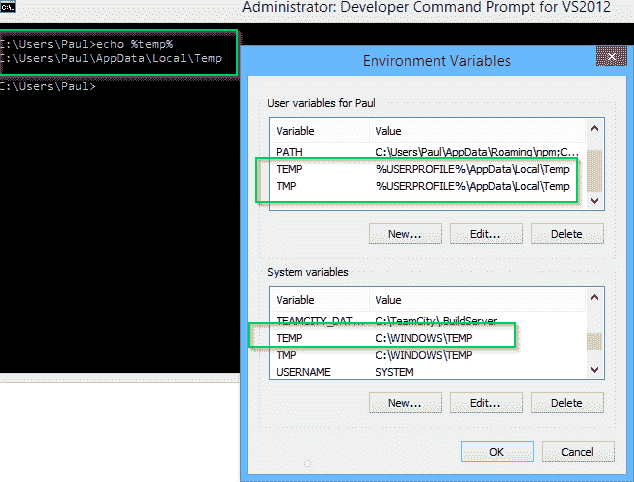

# %TEMP%对于作为本地系统运行的 Windows 服务有不同的值- Octopus Deploy

> 原文：<https://octopus.com/blog/temp-different-values-for-windows-service>

您可能已经知道环境变量可以在机器范围或用户范围内定义。用户范围内的值通常会覆盖机器范围内定义的值。



但是，作为系统帐户运行的 Windows 服务有一种特殊情况。给定以下 Windows 服务:

```
public partial class Service1 : ServiceBase
{
    public Service1()
    {
        InitializeComponent();
    }

    protected override void OnStart(string[] args)
    {
        File.WriteAllText("C:\\Temp\\Service.txt", 
            "Temp:        " + Environment.GetEnvironmentVariable("Temp") + Environment.NewLine +
            "Temp (User): " + Environment.GetEnvironmentVariable("Temp", EnvironmentVariableTarget.User) + Environment.NewLine);
    }
} 
```

当服务作为我的用户帐户运行时，我得到了我所期望的:

```
Temp:        C:\Users\Paul\AppData\Local\Temp
Temp (User): C:\Users\Paul\AppData\Local\Temp 
```

然而，作为内置系统(本地系统)帐户运行服务，您会得到不同的行为:

```
Temp:        C:\WINDOWS\TEMP
Temp (User): C:\WINDOWS\system32\config\systemprofile\AppData\Local\Temp 
```

似乎对于在系统帐户下运行的 Windows 服务，即使有一个特定于用户的环境变量，也使用了不同的`%TEMP%`。

这在昨天的 2.6 预发布中造成了一个错误，因为我们添加了一个功能，在每次脚本运行之前自动更新环境变量(以防您已经更改了环境变量，并且不想重新启动触手 windows 服务)。当然，好心没好报 **:-)**

我找不到任何关于这个特性的文档，但是环境变量是由父进程继承的。服务归`services.exe`所有，服务归`wininit.exe`所有。使用 Process Explorer，`wininit.exe`的环境变量将 TEMP 设置为 C:\Windows\TEMP。我猜这可能是依赖于使用`C:\Windows\TEMP`的旧 Windows 服务的向后兼容特性。

(我们将在明天发布 2.6 的补丁来解决这个问题)