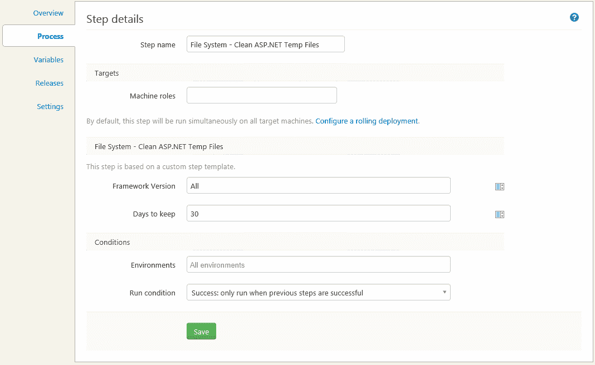

# 清理临时 ASP.NET 文件- Octopus 部署

> 原文：<https://octopus.com/blog/temporary-asp-net-files>

绝大多数的 ASP.NET 网站和网络应用程序都使用[动态编译](http://msdn.microsoft.com/en-us/library/vstudio/ms366723.aspx)来编译应用程序的某些部分。通过动态编译为 ASP.NET 网站创建的程序集存储在`Temporary ASP.NET files`目录中。随着时间的推移，这些临时文件会越来越多，必须手动删除。作为[影像复制](http://msdn.microsoft.com/en-us/library/ms404279.aspx)的一部分，网站 bin 目录的副本也存储在该文件夹中。Octopus Deploy 的许多用户也比以前更频繁地使用持续集成或发布。这反过来意味着这些临时文件可以积累得相当快。

除了留给手动流程，我们还有一些方法可以在部署后清理。要清理这个目录，您可以使用来自 [Octopus Deploy 库](https://library.octopusdeploy.com/)的[文件系统-清理 ASP.NET 临时文件](https://library.octopusdeploy.com/#!/step-template/actiontemplate-file-system-clean-asp-net-temp-files) PowerShell 脚本模板。作为部署过程中的一个步骤，该脚本将允许您清理临时文件目录。

## 如何使用脚本

从库中导入步骤并将该步骤添加到项目中之后，您可以配置框架版本和要保留的天数。



该步骤只需要两个参数`Framework version`和`Days to keep`。默认情况下，它会清理网站目录下的`Temporary ASP.NET files`目录超过 30 天。

**框架版本**

指定`All`将清除每个已安装的框架版本的临时文件。如果需要针对特定版本，可以指定位和/或版本。

仅指定一个位值将匹配所有版本。在这里，您只能指定以下两个选项之一。

```
 - Framework
 - Framework64 
```

仅指定一个版本将与该版本匹配，而不考虑位(32 位和 64 位)。版本必须始终以`v`开头。

```
 - v1.1.4322
 - v2.0.50727 
```

完全指定的框架版本将只匹配该路径。

```
 - Framework\v4.0.30319
 - Framework64\v4.0.30319 
```

**保留天数**

如果网站目录的上次写入时间超过了指定的保留天数，它将被删除。该目录在应用程序启动时创建。

## 脚本是如何工作的

`Temporary ASP.NET files`下的目录结构由映射到应用程序名的目录组成，应用程序名是虚拟路径名或根目录。在这个目录下，每个网站的每个*版本*都有一个代码生成目录。该脚本将只识别删除代码生成目录。代码生成目录也是`Days to keep`用来保留的。

删除临时 ASP.NET 文件是一项安全的操作，请记住，多个网站可以使用此文件夹，并且当前正在使用的网站可能会被回收。

您可以在部署之前或之后执行脚本。但是，建议您在部署之前运行该脚本，因为即使在部署完成后，以前的部署可能仍在使用中。任何包含锁定文件的代码生成目录都将被跳过。

## 还有其他解决方法吗

如果您有多个网站，或者需要尽可能避免停机配置，可以使用自定义编译目录来隔离每个网站的代码生成目录。您可以使用 web.config 中的`compilation`标签上的`tempDirectory`属性指定一个定制的临时文件目录

```
<configuration> 
    <system.web>    
        <compilation tempDirectory="C:\TempAspNetFiles\">
        </compilation>
    </system.web>
</configuration> 
```

## 什么时候该担心这个？

如果您正在进行频繁的部署，或者您需要高度健壮的部署，您只需要担心这一点。其他要考虑的因素是您部署了多少站点、bin 目录的大小、部署的频率以及您有多少磁盘空间。