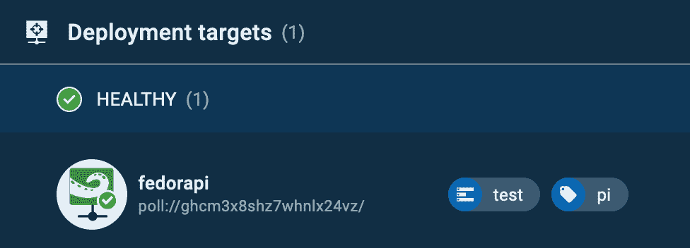
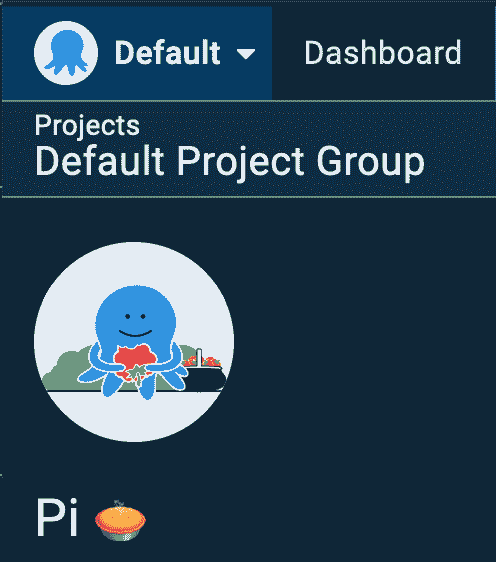
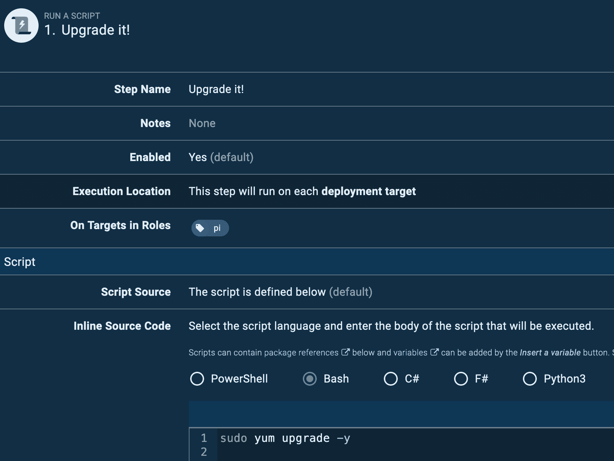

# 手臂上的章鱼触手/手臂 64 -章鱼展开

> 原文：<https://octopus.com/blog/tentacle-on-arm>

[](#)

我们很高兴地分享我们的触手代理现在支持 ARM 和 ARM64 硬件。这一更新使您可以将应用和服务部署到 Raspberry Pi 3 & 4、AWS A1 EC2 实例或任何可以运行[的 ARM 硬件。网芯 3.0 或更高版本](https://devblogs.microsoft.com/dotnet/announcing-net-core-3-0/#platform-support)。

在这篇文章中，我将解释为什么在 ARM 服务器上运行触手是有价值的，以及如何开始。

## 为什么触手在 ARM/ARM64 上？

早在 2019 年末，我们就推出了对基于 ARM 的部署目标和工作人员的支持，作为 SSH 连接选项*。 [Linux 触手](https://octopus.com/downloads/tentacle#linux)已经出现了一段时间，但是它只支持基于`x86_64/amd64`的机器，使得 ARM 采用者只能使用 SSH。

通过 SSH 连接是可以的，但是它并不适用于每个人，比如不允许使用端口 22 的高度安全的环境。它还需要在 Octopus 服务器和 SSH 服务器之间建立直接连接，可能需要通过防火墙。

通过在 ARM 设备上安装轮询触手，可以避免为 SSH 连接打开防火墙端口，如果您使用的是 Octopus 云服务，这一点尤为重要。

请随意查看我们的[前一篇博文](https://octopus.com/blog/tentacle-on-linux)，这篇博文更详细地介绍了使用 Linux 触手进行部署而不是 SSH 的好处。

在 ARM 硬件上运行您的工作负载有一些好处:

*   降低运行成本
*   对于 Raspberry Pi 等小型制造商而言，是低成本可更换单元。
*   与 x86 服务器相比，计算速度更快。

[ARM 与 x86 的比较](https://www.section.io/engineering-education/arm-x86/)

* *从技术上来说，它比这个时间更早，但你必须跨越一些尴尬的障碍。*

## 入门指南

在 Linux 上配置触手的所有说明都可以在我们的[文档](https://octopus.com/docs/infrastructure/deployment-targets/linux/tentacle)中找到，但是我将提供一个步骤的演示。在演练的最后，我们将在私有网络中有一个 Raspberry Pi，它连接到一个 Octopus Cloud 实例。

对于这个例子，我在[树莓派 3B+](https://www.raspberrypi.org/products/) 上运行 [Fedora 33 服务器](https://getfedora.org/en/server/download/)，并注册了[章鱼云实例](https://octopus.com/start/cloud)。

您还可以在装有 Ubuntu 18.04 或更高版本的 Raspberry Pi 或 Raspbian Buster 上运行 Linux 触手代理。

在我们安装触手应用程序之前，您需要一个用于认证的 **Octopus 服务器 URL** 和一个 **API 密钥**。如果您使用本地 Octopus 服务器实例，您可以使用**用户名/密码**进行认证。

### 装置

安装触手包很简单:

```
sudo wget https://rpm.octopus.com/tentacle.repo -O /etc/yum.repos.d/tentacle.repo
sudo yum install tentacle 
```

安装结束时，您将看到以下消息:

```
To set up a Tentacle instance, run the following script:
    /opt/octopus/tentacle/configure-tentacle.sh 
```

如果您需要进行自动化的、可重复的安装，可以在 [Linux 触手文档](https://octopus.com/docs/infrastructure/deployment-targets/linux/tentacle)中找到示例脚本，但是现在，我们将运行配置脚本，并且大部分情况下只接受默认值。

对于这个例子，为触手的种类选择**轮询** (2)是很重要的。[轮询触手](https://octopus.com/docs/infrastructure/deployment-targets/windows-targets/tentacle-communication#polling-tentacles)将连接到 Octopus 服务器，因此我们不需要在防火墙中打开任何额外的端口:

```
[user@fedora ~]# sudo /opt/octopus/tentacle/configure-tentacle.sh

Name of Tentacle instance (default Tentacle):
Invalid characters will be ignored, the instance name will be: 'Tentacle'

What kind of Tentacle would you like to configure: 1) Listening or 2) Polling (default 1): 2
Where would you like Tentacle to store log files? (/etc/octopus):
Where would you like Tentacle to install applications to? (/home/Octopus/Applications):
Octopus Server URL (eg. https://octopus-server): https://***.octopus.app
Select auth method: 1) API-Key or 2) Username and Password (default 1): 1
API-Key: ...
Select type of Tentacle do you want to setup: 1) Deployment Target or 2) Worker (default 1): 1
What Space would you like to register this Tentacle in? (Default):
What name would you like to register this Tentacle with? (fedora): fedorapi
Enter the environments for this Tentacle (comma seperated): test
Enter the roles for this Tentacle (comma seperated): pi

The following configuration commands will be run to configure Tentacle:
sudo /opt/octopus/tentacle/Tentacle create-instance --instance "Tentacle" --config "/etc/octopus/Tentacle/tentacle-Tentacle.config"
sudo /opt/octopus/tentacle/Tentacle new-certificate --instance "Tentacle" --if-blank
sudo /opt/octopus/tentacle/Tentacle configure --instance "Tentacle" --app "/home/Octopus/Applications" --noListen "True" --reset-trust
sudo /opt/octopus/tentacle/Tentacle register-with --instance "Tentacle" --server "https://***.octopus.app" --name "fedorapi" --comms-style "TentacleActive" --server-comms-port "10943" --apiKey "API-XXXXXXXXXXXXXXXXXXXXXXXXXX" --space "Default" --environment "test"  --role "pi"
sudo /opt/octopus/tentacle/Tentacle service --install --start --instance "Tentacle"
Press enter to continue...

Creating empty configuration file: /etc/octopus/Tentacle/tentacle-Tentacle.config
Saving instance: Tentacle
Setting home directory to: /etc/octopus/Tentacle
A new certificate has been generated and installed. Thumbprint:
9B691824225B6A77AB68...
These changes require a restart of the Tentacle.
Removing all trusted Octopus Servers...
Application directory set to: /home/Octopus/Applications
Tentacle will not listen on a port
These changes require a restart of the Tentacle.
Checking connectivity on the server communications port 10943...
Connected successfully
Registering the tentacle with the server at https://***.octopus.app/
Detected automation environment: NoneOrUnknown
Machine registered successfully
These changes require a restart of the Tentacle.
Service installed: Tentacle
Service started: Tentacle

Tentacle instance 'Tentacle' is now installed 
```

在脚本完成配置触手之后，您将能够在实例的 Deployment Targets 页面中看到 Linux 触手。

[](#)

### 触手在行动

接下来，我们将对我们的新触须运行一些东西。

对于这一步，我将建立一个新项目并配置一个 runbook 来安装最新的软件包更新。

在您的实例中，创建一个新项目，我将我的项目称为 **Pi🥧**

[](#)

然后我创建了一个名为**的新 runbook 升级它！**添加了一个脚本步骤，包含:

```
sudo yum upgrade -y 
```

该步骤被配置为针对角色 **pi** 运行 bash 脚本，该角色是我在前面的配置脚本中指定的角色。

【T2 

针对一个角色运行，意味着您可能有许多具有相同角色的目标，执行将针对每个目标运行。添加一个调度触发器，您就有了一个真正的 DevOps 流程。

这是一个简单的例子，这也可能是一个在 Raspberry Pi 上更新 PiHole ( `pi-hole -up`)或清理 Docker 图像(`docker images prune --force`)的操作手册，或者是一个将最新版本的内部 Python 应用程序部署到远程物联网监控设备的部署项目。

## 结论

使用 ARM 硬件的原因有很多，从成本节约到性能或远程物联网设备。能够通过触手将它们连接到 Octopus 实例允许您向它们部署应用程序更新，或者使用我们的 [Runbooks](https://octopus.com/docs/runbooks) 功能来集中管理操作系统和应用程序。轮询触手的额外好处是避免复杂的防火墙配置，并在公共互联网上暴露 SSH 端口。