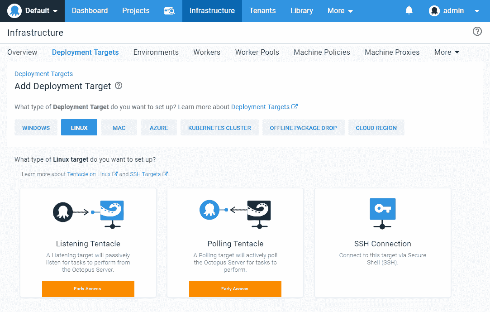
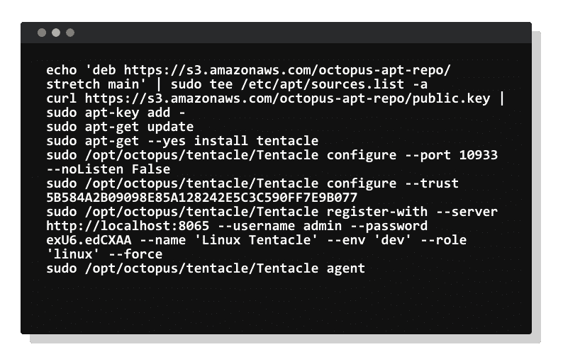

# 介绍用于高度安全的 Linux 服务器的 Linux 触手- Octopus Deploy

> 原文：<https://octopus.com/blog/tentacle-on-linux>

Octopus 正在通过引入原生 Linux 触手来扩展我们支持的部署目标列表(您可以部署到的服务器和云服务)。触须一直是我们最受欢迎的部署目标。它们可以被配置为与 Octopus 服务器通信的方式提供了最大的灵活性，但是缺点是它们是 Windows 独有的。

我们一直在努力为 Linux 部署目标带来一流的支持，我们很高兴地宣布 **[提前获得 Linux 触手](/blog/tentacle-on-linux#linux-tentacle-early-access)** 。如果你想等到正式发布，你可以在我们的[路线图](https://octopus.com/company/roadmap)页面上关注这个特性和其他特性，你甚至可以注册更新。

部署到 Linux 服务器的现有方法是在 Octopus 中将它们配置为 SSH 目标，虽然这种方法对大多数应用程序都很有效，但它要求目标机器有一个开放的 SSH 连接。不幸的是，一些公司在高度安全的环境中运营，在那里不可能在生产服务器上打开端口 22。

那么一个原生的 Linux 触手如何解决这个问题呢？Tentacle 支持轮询模式，通过这种配置，Tentacle 轮询 Octopus 服务器，以定期检查是否有任何任务需要它执行。最大的优点是目标服务器不需要任何防火墙的改变，它只需要 Octopus 服务器上的一个开放端口。这个功能消除了在 Linux 机器上运行 SSH 服务器的需要，这解决了许多团队的安全问题。

## 示例 1: Octopus 云部署到 Linux 服务器

假设你的团队正在使用 Octopus Cloud 将几个微服务部署到多个 Linux 服务器上。对于当前版本的 Octopus，您的 Linux 目标需要运行一个可以通过互联网公开访问的 SSH 服务器。虽然 SSH 被认为是更安全的远程访问方法之一，但一些公司在高度安全的环境中运营，在这种环境中不可能在生产服务器上打开端口 22。

在这种情况下，将您的 Linux 目标配置为 SSH 目标是唯一的选择，但是出于安全考虑，这可能是不可能的。

解决方案:Linux 触手！我们现在可以设置 Linux 目标来运行触手服务，并配置它以轮询模式与 Octopus 服务器通信。使用这种方法，我们不需要打开任何入站端口，Linux 机器只需要在出站端口(默认为 10943)和端口 80 或 443 上通信，就可以访问 Octopus 服务器 web 门户。

## 示例 2:只有 HTTPS 的 DMZ 中的服务器

假设您的团队正在尝试部署在 DMZ 中运行的高度安全的 Linux 服务器，除了 HTTPS 之外，不允许任何传入连接用于 web 流量。我们行业中的安全性和合规性限制使得不可能授予 SSH 访问权限。

解决方案:这是触手轮询模式真正的亮点，它允许你的触手主动轮询 Octopus 服务器，而 Octopus 服务器不需要知道任何关于 Linux 目标的 IP 地址。

## Linux 触手早期访问

我们目前正在为 Linux 触手提供早期访问，以获得反馈并验证其设计。[我们的文档](https://octopus.com/docs/infrastructure/deployment-targets/linux/tentacle)涵盖了如何开始的所有细节。我们正在构建 DEB (Ubuntu/Debian)和 RPM (CentOS/Fedora)包，以及用于手动安装的. tar.gz 归档文件。触手是用。NET Core 2.x，所以如果你的 Linux 版本支持[的话](https://docs.microsoft.com/en-us/dotnet/core/linux-prerequisites?tabs=netcore2x)你应该可以运行触手。我们喜欢反馈，所以请在`#linux-tentacle`频道中加入我们的[社区 slack](https://octopus.com/slack) 的讨论。

## 包扎

Linux Tentacle 为在高度安全的环境中部署到 Linux 的团队提供了更大的灵活性，并补充了我们现有的 SSH 部署目标支持。我们的目标是为 Linux 生态系统带来我们已经为 Windows 提供的所有相同的特性。不要忘记在我们的[公共路线图](https://octopus.com/company/roadmap)页面上注册更新。