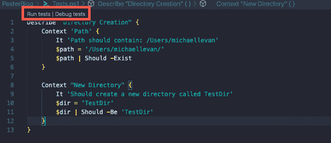
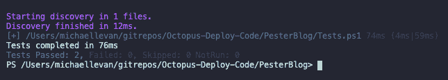

# 使用 perste-Octopus Deploy 测试 PowerShell 代码

> 原文：<https://octopus.com/blog/testing-powershell-code-with-pester>

[](#)

当你使用任何代码时，无论是自动化代码还是软件代码，都应该以同样的方式对待。毕竟函数还是函数，变量还是变量。与构建应用程序代码相比，在自动化过程中，有很多事情不经常出现，其中之一就是测试。

单元测试和模拟测试在脚本和自动化中非常重要。

想一想这个场景:*我在本地测试了 PowerShell 功能，它工作了！它做了我需要它做的事情，现在我要把它存储在 GitHub 中，以便以后使用。*

它是在本地测试的，这很好，但是您运行的测试现在已经是过去的事情了，可能会发生一些事情:

*   可以创建新版本的代码。
*   修改代码可能会引入错误。
*   可以添加新功能。
*   代码用于不同的系统或操作系统。
*   您正在使用的 PowerShell 模块被更新或更改。
*   PowerShell 模块正在进行的 API 调用发生了变化。

鉴于以上几点，您在本地运行的测试不再有效。

在这篇博客文章中，您将学习如何使用 PowerShell 最流行的测试框架 [Pester](https://github.com/pester/Pester) 。

## 先决条件

要跟进这篇博文，您需要具备以下条件:

## 安装纠缠

如果这是你第一次运行 Pester 框架，根据你的操作系统，你很可能必须安装它。安装过程是通过`Install-Module` cmdlet 完成的，它是所有操作系统的 PowerShell 自带的。

若要安装 Pester，请运行以下 cmdlet:

```
Install-Module -Name Pester 
```

运行 cmdlet 后，您应该会看到与下面的屏幕截图类似的输出。接受所有模块，将安装 Pester。若要确认安装，请运行以下 cmdlet:

```
Get-InstalledModule -Name Pester 
```

## 看一看要测试的 PowerShell 代码

在运行任何类型的纠缠测试之前，您需要让纠缠测试使用的代码。首先来看一下“纠缠”,这个测试并不复杂。它可以是由几行代码组成的简单 PowerShell 函数。在这一节中，您将会看到用于测试的代码。

打开 VS 代码，为 PowerShell 函数创建一个新文件。

下面的 PowerShell 函数执行以下操作:

*   创建名为`Create-Dir`的新函数
*   设置一个`cmdletbinding()[]`将功能转换为高级功能。高级功能使您能够使用 Verbose、ErrorAction 等。
*   param 块设置了两个参数，即创建新目录的路径和新目录名。
*   用于创建路径的 cmdlet 是`New-Item`。

如果您运行下面的代码并指定一个目录名和路径，您将看到一个新目录已经创建:

```
function Create-Dir {
    [cmdletbinding()]
    param(
        [string]$path,
        [string]$dirName
    )

    New-Item -Name $dirName -Path $path
} 
```

下面的截图显示了在**/Users/michaelevan/**目录中创建一个名为 **TestPath** 的目录的示例:

[](#)

## 编写第一个测试

现在您已经有了代码，您可以弄清楚您希望测试是什么样子的了。纠缠测试不仅基于长度，还基于功能。在这一节中，您将看一看一个基本的 Pester 测试来开始。

有一种软件开发实践叫做[测试驱动开发(TTD)](https://www.agilealliance.org/glossary/tdd/) ，你首先定义测试，然后基于这些测试编写代码。这篇博客文章并没有遵循这种方法，但它确实是一个有趣的话题。

1.  在 VS 代码中，打开一个新文件，命名为`Tests.ps1`。`Tests`关键字让 PowerShell 知道您正在运行测试，VS 代码将提供一些额外的功能，比如能够从 IDE 中运行测试。
2.  在`Tests.ps1`文件中，粘贴以下代码，这是测试本身:

```
Describe "Directory Creation" {
    Context 'Path' {
        It 'should contain: path_that_you_used_for_the_function'
        $path = 'path_that_you_used_for_the_function'
        $path | Should -Exist
    }

    Context "New Directory" {
        It 'Should create a new directory called TestDir'
        $dir = 'TestDir'
        $dir | Should -Be 'TestDir'
    }
} 
```

在您运行测试之前，让我们先检查一遍。

*   你从`Describe`块开始。Describe 块定义了一组 PowerShell 测试。所有的纠缠文件必须包含至少一个描述块。
*   你会看到的第二个方块是`Context`。上下文块在描述块中定义了子组测试。上下文很方便，因为它允许您编写多个测试块。
*   在上下文块中，您会看到一个名为`It`的关键字。`It`用于定义单个测试用例。`It`真的很棒，因为你可以让代码听起来像自然语言的句子。例如，一个`It`测试可以说**它“应该包含:/Users/Michael levan”**。
*   在您定义测试的地方，您会看到`Should`。`Should`命令用于定义断言，也就是您希望测试用您给它的信息做什么。

一旦测试在`Tests.ps1`文件中，您将看到一些运行测试的选项，如下面的截图所示。

[](#)

## 运行单元测试

在前面的部分中，您确切地定义了测试应该是什么样子。测试应该有两个单独的测试；一个测试路径，另一个测试新目录是否叫做 **TestDir** 。

在这一节中，您将学习如何运行测试以及输出应该是什么样子。

在`Tests.ps1`文件中，点击**运行测试**按钮运行测试。运行测试后，您应该会看到类似下面截图的输出。

如您所见，测试找到了目录，并确认正在创建的新目录是 **TestDir** 。

[](#)

恭喜你。您已经使用 PowerShell 测试框架 Pester 正式创建并运行了一个测试。

## 结论

当您编写任何类型的代码时，您都知道它看起来像什么，如何工作，但是一天、一周、一个月或一年后，代码可能会发生变化，如果发生这种情况，就有可能出现功能差异，甚至引入错误。当你将测试融入到任何代码中时，这些事情发生的风险就会降低。

在这篇博客文章中，你学到了什么是纠缠，为什么你应该使用它，以及如何使用它。如果你想深入研究《纠缠》，我推荐亚当·伯特伦的这本书:[纠缠书](https://leanpub.com/pesterbook)。

如果你想找到这篇博文中使用的代码，请查看 [GitHub repo](https://github.com/AdminTurnedDevOps/Octopus-Deploy-Code/tree/master/PesterBlog) 。