# Selenium 系列:第一个 WebDriver 测试——Octopus Deploy

> 原文：<https://octopus.com/blog/selenium/3-the-first-test/the-first-test>

这篇文章是关于[创建 Selenium WebDriver 测试框架](/blog/selenium/0-toc/webdriver-toc)的系列文章的一部分。

现在我们已经在 IntelliJ 中配置并导入了 Maven 项目，我们可以开始添加一些测试了。

测试类将在目录`src/test/java/com/octopus`中创建。Maven 有一个标准的目录结构，将测试类放在`src/test/java`目录下，而测试类本身将在`com.octopus`包中，该包映射到`com/octopus`目录结构。

要创建新目录，右击顶层项目文件夹，选择新建➜目录。

[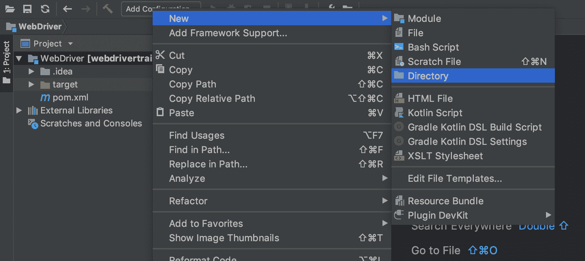](#)

输入`src/test/java/com/octopus`作为目录名，并点击`OK`按钮。

[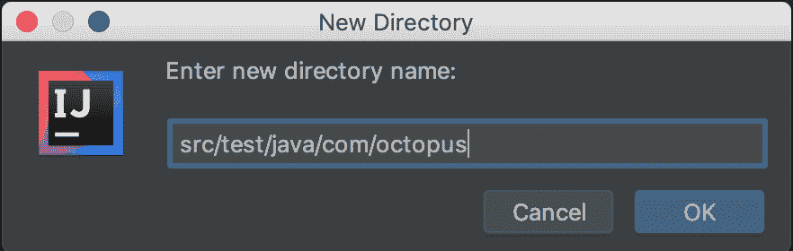](#)

将创建新的目录结构。然而，IntelliJ 还不能将新目录识别为可以找到 Java 源文件的位置。要刷新 IntelliJ 项目，这将导致这些新目录被识别，单击`Maven Projects`工具窗口中的`Reimport All Maven Projects`按钮。

[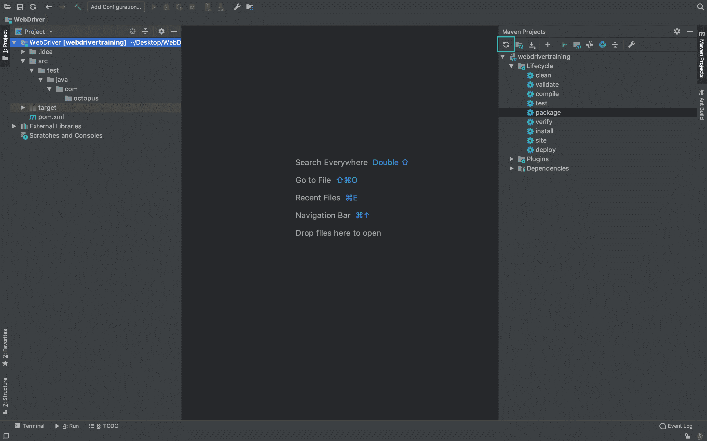](#)

请注意,`java`文件夹有一个绿色图标。这表明 IntelliJ 将该文件夹识别为包含 Java 源文件的文件夹。

[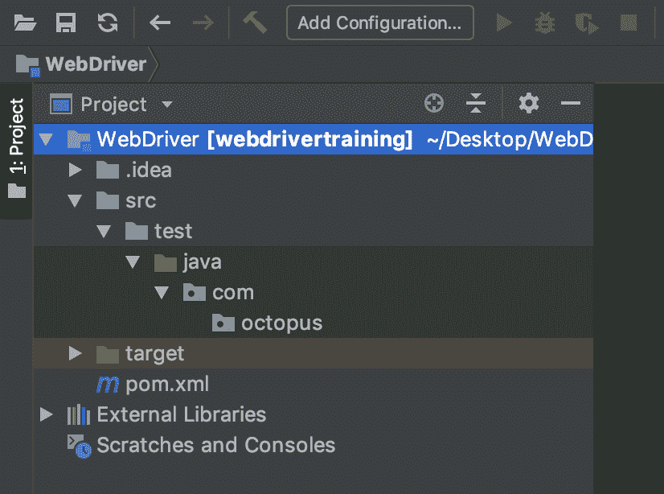](#)

在`octopus`目录中，我们将创建一个名为`InitialTest`的类。为此，右击`octopus`目录并选择新➜ Java 类。

[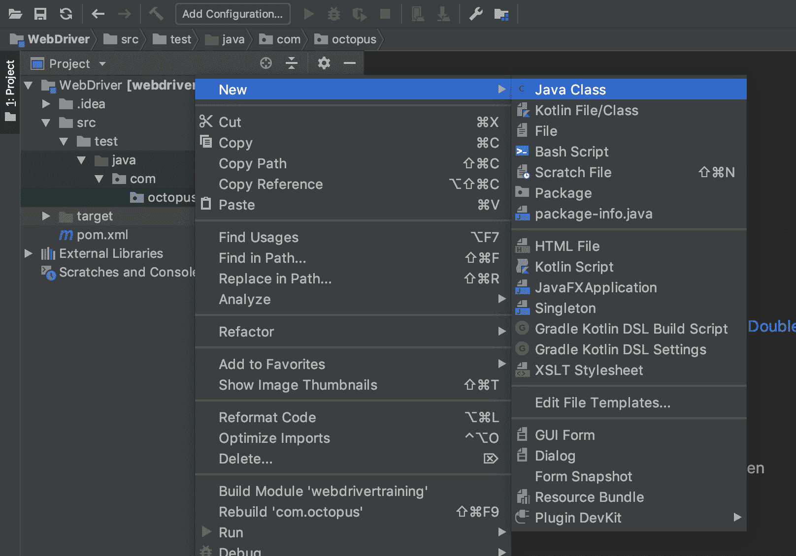](#)

输入`InitialTest`作为类名，并点击`OK`按钮。

[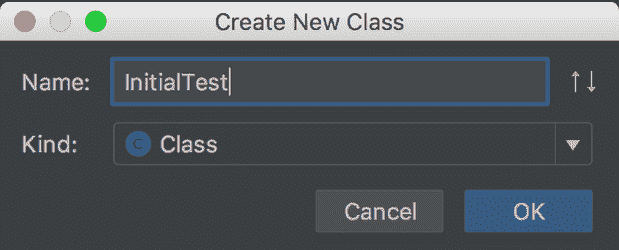](#)

用以下内容替换默认类别代码:

```
package com.octopus;

import org.junit.Test;

import org.openqa.selenium.chrome.ChromeDriver;

public class InitialTest {
  @Test
  public void openURL() {
    final ChromeDriver chromeDriver = new ChromeDriver();
    chromeDriver.get("https://octopus.com/");
    chromeDriver.quit();
  }
} 
```

让我们来分解这个代码。

第一步是获得一个驱动类的实例，它与我们控制下的浏览器相匹配。在这种情况下，我们要控制的浏览器是 Google Chrome，它对应的驱动类是`ChromeDriver`。这个类来自我们在上一篇文章中添加的`org.seleniumhq.selenium:selenium-java`依赖项:

```
final ChromeDriver chromeDriver = new ChromeDriver(); 
```

接下来，我们使用`get()`方法打开一个 URL。这相当于在地址栏中输入 URL 并按回车键:

```
chromeDriver.get("https://octopus.com/"); 
```

最后，我们调用`quit()`方法关闭浏览器并关闭驱动程序:

```
chromeDriver.quit(); 
```

要在 IntelliJ 中运行测试，单击`openURL`方法旁边的绿色图标，然后单击`Run openURL()`。

[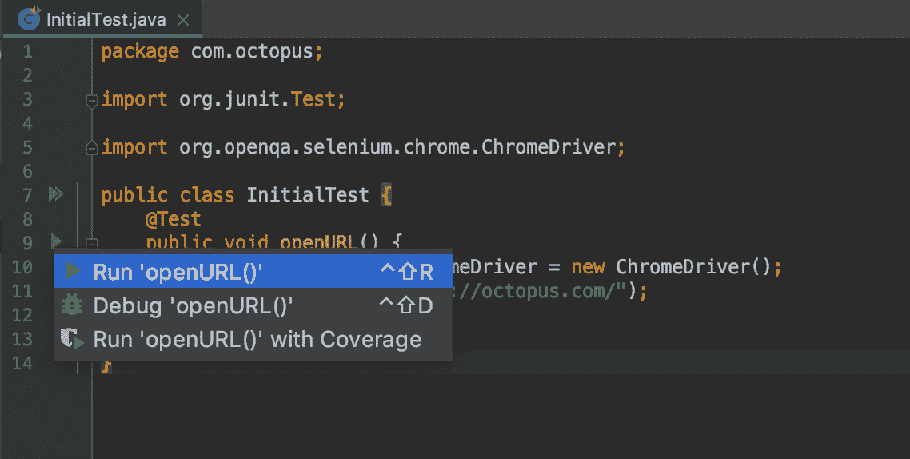](#)

运行该测试会产生以下错误:

```
java.lang.IllegalStateException: The path to the driver executable must be set by the webdriver.chrome.driver system property; for more information, see
https://github.com/SeleniumHQ/selenium/wiki/ChromeDriver. The latest version can be downloaded from
http://chromedriver.storage.googleapis.com/index.html 
```

[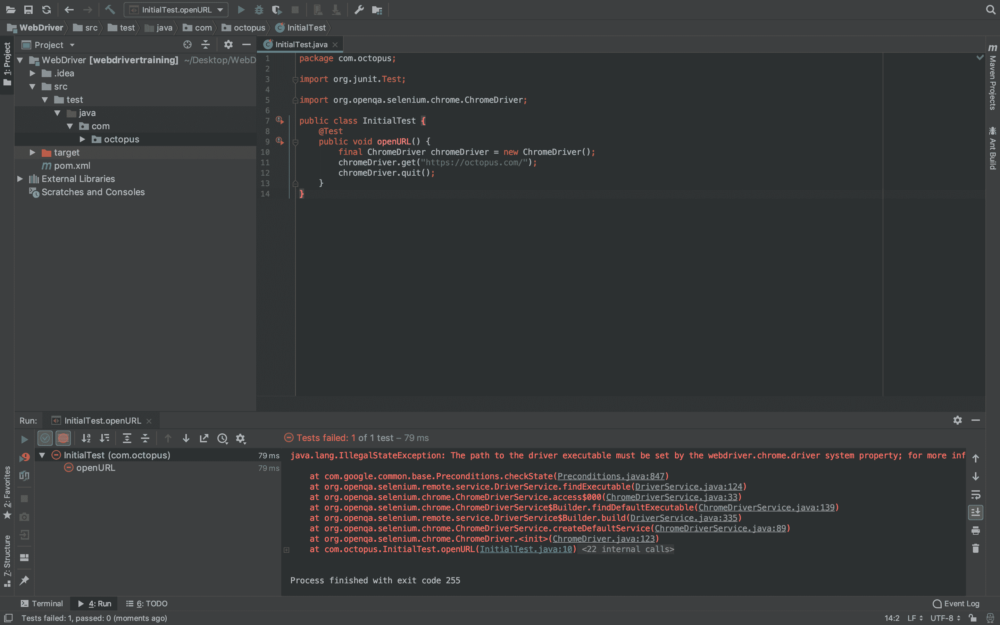](#)

当我们试图运行测试时抛出了`IllegalStateException`异常，因为找不到驱动程序可执行文件。有帮助的是，这个错误把我们指向了[http://chromedriver.storage.googleapis.com/index.html](http://chromedriver.storage.googleapis.com/index.html)，在那里可以下载驱动程序。

打开此链接会显示许多对应于驱动程序可执行文件版本的目录。您几乎总是希望获得最新版本，尽管应用于列表的排序不会使最新版本变得明显。

在下面的屏幕截图中，您可以看到目录是使用字符串比较进行排序的，这导致 2.4 版出现在 2.37 版之后。然而，从这个列表中(当你读到这篇文章时，这些版本已经改变了)，你实际上想要下载 2.37 版本，因为这是可用的最新版本。

[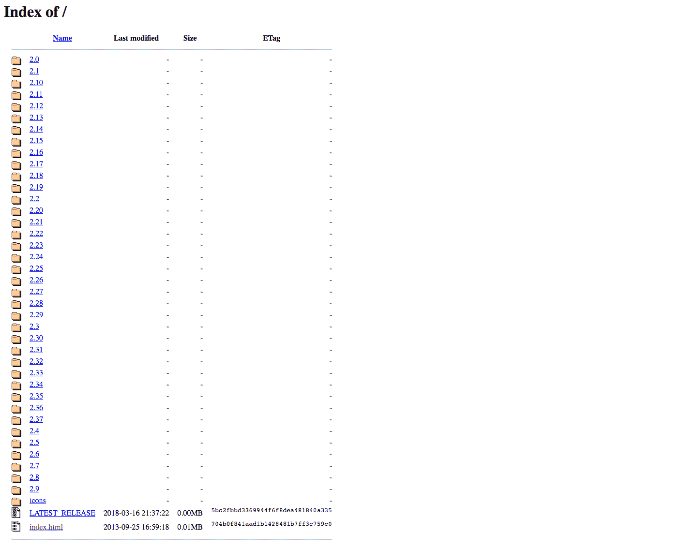](#)

或者，您可以访问网站[https://sites . Google . com/a/chromium . org/chrome driver/downloads](https://sites.google.com/a/chromium.org/chromedriver/downloads)，该网站提供了最新版本的直接链接。

在这个目录中，您会发现许多与您运行测试的平台相对应的 zip 文件。

[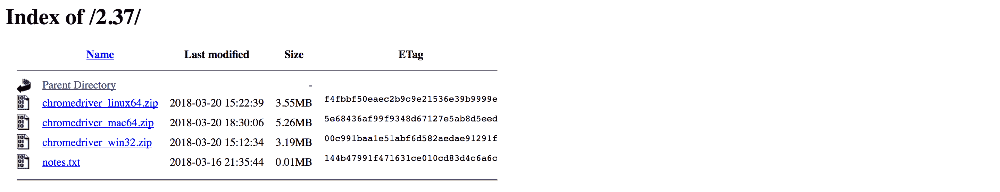](#)

这些 zip 文件中是驱动程序可执行文件。对于 Linux 和 Mac 用户，该可执行文件被称为`chromedriver`，而对于 Windows 用户，它被称为`chromedriver.exe`。

[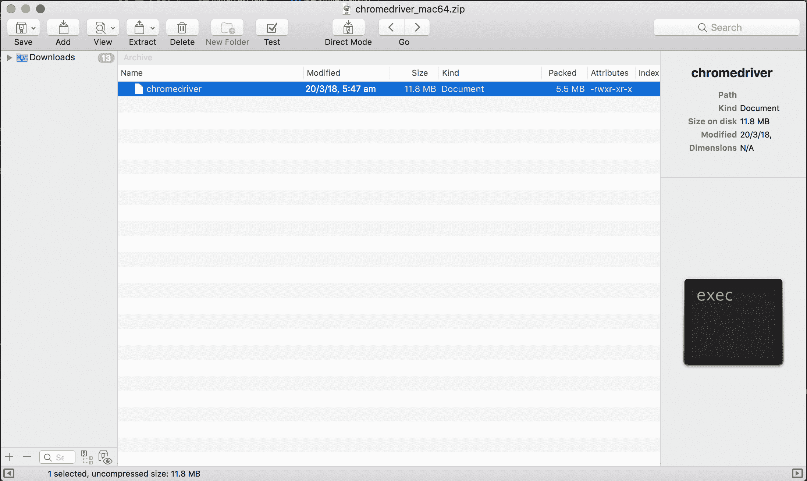](#)

异常消息告诉我们，我们需要将`webdriver.chrome.driver`系统属性设置为从 zip 文件中提取的可执行文件的位置。

这是通过配置`pom.xml`文件中的`maven-surefire-plugin`来完成的。下面是显示新插件配置的片段:

```
<project 
xmlns:xsi="http://www.w3.org/2001/XMLSchema-instance"
xsi:schemaLocation="http://maven.apache.org/POM/4.0.0
http://maven.apache.org/xsd/maven-4.0.0.xsd">

  <!-- ... -->

  <build>
    <plugins>

    <!-- ... -->

    <!--
    This is the configuration that has been added to define the webdriver.chrome.driver system property during a test.
    -->

      <plugin>
        <groupId>org.apache.maven.plugins</groupId>
        <artifactId>maven-surefire-plugin</artifactId>
        <version>2.21.0</version>
        <configuration>
          <systemPropertyVariables>
          <!--
          This element defines the webdriver.chrome.driver
          system property.
          -->
          <webdriver.chrome.driver>/Users/Shared/tools/chromedriver</webdriver.chrome.driver>
          </systemPropertyVariables>
        </configuration>
      </plugin>
    </plugins>
  </build>
</project> 
```

在这个例子中，我已经将驱动程序可执行文件提取到`/Users/Shared/tools/chromedriver`。

定义`webdriver.chrome.driver`系统属性的替代方法是将驱动程序可执行文件放在`PATH`环境变量中的目录下。当在`PATH`上找到驱动程序可执行文件时，您不需要像上面那样配置`<systemPropertyVariables>`元素，因为文件会被自动找到。

在 MacOS 系统上，您可以通过将目录添加到文件`/etc/paths`来将新目录添加到`PATH`环境变量中。

在下面的例子中，您可以从`cat`命令的输出(将文件的内容打印到屏幕上)中看到目录`/Users/Shared/tools`已经被添加到了`/etc/paths`文件中:

```
$ cat /etc/paths

/usr/local/bin
/usr/bin
/bin
/usr/sbin
/sbin
/Users/Shared/tools 
```

您可能需要注销并重新登录才能使更改生效，一旦生效，您就可以通过运行`echo $PATH`来确认新目录在`PATH`环境变量中:

```
$ echo $PATH

/opt/local/bin:/opt/local/sbin:/usr/local/bin:/usr/bin:/bin:/usr/sbin:/sbin:/Users/Shared/tools 
```

在像 Ubuntu 这样的 Linux 发行版中，额外的定制软件通常安装在`/opt`目录中。例如，您可以将 Chrome 驱动程序可执行文件保存到`/opt/tools/chromedriver`。

[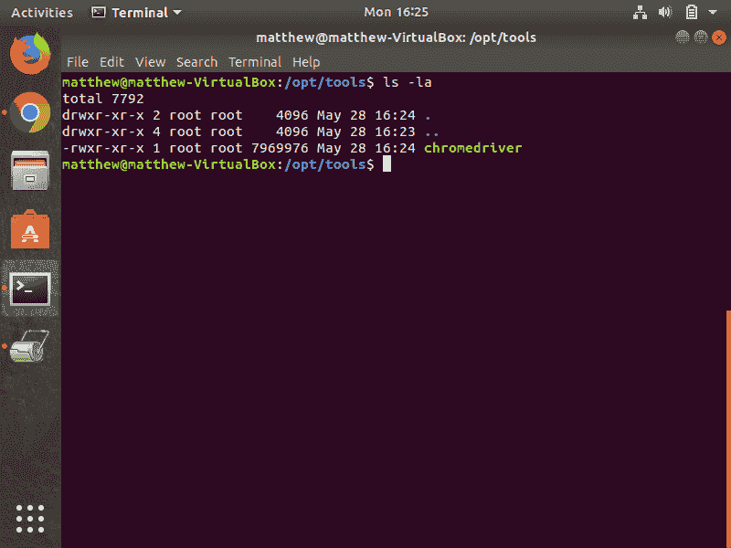](#)

要将`/opt/tools`目录添加到`PATH`中，将其添加到`/etc/environment`中的`PATH`变量中。在下面的截图中，你可以看到`/opt/tools`已经被添加到已经分配给`PATH`环境变量的目录列表的末尾。编辑完`/etc/environment`文件后，您可能需要注销并重新登录以使更改生效。

[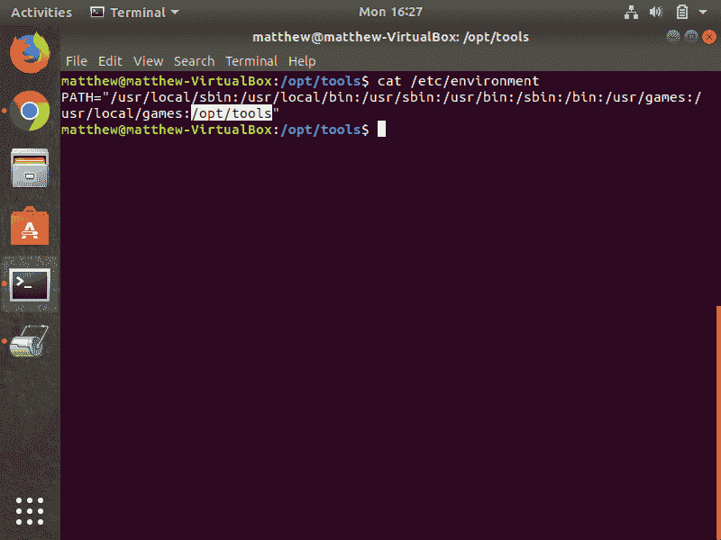](#)

在 Windows 中，您可能希望将驱动程序保存到类似`C:\tools\chromedriver.exe`的路径。要将该目录添加到`PATH`，需要编辑系统属性。

要查看系统属性，单击 Windows 键+ R 打开`Run`对话框，并输入`control sysdm.cpl,,3`作为要运行的命令。点击`OK`按钮。

[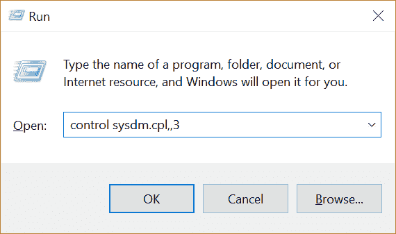](#)

这将打开`System Properties`对话框。点击`Environment Variables`按钮。

[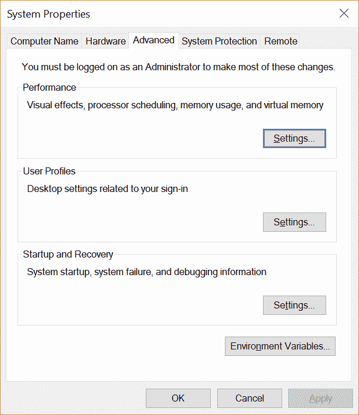](#)

环境变量分为两部分，一部分位于顶部，特定于当前用户，另一部分位于底部，由所有用户共享。两个列表都有一个`Path`变量。我们将编辑`System variables`以确保驱动程序可执行文件对所有用户可用，所以双击`System variables`列表中的`Path`项。

[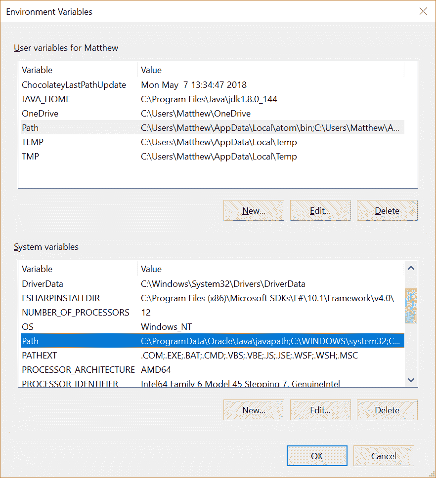](#)

点击`New`按钮，为环境变量添加一个新路径。

[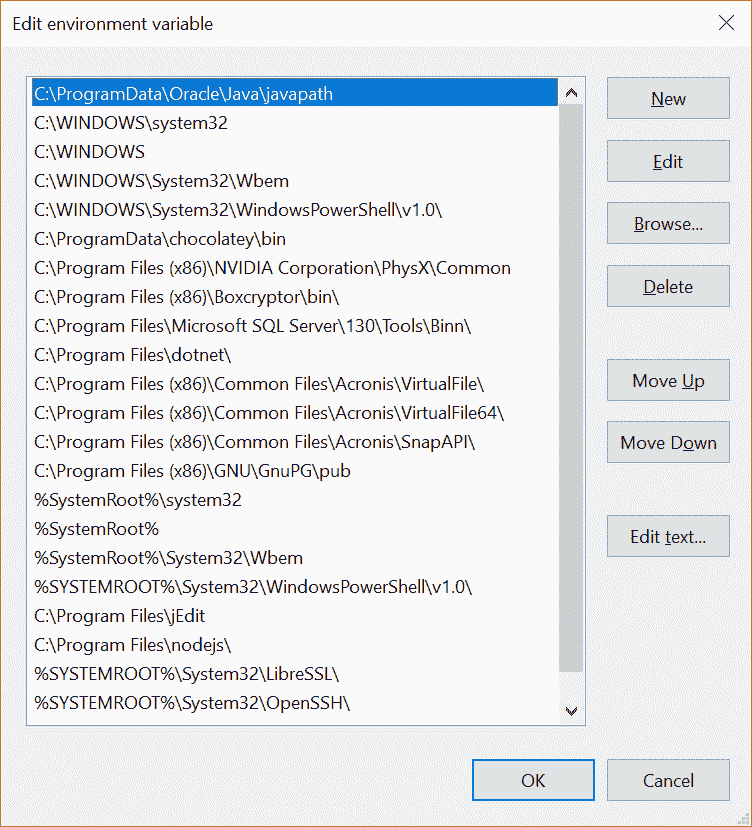](#)

将`C:\tools`添加到列表中。然后点击所有打开对话框上的`OK`按钮保存更改。

[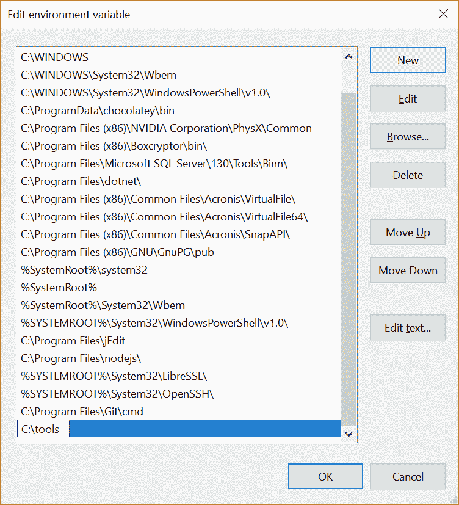](#)

给定将驱动程序可执行文件添加到路径或设置`webdriver.chrome.driver`系统属性的选项，我通常更喜欢将驱动程序可执行文件提取到`PATH`环境变量中的一个目录中。将每个浏览器的驱动程序可执行文件保存在一个公共位置，可以更容易地在浏览器之间切换，而不必记住为每个浏览器定义的特定系统属性，或者根据运行测试的操作系统修改不同的文件名。

因此，在这一点上，我们可以运行测试，没有错误。你会注意到 Chrome 浏览器启动，打开 https://octopus.com/的，然后再次关闭。我们现在已经成功地运行了我们的第一个 WebDriver 测试。

[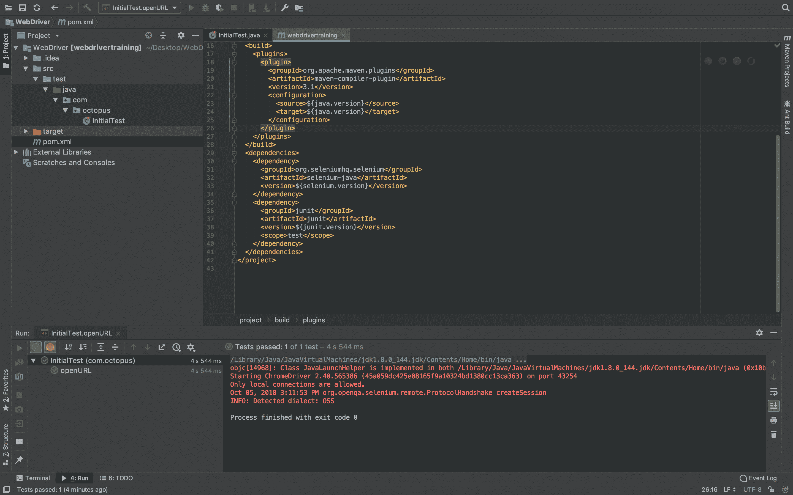](#)

您还会注意到，浏览器窗口打开和关闭的速度非常快。事实上，你可能根本没有看到浏览器窗口。

有时，在测试运行后让浏览器保持打开状态是很有用的。尤其是在调试测试时，在测试失败后能够直接与浏览器交互以便确定失败测试的原因是很方便的。

让浏览器保持打开状态就像不调用驱动程序对象上的`quit()`方法一样简单。因为是对`quit()`方法的调用关闭了浏览器并关闭了驱动程序，所以不进行这个调用将会在测试完成后保持浏览器打开。

在下面的代码中，我注释掉了对`chromeDriver.quit()`的调用，当这个测试运行时，它启动的 Chrome 浏览器将在屏幕上保持打开:

```
package com.octopus;

import org.junit.Test;

import org.openqa.selenium.chrome.ChromeDriver;

public class InitialTest {
  @Test
  public void openURL() {
    final ChromeDriver chromeDriver = new ChromeDriver();
    chromeDriver.get("https://octopus.com/");
    //chromeDriver.quit();
  }
} 
```

不过，给你个警告。不调用`quit()`方法将会留下驱动程序可执行的运行实例，由您来手动结束这些进程。

在下面的截图中，你可以看到许多`chromedriver`实例一直在运行，因为驱动程序的`quit()`方法没有被调用。必须手动停止这些实例，否则它们会随着您运行每个测试而不断累积，每个实例都会消耗额外的系统内存。

这个截图显示了 MacOS 活动监视器，在其中我们看到测试完成后,`chromedriver`的实例一直在运行。需要手动关闭它们来回收它们消耗的资源。

[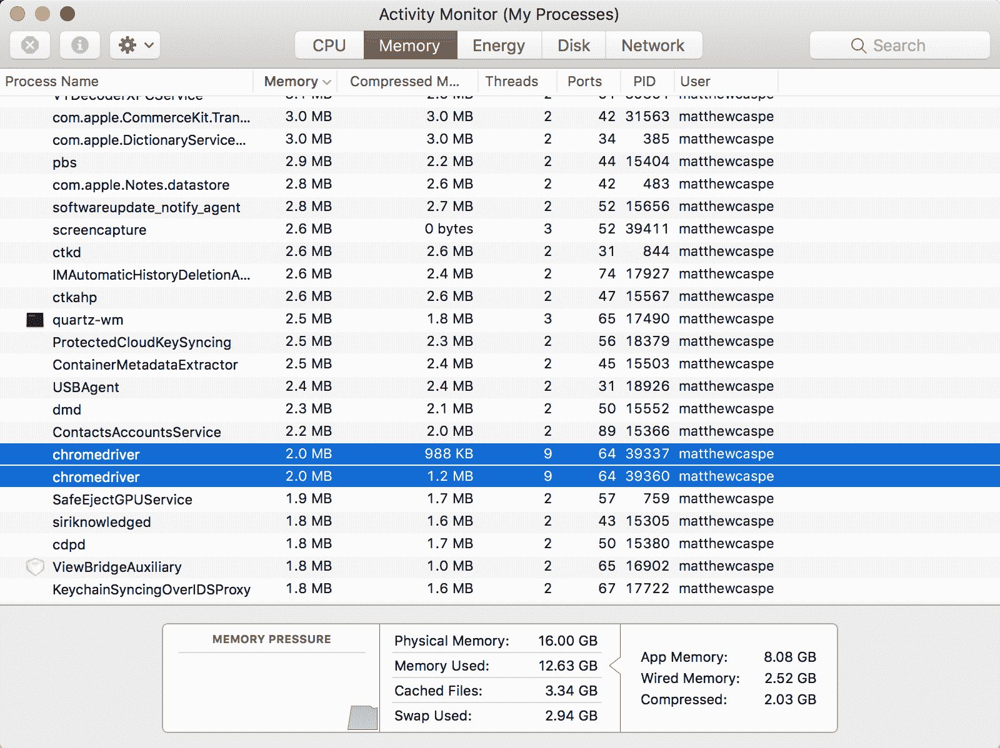](#)

当 Chrome 被 WebDriver 控制时，它会显示一条警告消息，称 Chrome 正被自动化测试软件控制。这是 Chrome 的一项安全功能，让用户知道他们的浏览器何时被用 WebDriver API 编写的软件控制。虽然可以手动关闭，但无法使用 WebDriver 关闭或阻止此警告。

[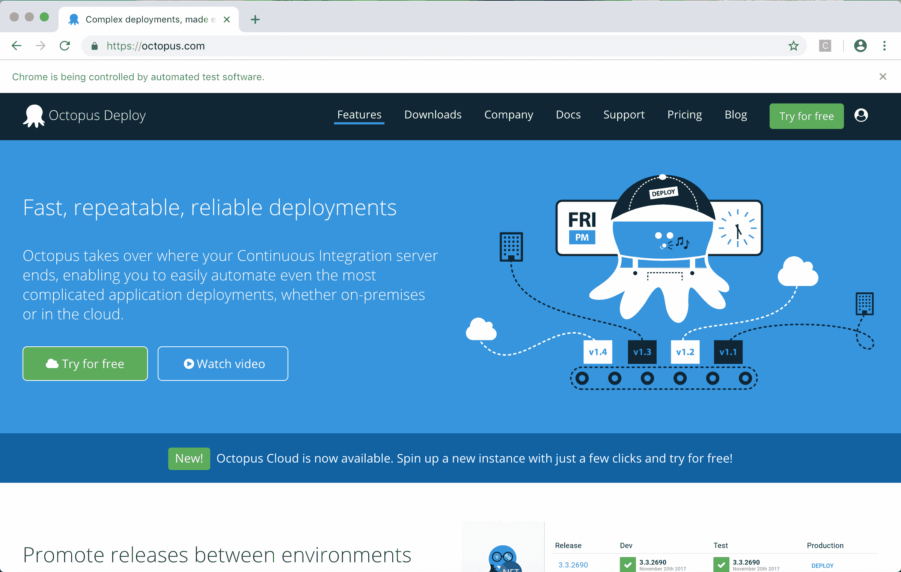](#)

这样，我们就有了一个简单但功能齐全的 WebDriver 测试来控制 Chrome web 浏览器，为我们开始构建一些更高级的测试奠定了基础。

## Firefox 测试

对于我们启动 Firefox 的测试，需要安装它。火狐可以从 https://firefox.com 下载。

然后需要将`geckodriver`可执行文件放在从[https://github.com/mozilla/geckodriver/releases](https://github.com/mozilla/geckodriver/releases)获得的某个平台特定下载的路径上。

MacOS 和 Linux 的可执行文件名称是`geckodriver`，Windows 的可执行文件名称是`geckodriver.exe`。

最后，创建了一个`FirefoxDriver`类的实例。这个类和`ChromeDriver`类有相同的`get()`方法，因为它们都继承自`RemoteWebDriver`。

您可以看到在新的`openURLFirefox()`方法中创建了`FirefoxDriver`类，如下所示:

```
package com.octopus;

import org.junit.Test;
import org.openqa.selenium.chrome.ChromeDriver;
import org.openqa.selenium.firefox.FirefoxDriver;

public class InitialTest {
    @Test
    public void openURL() {
        final ChromeDriver chromeDriver = new ChromeDriver();
        chromeDriver.get("https://octopus.com/");
        chromeDriver.quit();
    }

    @Test
    public void openURLFirefox() {
        final FirefoxDriver firefoxDriver = new FirefoxDriver();
        firefoxDriver.get("https://octopus.com/");
        firefoxDriver.quit();
    }
} 
```

运行`openURLFirefox()`单元测试将打开 Firefox 浏览器，在[https://octopus.com/](https://octopus.com/)打开页面，然后再次关闭浏览器。

这篇文章是关于[创建 Selenium WebDriver 测试框架](/blog/selenium/0-toc/webdriver-toc)的系列文章的一部分。