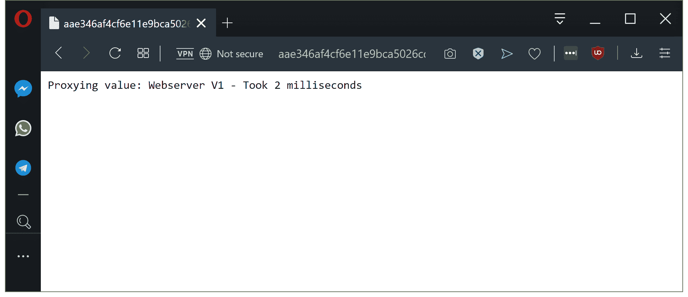

# 通过示例探索 Istio——Octopus 部署

> 原文：<https://octopus.com/blog/istio/the-sample-application>

[](#)

这是探索 Istio 的系列文章的第一部分，Istio 是 Kubernetes 可用的流行服务网格。在本文中，我将介绍一个样例应用程序，我们将使用它来探索 Istio 的主要特性。

* * *

Istio 是当今 Kubernetes 最受欢迎和最强大的服务网格之一。为了理解它提供的特性，有一个非常简单的示例应用程序来发出网络请求是很有用的，我们可以通过 Istio 来操作和配置它。

Istio 项目提供的典型例子是 [Bookinfo](https://istio.io/docs/examples/bookinfo/) 。Bookinfo 是一个小型多语言微服务应用程序，其输出可以通过修改网络策略来调整。

但是，我发现 Bookinfo 的层次太高，无法真正理解 Istio 的特性，因此，我将展示一个非常简单的 Kubernetes 部署，其中 Node.js 应用程序代理来自集群内部和外部的各种 web 服务器的请求。通过使事情变得非常简单，当网络请求发出时，很容易看到 Istio 正在做什么。

## 代理应用程序

我们示例中面向公众的应用程序是一个非常简单的 Node.js web 服务器。这个应用程序向它所代理的服务发出第二个网络请求，包装响应并返回它以及发出请求所用的时间。

我们将使用这个代理前端来观察网络请求如何在网络中路由，显示任何失败的网络请求，并测量请求花费的时间。

该应用程序的代码可以在 GitHub 上找到:

```
// content of index.js
const http = require('http');
const url = require('url');
const requestService = require('request');
const port = 3030;
const proxyUrl = process.env.PROXYURL || "https://raw.githubusercontent.com/mcasperson/NodejsProxy/master/helloworld.txt";

const requestHandler = (request, response) => {
  const path = url.parse(request.url).pathname;
  const start = new Date().getTime();
  requestService(proxyUrl + (path == "/" ? "" : path), (err, res, body) => {
    const duration = new Date().getTime() - start;
    if (err) {
      response.end(err.toString() + " - Took " + duration + " milliseconds");
    } else {
      response.end("Proxying value: " + body + " - Took " + duration + " milliseconds");
    }
  });
}

const server = http.createServer(requestHandler);

server.listen(port, (err) => {
  if (err) {
    return console.log('something bad happened', err);
  }

  console.log(`server is listening on ${port}`);
}); 
```

## 外部服务

在同一个存储库中，我们有两个文本文件[在这里](https://raw.githubusercontent.com/mcasperson/NodejsProxy/master/externalservice1.txt)和[在这里](https://raw.githubusercontent.com/mcasperson/NodejsProxy/master/externalservice2.txt)。由于 GitHub 允许您查看托管存储库中文件的原始内容，这些将作为模拟外部服务供我们的代理使用。这意味着我们不必麻烦地部署一个公共服务来返回静态内容。

## 内部网络服务器

对于内部 web 服务器，我们将运行第二个 Node.js 应用程序，它返回静态文本，在我们的例子中是`Webserver V1`和`Webserver V2`，以及运行图像的容器的主机名。我们将为每个版本启动 3 个实例，这意味着我们将有 6 个实例运行服务器的 2 个版本。

网络服务器的不同版本将标有`version: v1`或`version: v2`。当我们开始研究 Istio 的 VirtualService 和 DestinationRule 资源时，这种配置将为我们提供以有趣的方式路由和管理网络流量的机会。

该应用的源代码可以在 [GitHub](https://github.com/mcasperson/NodeJSWebServer) 上找到:

```
const http = require('http');
var url = require("url");
const os = require('os');
const port = 3030;
const content = process.env.SERVERCONTNET || "Hello world";

const requestHandler = (request, response) => {
  const path = url.parse(request.url).pathname;

  if (path == "/failsometimes") {
    if (Math.floor((Math.random() * 3)) == 0) {
      response.statusCode = 500;
    }
  }

  response.end(content + " requested from " + url.parse(request.url).pathname + " on " + os.hostname() + " with code " + response.statusCode);
};

const server = http.createServer(requestHandler);

server.listen(port, (err) => {
  if (err) {
    return console.log('something bad happened', err);
  }

  console.log(`server is listening on ${port}`);
}); 
```

## 建筑图

下面是使用 [Kubernetes 部署语言](https://blog.openshift.com/kdl-notation-kubernetes-app-deploy/) (KDL)的示例应用程序的顶级概述。

位于[https://github . com/mcasperson/NodejsProxy/blob/master/kubernetes/example . YAML](https://github.com/mcasperson/NodejsProxy/blob/master/kubernetes/example.yaml)的 YAML 是该示例项目的一个可部署示例。

我们有一个负载均衡器服务资源，它将流量定向到由`proxy`部署资源创建的 Pod 资源，后者又从由部署资源`webserverv1`和`webserverv2`创建的 Pod 资源请求内容。代理的内容然后被返回给浏览器。

同时，有两个额外的集群 IP 服务资源称为`webserverv1`和`webserverv2`，它们当前没有被访问。这些是为 Istio 策略做准备而创建的，与我们在最初的实现中建立的相比，Istio 策略将以更细粒度的方式引导流量。

[](#)

示例应用程序 Kubernetes 架构。

当我们打开应用程序时，我们将看到代理包装了来自`webserverv1`或`webserverv2`的响应，因为服务资源指向所有 web 服务器 Pod 资源，因此将针对任何给定的请求联系它们中的任何一个。我们还可以看到检索代理值所花费的时间。

[](#)

*代理应用程序从 web 服务器返回值。*

## 结论

这里显示的示例应用程序很简单，并不试图复制真实的场景。但是，它非常适合作为我们使用 Istio 添加新网络功能的起点。

在[的下一篇文章](/blog/istio/istio-virtualservice)中，我们将介绍 Istio VirtualService 资源。