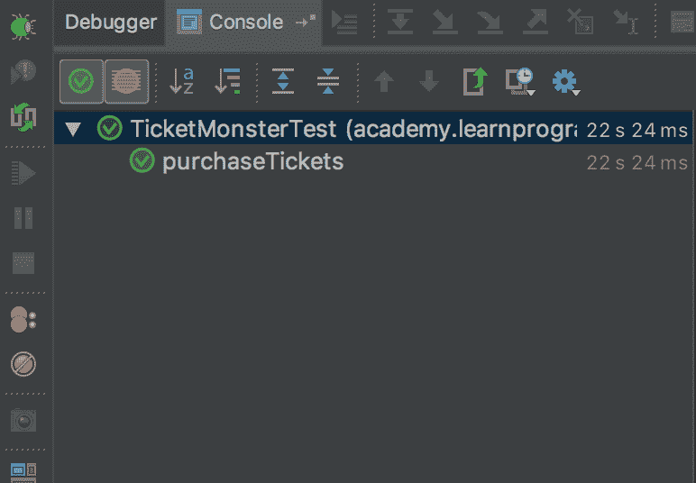

# 硒系列:TicketMonster 测试-章鱼部署

> 原文：<https://octopus.com/blog/selenium/22-the-ticketmonster-test/the-ticketmonster-test>

这篇文章是关于[创建 Selenium WebDriver 测试框架](/blog/selenium/0-toc/webdriver-toc)的系列文章的一部分。

TicketMonster 是由 RedHat 创建的一个示例应用程序，用于演示许多 Java web 技术。TicketMonster 的好处(无论如何，从 WebDriver 教程的角度来看)是它没有针对自动化测试进行优化，这意味着要成功测试应用程序的典型旅程，我们不能依赖一致的网络请求或所有具有方便的`id`属性的元素，我们可以使用这些属性来定位它们。

但是为了给 TicketMonster 编写测试，我们需要把它部署在某个地方。TicketMonster 应用程序的源代码是免费提供的，您可以在[https://developers . red hat . com/ticket-monster/whatsiticketmonster/](https://developers.redhat.com/ticket-monster/whatisticketmonster/)找到如何在本地运行 TicketMonster 的详细说明。

我们将要测试的场景是购买一张活动门票。我们先来贯穿一下手动买票的流程。

从主页开始，我们单击`Buy tickets now`按钮。

[](#)

这为我们提供了一个事件列表。在这里，我们单击`Concert`链接展开菜单，然后单击`Rock concert of the decade`链接。

[](#)

我们选择`Toronto : Roy Thomson Hall`作为场地，并保留默认时间。然后点击`Order tickets`按钮。

[](#)

选择`A - Premier platinum reserve`部分，并输入`2`作为票的数量。在`Order Summary`部分输入电子邮件地址，并点击`Add tickets`按钮确认这些选择。

[](#)

完成机票选择后，点击`Checkout`按钮。

[](#)

交易完成了，我们买了一场虚拟演出的门票。

[](#)

尽管这个购买门票的场景并不复杂，但是用 WebDriver 测试它需要大量的技术，到目前为止我们已经在库中实现了这些技术。我们单击链接和按钮等元素，填充文本框，从下拉列表中选择项目，并与动态添加到页面的元素进行交互。

下面是使用 WebDriver 完成购票场景的测试:

```
package com.octopus;

import org.junit.Assert;
import org.junit.Test;

public class TicketMonsterTest {

    private static final AutomatedBrowserFactory AUTOMATED_BROWSER_FACTORY =
            new AutomatedBrowserFactory();

    private static final int WAIT_TIME = 30;

    @Test
    public void purchaseTickets() {

        final AutomatedBrowser automatedBrowser =
                AUTOMATED_BROWSER_FACTORY.getAutomatedBrowser("ChromeNoImplicitWait");

        try {

            automatedBrowser.init();

            automatedBrowser.goTo("https://ticket-monster.herokuapp.com");

            automatedBrowser.clickElement("Buy tickets now", WAIT_TIME);

            automatedBrowser.clickElement("Concert", WAIT_TIME);

            automatedBrowser.clickElement("Rock concert of the decade", WAIT_TIME);

            automatedBrowser.selectOptionByTextFromSelect("Toronto : Roy Thomson Hall", "venueSelector", WAIT_TIME);

            automatedBrowser.clickElement("bookButton", WAIT_TIME);

            automatedBrowser.selectOptionByTextFromSelect("A - Premier platinum reserve", "sectionSelect", WAIT_TIME);

            automatedBrowser.populateElement("tickets-1", "2", WAIT_TIME);

            automatedBrowser.clickElement("add", WAIT_TIME);

            automatedBrowser.populateElement("email", "email@example.org", WAIT_TIME);

            automatedBrowser.clickElement("submit", WAIT_TIME);

            final String email = automatedBrowser.getTextFromElement("div.col-md-6:nth-child(1) > div:nth-child(1) > p:nth-child(2)", WAIT_TIME);
            Assert.assertTrue(email.contains("email@example.org"));

            final String event = automatedBrowser.getTextFromElement("div.col-md-6:nth-child(1) > div:nth-child(1) > p:nth-child(3)", WAIT_TIME);
            Assert.assertTrue(event.contains("Rock concert of the decade"));

            final String venue = automatedBrowser.getTextFromElement("div.col-md-6:nth-child(1) > div:nth-child(1) > p:nth-child(4)", WAIT_TIME);
            Assert.assertTrue(venue.contains("Roy Thomson Hall"));
        } finally {
            automatedBrowser.destroy();
        }
    }
} 
```

让我们一行一行地分解这段代码。

我们有一个`AutomatedBrowserFactory`类的静态实例，我们将使用它来生成`AutomatedBrowser`类的实例:

```
private static final AutomatedBrowserFactory AUTOMATED_BROWSER_FACTORY
  = new AutomatedBrowserFactory(); 
```

因为我们在与元素交互时将利用显式等待，所以我们需要有一个等待元素可用的持续时间。常量`WAIT_TIME`将用作显式等待时间的默认持续时间。

我们在这里有相当长的等待时间，因为应用程序已经被部署到一个相当小的 Heroku 实例，有时页面可能需要一些时间来加载:

```
private static final int WAIT_TIME = 30; 
```

对于这个测试，我们将使用显式等待，并利用简单的元素选择方法。为了让这两者按预期工作，我们需要一个不实现隐式等待的`AutomatedBrowser`实例。通过将`ChromeNoImplicitWait`选项传递给`AutomatedBrowserFactory`实例，我们将收到一个不实现隐式等待的`AutomatedBrowser`实例:

```
@Test
public void purchaseTickets() {
  final AutomatedBrowser automatedBrowser =
    AUTOMATED_BROWSER_FACTORY.getAutomatedBrowser("ChromeNoImplicitWait"); 
```

然后我们初始化`AutomatedBrowser`实例，并打开 TicketMonster URL:

```
try {
  automatedBrowser.init();
  automatedBrowser.goTo("https://ticket-monster.herokuapp.com"); 
```

在主页上，我们点击`Buy tickets now`链接。尽管这个元素看起来像一个按钮，但它实际上是一个链接，或者说是一个`<a>`元素。

[](#)

这意味着我们可以通过它的文本来识别这个元素。如果您还记得我们实现`SimpleBy`类时，我们用来标识元素的方法之一是`By.ByLinkText`类:

```
final By[] byInstances = new By[] {
  By.id(locator),
  By.xpath(locator),
  By.cssSelector(locator),
  By.className(locator),
  By.linkText(locator),
  By.name(locator)
}; 
```

`By.linkText()`方法意味着我们可以使用组成链接的文本，即`Buy tickets now`:

```
automatedBrowser.clickElement("Buy tickets now", WAIT_TIME); 
```

`Concert and Rock concert of the decade`元素也是链接，因此我们通过它们的文本来识别它们:

[](#)

```
automatedBrowser.clickElement("Concert", WAIT_TIME);
automatedBrowser.clickElement("Rock concert of the decade", WAIT_TIME); 
```

venue selection 下拉列表的 ID 是`venueSelector`，所以我们用它来标识它。从该列表中，我们选择`Toronto : Roy Thomson Hall`选项:

[](#)

```
automatedBrowser.selectOptionByTextFromSelect("Toronto : Roy Thomson Hall", "venueSelector", WAIT_TIME); 
```

在我们选择了一个地点后，会显示一个新的面板，提供一些默认的日期和时间。我们接受这些默认值，不需要与新的下拉列表交互。

我们确实需要点击`Order tickets`按钮。与我们点击的其他按钮类元素不同，这个元素是一个实际的表单按钮。这意味着我们不能使用元素中的文本来识别它。这个元素的名字是`bookButton`，由于`By.name()`方法是`SimpleBy`标识元素的方法之一，我们可以使用这个属性来标识按钮。

这一步是显式等待有价值的一个很好的例子，因为我们正在交互的元素是动态显示的，我们不能假设元素可以立即被点击。因为我们使用了显式等待，所以我们可以确信，只有当元素处于期望的状态时，测试才会继续，在这种情况下，这意味着它们可以被单击:

[](#)

```
automatedBrowser.clickElement("bookButton", WAIT_TIME); 
```

从 ID 为`sectionSelect`的下拉列表中选择该部分:

[](#)

```
automatedBrowser.selectOptionByTextFromSelect("A - Premier platinum reserve", "sectionSelect", WAIT_TIME); 
```

定义要购买的门票数量的文本框有一个`tickets-1`的`name`。我们用它来标识元素，并用文本`2`填充它:

[](#)

```
automatedBrowser.populateElement("tickets-1", "2", WAIT_TIME); 
```

`Add tickets`按钮是表单按钮的另一个例子。我们用它的`add`中的`name`来识别并点击它:

[](#)

```
automatedBrowser.clickElement("add", WAIT_TIME); 
```

电子邮件文本框有一个 ID`email`，我们用它来标识它，并用虚拟电子邮件地址`email@example.org`填充它:

[](#)

```
automatedBrowser.populateElement("email", "email@example.org", WAIT_TIME); 
```

`Checkout`按钮是另一个表单按钮。它有一个`submit`的`name`:

[](#)

```
automatedBrowser.clickElement("submit", WAIT_TIME); 
```

在最后一个屏幕上，我们不与任何元素交互，而是捕捉文本来验证它是否符合我们的预期。

我们感兴趣的文本可以在许多段落或`<p>`元素中找到。我们可以从 developer tools 窗口中看到，这些元素没有任何我们可以用来识别它们的有用属性。其实他们根本没有任何属性。

在这些情况下，您必须使用 XPath 或 CSS 选择器来标识元素。因为 CSS 选择器对 web 开发人员来说更熟悉，所以这是我们将使用的样式:

[](#)

右击元素并选择复制➜复制选择器让 Chrome 生成一个 CSS 选择器来唯一标识元素:

[](#)

在这种情况下，保存电子邮件地址的元素可以用 CSS 选择器`div.col-md-6:nth-child(1) > div:nth-child(1) > p:nth-child(2)`找到。我们用它来识别元素并获取其文本内容，然后对其进行检查以确保它包含我们之前输入的电子邮件地址:

```
final String email = automatedBrowser.getTextFromElement("div.col-md-6:nth-child(1) > div:nth-child(1) > p:nth-child(2)", WAIT_TIME);
Assert.assertTrue(email.contains("email@example.org")); 
```

我们遵循相同的流程来识别包含地点和事件的段落，并验证这些元素包含的文本:

```
final String event = automatedBrowser.getTextFromElement("div.col-md-6:nth-child(1) > div:nth-child(1) > p:nth-child(3)", WAIT_TIME);
Assert.assertTrue(event.contains("Rock concert of the decade"));

final String venue = automatedBrowser.getTextFromElement("div.col-md-6:nth-child(1) > div:nth-child(1) > p:nth-child(4)", WAIT_TIME);
Assert.assertTrue(venue.contains("Roy Thomson Hall")); 
```

然后测试结束，在`finally`块中清理资源:

```
 } finally {
      automatedBrowser.destroy();
    }
} 
```

在测试像 TicketMonster 这样的真实应用程序时，我们可以观察到编写 WebDriver 测试的三个重要方面。

首先，在今天的 web 应用程序中，动态元素无处不在。无论这些是我们在加载新页面后需要与之交互的元素，还是由 JavaScript 操纵的元素，测试现代 web 应用程序都意味着处理不总是立即可用的元素。

其次，我们已经在这个测试中看到，我们想要与之交互的元素拥有惟一的 id 是多么的罕见。我们经常不得不依赖于`name`属性，我们甚至不得不使用 CSS 选择器来为我们的最终验证识别一些段落元素。

第三，我们看到，仅仅因为两个元素在屏幕上看起来一样，它们就可以基于完全不同的 HTML 元素。在 TicketMonster 中，使用`<a>`元素的链接和使用`<input>`元素的表单按钮在视觉上是相同的。但是这两个元素对我们如何编写测试有影响。也就是说，链接可以通过它们的文本内容来识别，而表单按钮不能。

要在本地运行测试，单击测试旁边的绿色图标，并选择`Run purchaseTickets()`选项:

[](#)

你会看到 Chrome 打开，完成购买，然后测试通过并结束:

[](#)

这是将代码更改推送到 GitHub 的好机会。右键单击根项目目录并选择 Git ➜提交目录...；

[](#)

输入提交消息，点击`Commit and Push`:

[](#)

然后点击`Push`按钮更新 GitHub 库:

[](#)

几分钟后，Travis CI 将检测到变化并运行测试。在日志中，您将看到正在执行的新测试:

[](#)

编写代码、添加测试、签入变更以及让中央服务器构建代码、运行测试并记录结果的循环对于持续集成的理念至关重要。如果您是团队的一员，代码库的当前状态可以通过 Travis CI 构建是否通过来快速确定，并且因为我们在每次签入时都运行测试，所以我们可以高度确信通过的构建代表了有效并且可以部署的代码库。

如果你有敏锐的眼光，你可能已经注意到一些图片在购票时没有正确加载。如果承载占位符图像的网站遇到性能问题，就会发生这种情况。正如您在下面的截图中看到的，事件和位置图像没有正确加载。

[](#)

像这样的问题应该被认为是一个 bug，我们可以在测试中检测出来。让我们更新测试以捕获一个 HAR 文件，这是我们在添加对 BrowserMob 代理的支持时实现的:

```
@Test
public void purchaseTickets() {

  final AutomatedBrowser automatedBrowser =
  AUTOMATED_BROWSER_FACTORY.getAutomatedBrowser("ChromeNoImplicitWait");

  try {

    automatedBrowser.init();

    automatedBrowser.captureHarFile();

    automatedBrowser.goTo("https://ticket-monster.herokuapp.com");

    automatedBrowser.clickElement("Buy tickets now", WAIT_TIME);

    automatedBrowser.clickElement("Concert", WAIT_TIME);

    automatedBrowser.clickElement("Rock concert of the decade", WAIT_TIME);

    automatedBrowser.selectOptionByTextFromSelect("Toronto : Roy Thomson Hall", "venueSelector", WAIT_TIME);

    automatedBrowser.clickElement("bookButton", WAIT_TIME);

    automatedBrowser.selectOptionByTextFromSelect("A - Premier platinum reserve", "sectionSelect", WAIT_TIME);

    automatedBrowser.populateElement("tickets-1", "2", WAIT_TIME);

    automatedBrowser.clickElement("add", WAIT_TIME);

    automatedBrowser.populateElement("email", "email@example.org", WAIT_TIME);

    automatedBrowser.clickElement("submit", WAIT_TIME);

    final String email = automatedBrowser.getTextFromElement("div.col-md-6:nth-child(1) > div:nth-child(1) > p:nth-child(2)", WAIT_TIME);
    Assert.assertTrue(email.contains("email@example.org"));

    final String event = automatedBrowser.getTextFromElement("div.col-md-6:nth-child(1) > div:nth-child(1) > p:nth-child(3)", WAIT_TIME);
    Assert.assertTrue(event.contains("Rock concert of the decade"));

    final String venue = automatedBrowser.getTextFromElement("div.col-md-6:nth-child(1) > div:nth-child(1) > p:nth-child(4)", WAIT_TIME);
    Assert.assertTrue(venue.contains("Roy Thomson Hall"));
  } finally {
    try {
      automatedBrowser.saveHarFile("ticketmonster.har");
    } finally {
      automatedBrowser.destroy();
    }
  }
} 
```

然后，我们可以将生成的 HAR 文件加载到 [HAR 分析器](https://toolbox.googleapps.com/apps/har_analyzer/)中，并通过将 HTTP 响应代码过滤为 0、4xx 和 5xx 来查找网络错误。在这些范围内的响应表明有错误。

果然，我们看到一些图像请求有一个响应代码`0`，这意味着它们没有成功完成。因此，即使我们的测试成功完成了购票过程，HAR 文件也可以用来识别可能影响用户体验的其他问题:

[](#)

TicketMonster 的这个测试代表了一个真实的例子，展示了如何使用 WebDriver 编写端到端的测试。我们创建的库使得与 web 应用程序的交互变得非常容易；然而，拥有一个直接列出每一次点击、选择和填充操作的测试是非常低级的。在下一篇文章中，我们将探讨一种设计模式，它将与 web 应用程序的交互抽象化，以生成更具可重用性和可维护性的代码。

这篇文章是关于[创建 Selenium WebDriver 测试框架](/blog/selenium/0-toc/webdriver-toc)的系列文章的一部分。