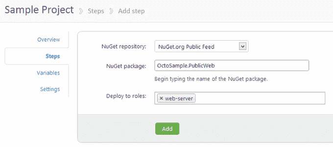
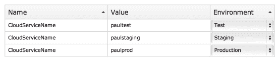
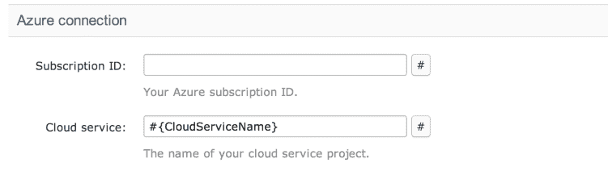

# 避免重复部署步骤的提示- Octopus 部署

> 原文：<https://octopus.com/blog/tips-to-avoid-duplicating-deployment-steps>

在 Octopus 中，我们强烈认为部署应该是可重复的。当您准备使用 Octopus 部署一个项目时，您需要花一些时间**定义您的部署过程**。在 Octopus 中，这由您在**步骤**选项卡上定义的一组部署步骤来表示。

我注意到人们在定义步骤时会犯一些常见的错误。为了有所帮助，您可以做两件事来减少重复部署步骤的需要。

## 技巧 1:在所有环境中使用相同的角色

创建包或脚本步骤时，可以指定该步骤部署到的角色:

人们有时会认为，当我选择上面的`web-server`角色时，该步骤将针对该角色中的所有机器运行，而不管我部署到哪个环境。**事实并非如此**。当我部署到我的开发环境中时，这个步骤将只在开发环境中的`web-server`机器上运行。当我部署到生产环境时，这个步骤将只在生产环境中的`web-server`角色的机器上运行。

如果您的角色名称以“prod”或“uat”或“dev”结尾，很可能您没有正确使用角色。

有一种理论认为，当谈到软件时，如果用户认为它必须以某种方式工作，而事实并非如此，那么是软件而不是用户有问题。我认为这在很大程度上是正确的。在这种情况下，我怀疑这是因为从 UX 的角度来看，我们没有做好明确部署期间会发生什么的工作。如果你对我们如何使这变得更清楚有任何建议，请在下面留下评论。

## 技巧 2:使用变量来说明环境之间的差异

定义步骤时，许多字段允许您引用变量。您可以通过查找字段旁边的哈希按钮来判断字段是否支持它。

假设我需要将一个 Azure 云服务包部署到 Azure 中的两个不同的云服务上。我*可以*创建两个不同的步骤，并为每个步骤选择不同的环境。然而，更好的方法是定义适用于每个环境的变量。

然后，我可以在定义步骤时引用该变量:

希望这两个技巧能够帮助您减少需要定义的部署步骤的数量。