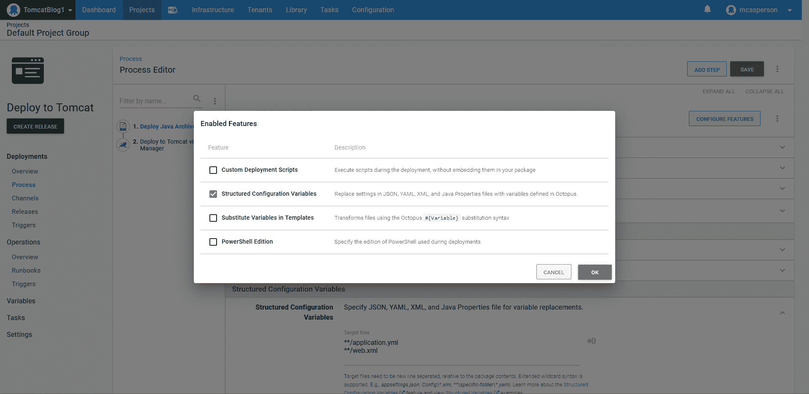
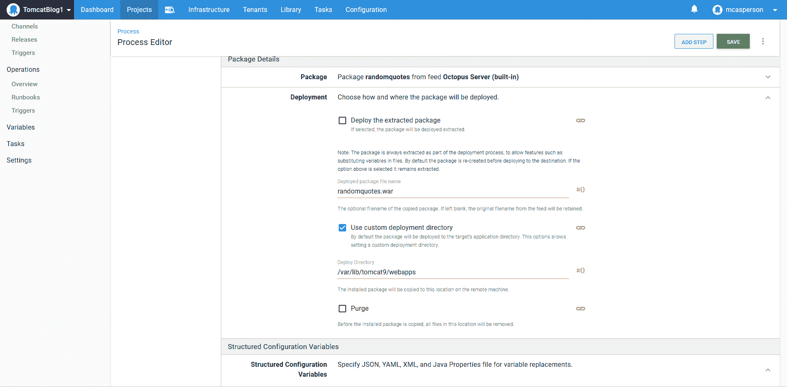
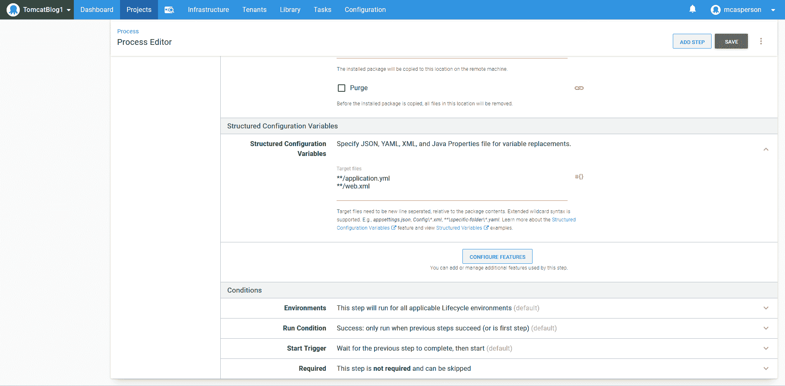
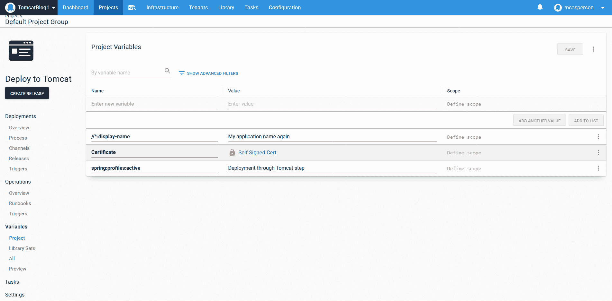
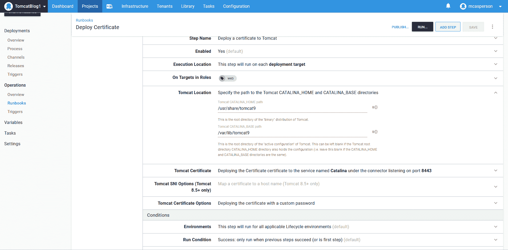
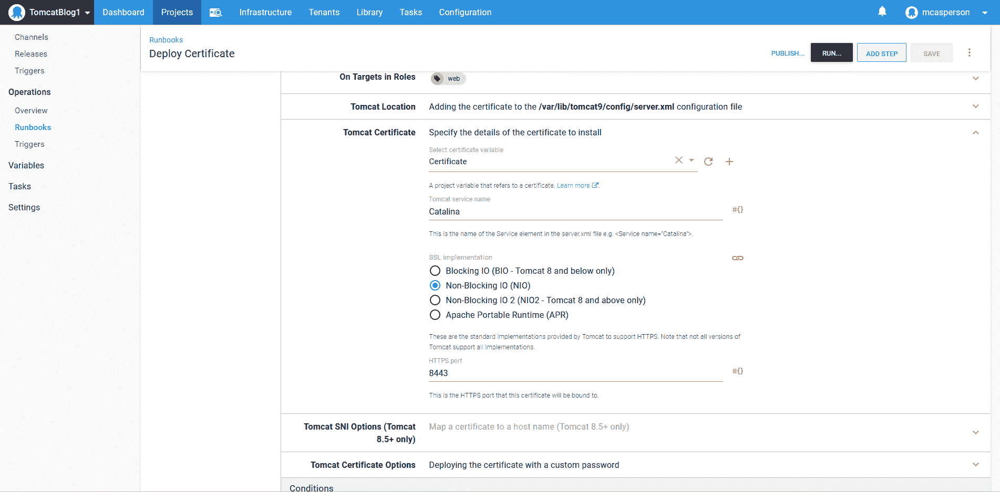

# 使用 YAML 和 XML 配置文件替换将 Java 部署到 Tomcat

> 原文：<https://octopus.com/blog/tomcat-deployments-with-variable-replacements>

[](#)

将应用程序部署到不同的环境时，一个常见的挑战是确保应用程序针对特定的环境进行了正确的配置。典型的例子是用每个环境所需的凭证配置数据库连接字符串。这些类型的敏感凭证不应该存储在源代码控制中，因此必须做一些工作来获取由在本地开发环境中工作的开发人员创建的应用程序包，以创建可以部署到共享但也受限制的环境中的包。

Octopus 多年来一直有能力将值注入到 JSON 文件中，但是 Java 应用程序通常没有将 JSON 作为一种配置格式。旧的 Java 应用程序严重依赖 XML，而像 Spring 这样的新库已经采用了 YAML 和属性文件作为它们的配置。

在本文和截屏中，我将向您展示如何将 Spring 应用程序部署到 Tomcat，利用 Octopus 2020.4 中的新功能将值注入 XML、YAML 和属性文件。

## 截屏

[https://www.youtube.com/embed/x1u2iAr_BQ4](https://www.youtube.com/embed/x1u2iAr_BQ4)

VIDEO

## 准备 Linux web 服务器

对于这个例子，我使用的是 Ubuntu 20.04。为了安装 Tomcat 和管理器应用程序，我们运行:

```
sudo apt-get install tomcat9 tomcat9-admin 
```

然后，我们需要通过修改`/var/lib/tomcat9/conf/tomcat-users.xml`文件来创建一个可以访问管理器应用程序的用户。该文件的示例如下所示:

```
<?xml version="1.0" encoding="UTF-8"?>
<tomcat-users 
              xmlns:xsi="http://www.w3.org/2001/XMLSchema-instance"
              xsi:schemaLocation="http://tomcat.apache.org/xml tomcat-users.xsd"
              version="1.0">
  <role rolename="manager-script"/>
  <role rolename="manager-gui"/>
  <user username="admin" password="Password01!" roles="manager-gui,manager-script"/>
</tomcat-users> 
```

如果您在访问管理器应用程序时遇到问题，可能是因为安全设置只限制从本地主机 IP 地址进行访问。该限制在文件`/usr/share/tomcat9-admin/manager/META-INF/context.xml`中定义。以下是实施过滤的**阀**被注释掉的例子:

```
<?xml version="1.0" encoding="UTF-8"?>
<Context antiResourceLocking="false" privileged="true" >
    <!-- Comment out the Valve below to remove the address filtering -->
    <!--<Valve className="org.apache.catalina.valves.RemoteAddrValve"
    allow="127\.\d+\.\d+\.\d+|::1|0:0:0:0:0:0:0:1" />-->
  <Manager sessionAttributeValueClassNameFilter="java\.lang\.(?:Boolean|Integer|Long|Number|String)|org\.apache\.catalina\.filters\.CsrfPreventionFilter\$LruCache(?:\$1)?|java\.util\.(?:Linked)?HashMap"/>
</Context> 
```

## 生成自签名证书

要生成自签名证书，请运行以下命令:

```
openssl genrsa 2048 > private.pem
openssl req -x509 -new -key private.pem -out public.pem
openssl pkcs12 -export -in public.pem -inkey private.pem -out mycert.pfx 
```

由此产生的 PFX 文件可以上传到八达通证书商店。

## 示例应用程序

我们正在部署的应用程序名为 Random Quotes，源代码可从 [GitHub](https://github.com/OctopusSamples/RandomQuotes-Java) 获得。这个应用程序有两个我们想要在部署期间修改的配置文件: [application.yml](https://github.com/OctopusSamples/RandomQuotes-Java/blob/master/src/main/resources/application.yml) 和 [web.xml](https://github.com/OctopusSamples/RandomQuotes-Java/blob/master/src/main/webapp/WEB-INF/web.xml) 。这些文件混合了 Spring 使用的较新的 YAML 配置风格和 servlet 应用程序使用的较旧的 XML 风格。

具体来说，我们将在 YAML 文件中设置活动的 Spring 概要文件，并在 XML 文件中设置应用程序显示名称。

要构建应用程序，请运行命令:

```
mvn package 
```

然后将`target`目录下的 WAR 文件上传到 Octopus 内置的 feed 中。

## 使用文件副本部署应用程序

使用 Octopus 可以以两种不同的方式部署 Java 应用程序。

一般的解决方案是将 WAR 文件复制到目标机器上的一个目录中。大多数应用程序服务器都有一个目录，用于监控新文件，然后自动部署应用程序。对于 Tomcat，该目录是`/var/lib/tomcat9/webapps`。

要将 Java 档案部署到目录，请使用**部署 Java 档案**步骤。

通过必须手动启用的**结构化配置变量**功能将值注入配置文件:

[](#)

然后，该步骤被配置为将 Java WAR 文件部署到`/var/lib/tomcat9/webapps`目录:

[](#)

然后将`application.yml`和`web.xml`文件定义为属性替换的目标:

[](#)

## 通过管理器部署应用程序

将应用程序部署到 Tomcat 的第二种方式是通过管理器步骤将**部署到 Tomcat。这一步利用了管理器应用程序公开的 API。**

为了配置这个步骤，我们需要将它指向位于 http://localhost:8080/manager 的管理器 API，并定义我们添加到`tomcat-users.xml`文件中的凭证:

[](#)

## 定义变量

我们需要定义两个变量来匹配我们想要替换的 YAML 和 XML 文件中的属性。

对于 YAML 文件，语法是一个冒号分隔的属性层次结构，产生一个变量名 **spring:profiles:active** 。对于 XML 文件，XPath 用作语法，这导致变量名为 **//*:display-name** :

[](#)

## 配置 HTTPS

配置 HTTPS 证书是通过**将证书部署到 Tomcat** 步骤完成的。

它要求定义 CATALINA_HOME 和 CATALINA_BASE 目录。这些在系统服务文件中定义在`/lib/systemd/system/tomcat9.service`，在我们的例子中定义为`/usr/share/tomcat9`和`/var/lib/tomcat9`:

[](#)

然后，我们通过端口 8443 暴露 HTTPS 访问:

[](#)

## 结论

在这个例子中，我们使用支持本地开发的通用配置文件部署了一个 web 应用程序，并在部署期间注入了在 Octopus 中定义的变量，以便为特定环境配置最终的应用程序。这演示了如何在将应用程序归档部署到共享和受限环境时，使用没有特定环境设置的应用程序归档并对其进行定制。

我们还部署了一个证书来配置 Tomcat 服务器上的 HTTPS 访问。

最终结果是一个为共享环境定制的 Spring Boot 应用程序，并安全地在 HTTPS 上公开。

愉快的部署！