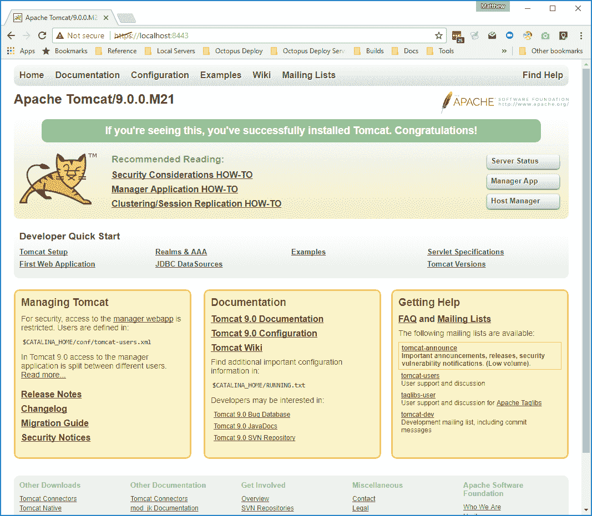

# 将证书部署到 Tomcat - Octopus 部署

> 原文：<https://octopus.com/blog/tomcat-https>

在之前的一篇文章中，我向您展示了如何将由 Octopus Deploy 管理的证书导出到 Java 密钥库中，然后配置 WildFly 来利用密钥库提供对 web 应用程序和管理端口的 HTTPS 访问。

在这篇文章中，我将向你展示如何在 Windows 中为 Tomcat 做同样的事情。

## 先决条件

要运行这篇博文中的命令和脚本，您需要安装一些工具。

第一个是 OpenSSL 客户机。我使用了来自 [Shining Light Productions](https://slproweb.com/products/Win32OpenSSL.html) 的 Windows OpenSSL 二进制文件。

第二个是 Groovy SDK。你可以从 [Groovy 下载页面](http://groovy-lang.org/download.html)下载安装程序。

这些步骤已经用 Tomcat 8 测试过了，但是应该适用于 Tomcat 6 以上的所有版本。

最后，你还需要安装 Java 8 JDK。

## 创建和分发证书

因为 WildFly 和 Tomcat 都使用 Java 密钥库，所以 WildFly 博文中的[创建证书库](https://octopus.com/blog/wildfly-https#creating-the-certificate-store)和[导出证书库](https://octopus.com/blog/wildfly-https#exporting-the-certificate-store)下的指令可以完全相同的方式应用于 Tomcat。

如果您遵循这些步骤，您的 Tomcat 实例将有一个名为`C:\keystore.jks`的文件。

## 在 Tomcat 中配置 HTTPS

为 Tomcat 配置 HTTPS 支持实际上非常简单。我们需要做两件事:

1.  向引用密钥库的`server.xml`文件添加一个`<Connector>`元素，如下所示:

```
<Connector SSLEnabled="true"
    keystoreFile="C:\keystore.jks"
    keystorePass="Password01"
    port="8443"
    protocol="org.apache.coyote.http11.Http11NioProtocol"
    scheme="https"
    secure="true"
    sslProtocol="TLS"/> 
```

2.  确保现有的 HTTP 连接器`redirectPort`属性指向 HTTPS 端口，如下所示:

```
<Connector
   connectionTimeout="20000"
   port="8080"
   protocol="HTTP/1.1"
   redirectPort="8443"/> 
```

为了促进这些改变，我们写了一个 [Groovy 脚本](https://github.com/OctopusDeploy/JBossDeployment/blob/master/tomcat-deploy-certificate.groovy)，它将使用必要的改变来更新`server.xml`文件。

## 运行脚本

要用 HTTPS 支持更新 Tomcat，运行如下脚本:

```
groovy tomcat-deploy-certificate.groovy --tomcat-dir C:\apache-tomcat-8.5.15 --https-port 8443 --http-port 8080 --keystore-file C:\keystore.jks --keystore-password Password01 
```

就是这样！重新启动 Tomcat，您将能够通过安全连接访问它。

[](#)

## 后续步骤

这些 Groovy 脚本正在被开发，作为最终将被移植到 Octopus Deploy 中直接提供的步骤中的概念验证。

如果你对剧本有任何问题，请留下评论。如果有一些 Java 特性你希望 Octopus 在未来部署支持，请加入 [Java RFC 帖子](https://octopus.com/blog/java-rfc)的讨论。