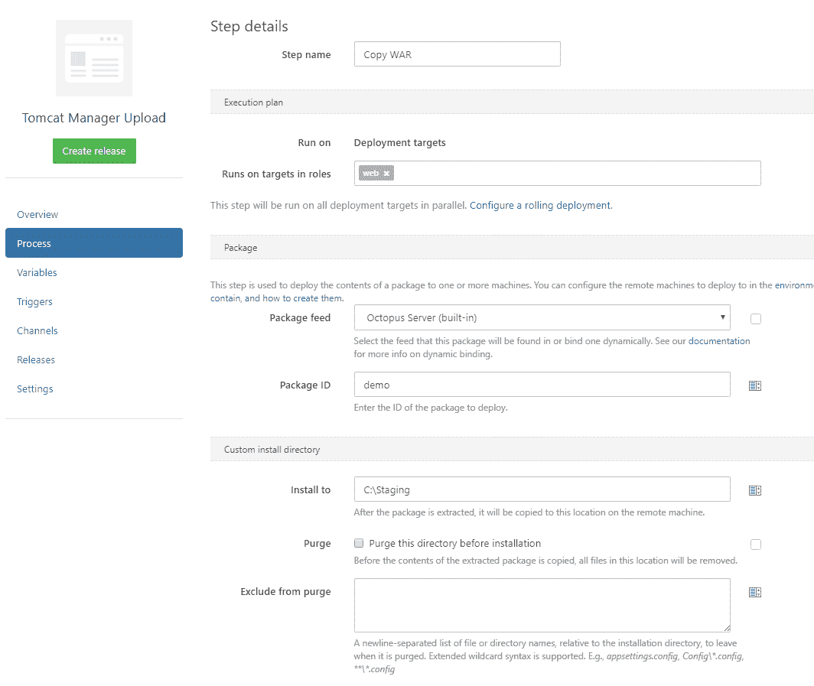
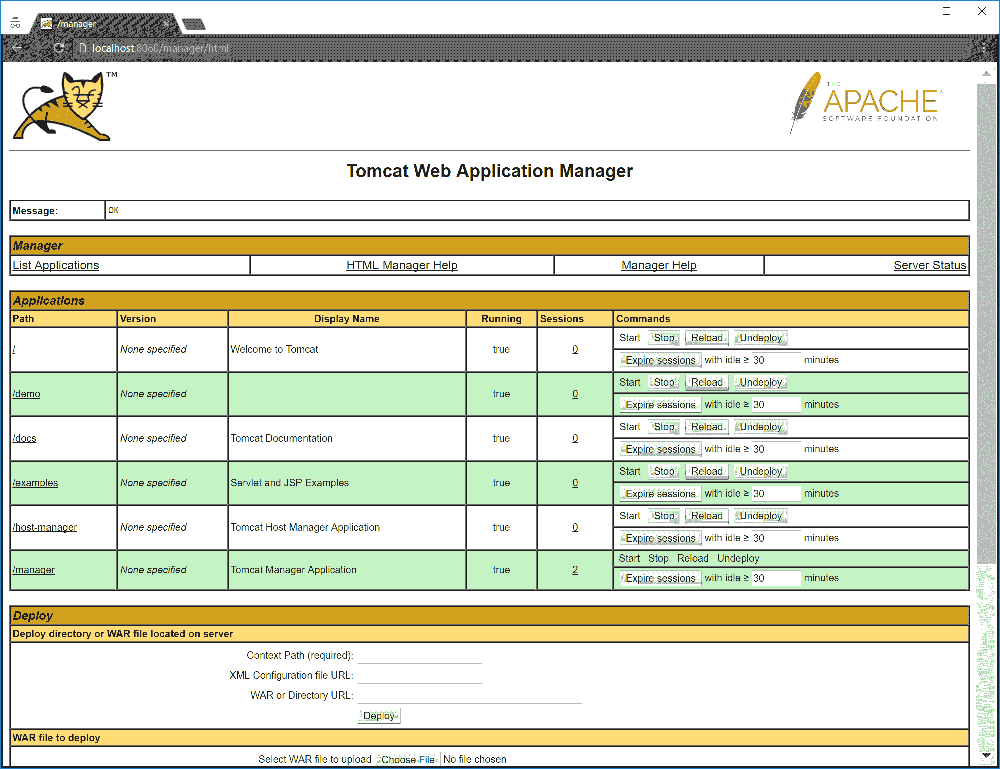

# 通过管理器部署 Tomcat 应用程序

> 原文：<https://octopus.com/blog/tomcat-manager-deployment>

在上一篇文章中，我向您展示了如何通过将一个 WAR 文件提取到 Tomcat `webapps`文件夹中，从 Octopus Deploy 部署到 Tomcat。除了文件副本，Tomcat 还支持通过与 Tomcat 发行版捆绑在一起的[管理器应用程序](https://tomcat.apache.org/tomcat-7.0-doc/html-manager-howto.html)部署 WAR 文件。

在本文中，我将向您展示如何通过 Tomcat 管理器在 Tomcat 中部署 WAR 文件。

## 配置 Tomcat

在开始上传 WAR 文件之前，我们需要做一些初始配置。

### 配置用户

我们需要定义与管理器交互的凭证。经理区分两种类型的用户，一种是通过浏览器使用 web 界面的用户，另一种是将使用 API 的用户。

为了定义这些用户，我们需要编辑`conf/tomcat-users.xml`文件。

基于浏览器的用户被分配到`manager-gui`角色，而 API 用户被分配到`manager-script`角色:

```
<user username="manager" password="s3cret" roles="manager-gui"/>
<user username="deployer" password="s3cret" roles="manager-script"/> 
```

### 定义最大文件上传大小

默认情况下，您只能通过管理器上传大约 50MB 的文件。这对于大的包来说通常不够大，所以您可以通过编辑`webapps/manager/WEB-INF/web.xml`文件来设置一个更高的限制。在该文件中，您会发现一个`<multipart-config>`元素，它的子元素定义了最大文件上传大小。

在这里，我将最大文件上传大小设置为 250MB:

```
<multipart-config>
  <max-file-size>262144000</max-file-size>
  <max-request-size>262144000</max-request-size>
  <file-size-threshold>0</file-size-threshold>
</multipart-config> 
```

## 上传战争文件

要将 WAR 文件放入 Octopus Deploy，请按照前一篇博文中的[打包 WAR 文件](https://octopus.com/blog/octopus-tomcat#packaging-the-war-file)和[推送包](https://octopus.com/blog/octopus-tomcat#pushing-the-package)中的说明进行操作。

然后，您可以使用[中的指令将 WAR 文件提取到目标服务器上，创建一个 Octopus 部署项目](https://octopus.com/blog/octopus-tomcat#creating-a-octopus-deploy-project)。

但是这次有一个重要的不同。我们将把 WAR 文件提取到一个临时位置，而不是直接提取到`webapps`文件夹。在这种情况下，我将文件提取到了`C:\staging`文件夹:

[](#)

为了部署文件，我们需要对`http://localhost:8080/manager/text/deploy` URL 进行 HTTP PUT，在请求体中提供要部署的 WAR 文件。`path`查询参数定义了将分配给应用程序的上下文路径。请注意，在路径名中有前导斜杠是很重要的。

下面的 PowerShell 命令使用 [curl](https://curl.haxx.se/download.html) 来发出 HTTP 请求:

```
& "C:\curl.exe" -u deployer:s3cret -X PUT -F "file=@C:\staging\demo.war" http://localhost:8080/manager/text/deploy?path=/demo 
```

## 确认部署

打开 http://localhost:8080/manager，并为我们之前创建的管理员用户提供凭据。您将看到应用程序部署在`demo`路径下:

[](#)

## 后续步骤

正在开发这些过程，作为最终将迁移到 Octopus Deploy 中直接提供的步骤中的概念验证。

如果您对此流程有任何疑问，请留下评论。如果有一些 Java 特性你希望 Octopus 在未来部署支持，请加入 [Java RFC 帖子](https://octopus.com/blog/java-rfc)的讨论。