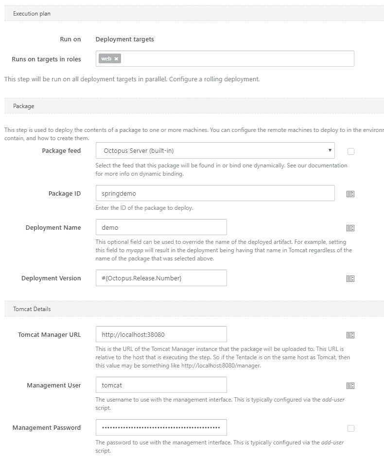
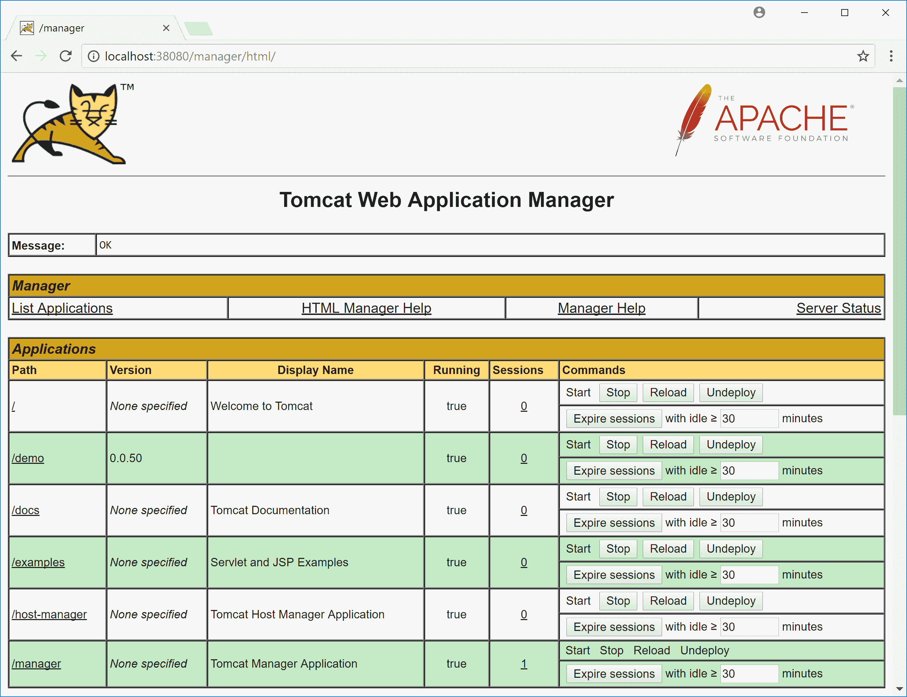
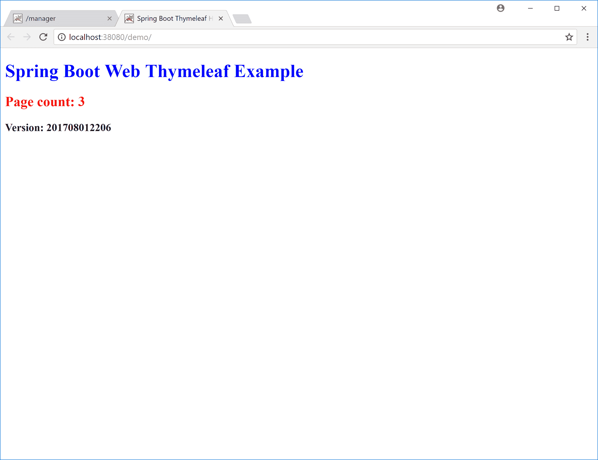
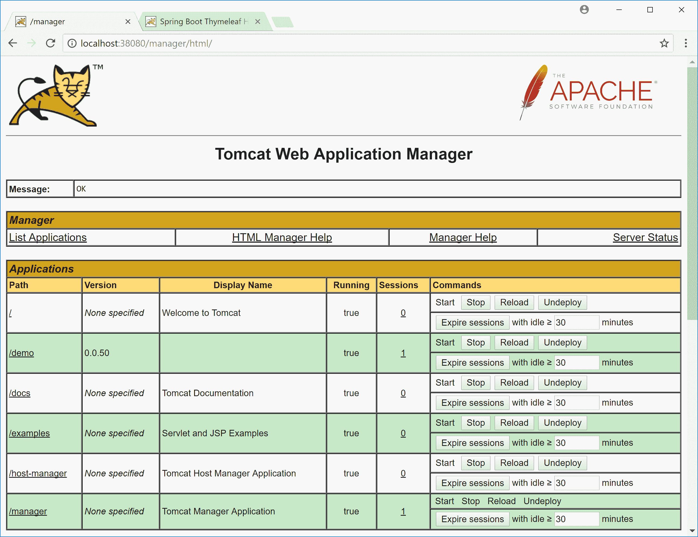
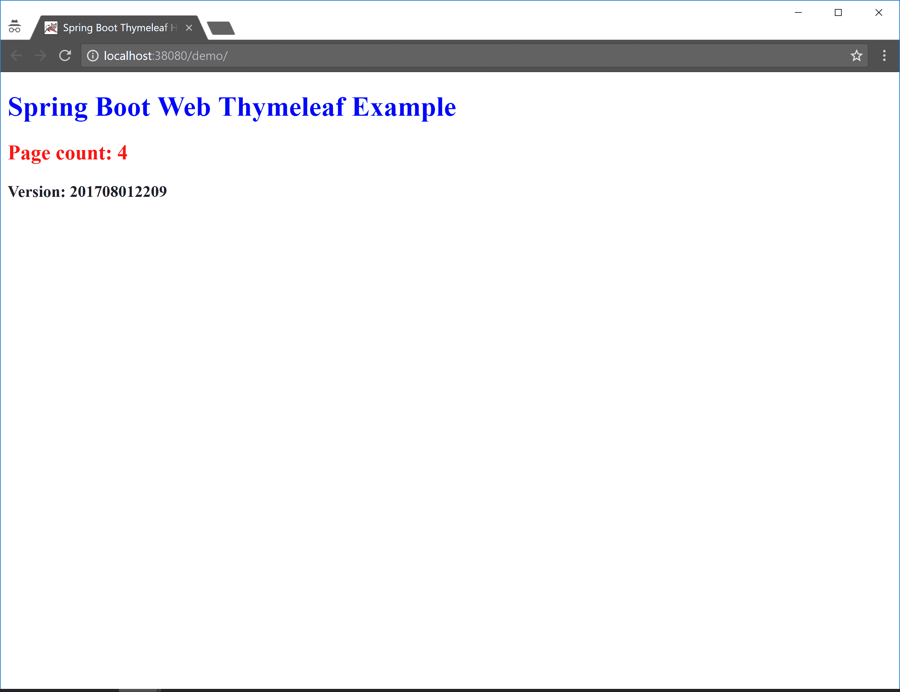
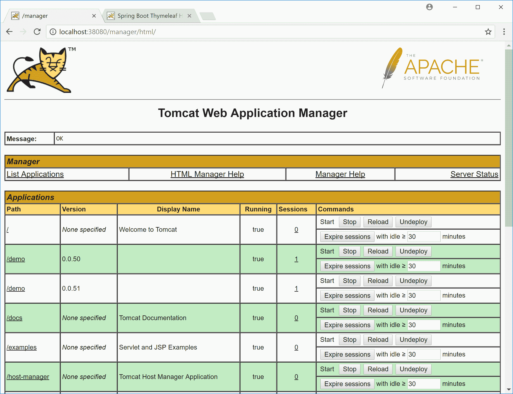
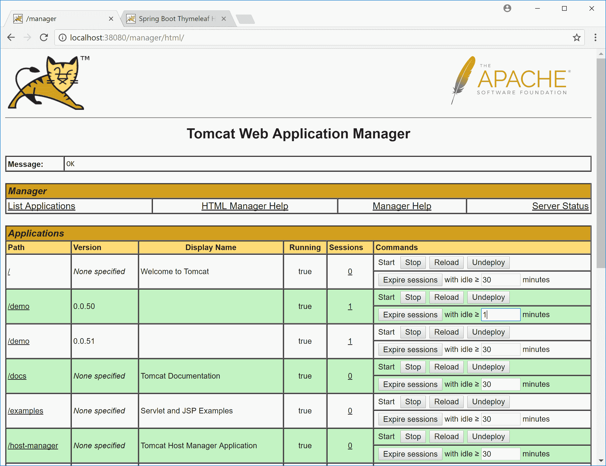
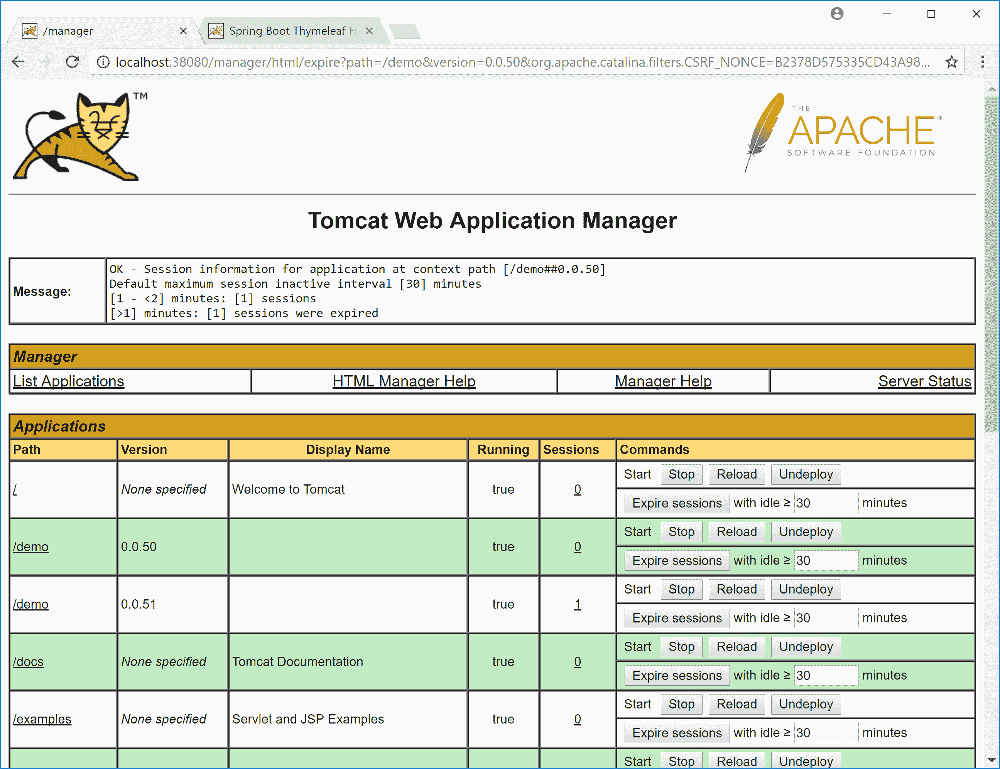
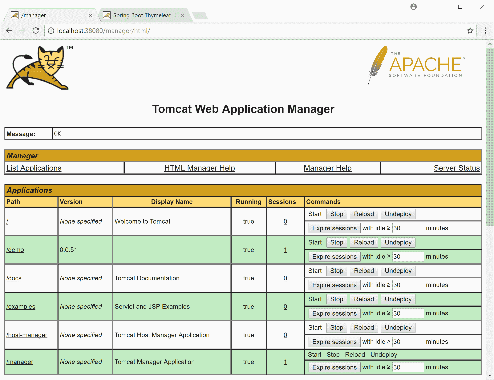

# 使用 Octopus Deploy - Octopus Deploy 在 Tomcat 中启用并行部署

> 原文：<https://octopus.com/blog/tomcat-parallel-deployments>

在 Octopus，我们正在努力构建对 Java 和 Tomcat 等服务器的支持。虽然这项工作仍在进行中，但我想分享 Tomcat 的一个简洁的特性，当这项 Java 工作发布时，您将能够通过 Octopus Deploy 使用它。

博文中的截图来自 Octopus Deploy 的开发版本，在最终版本中会有变化。

## 并行部署

考虑这个相当典型的场景。您有一个为 web 应用程序提供服务的 Tomcat 实例，并且您想要部署一个新版本。目前使用该应用程序的用户会发生什么情况？通常，部署新版本的应用程序会使为旧版本的应用程序建立的会话失效。这对用户体验意味着什么在很大程度上取决于所涉及的应用程序，但成为那些会话刚刚终止的客户之一几乎不会有什么乐趣。

Tomcat 附带了一个很好的特性，叫做并行部署，这使得这些升级对于管理员来说更加容易，对于客户来说更加愉快。并行部署允许应用程序的两个或更多版本并行运行，允许现有会话自然完成，同时将新流量导向新部署的应用程序版本。

并行部署不能解决数据库等共享资源的变更问题。如果应用程序的新版本改变了数据库模式，旧版本的应用程序可能不再按预期工作。在决定实现并行部署时，请记住这些限制。

并行部署很容易配置，所以让我们看一个简单的例子。

## 通过 Octopus Deploy 部署 Tomcat

这里是我们正在构建到 Octopus Deploy 中的工作进展步骤的截图。

[](#)

任何通过 Octopus Deploy 将应用程序部署到 IIS 的人都应该对此很熟悉。您选择要部署的包，并定义您要部署到的服务器的一些细节。

为了利用并行部署，您只需要为`Deployment Version`字段定义一个值。唯一的要求是更新的部署要有更高的版本。在这个例子中，我们使用 Octopus 版本号作为版本，这满足了每次部署都增加版本号的要求。

## 部署第一个版本

一旦部署完成，您将在 Tomcat 管理器中看到类似这样的内容。在本例中，演示应用程序已经部署了版本`0.0.50`。另请注意，它还没有会话。这是因为没有人开始使用该应用程序。

[](#)

这是刚刚部署的演示应用程序的屏幕截图。请注意屏幕底部的版本号。这是构建应用程序时生成的时间戳。

应用程序中的时间戳和它在 Tomcat 中被分配的版本不需要相同。使这些版本相同是有益的，但是对于这个例子，我们只使用这个时间戳来区分并行部署的应用程序的两个版本。

[](#)

既然已经使用了这个应用程序，Tomcat 将显示它有一个与之相关联的会话。你可以在`Sessions`栏下看到这个。

[](#)

## 部署第二个版本

现在我们有一个新版本的应用程序要部署。部署由 Octopus Deploy 处理，这一次给了我们同一个应用程序的第二个版本，现在是版本`0.0.51`。

在这里，我在一个隐姓埋名的窗口中打开了应用程序。这样做意味着我没有共享在常规 Chrome 窗口中开始的会话，这意味着 Tomcat 将这个请求视为一个新的会话。从截图中可以看到，应用程序显示的时间戳是不同的，因为这是后来构建的不同的 WAR 文件。

[](#)

现在，Tomcat 管理器向我们展示了演示应用程序的两个版本:`0.0.50`和`0.0.51`。两者都有活动会话，并且都将独立运行。现有用户继续使用版本`0.0.50`，而新流量被导向版本`0.0.51`。

[](#)

## 删除旧部署

在某个时刻，针对旧版本应用程序的所有会话都将结束。当这种情况发生时，我们可以利用 Tomcat 中的一个特性，该特性会在没有用户的情况下自动取消部署旧的应用程序版本。

要启用这个特性，您需要编辑`server.xml`文件，并在`<Host>`元素中设置`undeployOldVersions="true"`。

```
<Host
  name="localhost"  
  appBase="webapps"
  unpackWARs="true"
  autoDeploy="true"
  undeployOldVersions="true"> 
```

通常会话会在大约 30 分钟后过期，但是您可以通过使用`commands`列中的`Expire sessions`按钮终止空闲了一分钟的会话，并将空闲时间减少到一分钟，从而加快进程。

[](#)

随着会话手动过期，应用程序版本`0.0.50`不再有任何活动用户。

[](#)

几秒钟后，这个旧版本将自动取消部署。

[](#)

## 结论

如果您正在寻找一种简单的方法来管理 Java 应用程序的滚动部署，Tomcat 中的并行部署特性是一种非常方便的方法，可以将用户定向到新版本，同时在不再使用旧版本时最终清理旧版本。