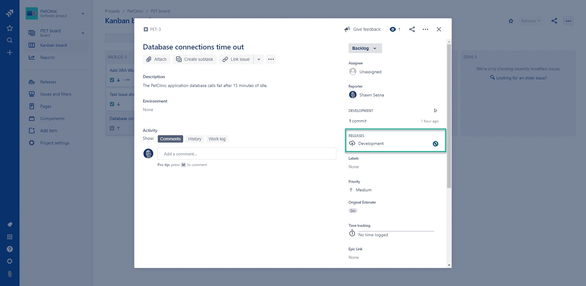

# 跟踪 CI/CD 渠道中的吉拉问题- Octopus Deploy

> 原文：<https://octopus.com/blog/track-jira-issues-across-your-ci-cd-pipeline>

[](#)

随着人们认识到 DevOps 提供的好处，近年来 devo PS 的采用大幅增加。许多解决方案提供集成在一起的持续集成和持续交付(CI/CD ),我们之前已经讨论过 CI 和 CD 之间的[差异，但是这些解决方案很少充分利用在 DevOps 中至关重要的持续反馈循环。在这篇文章中，我将向您展示如何集成 Jenkins、Octopus Deploy 和吉拉来提供一个解决方案，使您可以轻松地跟踪 CI/CD 渠道中的问题。](https://octopus.com/blog/difference-between-ci-and-cd)

## 安装詹金斯章鱼部署插件

Octopus Deploy 为 Jenkins 提供了一个插件，实现了其他构建平台上可用的相同功能。

安装 Octopus Deploy 插件与为 Jenkins 安装任何其他插件是一样的。当你打开 Jenkins，从登陆页面点击**管理 Jenkins** ，然后**管理插件**:

[](#)

点击**可用的**选项卡，按`Octo`过滤。勾选 Octopus Deploy 旁边的方框，选择**安装而不重启**或**立即下载并重启后安装**。

安装插件后，您将可以访问以下构建任务:

*   Octopus 部署:打包应用程序
*   Octopus 部署:推送包
*   Octopus 部署:推送构建信息

除了构建任务之外，您还将有以下构建后任务:

*   Octopus 部署:创建发布
*   章鱼部署:部署释放

Jenkins 插件与 Azure DevOps、TeamCity 和 Bamboo 的不同之处在于，*创建版本*和*部署版本*只能作为构建后操作使用。Jenkins 只允许一个 post build 动作类型，这意味着每个构建定义不能有一个以上的 *create release* 动作。

### 配置 Octopus 服务器连接

许多 Octopus 部署步骤需要连接到 Octopus 服务器。要配置连接，点击**管理 Jenkins** ，然后**配置系统**，然后向下滚动到 **Octopus Deploy 插件**，点击**添加 Octopus Deploy 服务器**:

[](#)

添加您的 Octopus 服务器详情并点击**保存**。

### Octopus 部署 CLI

Octopus Deploy 插件包含了执行这些操作所需的所有命令，但是它仍然依赖于构建代理上存在的 [Octopus Deploy CLI](https://octopus.com/downloads/octopuscli) 。下载 Octopus CLI 并将其解压缩到一个文件夹中，然后配置 Jenkins 知道它在那里。

点击**管理 Jenkins** ，然后点击**全局工具配置**。滚动到 **Octopus Deploy CLI** 部分，点击**添加 Octopus 工具**。添加工具的名称和 Octopus CLI 的路径，例如`c:\octopuscli\octo.exe`。

## 示例构建

在这篇文章中，我构建了 PetClinic 应用程序，这是一个使用 MySQL 作为后端的 Java 应用程序。

### 构建设置

首先，从 Jenkins 菜单中选择一个**新项目**:

[T32](#)

给你的项目命名，选择 **Maven 项目**。单击 **OK** ，您将看到构建定义的配置屏幕。

我将我的构建配置为基于下面定义的参数创建一个惟一的版本号。这个版本号将被印在构建的工件上，这些工件随后将被推送到 Octopus Deploy。我安装了几个 Jenkins 插件来实现这个功能:

*   构建名称和描述设置器
*   日期参数插件

在**通用选项卡**下，勾选**框，该项目被参数化**。

我们构建所需的参数是(所有`String`参数):

*   数据库名称:`#{Project.MySql.Database.Name}`
*   数据库服务器名称:`#{MySql.Database.Server.Name}`
*   数据库用户名:`#{Project.MySql.Database.User.Name}`
*   数据库用户密码:`#{Project.MySql.Database.User.Password}`

我添加了一些可选参数来构造版本号，格式如下:`1.0.2098.101603`。

可选参数:

*   专业(字符串):1
*   次要(字符串):0
*   年份(日期):
    *   日期格式:yy
    *   默认值:local date . now()；
*   年月日:
    *   日期格式:D
    *   默认值:local date . now()；
*   时间(日期):
    *   日期格式:HHmmss
    *   local date . now()；

定义好参数后，让我们将构建与源代码控制挂钩。我在这个构建中使用 PetClinic 公共 bit bucket repo:`https://twerthi@bitbucket.org/octopussamples/petclinic.git`。点击**源代码管理**，选择 Git，输入 repo 的 URL。

如果您使用了上面的可选参数，单击**构建环境**选项卡，选中复选框**设置构建名称**，输入`${MAJOR}.${MINOR}.${YEAR}${DAYOFYEAR}.${TIME}`作为构建名称，将构建名称设置为我们之前配置的版本号。

### 构建步骤

由于我们选择了 Maven 构建，Jenkins 为我们创建了构建步骤。我们需要做的就是导航到 build 选项卡，并为**目标和选项**输入以下内容:

```
clean package -Dproject.versionNumber=${BUILD_DISPLAY_NAME} -DdatabaseServerName=${DatabaseServerName} -DdatabaseName=${DatabaseName} -DskipTests -DdatabaseUserName=${DatabaseUserName} -DdatabaseUserPassword=${DatabaseUserPassword} 
```

命令的分解:

*   清理:清理项目并移除由之前的构建生成的所有文件。
*   打包:将编译好的源代码打包成可分发的格式(jar，war，…)。
*   -D:传递到构建中的参数。

这一步构建一个名为`petclinic.web.Version.war`的. war 文件。在这种情况下，包 ID 是`petclinic.web`。

### 发布步骤

我们剩下的步骤在构建定义的 post 步骤部分。这是我们为 MySQL 数据库后端打包 Flyway 项目的地方，将包和构建信息推送到 Octopus Deploy，然后创建我们的版本。

在**后期步骤**页签中，点击**添加后期构建步骤**，选择**Octopus:package application**，输入任务详情:

*   包装标识:`petclinic.mysql.flyway`
*   版本号:`${BUILD_DISPLAY_NAME}`这是我们通过参数配置的版本号，通过上面的设置构建名选项设置。
*   包格式:`zip|nuget`
*   包基础文件夹:`${WORKSPACE}\flyway`。忽略警告，它工作正常。
*   包包含路径:这里没有这个项目。
*   包输出文件夹:`${WORKSPACE}`

接下来，我们定义推送步骤。点击 **Post 步骤**选项卡，点击 **Add post-build step** 下拉菜单，选择**Octopus Deploy:push packages**:

[T31](#)

选择我们之前配置的 Octopus Deploy 服务器连接，然后选择您想要推送的空间(如果没有指定空间，将使用默认空间)。最后，添加要推送的包的路径。这一步接受通配符格式。路径的起始文件夹是`${WORKSPACE}`,所以没有理由指定它(事实上，如果您这样做，它将失败)。

在上面我们为 Flyway 定义的**Octopus Deploy:package application**步骤中，我们告诉该步骤将包放在`${WORKSPACE}`文件夹中。Maven build 放置 build。war 文件放在`/target/`文件夹中，所以我们的包路径文件夹值是:

```
/*.nupkg
/target/*.war 
```

负责推动包裹。接下来，我们将推送一些构建信息。点击**添加后期构建步骤**并选择**Octopus Deploy:Push build information**。这一步是吉拉发布说明的地方。

填写以下详细信息:

*   Octopus 服务器:前面定义的服务器连接。
*   空间:你推动包裹的空间。
*   包 id:
    *   `petclinic.web`
    *   `petclinic.mysql.flyway`
*   版本号:`${BUILD_DISPLAY_NAME}`

### 构建定义完成

在这个构建定义中，我们将 Jenkins 与 Octopus Deploy 集成在一起，并将 Jenkins 构建配置为从 Bitbucket 中检索发行说明，因此它们出现在 Octopus Deploy 中。让我们前往吉拉，进行集成配置。

## 部署吉拉与八达通集成

Octopus Deploy 已经开发了与吉拉软件的集成，以便在部署发生时，提交消息所引用的任何问题都可以回调到吉拉，并提供关于问题修复程序已部署在管道中的哪个位置的更新。

### 在吉拉添加八达通部署应用程序

Octopus Deploy 在吉拉市场创建了一个应用程序，便于集成。在吉拉软件登陆页面，点击**吉拉设置**、**应用**，点击**查找新应用**，按`Octo`过滤，选择**八达通部署吉拉**:

[](#)

点击**获取 app** ，点击**立即获取**。

看到应用程序已成功安装的消息后，点击**开始**。

### 配置吉拉和 Octopus 部署集成

在本节中，我们需要在 Octopus Deploy 和吉拉之间切换。

在继续之前，让我们打开 Octopus Deploy 并进入右侧屏幕来完成这一集成。在 Octopus Deploy 中，点击**配置**，然后点击**设置**，再点击**吉拉问题跟踪器**。

复制 Octopus 安装 ID 并将该值粘贴到吉拉的 Octopus 安装 ID 中(但不要单击保存):

[](#)

复制吉拉基本 URL 并将该值粘贴到 Octopus Deploy 中的**吉拉基本 Url** 字段和**吉拉问题跟踪器**屏幕上。

现在，回到吉拉，复制**吉拉连接应用程序密码**，并将其粘贴到 Octopus Deploy 中的**吉拉连接应用程序密码**字段。

**注意**在 Octopus Deploy 中的**测试**按钮不会起作用*直到*你先点击**保存**在吉拉:

现在，让我们回到 Octopus Deploy，点击**测试**按钮测试连接工作。如果连接正常，您将看到以下屏幕:

[](#)

至此，我们已经完成了吉拉的工作，但是在 Octopus Deploy 中我们还有一些事情要做。首先，让我们通过单击**已启用**复选框来启用 Octopus Deploy 中的集成。

要配置发行说明，请向下滚动并输入吉拉用户名和密码。

`Jira Username`是你的电子邮件地址，`Jira Password`是你的 API 密匙。

确保单击“测试”以确保凭据有效。

### 环境测绘

作为与吉拉集成的一部分，您需要将 Octopus 部署环境映射到吉拉环境类型。这是必要的，这样吉拉可以了解八达通的环境和跟踪问题的进展。请注意，吉拉环境类型是不能编辑的固定列表。为此，单击**基础架构**选项卡，然后单击**环境**，并单击该环境的省略号和**编辑**:

[](#)

使用**吉拉环境类型**部分中的下拉菜单将 Octopus 部署环境与吉拉环境类型相关联。

对要映射的任何其他环境重复此过程。

## Octopus 部署项目自动发布说明创建

要配置自动发行说明创建，从您的 Octopus 项目中，单击**设置**，并为发行说明模板输入以下内容:

```
#{each package in Octopus.Release.Package}
- #{package.PackageId} #{package.Version}
#{each workItem in package.WorkItems}
    - [#{workItem.Id}](#{workItem.LinkUrl}) - #{workItem.Description}
#{/each}
#{/each} 
```

(可选)您可以为部署更改模板输入以下内容:

```
#{each release in Octopus.Deployment.Changes}
**Release #{release.Version}**
#{release.ReleaseNotes}
#{/each} 
```

[](#)

## 反馈回路

随着我们的集成完成，是时候看到所有这些一起工作了。

### 在吉拉软件中创建一个问题

让我们在吉拉创建一个问题，点击左侧的 **+** :

[](#)

填写问题表格，点击**创建**。

记下为该问题创建的 ID，因为您稍后会需要它。对于这个帖子，是`PET-3`。

### 承诺回购

提交在 Octopus Deploy 中显示为发行说明，因此您可以看到正在部署什么。此外，如果您在提交消息中引用吉拉问题，提交将与吉拉的问题相关联。当部署发生时，八达通将更新吉拉的状态。

向您的回购协议添加一些提交；在这篇文章中，我添加了以下内容:

*   更新 pom.xml 以使用 SSL 版本的[https://repo.spring.io/milestone](https://repo.spring.io/milestone)回购
*   PET-3 -更新了数据源 bean 属性，以防止数据库连接超时
*   将 bin 文件夹添加到 Flyway 项目中，以包含 JRE 的内置版本

### 构建项目

提交完成后，我们就可以构建项目了。构建定义中的推送构建信息步骤将包含我们的提交消息。让我们在詹金斯排队建设。

在 Jenkins 中，点击**用参数**构建，点击**构建**。

### 查看 Octopus Deploy 中的构建信息

构建完成后，应该可以在 Octopus Deploy 中获得这些信息。导航到**库**标签，点击**构建信息**，点击**最高版本**链接查看提交和工作项。

这里我们看到构建来自 Jenkins 构建服务器，并且包括我们对相关工作项(PET-3)进行的三次提交。点击 PET-3 链接将我们带到吉拉问题。

### 部署版本

到目前为止，这种整合看起来相当不错！部署一个版本会用状态更新吉拉。让我们开始开发部署。本文假设您已经知道如何创建项目，所以我们将跳过项目创建和部署过程的步骤。

在您的 Octopus Deploy 项目中，单击 **CREATE RELEASE** ，在下一个屏幕中单击 **Save** 之后，您将看到发布的详细信息。在这个屏幕上，我们可以看到我们的发行说明和相关的构建信息:

[](#)

当该版本开始部署时，它将向吉拉发送信息。在吉拉，我们可以看到这个问题目前正在发展中。

[](#)

## 结论

詹金斯，吉拉和章鱼部署都是强大的 DevOps 工具。当您将这三者集成在一起时，您将获得一个强大的 DevOps 解决方案，它向开发人员、操作人员和业务团队等提供持续的反馈。

观看我们最近的网络研讨会，了解如何将 Atlassian 云管道与 Octopus Deploy 集成。我们涵盖了这篇文章中的许多概念，所以请查看:

[https://www.youtube.com/embed/yPjooXDJUA0](https://www.youtube.com/embed/yPjooXDJUA0)

VIDEO