# Kubernetes 微服务部署终极指南- Octopus Deploy

> 原文：<https://octopus.com/blog/ultimate-guide-to-k8s-microservice-deployments>

[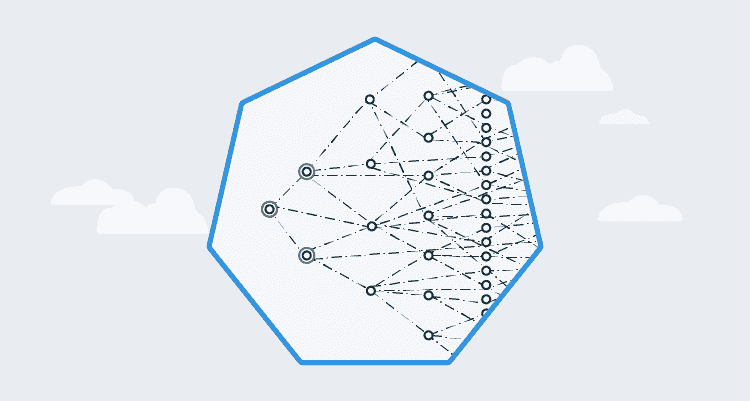](#)

对于希望快速可靠地发布复杂系统的团队来说，微服务已经成为一种流行的开发实践。Kubernetes 是微服务的天然平台，因为它可以处理部署许多单个微服务的许多实例所需的编排。此外，服务网格技术将常见的网络问题从应用层提升到基础设施层，使路由、保护、记录和测试网络流量变得更加容易。

使用微服务、Kubernetes 和服务网格技术创建持续集成和持续交付(CI/CD)管道需要一些工作，因为健壮的 CI/CD 管道必须解决许多问题:

*   高可用性(HA)
*   多重环境
*   零停机部署
*   HTTPS 和证书管理
*   功能分支部署
*   烟雾测试
*   回滚策略

在本文中，我将介绍如何通过将 Google 创建的名为 [Online Boutique](https://github.com/GoogleCloudPlatform/microservices-demo) 的示例微服务应用程序部署到亚马逊 EKS Kubernetes 集群，配置 Istio 服务网格以处理网络路由，并深入 HTTP 和 gRPC 网络以通过集群路由租用的网络流量来测试功能分支，从而创建 CI/CD 管道的持续交付(或部署)部分。

## 创建 EKS 集群

即使我将微服务应用程序部署到亚马逊 EKS 托管的 Kubernetes 集群，我也不依赖 EKS 提供的任何特殊功能，因此任何 Kubernetes 集群都可以用于遵循该流程。

开始使用 EKS 最简单的方法是使用 [ekscli 工具](https://eksctl.io/)。这个 CLI 工具抽象出了与创建和管理 EKS 集群相关的大部分细节，并提供了合理的默认值来帮助您快速入门。

## 创建 AWS 帐户

Octopus 对通过 AWS 帐户向 EKS 集群进行身份验证提供了本机支持。该账户在基础设施➜账户下定义。

[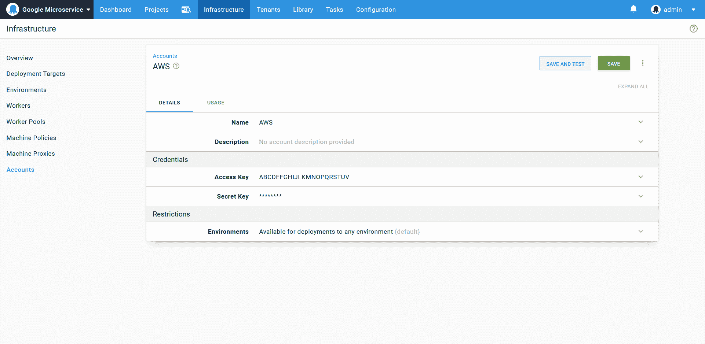](#)

*AWS 账户*

## 创建 Kubernetes 目标

通过导航到基础设施➜部署目标，在 Octopus 中创建 Kubernetes 目标。在部署目标屏幕上，选择**身份验证**部分中的 **AWS 帐户**选项，并添加 EKS 集群的名称。

[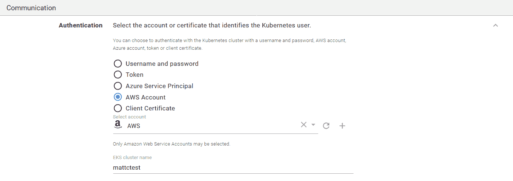](#)

*Kubernetes 目标根据 AWS 帐户进行身份验证。*

在 **Kubernetes Details** 部分，添加 EKS 集群的 URL，并选择集群证书或选中 **Skip TLS 验证**选项。

该目标运行的默认名称空间在 **Kubernetes 名称空间**字段中定义。

部署过程中的每一步都可以覆盖名称空间，因此可以将该字段留空，并在多个名称空间中重用一个目标。但是，当在单个集群中共享多个环境时，最好设置默认的名称空间。

[](#)

*EKS 星团详情。*

执行这些步骤的 Octopus 服务器或工作者必须在路径上有可用的`kubectl`和 AWS `aws-iam-authenticator`可执行文件。更多细节见[文件](https://octopus.com/docs/infrastructure/deployment-targets/kubernetes-target#add-a-kubernetes-target)。

## 安装 Istio

Istio 提供了许多安装选项，但我发现`istioctl`工具是最简单的。

从 [GitHub](https://github.com/istio/istio/releases) 下载一份`istioctl`的副本。文件名将类似于`istioctl-1.5.2-win.zip`，我们将其重命名为`istioctl.1.5.2.zip`，然后上传到 Octopus。将可执行文件放在 Octopus 内置提要中，可以在脚本步骤中使用它。

向 runbook 添加一个**运行 kubectl CLI 脚本**步骤，并引用`istioctl`包:

[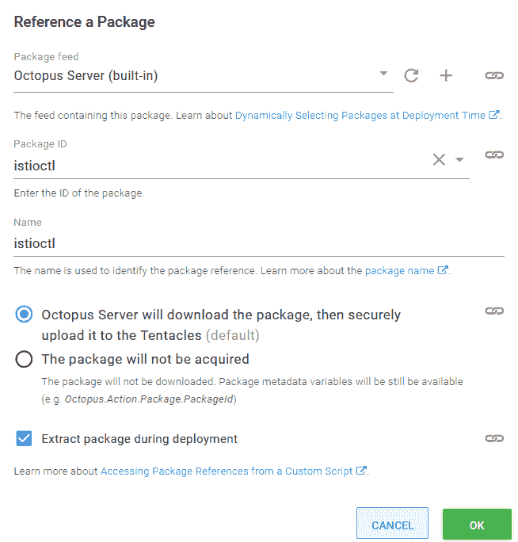](#)

参考 Istio CLI 工具的附加包。

在脚本体中，执行如下所示的`istioctl`，将 Istio 安装到 EKS 集群中。您可以从 [Istio 文档](https://istio.io/docs/setup/install/istioctl/)中找到关于这些命令的更多信息。然后将`istio-injection`标签添加到包含我们的应用程序的名称空间中，以启用[自动 Istio sidecar 注入](https://istio.io/docs/setup/additional-setup/sidecar-injection/#automatic-sidecar-injection):

```
istioctl/istioctl manifest apply --skip-confirmation
kubectl label namespace dev istio-injection=enabled 
```

您必须使用`--skip-confirmation`参数来防止`istioctl`永远等待工具通过 Octopus 运行时无法提供的输入。

[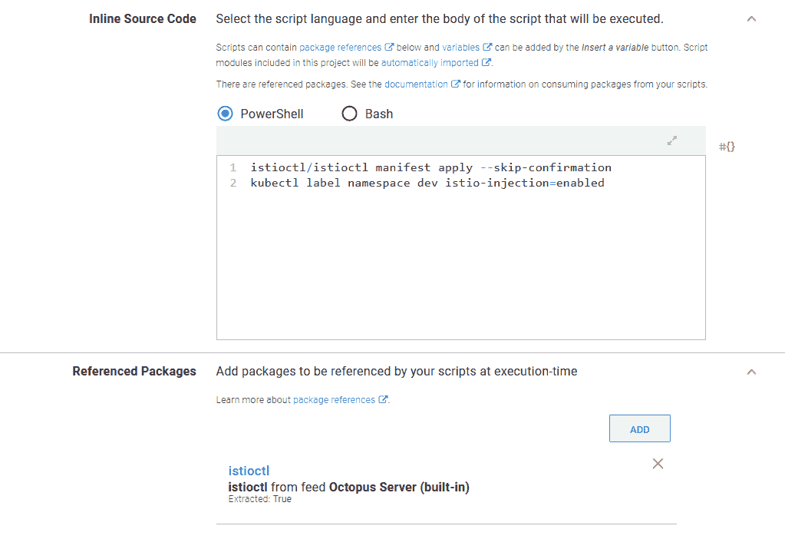](#)

*安装 Istio 并在名称空间中启用自动边车注入的脚本。*

## 创建 Docker 提要

构成我们的微服务应用程序的 Docker 映像将托管在 Docker Hub 中。Google 确实提供了来自他们自己的 Google Container Registry 的图像，但是这些图像没有 SemVer 兼容标签，Octopus 需要这些标签在发布创建期间对图像进行排序。我们还将创建一些特性分支映像来部署到集群，因此需要一个我们可以发布到的公共存储库。在下面的截图中，您可以看到在 Library ➜外部提要下创建的一个新的 Docker 提要:

[](#)

*Docker Hub Docker feed。*

## 部署微服务

在线精品示例应用程序提供了一个 [Kubernetes YAML 文件](https://github.com/GoogleCloudPlatform/microservices-demo/blob/master/release/kubernetes-manifests.yaml)，该文件定义了运行应用程序所需的所有部署和服务。

每项服务都将作为单独的项目部署在 Octopus 中。微服务的优势之一是每个服务都有独立的生命周期，允许独立于任何其他服务进行测试和部署。为每个微服务创建单独的 Octopus 项目允许我们为该服务创建和部署版本。

YAML 文件中提到的第一个微服务叫做`emailservice`。我们将在一个名为`01\. Online Boutique - Email service`的项目中部署`emailservice`。这个微服务有两个 Kubernetes 资源:一个部署和一个服务。这些资源的 YAML 如下所示:

```
apiVersion: apps/v1
kind: Deployment
metadata:
  name: emailservice
spec:
  selector:
    matchLabels:
      app: emailservice
  template:
    metadata:
      labels:
        app: emailservice
    spec:
      terminationGracePeriodSeconds: 5
      containers:
      - name: server
        image: gcr.io/google-samples/microservices-demo/emailservice:v0.2.0
        ports:
        - containerPort: 8080
        env:
        - name: PORT
          value: "8080"
        # - name: DISABLE_TRACING
        #   value: "1"
        - name: DISABLE_PROFILER
          value: "1"
        readinessProbe:
          periodSeconds: 5
          exec:
            command: ["/bin/grpc_health_probe", "-addr=:8080"]
        livenessProbe:
          periodSeconds: 5
          exec:
            command: ["/bin/grpc_health_probe", "-addr=:8080"]
        resources:
          requests:
            cpu: 100m
            memory: 64Mi
          limits:
            cpu: 200m
            memory: 128Mi
---
apiVersion: v1
kind: Service
metadata:
  name: emailservice
spec:
  type: ClusterIP
  selector:
    app: emailservice
  ports:
  - name: grpc
    port: 5000
    targetPort: 8080 
```

部署和服务资源的这种配对是我们将在 YAML 文件中看到的重复模式。部署用于部署和管理实现微服务的容器。服务资源向其他微服务和前端应用程序公开这些容器，前端应用程序向最终用户公开微服务。

通过**部署 Kubernetes 容器**步骤，在 Octopus 中公开了组合公共 Kubernetes 资源的模式。这个固执己见的步骤为 Kubernetes 部署、服务、入口、秘密和配置映射提供了丰富的用户界面，使这个步骤成为部署我们在线精品微服务的自然选择。

从历史上看，使用**部署 Kubernetes 容器**步骤的一个缺点是将现有 YAML 文件中的属性翻译到用户界面中所花费的时间。每个设置都必须手动复制，这是一项艰巨的任务。

Octopus 2020.2.4 中最近添加的一个功能允许您直接编辑由该步骤生成的 YAML。单击每个 Kubernetes 资源的**编辑 YAML** 按钮，在一个操作中将 YAML 复制到步骤中:

[](#)

*编辑 YAML 按钮导入和导出 YAML。*

在下面的截图中，您可以看到我粘贴了组成`emailservice`部署资源的 YAML:

[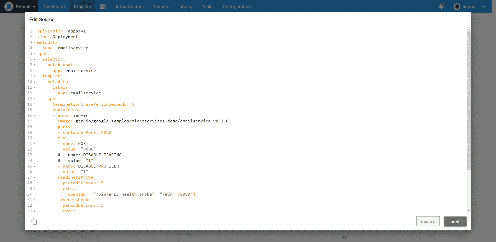](#)

*从微服务项目导入 YAML。*

导入所提供的 YAML 中与表单公开的字段匹配的任何属性。在下面的屏幕截图中，您可以看到`server`容器已经导入，包括环境设置、健康检查、资源限制和端口:

[](#)

*从导入的 YAML 得到的容器定义。*

并不是每个可能的部署属性都被**Deploy Kubernetes containers**步骤所识别，未被识别的属性在导入过程中会被忽略。`Deploy raw Kubernetes YAML`步骤提供了一种将通用 YAML 部署到 Kubernetes 集群的方法。然而，组成在线精品示例应用程序的微服务所使用的所有属性都是由**部署 Kubernetes 容器**步骤公开的。

接下来，我将服务 YAML 导入到步骤的**服务**部分:

[](#)

*服务区编辑 YAML 按钮。*

[](#)

*导入 YAML 定义的服务资源。*

服务将流量定向到与在`selector`属性下定义的标签相匹配的 pod。**Deploy Kubernetes containers**步骤忽略了导入的服务 YAML 中的`selector`属性，取而代之的是，假设部署中的 pod 都将由服务公开。以这种方式耦合部署和服务是由**部署 Kubernetes 容器**步骤实施的观点之一。

我们的微服务不会部署入口、秘密或配置映射资源，因此我们可以通过单击**配置功能**按钮从步骤中删除这些功能，并删除对未使用功能的检查:

[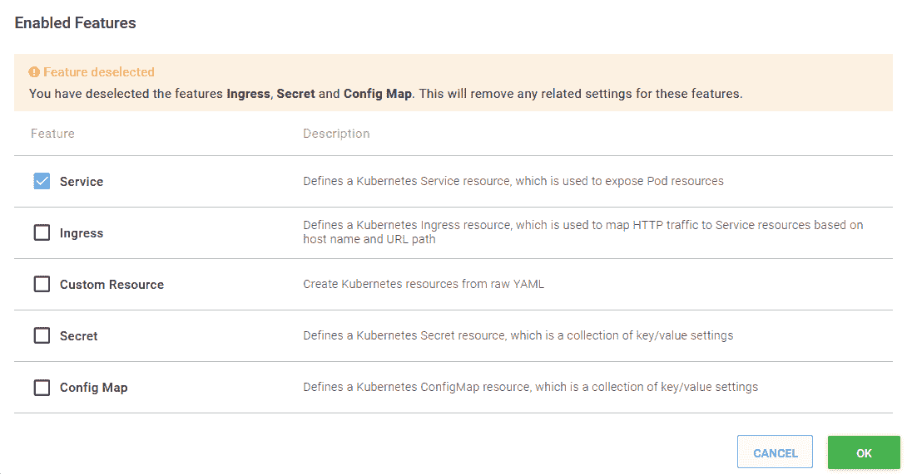](#)

*删除未使用的配置特征。*

最后一步是引用我们构建并上传到 Docker Hub 的容器。导入过程引用了部署 YAML 中定义的容器`microservices-demo/emailservice`。我们需要将其更改为`octopussamples/microservicedemo-emailservice`，以引用由[octopus samples](https://hub.docker.com/u/octopussamples)Docker Hub 用户上传的容器:

[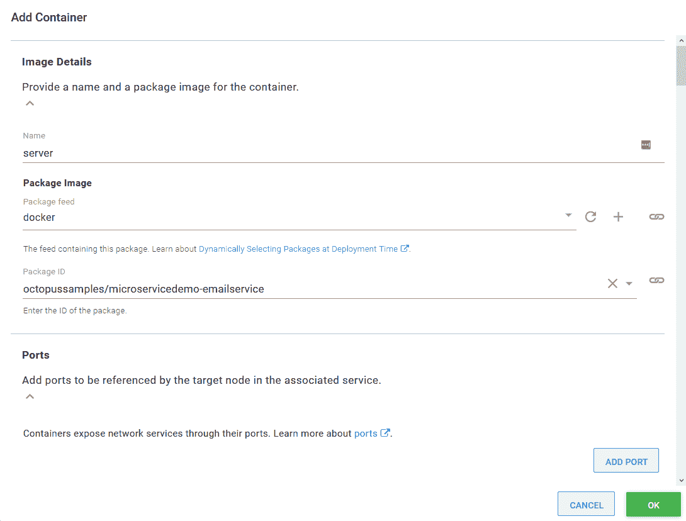【](#)

*更新 Docker 图像。*

据此，我们创建了一个部署`emailservice`的 Octopus 项目。`emailservice`是组成在线精品示例应用程序的 11 个微服务之一，其他微服务称为:

*   `checkoutservice`
*   `recommendationservice`
*   `frontend`
*   `paymentservice`
*   `productcatalogservice`
*   `cartservice`
*   `loadgenerator`
*   `currencyservice`
*   `shippingservice`
*   `redis-cart`
*   `adservice`

这些微服务中的大多数都部署了与我们在`emailservice`中看到的相同的部署和服务对。例外情况是`loadgenerator`，它没有服务，以及`frontend`，它包括一个额外的负载平衡器服务，将微服务暴露给公共流量。

额外的负载平衡器服务可以通过**部署 Kubernetes 服务资源**步骤进行部署。这个独立的步骤具有与**部署 Kubernetes 容器**步骤中相同的**编辑 YAML** 按钮，因此可以直接导入`frontend-external`服务 YAML:

[](#)

*导入独立服务 YAML 定义。*

与**部署 Kubernetes 容器**步骤不同，独立的**部署 Kubernetes 服务资源**步骤与部署无关，因此它导入并公开标签选择器来定义流量被发送到的 pod。

## 高可用性

由于 Kubernetes 负责集群中的配置单元，并内置了对单元和节点健康状况的跟踪支持，我们获得了开箱即用的合理程度的高可用性。此外，我们通常可以依靠云提供商来监控节点运行状况，重新创建故障节点，并跨可用性区域对节点进行物理配置，以降低停机的影响。

然而，我们导入的部署的默认设置需要一些调整，以使它们更有弹性。

首先，我们需要增加部署副本数量，这决定了一个部署将创建多少个单元。默认值为 1，表示任何一个 pod 出现故障都会导致微服务不可用。增加这个值意味着我们的应用程序可以承受单个 pod 的丢失。在下面的屏幕截图中，您可以看到我已经将广告服务的副本数量增加到了 2:

[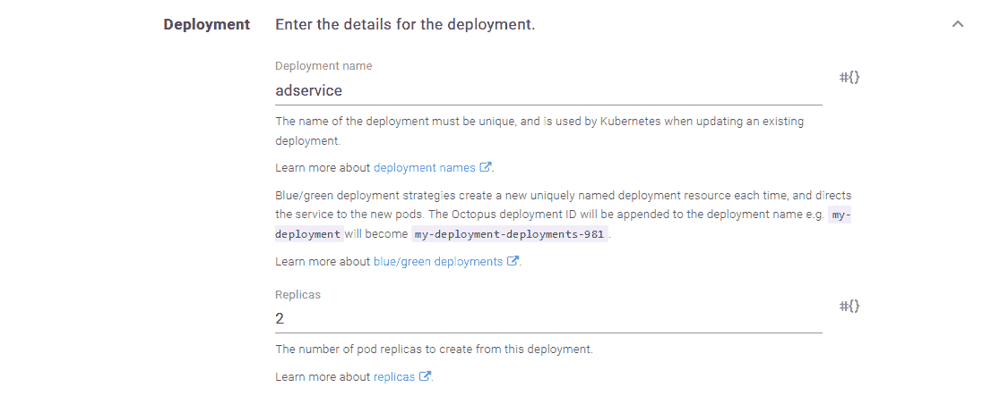](#)

*增加 pod 副本数量。*

拥有两个 pod 是一个好的开始，但是如果这两个 pod 都是在单个节点上创建的，我们仍然会有单点故障。为了解决这个问题，我们在 Kubernetes 中使用了一个名为 pod anti-affinity 的功能。这允许我们指示 Kubernetes 更喜欢将某些 pod 部署在单独的节点上。

在下面的截图中，您可以看到我创建了一个首选的反相似性规则，该规则指示 Kubernetes 尝试将带有标签`app`和值`adservice`(这是该部署分配给 pod 的一个标签)的 pod 放置在不同的节点上。

拓扑关键字是指定给节点的标签名称，用于定义节点所属的拓扑组。在更复杂的部署中，拓扑关键字将用于指示细节，如节点所在的物理区域或网络注意事项。然而，在这个例子中，我们选择了一个标签来唯一地标识每个节点，这个标签叫做`alpha.eksctl.io/instance-id`，有效地创建了只包含一个节点的拓扑。

最终结果是，Kubernetes 将尝试将属于同一部署的 pod 放在不同的节点上，这意味着我们的集群更有可能在失去单个节点的情况下不受影响:

[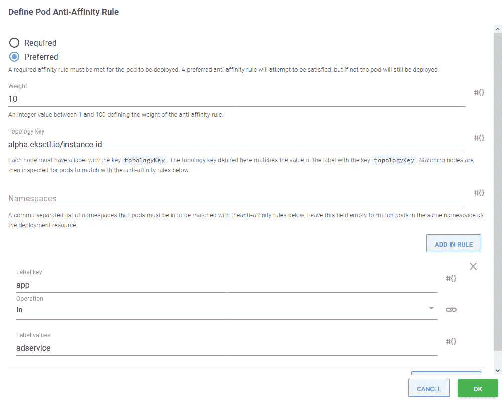](#)

*定义 pod 反亲和性。*

## 零停机部署

Kubernetes 中的部署资源为部署更新提供了两种内置策略。

首先是再造策略。该策略首先删除任何现有的 pod，然后再部署新的 pod。recreate 策略消除了两个 pod 版本共存的需要，这在诸如不兼容的数据库更改被合并到新版本中的情况下可能很重要。然而，当旧的吊舱被关闭时，它确实引入了停机时间，该停机时间持续到新的吊舱完全可操作为止。

第二种也是默认的策略是滚动更新策略。这种策略以增量方式用新的 pods 替换旧的 pods，并且可以以这样一种方式进行配置，以确保在更新期间总是有健康的 pods 可用于服务流量。滚动更新策略意味着新旧 pod 在短时间内并行运行，因此您必须特别注意确保客户端和数据存储能够支持两种 pod 版本。这种方法的好处是没有停机时间，因为一些 pod 仍然可以用来处理任何请求。

Octopus 引入了第三种部署策略，称为蓝/绿。蓝/绿策略是通过创建一个不同的新部署资源来实现的，也就是说，每个部署都有一个具有唯一名称的新部署资源。如果在**Deploy Kubernetes containers**步骤中定义了一个 configmap 或 secret，那么也会创建这些资源的不同的新实例。在新部署成功且所有运行状况检查都通过后，服务将更新，以将流量从旧部署切换到新部署。这允许在没有停机时间的情况下进行完全切换，并确保流量仅发送到旧的 pod 或新的 pod。

选择滚动或蓝/绿部署策略意味着我们可以零停机部署微服务:

【T2 

*启用滚动更新。*

真正的零停机部署需要一些额外的工作，才能在更新过程中不丢失任何请求。博客文章[用 Kubernetes](https://blog.sebastian-daschner.com/entries/zero-downtime-updates-kubernetes) 实现零停机滚动更新提供了一些在更新期间最小化网络中断的技巧。

## 功能分支部署

对于单一应用程序，功能分支部署通常是直接的；整个应用程序被构建、捆绑和部署为单个工件，并且可能由特定的数据库实例提供支持。

微服务呈现了一个非常不同的场景。当一个微服务的所有上游和下游依赖项都可以用来处理请求时，这个微服务才可能以一种有意义的方式运行。

博客文章[为什么我们在优步的微服务架构中利用多租户](https://eng.uber.com/multitenancy-microservice-architecture/)讨论了在微服务架构中执行集成测试的两种方法:

*   平行测试
*   生产中的测试

这篇博文详细介绍了这两种策略的实施，但总结起来:

*   并行测试包括在一个共享的临时环境中测试微服务，该环境的配置类似于生产环境，但与生产环境相隔离。
*   生产中的测试包括将测试中的微服务部署到生产中，使用安全策略将其隔离，将所有静态数据分类为测试或生产数据，并将不同的流量子集定向到测试微服务。

这篇博客文章继续提倡在生产中进行测试，列举了并行测试的这些局限性:

*   额外硬件成本
*   同步问题(或试运行和生产环境之间的偏差)
*   不可靠的测试
*   不准确的容量测试

很少有开发团队会像优步那样接受微服务，所以我怀疑对于大多数团队来说，部署微服务功能分支将涉及到介于优步描述的并行测试和生产测试之间的解决方案。具体来说，在这里我们将了解如何在暂存环境中将微服务功能分支与现有版本一起部署，并将一部分流量定向到该分支。

通过利用硬件和网络隔离，将功能分支部署到临时环境中消除了干扰生产服务的风险，从而消除了在生产环境中实施这种隔离的需要。它还消除了划分或识别测试和生产数据的需要，因为在试运行环境中创建的所有数据都是测试数据。

在开始之前，我们需要简要回顾一下什么是服务网格，以及我们如何利用 Istio 服务网格来独立于微服务引导流量。

### 什么是服务网格？

在服务网格出现之前，网络功能很像老式的电话交换机。应用程序类似于个人打电话；他们知道他们需要与谁通信，像 NGINX 这样的反向代理将作为总机操作员来连接双方。只要交易中的所有各方都是众所周知的，并且他们交流的方式是相对静态和非专业化的，这种基础设施就可以工作。

微服务类似于手机的兴起。有更多的设备需要连接在一起，以不可预测的方式在网络中漫游，每个设备通常都需要自己独特的配置。

服务网格旨在适应大量服务相互通信的日益复杂和动态的需求。在服务网格中，每个服务负责定义它将如何接受请求；它需要哪些常见的网络功能，如重试、断路、重定向和重写。这避免了所有流量都必须通过的中央*交换机*,并且在大多数情况下，单个应用程序不需要知道它们的网络请求是如何被处理的。

服务网格是提供大量功能的丰富平台，但为了部署微服务功能分支，我们最感兴趣的是检查和路由网络流量的能力。

### 我们在路由什么流量？

下面是架构图，显示了组成在线精品的各种微服务，以及它们如何通信:

[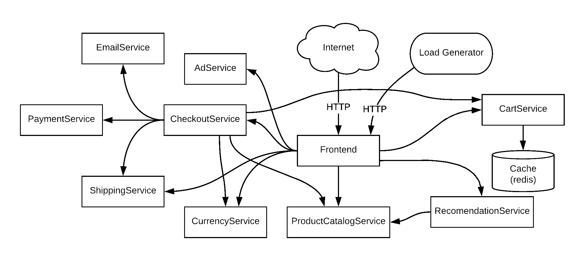](#)

*微服务应用架构。*

请注意，在此图中，来自互联网的公共流量通过前端进入应用程序。这个流量是普通的 HTTP。

微服务之间的通信然后通过 [gRPC](https://grpc.io/) 执行，它是:

> 一个高性能、开源的通用 RPC 框架

重要的是，gRPC 使用 HTTP2。因此，要将流量路由到微服务功能分支部署，我们需要检查和路由 HTTP 流量。

### 路由 HTTP 流量

Istio [HTTPMatchRequest](https://istio.io/docs/reference/config/networking/virtual-service/#HTTPMatchRequest) 定义了可用于匹配 HTTP 流量的请求的属性。这些属性相当全面，包括 URI、方案、方法、头、查询参数、端口等等。

为了将流量子集路由到功能分支部署，我们需要能够以不干扰请求中包含的数据的方式将附加信息作为 HTTP 请求的一部分进行传播。方案(即 HTTP 或 HTTPS)、方法(GET、PUT、POST 等)。)、端口、查询参数(问号后面的 URI 部分)和 URI 本身都包含特定于所做请求的信息，不能修改这些信息。这样就剩下头了，头是键值对，经常被修改以支持请求跟踪、代理和其他元数据。

查看浏览器在与在线精品前端交互时提交的网络流量，我们可以看到,`Cookie`报头可能包含一个有用的值，我们可以检查该值以做出路由决策。该应用程序保存了一个 cookie，它带有一个标识浏览器会话的 GUID，事实证明，这就是该示例应用程序用来标识用户的方法。显然，在现实世界的例子中，身份验证服务用于识别用户，但是对于我们的目的，随机生成的 GUID 就足够了。

[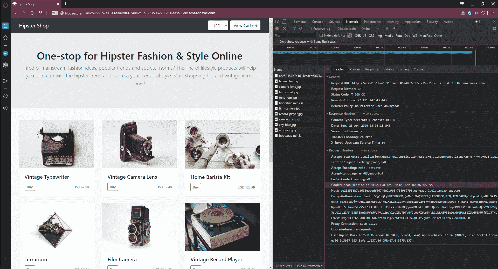](#)

*从浏览器捕获网络流量。*

有了 HTTP 头，我们可以检查和路由。下一步是部署特性分支。

### 创建特征分支 Docker 图像

在线精品已经用多种语言编写，前端组件用 Go 编写。我们将对[标题模板](https://github.com/GoogleCloudPlatform/microservices-demo/blob/master/src/frontend/templates/header.html)做一个小小的修改，以包含文本 **MyFeature** ，使其清楚地表示我们的特性分支。

我们将从这个分支构建一个 Docker 映像，并将其发布为`octopussamples/microservicedemo-frontend:0.1.4-myfeature`。注意，`0.1.4-myfeature`的标签是一个 SemVer 字符串，它允许这个图像被用作 Octopus 部署的一部分。

### 部署第一个功能分支

我们在部署前端应用程序的 Octopus 项目中定义了两个通道。

**默认**通道有一个版本规则，要求 SemVer 预发布标签为空，正则表达式为`^$`。这个规则确保这个频道只匹配版本(或者在我们的例子中是 Docker 标签)，比如`0.1.4`。

**特征分支**通道有一个版本规则，要求 SemVer 预发布标签*不*为空，正则表达式为`.+`。这个频道会匹配`0.1.4-myfeature`这样的版本。

然后，我们向部署添加一个名为`FeatureBranch`的变量，其值为`#{Octopus.Action.Package[server].PackageVersion | Replace "^([0-9\.]+)((?:-[A-Za-z0-9]+)?)(.*)$" "$2"}`。该变量获取名为`server`的 Docker 图像版本，在正则表达式中捕获预发布和前导破折号作为 group 2，然后只打印 group 2。如果没有预发布，变量将解析为空字符串。

[](#)

*用于提取 SemVer 预发布的变量。*

然后，将该变量附加到部署名称、部署标签和服务名称之后。更改部署和服务的名称可以确保特性分支部署在名为`frontend`的现有资源旁边创建名为`frontend-myfeature`的新资源:

[](#)

*摘要文本显示部署的名称和标签*

[](#)

*摘要文本显示服务的名称*

### 通过 Istio 暴露前端

到目前为止，我们还没有部署任何 Istio 资源。包含我们的应用程序的名称空间上的`istio-injection`标签意味着由我们的部署创建的 pod 包括 Istio sidecar，准备拦截和路由流量，但正是普通的旧 Kubernetes 服务将我们的 pod 相互公开。

为了开始使用 Istio 路由我们的内部流量，我们需要创建一个虚拟服务:

```
apiVersion: networking.istio.io/v1beta1
kind: VirtualService
metadata:
  name: frontend
spec:
  gateways:
  - istio-system/ingressgateway
  hosts:
  - '*'
  http:
  - match:
    - headers:
        Cookie:
          exact: shop_session-id=4f9e715d-fe56-4a1e-964b-b00b607e7695
    route:
    - destination:
        host: frontend-myfeature
  - route:
    - destination:
        host: frontend 
```

这项虚拟服务有几个重要部分:

*   `gateway`被设置为`istio-system/ingressgateway`，这是安装 Istio 时创建的网关。该网关依次接受来自负载平衡器服务的流量，该服务也是在`istio-system`名称空间中创建的，这意味着要访问我们的应用程序并通过该虚拟服务路由流量，我们需要通过 Istio 负载平衡器服务的公共主机名来访问应用程序。
*   `http`属性下的第一项指定其`Cookie`报头与指定值匹配的传入流量将被定向到`frontend-myfeature`服务。
*   任何其他流量都被发送到`frontend`服务。

有了这些规则，我们可以重新打开应用程序，我们的请求被重定向到 feature 分支，如标题所示:

[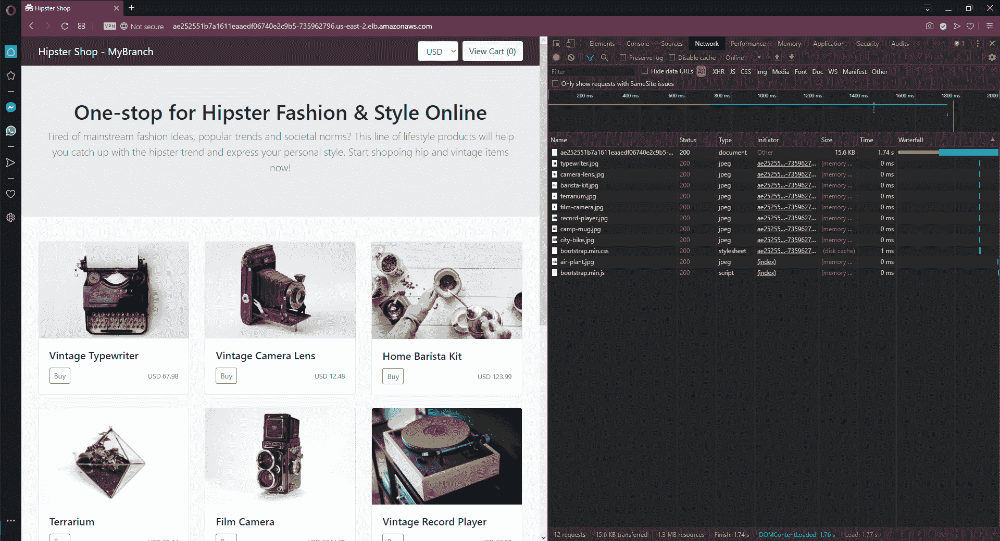](#)

*Istio 检查了 Cookie 头并将请求定向到特性分支。*

然而，这种重定向只是挑战的一半。我们已经成功检查了应用程序已经添加的 HTTP 头，并将 web 流量定向到面向公众的前端应用程序的功能分支。但是重定向内部 gRPC 调用呢？

### gRPC 路由

就像普通的 HTTP 请求一样，gRPC 请求也可以公开用于路由的 HTTP 头。任何与 gRPC 请求相关联的[元数据](https://grpc.io/docs/guides/concepts/#metadata)都被公开为 HTTP 头，然后可以被 Istio 检查。

前端应用程序向许多其他微服务发出 gRPC 请求，包括广告服务。为了启用 ad 服务的特性分支部署，我们需要将*用户 ID* (实际上只是会话 ID，但是我们将这两个值视为同一事物)与 gRPC 请求一起从前端传播到 ad 服务。

为此，我们向`getAd()`方法添加一个名为`userID`的属性，创建一个名为`metactx`的新上下文，通过`userid`元数据属性公开用户 ID，并使用上下文`metactx`发出 gRPC 请求:

```
func (fe *frontendServer) getAd(ctx context.Context, userID string, ctxKeys []string) ([]*pb.Ad, error) {
    ctx, cancel := context.WithTimeout(ctx, time.Millisecond*100)
    defer cancel()

    // This is where we add the metadata, which in turn is exposed as HTTP headers
    metactx := metadata.AppendToOutgoingContext(ctx, "userid", userID)

    resp, err := pb.NewAdServiceClient(fe.adSvcConn).GetAds(metactx, &pb.AdRequest{
        ContextKeys: ctxKeys,
    })
    return resp.GetAds(), errors.Wrap(err, "failed to get ads")
} 
```

[元数据包](https://godoc.org/google.golang.org/grpc/metadata)导入时带有:

```
metadata "google.golang.org/grpc/metadata" 
```

注意，调用`getAd()`函数的函数链也必须更新以传递新的参数，在顶层，通过调用`sessionID(r)`找到用户 ID，其中`r`是 HTTP 请求对象。

我们现在可以创建一个虚拟服务，根据`userid` HTTP 头将前端应用程序发出的请求路由到广告服务，这就是 gRPC 元数据键值对的公开方式:

```
apiVersion: networking.istio.io/v1beta1
kind: VirtualService
metadata:
  name: adservice
spec:
  hosts:
    - adservice
  http:
    - match:
        - headers:
            userid:
              exact: 4f9e715d-fe56-4a1e-964b-b00b607e7695
      route:
        - destination:
            host: adservice-myfeature
    - route:
        - destination:
            host: adservice 
```

手动编辑虚拟服务可能很繁琐，随着更多分支的部署或更多测试用户的配置，我们将需要一个更加自动化的解决方案来编辑虚拟服务。

下面是一个 PowerShell 脚本，它读取当前虚拟服务，为给定用户添加或替换重定向规则，并将更改保存回 Kubernetes。该代码可以保存为操作手册(因为流量切换是一个独立于部署的过程)，并且变量`SessionId`和`Service`可以在每次运行之前被提示:

```
# Get the current virtual service
$virtService = kubectl get virtualservice adservice -o json | ConvertFrom-JSON

# Clean up the generated metadata properties, as we do not want to send these back
$virtService.metadata = $virtService.metadata |
    Select-Object * -ExcludeProperty uid, selfLink, resourceVersion, generation, creationTimestamp, annotations

# Get the routes not associated with the new session id
$otherMatch = $virtService.spec.http |
    ? {$_.match.headers.userid.exact -ne "#{SessionId}"}

# Create a new route for the session
$thisMatch = @(
  @{
    match = @(
      @{
        headers = @{
          userid = @{
            exact = "#{SessionId}"
          }
        }
      }
    )
    route = @(
      @{
        destination = @{
          host = "#{Service}"
        }
      }
    )
  }
)

# Append the other routes
$thisMatch += $otherMatch
# Apply the new route collection
$virtService.spec.http = $thisMatch
# Save the virtual service to disk
$virtService | ConvertTo-JSON -Depth 100 | Set-Content -Path vs.json
# Print the contents of the file
Get-Content vs.json
# Send the new virtual service back to Kubernetes
kubectl apply -f vs.json 
```

一个更健壮的解决方案可能包括编写一个定制的 Kubernetes 操作符来保持虚拟服务资源与定义测试流量的外部数据源同步。这篇文章不会深入讨论操作符的细节，但是你可以从文章[中找到更多的信息，用 Kotlin](https://octopus.com/blog/operators-with-kotlin) 创建一个 Kubernetes 操作符。

### 部署内部功能分支

就像我们对前端应用程序所做的一样，广告服务的一个分支已经被创建并作为`octopussamples/microservicedemo-adservice:0.1.4-myfeature`被推送。Octopus 中的广告服务项目获得了设置为`#{Octopus.Action.Package[server].PackageVersion | Replace "^([0-9\.]+)((?:-[A-Za-z0-9]+)?)(.*)$" "$2"}`的新的`FeatureBranch`变量，部署和服务的名称也更改为`adservice#{FeatureBranch}`。

特性分支本身被更新为将字符串`MyFeature`附加到由服务提供的广告上，以允许我们看到特性分支部署何时被调用。部署虚拟服务后，我们再次打开 web 应用程序，发现我们收到的广告确实包含字符串`MyFeature`:

[](#)

Istio 根据 userid 报头将内部 gRPC 请求路由到广告服务功能分支。

### 摘要

为了在微服务环境中部署用于集成测试的功能分支，在不干扰其他流量的情况下测试特定请求是有用的。通过在 HTTP 头和 gRPC 元数据中公开路由信息(进而公开为 HTTP 头)，Istio 可以将特定流量路由到功能分支部署，而所有其他流量则通过常规主线微服务部署。

这可能足以在测试环境中部署微服务功能分支。如果您的特性分支发生故障，并在测试数据库中保存无效数据，这是不方便的，但不会导致生产中断。同样，将无效消息放在消息队列中可能会破坏测试环境，但是您的生产环境是隔离的。

优步的博客文章提供了一个诱人的视角，展示了如何将部署特性分支的想法扩展到生产环境中进行测试。但是，请注意，这篇文章明确指出，租用信息必须随所有请求一起传播，与所有静态数据一起保存，并且可选地将测试数据隔离在单独的数据库和消息队列中。此外，安全策略需要到位，以确保测试微服务不会失控，不会与它们不应该交互的服务进行交互。这篇博文不会涉及这些额外的需求，但是部署和与微服务特性分支交互的能力是一个很好的基础。

## HTTPS 和证书管理

为了允许通过 HTTPS 安全地访问我们的应用程序，我们将配置[秘密发现服务](https://istio.io/docs/tasks/traffic-management/ingress/secure-ingress-sds/)。

第一步是部署入口网关代理，这是通过使用`istioctl`工具生成 YAML 文档并应用它来实现的。正如我们在安装 Istio 本身时所做的那样，`istioctl`包引用被添加到作为 runbook 的一部分运行 kubectl CLI 脚本的**运行步骤中。部署代理的脚本如下所示:**

```
istioctl\istioctl manifest generate `
  --set values.gateways.istio-egressgateway.enabled=false `
  --set values.gateways.istio-ingressgateway.sds.enabled=true > `
  istio-ingressgateway.yaml
kubectl apply -f istio-ingressgateway.yaml 
```

[](#)

*使用 istioctl 启用代理。*

下一步是将 HTTPS 证书和私钥的内容保存为秘密。在这篇文章中，我使用了由 Let's Encrypt 通过我的 DNS 提供商 dnsimple 生成的证书，并下载了 PFX 证书包。该软件包在将证书部署到 IIS 的说明下提供，但是 PFX 文件本身是通用的。我们使用 PFX 文件，因为它是独立的，很容易上传到 Octopus。

[](#)

*让我们加密由 DNS 提供商生成的证书。*

PFX 文件作为新证书上传到库➜证书下:

[](#)

*把咱们的加密证书上传到八达通。*

要将证书导入 Kubernetes，我们需要创建一个秘密。我们从引用名为`Certificate`的变量中的证书开始:

[](#)

*作为变量引用的证书。*

然后，证书的内容被保存到两个文件中，一个保存证书，另一个保存私钥。证书变量在 Octopus 中很特殊，因为它们公开了许多由[生成的属性](https://octopus.com/docs/projects/variables/certificate-variables#expanded-properties)，包括`PrivateKeyPem`和`CertificatePem`。

这两个文件的内容依次保存到一个名为`octopus.tech`的秘密中:

```
Set-Content -path octopus.tech.key -Value "#{Certificate.PrivateKeyPem}"
Set-Content -path octopus.tech.crt -Value "#{Certificate.CertificatePem}"

kubectl delete -n istio-system secret octopus.tech
kubectl create -n istio-system secret generic octopus.tech `
  --from-file=key=octopus.tech.key `
  --from-file=cert=octopus.tech.crt
kubectl get -n istio-system secret octopus.tech -o yaml 
```

然后`ingressgateway`网关被更新以暴露端口 443 上的 HTTPS 流量。`credentialName`属性与我们上面创建的秘密的名称相匹配，并且`mode`被设置为`SIMPLE`以启用标准 HTTPS(与`MUTUAL`相反，它配置相互 TLS，这通常对公共网站没有用):

```
apiVersion: networking.istio.io/v1alpha3
kind: Gateway
metadata:
  name: ingressgateway
  namespace: istio-system
spec:
  selector:
    istio: ingressgateway
  servers:
  - port:
      number: 443
      name: https
      protocol: HTTPS
    tls:
      mode: SIMPLE
      credentialName: octopus.tech
    hosts:
    - "*"
  - port:
      number: 80
      name: http
      protocol: HTTP
    hosts:
    - "*" 
```

做出这一更改后，我们可以通过 HTTPS 和 HTTP:

[](#)

*通过 HTTPS 访问网站。*

## 烟雾测试

Kubernetes 提供了内置支持，用于在 pod 被标记为健康并投入使用之前检查其状态。就绪探测器确保在首次创建 pod 时，该 pod 处于健康状态并准备好接收流量，而活动探测器在其生命周期内不断验证 pod 的健康状态。

我们从示例应用程序中部署的微服务包括这些检查。下面显示的 YAML 是应用于内部 gRPC 微服务的就绪性和活性检查的一个片段(略有变化):

```
readinessProbe:
  periodSeconds: 5
  exec:
    command: ["/bin/grpc_health_probe", "-addr=:8080"]
livenessProbe:
  periodSeconds: 5
  exec:
    command: ["/bin/grpc_health_probe", "-addr=:8080"] 
```

`grpc_health_probe`是一个可执行文件，专门用于验证公开 gRPC 服务的应用程序的健康状况。这个项目可以在 [GitHub](https://github.com/grpc-ecosystem/grpc-health-probe) 上找到。

因为前端是通过 HTTP 公开的，所以它使用不同的检查来利用 Kubernetes 的能力来验证带有特殊格式的 HTTP 请求的 pod。有趣的是，这些检查使用会话 ID cookie 值来识别测试请求，就像我们将流量路由到功能分支一样:

```
readinessProbe:
  initialDelaySeconds: 10
  httpGet:
    path: "/_healthz"
    port: 8080
    httpHeaders:
      - name: "Cookie"
    value: "shop_session-id=x-readiness-probe"
livenessProbe:
  initialDelaySeconds: 10
  httpGet:
    path: "/_healthz"
    port: 8080
    httpHeaders:
      - name: "Cookie"
    value: "shop_session-id=x-liveness-probe" 
```

如果就绪性探测在部署过程中失败，部署将认为自己不健康。如果就绪检查失败，我们可以通过选择**等待部署成功**选项来使 Octopus 部署失败，这将在成功完成以下步骤之前等待 Kubernetes 部署成功:

【T2 

*等待部署成功可确保在成功完成该步骤之前通过所有准备情况检查。*

## 回滚策略

Kubernetes 支持对[部署资源](https://kubernetes.io/docs/concepts/workloads/controllers/deployment/#rolling-back-a-deployment)的本地回滚，命令如下:

```
kubectl rollout undo deployment.v1.apps/yourdeployment 
```

但是，这种回滚过程有一些限制:

*   它仅回滚部署，而不考虑部署所依赖的任何资源，如机密或配置映射。将特定于环境的配置存储在应用程序之外是十二因素应用程序所鼓励的实践之一，这意味着代码和配置通常会并排部署。
*   它不适用于蓝/绿部署，因为此过程创建了全新的部署资源，没有可回滚的配置历史。
*   八达通仪表板不会准确反映系统的状态。

Octopus 中的部署流程旨在捕获在给定版本中部署应用程序所需的所有步骤。通过重新部署旧的版本，我们可以确保代表可部署版本的所有资源和配置都被考虑在内。

请注意，必须特别注意持久存储数据的微服务，因为回滚到以前的版本并不能确保任何持久存储的数据都与以前的代码兼容。如果您使用滚动部署，情况也是如此，因为这种策略实现了增量升级，导致应用程序的旧版本和新版本在短时间内并行运行。

## 多重环境

[CNCF 2019 年调查](https://www.cncf.io/wp-content/uploads/2020/03/CNCF_Survey_Report.pdf)强调了在 Kubernetes 中分离团队的两种主要方法:分离名称空间和分离集群:

【T2 

*图表显示了 2019 年 CNCF 调查的团队分离策略。*

Kubernetes 提供了对资源限制(CPU、内存和临时磁盘空间)、通过网络策略的防火墙隔离和 RBAC 授权的现成支持，可以根据名称空间限制对 Kubernetes 资源的访问。

Istio 可以用来实现网络速率限制，尽管它不像那么容易。

然而，名称空间并不是完全相互隔离的。例如，自定义资源定义[不能限定在名称空间](https://github.com/kubernetes/kubernetes/issues/65551)的范围内。

这意味着 Kubernetes 支持软多租户，其中名称空间大部分(但不是完全)相互隔离。硬多租户，其中名称空间可以用来隔离不受信任的邻居，是一个积极讨论的主题[但目前还不可用。](https://blog.jessfraz.com/post/hard-multi-tenancy-in-kubernetes/)

这可能意味着您将拥有多个共享一个 Kubernetes 集群的测试环境，以及一个单独的生产集群。

好消息是，无论您的环境是通过名称空间还是集群实现的，都被 Octopus Kubernetes 目标抽象掉了。

正如我们在本文开头看到的，Octopus 中的 Kubernetes 目标捕获了默认名称空间、用户帐户和集群 API URL。这三个字段的组合代表了执行部署的安全边界。

Kubernetes 目标的范围是环境，部署过程的范围是目标角色，将部署过程从底层集群或名称空间中分离出来。在下面的截图中，您可以看到第二个 Kubernetes 目标，其作用域为`Test`环境，默认为`test`名称空间:

[](#)

*默认为测试名称空间的目标，范围为测试环境。*

为了更好地分隔目标，我们可以为每个目标创建服务帐户，其范围为名称空间。下面的 YAML 显示了一个服务帐户、角色和角色绑定的示例，该示例仅授予对`dev`名称空间的访问权限:

```
apiVersion: v1
kind: ServiceAccount
metadata:
  name: dev-deployer
  namespace: dev
---
kind: Role
apiVersion: rbac.authorization.k8s.io/v1
metadata:
  namespace: dev
  name: dev-deployer-role
rules:
  - apiGroups: ["*"]
    resources: ["*"]
    verbs: ["*"]
---
kind: RoleBinding
apiVersion: rbac.authorization.k8s.io/v1
metadata:
  name: dev-deployer-binding
  namespace: dev
subjects:
  - kind: ServiceAccount
    name: dev-deployer
    apiGroup: ""
roleRef:
  kind: Role
  name: dev-deployer-role
  apiGroup: "" 
```

创建服务帐户会导致创建密码。这个秘密包含一个 base64 编码的令牌，我们可以使用以下命令来访问它:

```
kubectl get secret $(kubectl get serviceaccount dev-deployer -o jsonpath="{.secrets[0].name}" --namespace=dev) -o jsonpath="{.data.token}" --namespace=dev 
```

该值随后被解码并保存为 Octopus 中的令牌帐户:

【T2 

*八达通中保存的服务账户令牌。*

Kubernetes 目标可以使用令牌帐户:

[](#)

*Kubernetes 目标使用的令牌。*

这个目标现在可以用来将资源部署到`dev`名称空间，并且禁止修改其他名称空间中的资源，从而有效地通过名称空间对 Kubernetes 集群进行分区。

## 结论

如果你已经做到了这一步，祝贺你！配置具有高可用性、多环境、零停机部署、HTTPS 访问、功能分支部署、冒烟测试和回滚的微服务部署并非易事，但有了本指南，您将拥有在 Kubernetes 中构建世界一流部署的坚实基础。