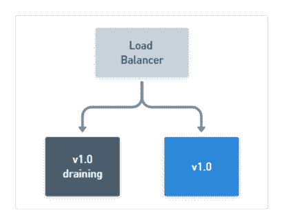
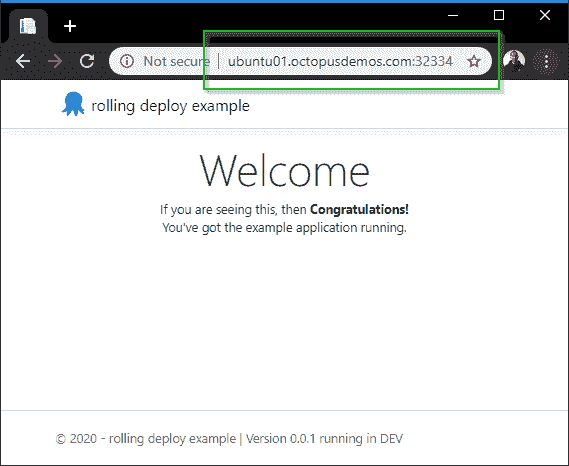

# 滚动部署的终极指南- Octopus Deploy

> 原文：<https://octopus.com/blog/ultimate-guide-to-rolling-deployments>

[](#)

当部署现代软件的新版本时，比如 web 应用程序和服务，一些团队在进行部署时关闭整个网站的情况仍然很常见。

如果您的大多数客户只在工作时间使用您的应用程序，那么这种大爆炸式的方法可能是可以接受的，但是如果您的客户全天候使用您的应用程序会怎么样呢？

如今，用户希望应用程序始终可用，有一些部署模式可以用来实现零停机。在这篇文章中，我将更深入地讨论其中一种模式；滚动部署。我还将为您提供一些如何使用不同工具实现滚动部署的实际例子。

## 在这篇文章中

## 什么是滚动部署？

滚动部署是一种部署模式(也称为增量部署、批量部署或斜坡部署)，在这种模式下，通常一次向一个或多个部署目标交付新软件，直到所有目标都部署了软件的更新版本。

典型的流程如下所示:

1.  在应用程序的两个节点运行`v1.0`的情况下，清空要更新的第一个节点，将其从负载平衡器池中取出，并让剩余的节点保持在线以服务流量:

[](#)

2.  停止在耗尽的节点上运行`v1.0`应用程序，然后部署新的`v1.1`版本。*可选地*，通过在新部署的应用程序上运行测试来验证部署是否成功。同时，维护至少一个运行应用程序`v1.0`的节点:

[](#)

3.  在第一个节点成功更新后，继续清空仍在运行应用程序`v1.0`的剩余节点，同时您的新`v1.1`版本现在在线提供流量:

[](#)

4.  停止剩余节点上的`v1.0`应用程序的运行，部署新的`v1.1`版本。同样，也可以验证部署是否成功:

[](#)

5.  最后，在应用程序的`v1.1`成功部署到所有节点之后，您的滚动部署就完成了！

[](#)

如果您想要加速您的滚动部署，并同时向多个节点交付一个新版本，比如说两个节点，那么它看起来应该是这样的:

[](#)

这种增量方法通常在位于负载平衡器之后的 web 应用程序中更受青睐，因为大多数负载平衡器支持一种称为**连接排出**的概念。这允许到服务的连接自然完成，并防止建立新的连接。

通过执行该动作，被选择更新的实例可以在它们完成它们的工作之后从可用池中移除，而其他实例保持在线服务流量。

尽管上面的场景描述了 web 应用程序滚动部署，但是也可以实现其他类型应用程序的滚动部署，只要它们是以支持安全地结束其过程的方式构建的。

例如，Octopus Deploy 的[高可用性](https://octopus.com/docs/administration/high-availability)配置也有一个[消耗选项](https://octopus.com/docs/administration/high-availability/managing-high-availability-nodes#ManagingHighAvailabilityNodes-Drain)，它可以阻止任何新任务的执行，并完成它当前正在执行的任何任务，直到空闲。排水等功能允许安全终止进程，然后可以更新并重新联机。

## 它们为什么有用？

那么，为什么要使用滚动部署而不是其他模式，比如 canary 或 blue/green？滚动部署具有以下优势:

### 增量更新

应用程序的新版本是逐步推出的。这使您可以验证它的工作，例如，在进行下一批更新之前运行健康检查或测试。

如果您需要启动回滚，您也可以用一种安全且可控的方式来完成。

### 保持灯亮着

当您着手更新少量的应用程序实例时，其余的继续为请求服务。这意味着您的应用程序不会停机，并且在整个部署过程中您的用户都可以使用它。

### 平行

您通常可以控制一次部署到的并发实例的数量。在之前的部署完成之前，不会开始进一步的部署。

您可以在 Octopus 滚动部署中使用**窗口大小**选项来控制一次可以部署多少个部署目标。

## 实践中的滚动部署模式

为了演示滚动部署的不同方法，我们有一个非常简单的。将显示网页的 NET Core 3.1 应用程序。

我感兴趣的部分的 HTML 如下所示:

```
<div class="text-center">
    <h1 class="display-4">Welcome</h1>
    <p>If you are seeing this, then <strong>Congratulations!</strong> <br/> You've got the example application running. </p>

    @if(Settings.Value.AppVersion == "0.0.2") {
        <p>v0.0.2 of the application comes with this text </p>
    }
    @if(Settings.Value.AppVersion == "0.0.3") {
        <p>But don't miss out on v0.0.3 of the application which comes with this text! </p>
    }
</div> 
```

该应用程序的代码可在 [GitHub](https://github.com/OctopusSamples/rolling-deploy-web-example) 上获得，并有一个与三个不同的`AppVersion`值相对应的[标签](https://github.com/OctopusSamples/rolling-deploy-web-example/releases)。一张 Docker 图片也已经发布为[octopus deploy/rolling-deploy-web-example](https://hub.docker.com/r/octopusdeploy/rolling-deploy-web-example)。

我想看看使用一些流行的技术和工具来执行此应用程序的滚动部署有多简单，因此我将使用以下工具来演示滚动部署:

### Docker 滚动应用程序更新

在过去几年中，Docker 已经成为事实上的容器技术。因此，它以 Docker [服务](https://docs.docker.com/engine/swarm/how-swarm-mode-works/services)的概念支持滚动部署也就不足为奇了。通常，服务是更大的架构图中的一小部分，在微服务中很受欢迎。

服务支持许多不同的选项，包括滚动更新策略和回滚能力。

#### 码头集装箱应用

我在一个 [Ubuntu](https://ubuntu.com/download/server) 服务器上运行 Docker，并使用我们预先构建的容器映像。在 Ubuntu 上安装 Docker 有几种方法:

1.  通过运行`sudo apt-get install docker.io`来使用 Ubuntu 存储库。
2.  使用官方的[对接指南](https://docs.docker.com/install/linux/docker-ce/ubuntu/#install-docker-engine---community)。

我选择了 Ubuntu 库，因为它似乎更快更容易，但你的里程可能会有所不同。无论您选择哪种方法，都有必要确保您满足安装的先决条件。

为了简单起见，我将在我的 Linux 机器的 SSH 终端会话中与 Docker 交互。有一些生产就绪的设置可以实现这一点，这些设置的特点是在一个 [Docker Compose](https://docs.docker.com/compose/compose-file/) 文件中定义您的服务，包括控制自动更新和回滚设置的部分。

**权限要求:**
本演示中的大多数命令都使用了 [sudo](https://www.linux.com/tutorials/linux-101-introduction-sudo/) 。默认情况下，Docker 守护程序作为根用户运行，需要提升权限才能执行命令。如果你不想在执行命令时使用`sudo`，请确保遵循 Docker [安装后](https://docs.docker.com/install/linux/linux-postinstall/)说明。

首先，为了查看这个独立运行的 Docker 映像，我们将使用以下命令运行它:

```
markh@ubuntu01:~$ sudo docker run -d -p 5001:5001 octopusdeploy/rolling-deploy-web-example:0.0.1 
```

不出所料，运行这个 Docker 图像会显示网页:

[](#)

在这篇文章中，我不解释如何建立一个容器图像。如果您是 Docker 的新手，我的同事 Shawn 已经写了一个很好的系列文章，介绍如何将一个真实世界的应用程序容器化，而不是另一个“Hello World”的例子。

**集装箱清理**

接下来需要快速整理。要删除我们使用上面的`run`命令创建的容器，我们需要停止它，然后使用`rm`命令删除它。我们可以用简洁的一行程序来实现这一点:

```
sudo docker rm $(sudo docker stop $(sudo docker ps -a -q --filter ancestor=octopusdeploy/rolling-deploy-web-example:0.0.1 --format="{{.ID}}")) 
```

这通过图像名`octopusdeploy/rolling-deploy-web-example:0.0.1`定位我们的容器，并将它传递给`stop`命令，最后将它传递给`rm`命令。

为了部署容器的多个实例，我们需要创建 Docker 服务。这使用[码头工人群](https://docs.docker.com/engine/swarm)作为其幕后指挥者。

**Docker Kubernetes orchestrator**
Docker 在使用 Docker [stack](https://docs.docker.com/engine/reference/commandline/stack) 命令部署容器时也支持 Kubernetes 作为 orchestrator，但是在使用`service create`时无法指定 orchestrator。

让我们看看创建服务的命令是什么样子的:

```
markh@ubuntu01:~$ sudo docker service create --name rolling-deploy-svc --replicas 3 --publish published=5001,target=5001 --update-delay 10s --update-parallelism 1 octopusdeploy/rolling-deploy-web-example:0.0.1 
```

这个命令中有很多内容，所以让我们来分析一下我们对 Docker 的要求:

*   `--name`不言自明。
*   `--replicas`标志控制我们想要的容器数量(3)。
*   `--publish published=5001,target=5001`使用 Swarm 的[路由网格](https://docs.docker.com/engine/swarm/ingress/#publish-a-port-for-a-service)指定要在端口 5001 上访问的服务，该路由网格本质上就像一个软件负载平衡器。
*   `--update-delay`配置服务任务更新之间的时间延迟(10 秒)。
*   `--update-parallelism`控制 Docker 将同时调度的最大任务数(1)。
*   最后，我们指定要使用的图像:`octopusdeploy/rolling-deploy-web-example:0.0.1`。

**提示:**
第一次运行`service create`时，可能会收到警告，就像我一样:`This node is not a swarm manager`。要解决此问题，请运行以下命令之一:

*   这将把你当前的节点初始化为群组管理器。
*   `sudo docker swarm join`:这将把你的本地节点连接到 swarm。

执行此操作将导致我们的服务被部署到 Docker Swarm，其中包含三个实例:

```
wxi1w4m7crknaz1f800kr9ztt
overall progress: 3 out of 3 tasks
1/3: running   [==================================================>]
2/3: running   [==================================================>]
3/3: running   [==================================================>]
verify: Service converged 
```

我们还可以通过运行`service inspect`命令来检查我们的服务是否有正确的更新配置:

```
markh@ubuntu01:~$ sudo docker service inspect rolling-deploy-svc --pretty

ID:             bh03s0yjzkevzkkwvu8q2h0jj
Name:           rolling-deploy-svc
Service Mode:   Replicated
 Replicas:      3
Placement:
UpdateConfig:
 Parallelism:   1
 Delay:         10s
 On failure:    pause
 Monitoring Period: 5s
 Max failure ratio: 0
 Update order:      stop-first
RollbackConfig:
 Parallelism:   1
 On failure:    pause
 Monitoring Period: 5s
 Max failure ratio: 0
 Rollback order:    stop-first
ContainerSpec:
 Image:         octopusdeploy/rolling-deploy-web-example:0.0.1@sha256:4da10d630025bf268b855b0b4afafa7334769ab6d0b3e75e11a3f11949708552
 Init:          false
Resources:
Endpoint Mode:  vip
Ports:
 PublishedPort = 5001
  Protocol = tcp
  TargetPort = 5001
  PublishMode = ingress 
```

这个结果表明我们有了我们想要的`UpdateConfig`，它将一次更新一个任务。

#### Docker 服务更新

现在我们可以通过运行`service update`命令将`octopusdeploy/rolling-deploy-web-example`的容器图像更新为`v0.0.2`:

```
markh@ubuntu01:~$ sudo docker service update rolling-deploy-svc --image octopusdeploy/rolling-deploy-web-example:0.0.2 
```

Docker 对每个容器运行更新，一次一个任务，就像我们配置的那样:

```
overall progress: 0 out of 3 tasks
1/3: running   [=============================================>     ]
2/3:
3/3: 
```

第一个任务完成后，它进入第二个任务:

```
overall progress: 1 out of 3 tasks
1/3: starting  [==================================================>]
2/3: ready     [=====================================>             ]
3/3: 
```

直到更新容器到`v0.0.2`的所有任务完成:

```
overall progress: 3 out of 3 tasks
1/3: running   [==================================================>]
2/3: running   [==================================================>]
3/3: running   [==================================================>]
verify: Service converged 
```

现在浏览网站显示申请`v0.0.2`的文本:

[](#)

#### Docker 服务回滚

正如直接推出一样，也可以在 Docker 中用一个简单的命令手动回滚。

首先，我们将通过运行以下命令来更新应用程序的最终版本`v0.0.3`:

```
markh@ubuntu01:~$ sudo docker service update rolling-deploy-svc --image octopusdeploy/rolling-deploy-web-example:0.0.3 
```

我们通过运行`service inspect`命令来验证新的`v0.0.3`版本，只为我们希望看到的输出传入一个`--format`参数:

```
markh@ubuntu01:~$ sudo docker service inspect --format='{.Spec.TaskTemplate.ContainerSpec.Image}}' rolling-deploy-svc

octopusdeploy/rolling-deploy-web-example:0.0.3@sha256:151a8f2aaed0192bf9f22eaeff487d546e6ff8fec4d0691e6697dede743b187c 
```

因为 Docker Swarm 知道我们部署的版本，所以我们可以使用`rollback`命令恢复到之前的版本(`v0.0.2`):

```
markh@ubuntu01:~$ sudo docker service rollback rolling-deploy-svc

rolling-deploy-svc
rollback: manually requested rollback
overall progress: rolling back update: 3 out of 3 tasks
1/3: running   [>                                                  ]
2/3: running   [>                                                  ]
3/3: running   [>                                                  ]
verify: Service converged 
```

一旦成功回滚，它就确认服务正在运行。

**提示:**
由于我没有给`rollback`命令指定任何参数，Docker 将默认一次回滚一个任务，每个任务之间没有延迟。您可以通过将以下内容传递给命令来指定不同的值:

*   `--rollback-parallelism`
*   `--rollback-delay`

Docker [文档](https://docs.docker.com/engine/reference/commandline/create/#options)中有您可以使用的参数的完整列表。

我们可以使用与之前相同的命令来检查服务，以验证回滚是否成功:

```
markh@ubuntu01:~$ sudo docker service inspect --format='{.Spec.TaskTemplate.ContainerSpec.Image}}' rolling-deploy-svc

octopusdeploy/rolling-deploy-web-example:0.0.2@sha256:4843a91ba84ace97cb11a6e3f68827a8c28a628d509159910c868f9ad02c3053 
```

这导致输出中出现预期的`v0.0.2`版本。

**数据库回滚**
当 Docker 中的服务利用数据库进行存储时，有一个适当的策略来处理服务回滚是很重要的，特别是当数据库在一个容器中时。Docker 不会自动回滚数据库更改，这可能会使您的数据库和应用程序处于不兼容状态。Docker [存储](https://docs.docker.com/storage/)文档提供了一些关于在容器中存储不同选项的指导。

#### 码头服务清理

最后，要删除 Docker 服务，我们只需运行`rm`命令:

```
markh@ubuntu01:~$ sudo docker service rm rolling-deploy-svc 
```

#### Docker 摘要

如您所见，在 Docker 中进行滚动部署并不需要太多的设置。加上它对回滚的支持，使它成为一个值得考虑的有吸引力的选择。

### Kubernetes 滚动更新

Kubernetes 中的滚动部署被称为[滚动更新](https://kubernetes.io/docs/reference/generated/kubectl/kubectl-commands#rolling-update)。

pod 的实例将使用新实例进行增量更新。它支持在更新期间不可用的 pod 的最大数量或百分比，以及可以创建的新 pod 的最大数量。除此之外，Kubernetes 还有一个方便的内置特性，允许更新恢复到以前的版本。

为了找到更多关于 Kubernetes 的信息，我的同事 Shawn 继续他的容器系列，主要关注 Kubernetes。

Kubernetes [关于更新的教程](https://kubernetes.io/docs/tutorials/kubernetes-basics/update/update-intro/)包括一个展示其工作原理的漂亮图表:

[](#)

#### Kubernetes 集群设置

和以前一样，我将在这个演示中重用我们预先构建的容器映像，这次使用的是 [MicroK8s](https://microk8s.io/) 。我还将主要在 SSH 终端会话中与它进行交互。

作者 Canonical 将 MicroK8s 描述为:

> 适用于 42 种 Linux 的 k8s 软件包。专为开发人员打造，非常适合 edge、IoT 和设备。

对于像我这样想尝试 Kubernetes 或者用它做一些开发的人来说，这很有用。

MicroK8s 的一个好处是它不像其他 Kubernetes 选择的那样需要任何类型的虚拟机(比如 [Minikube](https://minikube.sigs.k8s.io/) )。

在安装 MicroK8s 之前，值得注意的是有一些先决条件:

*   Ubuntu 18.04 LTS 或 16.04 LTS(或其他支持`snapd`的 OS)。
*   至少 20G 可用磁盘空间。
*   4GB 内存。
*   互联网连接。

为了安装 MicroK8s，我们运行[snap](https://docs.snapcraft.io/installing-snapd)命令:

```
markh@ubuntu01:~$ sudo snap install microk8s --classic

microk8s v1.17.0 from Canonical✓ installed 
```

**完整安装输出**
如果您想查看来自`snap`的完整安装输出，运行`snap changes`命令:

```
markh@ubuntu01:~$ snap changes

ID   Status  Spawn               Ready               Summary
1    Done    today at 10:17 UTC  today at 10:17 UTC  Initialize system state
2    Done    today at 10:17 UTC  today at 10:17 UTC  Initialize device
3    Done    today at 14:38 UTC  today at 14:38 UTC  Install "microk8s" snap 
```

由此，您可以运行命令`snap change 3`，其中`3`是上面`ID`列中用于安装 MicroK8s 的值。这将为您提供安装步骤的明细行。

**Kubernetes 部署**

现在我们已经安装并运行了 MicroK8s，让我们继续使用我们现有的映像`rolling-deploy-web-example`创建一个 Kubernetes 部署，并将其设置为在端口 5001 上侦听。

Google 将 Kubernetes [部署](https://cloud.google.com/kubernetes-engine/docs/concepts/deployment)描述为:

> 表示一组没有唯一标识的多个相同的 pod。部署运行应用程序的多个副本，并自动替换任何失败或无响应的实例。通过这种方式，部署有助于确保应用程序的一个或多个实例可用于服务用户请求。部署由 Kubernetes 部署控制器管理。

这听起来非常适合滚动部署。

#### Kubernetes 容器化应用程序设置

为了设置我们的应用程序的部署，我们将使用与 MicroK8s 打包在一起的 [kubectl](https://kubernetes.io/docs/reference/kubectl/kubectl/) 二进制文件。这是用于管理 Kubernetes 的命令行界面(CLI)。它特别添加了前缀`microk8s.`，以避免与您可能运行的任何其他 Kubernetes 实例发生命名冲突。如果我们运行`create deployment`命令:

```
markh@ubuntu01:~$ sudo microk8s.kubectl create deployment rollingdeploy-microk8s --image=octopusdeploy/rolling-deploy-web-example:0.0.1

deployment.apps/rollingdeploy-microk8s created 
```

MicroK8s 将创建我们的部署，并确认它已经成功创建。

接下来，我们将设置应用程序窗格监听端口`5001`。为此，我们运行 [expose](https://kubernetes.io/docs/reference/generated/kubectl/kubectl-commands#expose) 命令:

```
markh@ubuntu01:~$ sudo microk8s.kubectl expose deployment rollingdeploy-microk8s --type=NodePort --port=5001

service/rollingdeploy-microk8s exposed 
```

##### Kubernetes 仪表板

虽然已经创建了`rollingdeploy-microk8s` pod，但它可能不会立即可用。我们可以通过使用 Kubernetes [仪表板](https://kubernetes.io/docs/tasks/access-application-cluster/web-ui-dashboard/)查看我们的服务来检查它的状态，该仪表板作为[插件](https://microk8s.io/docs/addon-dashboard)包含在 MicroK8s 中。

试图远程访问仪表板需要您经历一些困难。启用附加组件后，我发现最简单的方法是通过运行`kubectl proxy`命令创建一个从我的机器到服务器的代理:

```
markh@ubuntu01:~$ sudo microk8s.kubectl proxy --accept-hosts=.* --address=0.0.0.0

Starting to serve on [::]:8001 
```

从那里你可以访问端口`8001`上的仪表板，但是你需要一个`Kubeconfig`文件或者`Token`来登录。更多详情请参见 MicroK8s [仪表板附件](https://microk8s.io/docs/addon-dashboard)。

注意:您可以通过为仪表板容器设置`--enable-skip-login`参数来跳过登录，但是不建议这样做，因为这违反了安全性最佳实践。

一旦打开，您就可以使用仪表板部署容器化的应用程序，管理集群资源并与之交互。

为了执行滚动更新，首先我们需要应用程序的多个副本。我们可以通过单击**部署**部分右侧的三个省略号，直接从仪表板扩展我们的部署:

[](#)

对于我们的 Kubernetes 部署，我将**所需副本**更新为 3，这样我就可以执行滚动更新，然后点击**缩放**:

[](#)

**等价的 kubectl 命令**
您可能已经注意到仪表板为我们的操作提供了运行的等价命令。来扩展我们的资源，那就是:

```
sudo microk8s.kubectl scale -n default deployment rollingdeploy-microk8s --replicas=3 
```

配置完 pod 后，我们可以通过运行`get pod`命令(名称可能不同)直接查询 pod 的状态来确认这一点:

```
markh@ubuntu01:~$ sudo microk8s.kubectl get pod

NAME                                      READY   STATUS    RESTARTS   AGE
rollingdeploy-microk8s-794bdc64c4-fv7zt   1/1     Running   0          76s
rollingdeploy-microk8s-794bdc64c4-t6mh5   1/1     Running   0          76s
rollingdeploy-microk8s-794bdc64c4-trr6f   1/1     Running   0          76s 
```

为了验证我们的应用程序正在工作，我们需要通过运行`get service`找到 Kubernetes 向我们在开始时创建的部署公开的端口:

```
markh@ubuntu01:~$ sudo microk8s.kubectl get service rollingdeploy-microk8s

NAME                     TYPE       CLUSTER-IP      EXTERNAL-IP   PORT(S)          AGE
rollingdeploy-microk8s   NodePort   10.152.183.39   <none>        5001:32334/TCP   1m 
```

在我的例子中，端口是`32334`,所以我访问服务的 URL 是:

```
http://ubuntu01.octopusdemos.com:32334 
```

**注意:**
在您自己的机器上运行时，端口可能会有所不同。Kubernetes 将在 30000-32767(默认)范围内随机分配一个端口，因为我们在前面运行`expose`命令时选择了`NodePort`类型。

在浏览器中打开 URL，我们可以看到在 Microk8s 中运行的应用程序有`v0.0.1`:

[](#)

#### Kubernetes 滚动更新

让我们继续，通过运行`set image`命令，指示 Kubernetes 用我们的图像`octopusdeploy/rolling-deploy-web-example`的`v0.0.2`更新我们的三个 pod:

```
markh@ubuntu01:~$ sudo microk8s.kubectl set image deployment/rollingdeploy-microk8s rolling-deploy-web-example=octopusdeploy/rolling-deploy-web-example:0.0.2 --record

deployment.apps/rollingdeploy-microk8s image updated 
```

接下来，我们可以通过运行`rollout status`命令来观察我们的首次展示的实时进度，直到它完成:

```
markh@ubuntu01:~$ sudo microk8s.kubectl rollout status deployment.v1.apps/rollingdeploy-microk8s

Waiting for deployment "rollingdeploy-microk8s" rollout to finish: 1 out of 3 new replicas have been updated...
Waiting for deployment "rollingdeploy-microk8s" rollout to finish: 1 out of 3 new replicas have been updated...
Waiting for deployment "rollingdeploy-microk8s" rollout to finish: 1 out of 3 new replicas have been updated...
Waiting for deployment "rollingdeploy-microk8s" rollout to finish: 2 out of 3 new replicas have been updated...
Waiting for deployment "rollingdeploy-microk8s" rollout to finish: 2 out of 3 new replicas have been updated...
Waiting for deployment "rollingdeploy-microk8s" rollout to finish: 2 out of 3 new replicas have been updated...
Waiting for deployment "rollingdeploy-microk8s" rollout to finish: 1 old replicas are pending termination...
Waiting for deployment "rollingdeploy-microk8s" rollout to finish: 1 old replicas are pending termination...
deployment "rollingdeploy-microk8s" successfully rolled out 
```

您可以看到它表示一次更新一个 Pod。

Kubernetes 部署确保只有一定数量的 pod 在更新时关闭。它通过创建一个新的 pod 并在完成后销毁旧的 pod 来实现这一点。

**默认 pod 更新控制**

默认情况下，Kubernetes 确保至少有 75%的期望数量的 pod 可用。此外，另一个默认情况是创建不超过 25%的总体期望数量的 pod。

在浏览器中打开 URL，我们可以看到我们的应用程序的`v0.0.2`在 Microk8s 中运行:

[](#)

这里触发了部署的首次展示，因为`set image`导致了对底层部署 pod 的[模板](https://kubernetes.io/docs/concepts/workloads/pods/pod-overview/#pod-templates)的更新。模板是描述[复制控制器](https://kubernetes.io/docs/concepts/workloads/controllers/replicationcontroller/)创建实际 pod 的方式的规范文档。

通过运行`edit`，我们可以看到我们的应用程序的模板是什么样子的:

```
markh@ubuntu01:~$ sudo microk8s.kubectl edit deployment.v1.apps/rollingdeploy-microk8s 
```

这将在文本编辑器中打开模板文件。对我来说，那是在终端本身。您可以交互编辑该文件。更改部署窗格的模板(`.spec.template`中的部分)将导致触发部署的首次展示:

[](#)

**提示:**
对部署的其他更新，如我们之前所做的缩放，不会导致部署被触发。

#### Kubernetes 部署回滚

成功的滚动部署显然是我们所有人都希望的，但是不可避免的是，在某个时候，您需要启动回滚，要么是在部署过程的一部分，要么是在一段时间之后。

使用 Kubernetes，默认情况下，所有部署的部署历史都保存在系统中。这意味着，您可以随时回滚。

**注意:**
可以更改为部署的首次部署存储的历史量(通过修改修订历史限制)，但通常不建议这样做，因为这会限制您回滚部署的能力。

为了查看我们部署的首次展示历史，我们运行`rollout history`命令:

```
markh@ubuntu01:~$ sudo microk8s.kubectl rollout history deployment.v1.apps/rollingdeploy-microk8s

deployment.apps/rollingdeploy-microk8s
REVISION  CHANGE-CAUSE
1         <none>
2         kubectl set image deployment/rollingdeploy-microk8s rolling-deploy-web-example=octopusdeploy/rolling-deploy-web-example:0.0.2 --kubeconfig=/var/snap/microk8s/1107/credentials/client.config --record=true 
```

我们可以选择通过运行`rollout undo`恢复到之前部署的`v0.0.1`版本:

```
markh@ubuntu01:~$ sudo microk8s.kubectl rollout undo deployment.v1.apps/rollingdeploy-microk8s

deployment.apps/rollingdeploy-microk8s rolled back 
```

**提示:**

```
markh@ubuntu01:~$ sudo microk8s.kubectl rollout undo deployment.v1.apps/rollingdeploy-microk8s --to-revision=1 
```

其中`--to-revision`参数包含您希望返回的版本。

Kubernetes [文档](https://kubernetes.io/docs/reference/generated/kubectl/kubectl-commands#-em-undo-em-)中有您可以使用的参数的完整列表。

我们可以确认我们已经回滚，或者通过查看仪表板，在浏览器中查看应用程序，或者通过运行`describe`命令:

```
markh@ubuntu01:~$ sudo microk8s.kubectl describe deployment

Name:                   rollingdeploy-microk8s
Namespace:              default
CreationTimestamp:      Wed, 22 Jan 2020 13:19:30 +0000
Labels:                 app=rollingdeploy-microk8s
Annotations:            deployment.kubernetes.io/revision: 3
Selector:               app=rollingdeploy-microk8s
Replicas:               3 desired | 3 updated | 3 total | 3 available | 0 unavailable
StrategyType:           RollingUpdate
MinReadySeconds:        0
RollingUpdateStrategy:  25% max unavailable, 25% max surge
Pod Template:
  Labels:  app=rollingdeploy-microk8s
  Containers:
   rolling-deploy-web-example:
    Image:        octopusdeploy/rolling-deploy-web-example:0.0.1
    Port:         <none>
    Host Port:    <none>
    Environment:  <none>
    Mounts:       <none>
  Volumes:        <none>
Conditions:
  Type           Status  Reason
  ----           ------  ------
  Available      True    MinimumReplicasAvailable
  Progressing    True    NewReplicaSetAvailable
OldReplicaSets:  <none>
NewReplicaSet:   rollingdeploy-microk8s-794bdc64c4 (3/3 replicas created)
Events: 
```

这表明`Image`被设置为`octopusdeploy/rolling-deploy-web-example:0.0.1`，正如我们所预期的。

**数据库回滚**
与 Docker 一样，重要的是要了解当您启动 Kubernetes 回滚时，您拥有的任何数据库将会发生什么。谷歌有一篇很棒的[文章](https://cloud.google.com/blog/products/databases/to-run-or-not-to-run-a-database-on-kubernetes-what-to-consider)更深入地讨论了在 Kubernetes 上运行数据库。

#### Kubernetes 部署清理

为了删除与我们的 Kubernetes 部署相关的所有资源，我们使用`delete`命令:

```
markh@ubuntu01:~$ sudo microk8s.kubectl delete services,deployment rollingdeploy-microk8s -n default

service "rollingdeploy-microk8s" deleted
deployment.apps "rollingdeploy-microk8s" deleted 
```

#### Kubernetes 摘要

与 Docker 相比，Kubernetes 的滚动部署设置似乎要多一点，特别是在访问仪表板方面，但是在完成所有配置之后，它运行得非常好。

### 使用 Octopus 进行滚动部署

Octopus 从 Octopus 2.0 开始就支持滚动部署的概念。

通过使用子步骤，我们可以为 Octopus 中的`rolling-deploy-web-example`应用程序设置部署流程。

创建新项目后，我们通过三个步骤配置滚动部署:

*   从负载平衡器中删除节点的脚本。
*   web 应用程序的部署。
*   将节点添加回负载平衡器的脚本。

为了在 Octopus 中实现增量发布，我们需要使我们的**窗口大小**低于部署目标的总数。在我的例子中，我将其设置为`1`，如下所示:

[](#)

我有两个配置了[目标角色](https://octopus.com/docs/octopus-concepts/target-roles) : `rolling-deploy-webapp`的部署目标。

当我将这个版本部署到`Test`环境时，Octopus 一次部署到一个部署目标，正如我在前面的部署过程中配置的那样:

[](#)

这就是全部了！查看我们的[文档](https://octopus.com/docs/deployment-patterns/rolling-deployments)以获得关于 Octopus 中滚动部署的完整参考。

**样本 Octopus 项目**
您可以在我们的[样本](https://g.octopushq.com/PatternRollingSampleAzureWebApp)实例中查看这个 Octopus 项目设置。

## 关于数据库的一句话

通常滚动部署的主要症结之一是数据库。执行涉及某种持久存储的滚动部署可能很棘手，但并非不可能。魔鬼总是在细节中。

如果您希望执行包含数据库更改的滚动部署，我建议首先部署数据库。您还希望确保对数据库所做的任何更改都与您已部署的代码的以前版本向后兼容。

最后，经常测试你的回滚策略绝对是个好主意*。*

 *## 结论

无论您使用哪种工具，滚动部署只是优化软件部署的一种模式。但是使用增量方法，它允许您保持应用程序在线，同时以受控的方式推出软件的新版本，通常具有对回滚的本机支持，这使它成为我最喜欢的最小化中断的方法。

**CI/CD 管道指南**
如果您需要任何其他帮助来配置您的 CI/CD 管道，我们已经创建了 [Octopus 指南](https://octopus.com/docs/guides)，其中包含为各种技术堆栈(包括 Docker 和 Kubernetes)设置 CI/CD 管道的分步说明。

欢迎发表评论，让我们知道您对滚动部署的想法！*