# Tomcat 部署的最终指南- Octopus Deploy

> 原文：<https://octopus.com/blog/ultimate-guide-to-tomcat-deployments>

[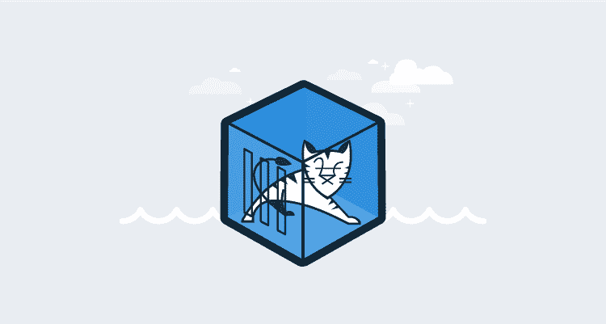](#)

持续集成和交付(CI/CD)是 DevOps 团队降低成本和增加软件团队敏捷性的共同目标。但是 CI/CD 管道不仅仅是测试、编译和部署应用程序。强大的 CI/CD 渠道解决了许多问题，例如:

*   高可用性(HA)
*   多重环境
*   零停机部署
*   数据库迁移
*   负载平衡器
*   HTTPS 和证书管理
*   功能分支部署
*   烟雾测试
*   回滚策略

如何实现这些目标取决于所部署的软件类型。在本文中，我将介绍如何通过将 Java 应用程序部署到 Tomcat 来创建 CI/CD 管道的持续交付(或部署)部分。然后，我构建了一个支持性的基础设施栈，其中包括用于负载平衡的 Apache web 服务器、用于数据库的 PostgreSQL、用于高可用性负载平衡器的 Keepalived 和用于协调部署的 Octopus。

## 关于 PostgreSQL 服务器的说明

本文假设 PostgreSQL 数据库已经部署在高可用性配置中。有关如何部署 PostgreSQL 的更多信息，请参考[文档](https://www.postgresql.org/docs/current/high-availability.html)。

本文中的说明可用于单个 PostgreSQL 实例，理解数据库代表单点故障。

## 如何在 Tomcat 中实现 HA

当谈到 HA 时，重要的是要准确理解需要管理平台的哪些组件来解决单个 Tomcat 实例的不可用性，例如，当一个实例由于日常维护或硬件故障而不可用时。

出于本文的目的，我创建了一个基础设施，允许传统的有状态 Java servlet 应用程序在单个 Tomcat 服务器不再可用时继续运行。实际上，这意味着当最初托管会话的服务器不再可用时，应用程序会话状态将持续存在并被分发到集群中的其他 Tomcat 实例。

简单回顾一下，Java servlet 应用程序可以根据一个`HttpSession`实例保存数据，然后可以跨请求使用。在下面的(天真的，因为它不处理竞争条件)例子中，我们有一个简单的计数器变量，它随着对页面的每个请求而递增。这演示了如何在 web 浏览器发出的单个请求中保存信息:

```
@RequestMapping("/pageCount")
public String index(final HttpSession httpSession) {
    httpSession.setAttribute("pageCount", ObjectUtils.defaultIfNull((Integer)httpSession.getAttribute("pageCount"), 0) + 1);
    return (Integer)httpSession.getAttribute("pageCount");
} 
```

会话状态保存在单个服务器的内存中。默认情况下，如果该服务器不再可用，会话数据也会丢失。对于像页面计数这样的小例子来说，这并不重要，但是对于更关键的功能来说，依赖于会话状态的情况并不少见。例如，购物车可能在会话状态中保存了要购买的商品列表，丢失该信息可能会导致销售失败。

为了保持高可用性，需要复制会话状态，以便在服务器脱机时可以共享。

Tomcat 提供了三种实现会话复制的解决方案:

1.  使用会话持久性并将会话保存到共享文件系统(PersistenceManager + FileStore)。
2.  使用会话持久性并将会话保存到共享数据库(PersistenceManager + JDBCStore)。
3.  使用内存复制，并使用 Tomcat 附带的 SimpleTcpCluster(`lib/catalina-tribes.jar`+`lib/catalina-ha.jar`)。

因为我们的基础设施堆栈已经假设了一个高度可用的数据库，所以我将实现选项二。对我们来说，这可能是最简单的解决方案，因为我们不需要实现任何特殊的网络，并且我们可以重用现有的数据库。但是，这种解决方案确实会在会话状态被修改和被保存到数据库之间引入延迟。这种延迟会产生一个窗口，在此期间，如果硬件或网络出现故障，数据可能会丢失。尽管支持计划的维护任务，因为当 Tomcat 关闭时，任何会话数据都将被写入数据库，这允许我们安全地修补操作系统或更新 Tomcat 本身。

我们注意到上面的示例代码很简单，因为它没有处理会话缓存不是线程安全的事实。即使是这个简单的例子也会受到可能导致页面计数不正确的竞争条件的影响。这个问题的解决方案是使用 Java 中可用的传统线程锁和同步特性，但是这些特性只在单个 JVM 中有效。这意味着我们必须确保客户端请求总是指向单个 Tomcat 实例，这又意味着只有一个 Tomcat 实例包含会话状态的单个权威副本，这可以通过线程锁和同步来确保一致性。这是通过粘性会话实现的。

粘性会话提供了一种方法，让负载平衡器检查客户端请求，然后将其定向到集群中的一个 web 服务器。默认情况下，在 Java servlet 应用程序中，客户端由 web 浏览器发送的`JSESSIONID` cookie 来标识，负载平衡器检查该 cookie 以标识持有会话的 Tomcat 实例，然后 Tomcat 服务器将请求与现有会话相关联。

总之，我们的 HA Tomcat 解决方案:

*   将会话状态保存到共享数据库中。
*   依靠粘性会话将客户端请求定向到单个 Tomcat 实例。
*   当 Tomcat 关闭时，通过保持会话状态来支持日常维护。
*   有一个小窗口，在此期间，硬件或网络故障可能会导致数据丢失。

## 为 HA 负载平衡器保持活动状态

为了确保网络请求分布在多个 Tomcat 实例中，而不是指向一个脱机实例，我们需要实现一个负载平衡解决方案。这些负载平衡器位于 Tomcat 实例的前面，将网络请求导向那些可用的实例。

有许多负载平衡解决方案可以完成这个任务，但是在这篇文章中，我们使用带有 mod_jk 插件的 Apache web 服务器。Apache 将提供网络功能，而 mod_jk 将把流量分配给多个 Tomcat 实例，实现粘性会话，为每个请求将客户机定向到同一个后端服务器。

为了保持高可用性，我们至少需要两个负载平衡器。但是，我们如何以一种可靠的方式在两个负载平衡器之间分割一个单一的传入网络连接呢？这就是 Keepalived 的用武之地。

Keepalived 是一个跨多个实例运行的 Linux 服务，它从健康实例池中挑选一个主实例。在确定主实例做什么时，Keepalived 非常灵活，但是在我们的场景中，我们将使用 Keepalived 为承担主角色的实例分配一个虚拟的浮动 IP 地址。这意味着我们的传入网络流量将被发送到一个分配给健康负载平衡器的浮动 IP 地址，然后负载平衡器将流量转发给 Tomcat 实例。如果其中一个负载平衡器脱机，Keepalived 将确保为剩余的负载平衡器分配浮动 IP 地址。

总之，我们的高可用性负载平衡解决方案:

*   使用 mod_jk 插件实现 Apache，将流量定向到 Tomcat 实例。
*   实施 Keepalived 以确保一个负载平衡器分配有虚拟 IP 地址。

## 网络图

这是我们将要创建的网络图:

[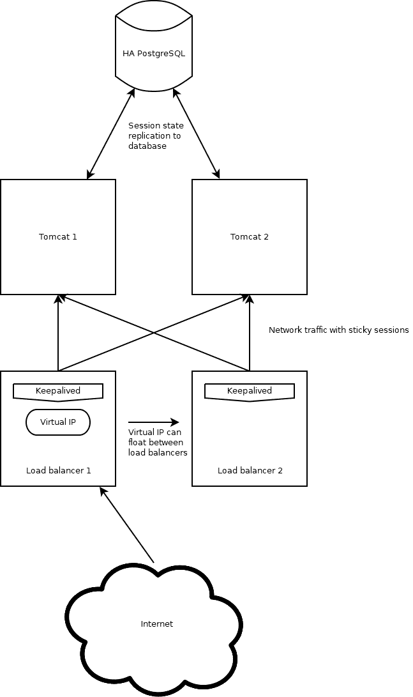](#)

## 零停机部署和回滚

持续交付的一个目标是始终处于可以部署的状态(即使您选择不部署)。这意味着放弃要求人们在午夜醒来，在客户睡觉时执行部署的计划。

零停机部署要求达到可以随时无中断完成部署的程度。在我们的示例基础架构中，为了实现零停机部署，我们需要考虑两点:

*   客户能够使用现有版本的应用程序来完成他们的会话，即使在部署了新版本的应用程序之后。
*   任何数据库更改的向前和向后兼容性。

在推出新的应用程序版本时，确保数据库更改向后和向前兼容需要一些设计工作和规则。幸运的是，有可用的工具，包括 [Flyway](https://flywaydb.org/) 和 [Liquidbase](https://www.liquibase.org/) ，它们提供了一种通过应用程序本身推出数据库更改的方法，负责对更改进行版本控制，并在所需的事务中包装任何迁移。我们将在本文后面的示例应用程序中看到 Flyway 的实现。

只要共享数据库在应用程序的当前版本和新版本之间保持兼容，Tomcat 就会提供一个名为[并行部署](https://tomcat.apache.org/tomcat-9.0-doc/config/context.html#Parallel_deployment)的特性，允许客户端继续访问应用程序的先前版本，直到它们的会话到期，同时针对应用程序的新版本创建新的会话。并行部署允许在不中断任何现有客户端的情况下部署新版本的应用程序。

Tomcat 能够自动清理不再有任何会话的旧版本。但是我们不会启用这个特性，因为它可能会阻止旧版本的会话迁移到另一个 Tomcat 实例。

确保数据库更改在应用程序的当前版本和新版本之间兼容，意味着我们可以轻松回滚应用程序部署。如果新版本引入了任何错误，重新部署应用程序的先前版本可以提供快速的后备。

总之，我们的零停机部署解决方案:

*   依赖于向前和向后兼容的数据库更改(至少在应用程序的新版本和当前版本之间)。
*   使用并行部署来允许现有会话不间断地完成。
*   通过恢复到以前安装的应用程序版本来提供应用程序回滚。

## 建设基础设施

此处显示的示例基础架构部署在 Ubuntu 18.04 虚拟机上。尽管一些包名和文件位置可能会改变，但大多数指令都与发行版无关。

### 配置 Tomcat 实例

#### 安装软件包

我们从安装 Tomcat 和管理器应用程序开始:

```
apt-get install tomcat tomcat-admin 
```

#### 添加 AJP 连接器

Apache web 服务器和 Tomcat 之间的通信是通过 AJP 连接器执行的。AJP 是一个优化的二进制 HTTP 协议，Apache 和 Tomcat 的 mod_jk 插件都理解它。连接器被添加到`/etc/tomcat9/server.xml`文件中的`Service`元素:

```
<Server>
  <!-- ... -->
  <Service name="Catalina">
    <!-- ... -->
    <Connector port="8009" protocol="AJP/1.3" redirectPort="8443"></Connector>
  </Service>
</Server> 
```

#### 定义 Tomcat 实例名

每个 Tomcat 实例都需要在`/etc/tomcat9/server.xml`文件的`Engine`元素中添加一个惟一的名称。默认的`Engine`元素如下所示:

```
<Engine name="Catalina" defaultHost="localhost"> 
```

Tomcat 实例的名称在`jvmRoute`属性中定义。我将调用第一个 Tomcat 实例`worker1`:

```
<Engine defaultHost="localhost" name="Catalina" jvmRoute="worker1"> 
```

第二个 Tomcat 实例被称为`worker2`:

```
<Engine defaultHost="localhost" name="Catalina" jvmRoute="worker2"> 
```

#### 添加经理用户

Octopus 通过管理器应用程序向 Tomcat 执行部署。这是我们之前用`tomcat-admin`包安装的。

为了对管理应用程序进行认证，需要在`/etc/tomcat9/tomcat-users.xml`文件中定义一个新用户。我将用密码`Password01!`调用这个用户`tomcat`，它将属于`manager-script`和`manager-gui`角色。

`manager-script`角色授予对管理器 API 的访问权限，而`manager-gui`角色授予对管理器 web 控制台的访问权限。

这里是用户定义的`tomcat`文件的副本:

```
<tomcat-users 
              xmlns:xsi="http://www.w3.org/2001/XMLSchema-instance"
              xsi:schemaLocation="http://tomcat.apache.org/xml tomcat-users.xsd"
              version="1.0">
  <role rolename="manager-gui"/>
  <role rolename="manager-script"/>
  <user username="tomcat" password="Password01!" roles="manager-script,manager-gui"/>
</tomcat-users> 
```

#### 添加 PostgreSQL JDBC 驱动程序 jar

每个 Tomcat 实例将与 PostgreSQL 数据库通信，以持久化会话数据。为了让 Tomcat 与 PostgreSQL 数据库通信，我们需要安装 PostgreSQL JDBC 驱动程序 JAR 文件。这是通过将文件`https://jdbc.postgresql.org/download/postgresql-42.2.11.jar`保存为`/var/lib/tomcat9/lib/postgresql-42.2.11.jar`来完成的。

#### 启用会话复制

为了支持数据库的会话持久性，我们在文件`/etc/tomcat9/context.xml`中添加了一个新的`Manager`定义。这个管理器使用`org.apache.catalina.session.PersistentManager`将会话细节保存到嵌套的`Store`元素中定义的数据库中。

元素反过来定义了会话信息将被保存到的数据库。

我们还需要添加一个装载`org.apache.catalina.ha.session.JvmRouteBinderValve`类的`Valve`。当客户机从一个 Tomcat 实例重定向到集群中的另一个 Tomcat 实例时，这个阀门非常重要。在部署我们的示例应用程序后，我们将看到这个阀门的运行。

这里是定义了`Manager`、`Store`和`Valve`元素的`/etc/tomcat9/context.xml`文件的副本:

```
<Context>
  <Manager
    className="org.apache.catalina.session.PersistentManager"
    processExpiresFrequency="3"
    maxIdleBackup="1" >
      <Store
        className="org.apache.catalina.session.JDBCStore"
        driverName="org.postgresql.Driver"
        connectionURL="jdbc:postgresql://postgresserver:5432/tomcat?currentSchema=session"
        connectionName="postgres"
        connectionPassword="passwordgoeshere"
        sessionAppCol="app_name"
        sessionDataCol="session_data"
        sessionIdCol="session_id"
        sessionLastAccessedCol="last_access"
        sessionMaxInactiveCol="max_inactive"
        sessionTable="session.tomcat_sessions"
        sessionValidCol="valid_session" />
  </Manager>
  <Valve className="org.apache.catalina.ha.session.JvmRouteBinderValve"/>
  <WatchedResource>WEB-INF/web.xml</WatchedResource>
  <WatchedResource>WEB-INF/tomcat-web.xml</WatchedResource>
  <WatchedResource>${catalina.base}/conf/web.xml</WatchedResource>
</Context> 
```

### 配置 PostgreSQL 数据库

#### 安装软件包

我们需要用新的数据库、模式和表来初始化 PostgreSQL。为此，我们使用`psql`命令行工具，该工具随以下软件一起安装:

```
apt-get install postgresql-client 
```

#### 添加数据库、模式和表

如果您查看上面定义的`/etc/tomcat9/context.xml`文件中的`connectionURL`属性，您会看到我们正在将会话信息保存到:

*   这个数据库叫做`tomcat`。
*   这个模式叫做`session`。
*   一个叫`tomcat_sessions`的桌子。

为了在 PostgreSQL 服务器中创建这些资源，我们运行了许多 SQL 命令。

首先，将以下文本保存到一个名为`createdb.sql`的文件中。如果数据库不存在，该命令将创建数据库(关于语法的更多信息，请参见 [this StackOverflow](https://stackoverflow.com/a/18389184/157605) 帖子):

```
SELECT 'CREATE DATABASE tomcat' WHERE NOT EXISTS (SELECT FROM pg_database WHERE datname = 'tomcat')\gexec 
```

然后用下面的命令执行 SQL，用 PostgreSQL 服务器的主机名替换`postgresserver`:

```
cat createdb.sql | /usr/bin/psql -a -U postgres -h postgresserver 
```

接下来，我们创建模式和表。将以下文本保存到名为`createschema.sql`的文件中。注意`tomcat_sessions`表的列匹配`/etc/tomcat9/context.xml`文件中`Store`元素的属性:

```
CREATE SCHEMA IF NOT EXISTS session;

CREATE TABLE IF NOT EXISTS session.tomcat_sessions
(
  session_id character varying(100) NOT NULL,
  valid_session character(1) NOT NULL,
  max_inactive integer NOT NULL,
  last_access bigint NOT NULL,
  app_name character varying(255),
  session_data bytea,
  CONSTRAINT tomcat_sessions_pkey PRIMARY KEY (session_id)
);

CREATE INDEX IF NOT EXISTS app_name_index
  ON session.tomcat_sessions
  USING btree
  (app_name); 
```

然后使用以下命令执行 SQL，用 PostgreSQL 服务器的主机名替换`postgresserver`:

```
psql -a -d tomcat -U postgres -h postgresserver -f /root/createschema.sql 
```

我们现在在 PostgreSQL 中有了一个表，可以保存 Tomcat 会话。

### 配置负载平衡器

#### 安装软件包

我们需要安装 Apache web 服务器、mod_jk 插件和 Keepalived 服务:

```
apt-get install apache2 libapache2-mod-jk keepalived 
```

#### 配置负载平衡器

mod_jk 插件通过文件`/etc/libapache2-mod-jk/workers.properties`进行配置。在这个文件中，我们定义了流量可以被定向到的工作线程的数量。该文件中的字段记录在[这里](https://tomcat.apache.org/connectors-doc/reference/workers.html)。

我们首先定义一个名为`loadbalancer`的工作者，它将接收所有的流量:

```
worker.list=loadbalancer 
```

然后，我们定义前面创建的两个 Tomcat 实例。确保用匹配的 Tomcat 实例的 IP 地址替换`worker1_ip`和`worker2_ip`。

注意，这里定义为`worker1`和`worker2`的工人的名字与`/etc/tomcat9/server.xml`文件中`Engine`元素的`jvmRoute`属性值相匹配。这些名称必须匹配，因为 mod_jk 使用它们来实现粘性会话:

```
worker.worker1.type=ajp13
worker.worker1.host=worker1_ip
worker.worker1.port=8009

worker.worker2.type=ajp13
worker.worker2.host=worker2_ip
worker.worker2.port=8009 
```

最后，我们将`loadbalancer`工作线程定义为负载平衡器，它将流量导向启用了粘性会话的`worker1`和`worker2`工作线程:

```
worker.loadbalancer.type=lb
worker.loadbalancer.balance_workers=worker1,worker2
worker.loadbalancer.sticky_session=1 
```

以下是`/etc/libapache2-mod-jk/workers.properties`文件的完整副本:

```
# All traffic is directed to the load balancer
worker.list=loadbalancer

# Set properties for workers (ajp13)
worker.worker1.type=ajp13
worker.worker1.host=worker1_ip
worker.worker1.port=8009

worker.worker2.type=ajp13
worker.worker2.host=worker2_ip
worker.worker2.port=8009

# Load-balancing behaviour
worker.loadbalancer.type=lb
worker.loadbalancer.balance_workers=worker1,worker2
worker.loadbalancer.sticky_session=1 
```

#### 添加 Apache 虚拟主机

为了让 Apache 接受流量，我们需要定义一个`VirtualHost`，我们在文件`/etc/apache2/sites-enabled/000-default.conf`中创建它。这个虚拟主机将接受端口 80 上的 HTTP 流量，定义一些日志文件，并使用`JkMount`指令将流量转发给名为`loadbalancer`的工作器:

```
<VirtualHost *:80>
  ErrorLog ${APACHE_LOG_DIR}/error.log
  CustomLog ${APACHE_LOG_DIR}/access.log combined
  JkMount /* loadbalancer
</VirtualHost> 
```

#### 配置保持活动状态

我们有两个负载平衡器，以确保在任何给定时间都可以让其中一个脱机进行维护。Keepalived 是我们用来将虚拟 IP 地址分配给一个负载平衡器服务的服务，Keepalived 称为主服务。

Keepalived 是通过`/etc/keepalived/keepalived.conf`文件配置的。

我们从命名负载平衡器实例开始。第一个负载均衡器叫做`loadbalancer1`:

```
vrrp_instance loadbalancer1 { 
```

`state`主机指定活动服务器:

```
state MASTER 
```

`interface`参数将物理接口名称分配给这个特定的虚拟 IP 实例:

运行`ifconfig`可以找到接口名。

```
interface ens5 
```

`virtual_router_id`是虚拟路由器实例的数字标识符。它必须在参与此虚拟路由器的所有 LVS 路由器系统上相同。它用于区分在同一网络接口上运行的多个 Keepalived 实例:

```
virtual_router_id 101 
```

`priority`指定分配的接口在故障转移中接管的顺序；数字越大，优先级越高。该优先级值必须在 0 到 255 的范围内，并且配置为状态`MASTER`的负载均衡服务器的优先级值应该设置为比配置为状态`BACKUP`的服务器的优先级值更高的数字:

```
priority 101 
```

`advert_int`定义发送 VRRP 广告的频率:

```
advert_int 1 
```

`authentication`块指定用于验证服务器故障转移同步的验证类型(`auth_type`和密码(`auth_pass`)。`PASS`指定密码验证:

```
authentication {
    auth_type PASS
    auth_pass passwordgoeshere
} 
```

`unicast_src_ip`是此负载平衡器的 IP 地址:

```
unicast_src_ip 10.0.0.20 
```

`unicast_peer`列出其他负载平衡器的 IP 地址。因为我们总共有两个负载平衡器，所以这里只列出了另一个负载平衡器:

```
unicast_peer {
  10.0.0.21
} 
```

`virtual_ipaddress`定义 Keepalived 分配给主节点的虚拟或浮动 IP 地址:

```
virtual_ipaddress {
    10.0.0.30
} 
```

这里是第一个负载平衡器的`/etc/keepalived/keepalived.conf`文件的完整副本:

```
vrrp_instance loadbalancer1 {
    state MASTER
    interface ens5
    virtual_router_id 101
    priority 101
    advert_int 1
    authentication {
        auth_type PASS
        auth_pass passwordgoeshere
    }
    # Replace unicast_src_ip and unicast_peer with your load balancer IP addresses
    unicast_src_ip 10.0.0.20
    unicast_peer {
      10.0.0.21
    }
    virtual_ipaddress {
        10.0.0.30
    }
} 
```

这里是第二个负载平衡器的`/etc/keepalived/keepalived.conf`文件的完整副本。

注意，名称已被设置为`loadbalancer2`,`state`已被设置为`BACKUP`,`priority`比`100`低，并且`unicast_src_ip`和`unicast_peer` IP 地址已被翻转:

```
vrrp_instance loadbalancer2 {
    state BACKUP
    interface ens5
    virtual_router_id 101
    priority 100
    advert_int 1
    authentication {
        auth_type PASS
        auth_pass passwordgoeshere
    }
    # Replace unicast_src_ip and unicast_peer with your load balancer IP addresses
    unicast_src_ip 10.0.0.21
    unicast_peer {
      10.0.0.20
    }
    virtual_ipaddress {
        10.0.0.30
    }
} 
```

使用以下命令在两个负载平衡器上重新启动`keepalived`服务:

```
systemctl restart keepalived 
```

在第一个负载平衡器上，运行命令`ip addr`。这将显示分配给接口的虚拟 IP 地址，Keepalived 被配置为使用输出`inet 10.0.0.30/32 scope global ens5`进行管理:

```
$ ip addr
1: lo: <LOOPBACK,UP,LOWER_UP> mtu 65536 qdisc noqueue state UNKNOWN group default qlen 1000
    link/loopback 00:00:00:00:00:00 brd 00:00:00:00:00:00
    inet 127.0.0.1/8 scope host lo
       valid_lft forever preferred_lft forever
    inet6 ::1/128 scope host
       valid_lft forever preferred_lft forever
2: ens5: <BROADCAST,MULTICAST,UP,LOWER_UP> mtu 9001 qdisc mq state UP group default qlen 1000
    link/ether 0e:2b:f9:2a:fa:a7 brd ff:ff:ff:ff:ff:ff
    inet 10.0.0.21/24 brd 10.0.0.255 scope global dynamic ens5
       valid_lft 3238sec preferred_lft 3238sec
    inet 10.0.0.30/32 scope global ens5
       valid_lft forever preferred_lft forever
    inet6 fe80::c2b:f9ff:fe2a:faa7/64 scope link
       valid_lft forever preferred_lft forever 
```

如果第一个负载平衡器关闭，第二个负载平衡器将采用虚拟 IP 地址，第二个 Apache web 服务器将充当负载平衡器。

## 构建部署管道

我们的部署管道将包括部署[随机报价](https://github.com/OctopusSamples/RandomQuotes-Java)示例应用程序。这是一个简单的有状态 Spring Boot 应用程序，利用 Flyway 来管理数据库迁移。

当您单击**刷新**按钮时，一个新的报价从数据库中加载，一个计数器在会话中递增，并且计数器在页面上显示为**报价计数**字段。应用程序版本显示在**版本**字段中。

我们可以使用**引用计数**和**版本**信息来验证在执行新部署或 Tomcat 实例离线时，现有会话是否被保留。

[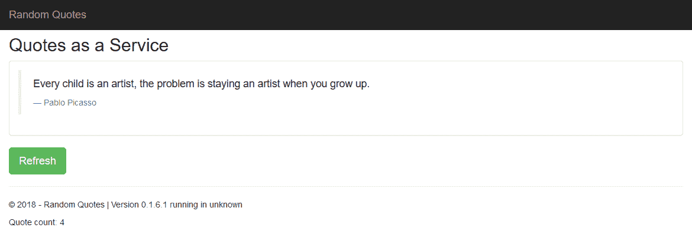](#)

### 获取一个 Octopus 实例

如果你还没有安装 Octopus，获得 Octopus 实例最简单的方法是[注册一个云账户](https://octopus.com/start/cloud)。这些实例对多达 10 个目标是免费的。

### 创造环境

我们将为这个例子创建两个环境: **Dev** 和 **Prod** 。这意味着我们将总共配置八个目标:四个负载平衡器和四个 Tomcat 实例。

### 展开触手

我们将在我们的每个虚拟机上安装一个触手，以允许我们执行部署、更新和系统维护任务。安装触手软件的说明可以在 [Octopus 下载页面](https://octopus.com/downloads/tentacle#linux)上找到。由于本例使用 Ubuntu 作为基本操作系统，我们用以下命令安装了触手:

```
apt-key adv --fetch-keys https://apt.octopus.com/public.key
add-apt-repository "deb https://apt.octopus.com/ stretch main"
apt-get update
apt-get install tentacle 
```

在安装了触手之后，我们用以下命令配置一个实例:

```
/opt/octopus/tentacle/configure-tentacle.sh 
```

该安装让你在[轮询或监听触角](https://octopus.com/docs/infrastructure/deployment-targets/windows-targets/tentacle-communication)之间做出选择。您选择哪个选项通常取决于您的网络限制。轮询触角要求托管触角的虚拟机能够到达 Octopus 服务器，而监听触角要求 Octopus 服务器能够到达虚拟机。通信方式的选择取决于 Octopus 服务器或 VMs 是否有固定的 IP 地址，以及防火墙中是否打开了正确的端口。任一选项都是有效的选择，不会影响部署过程。

这里是一个 **Dev** 环境的截图，带有 Tomcat 和负载平衡器实例的触角。Tomcat 实例的角色是 **tomcat** ，负载平衡器实例的角色是**负载平衡器**:

[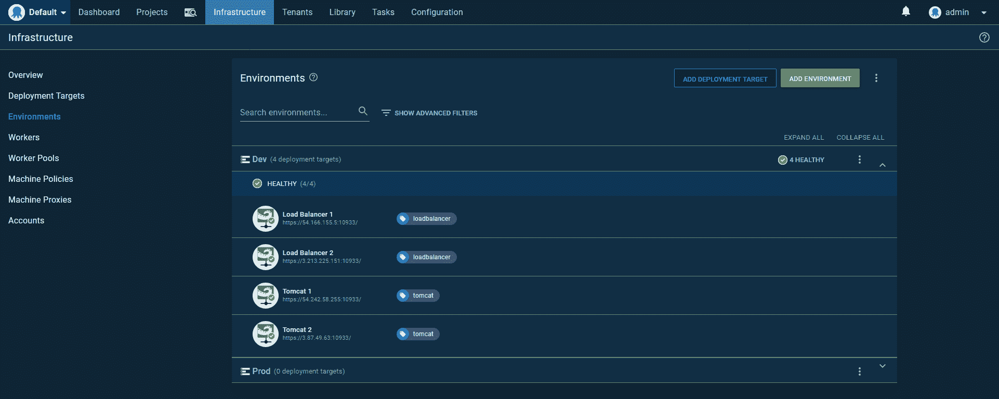](#)

### 创建外部提要

随机报价示例应用程序已经作为 WAR 文件推送到[Maven Central](https://repo.maven.apache.org/maven2/com/octopus/randomquotes/)。这意味着我们可以直接从 Maven 提要部署应用程序。

创建一个指向`https://repo.maven.apache.org/maven2/`的新 Maven 提要。此提要的屏幕截图如下所示:

[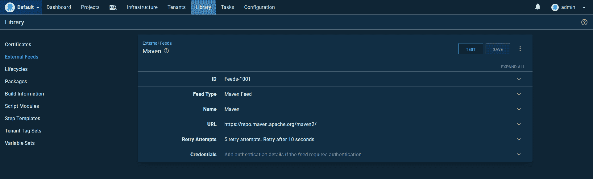](#)

通过搜索**com . octopus:random quotes**来测试提要。在这里，我们可以看到我们的应用程序位于存储库中:

[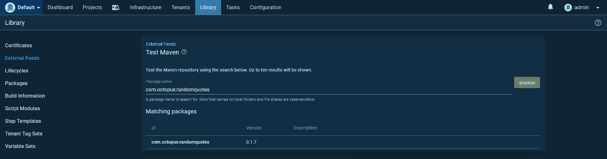](#)

### 创建部署流程

#### 生成时间戳

为了支持零停机部署，我们希望利用 Tomcat 中的[并行部署](https://tomcat.apache.org/tomcat-9.0-doc/config/context.html#Parallel_deployment)特性。通过在部署每个应用程序时对其进行版本控制，可以实现并行部署。

此版本号使用字符串比较来确定最新版本。典型的版本化方案，比如 SemVer，使用一种 *major.minor.patch* 格式，比如 *1.23.4* ，来标识版本。在很多情况下，这些传统的版本化方案可以作为字符串来比较，以确定它们的顺序。

但是，填充会带来一些问题。比如版本 *1.23.40* 比 *01.23.41* 低，但是直接字符串比较会返回相反的结果。

出于这个原因，我们使用部署时间作为 Tomcat 版本。因为版本需要跨目标保持一致，所以我们从一个脚本步骤开始，该步骤生成一个时间戳，并将其保存到一个输出变量中，代码如下:

```
$timestamp = Get-Date -Format "yyMMddHHmmss"
Set-OctopusVariable -name "TimeStamp" -value $timestamp 
```

#### Tomcat 部署

我们的部署流程从使用**Deploy to Tomcat via Manager**步骤将应用程序部署到每个 Tomcat 实例开始。我们将这个步骤称为**随机报价**，并在 **tomcat** 目标上运行它:

[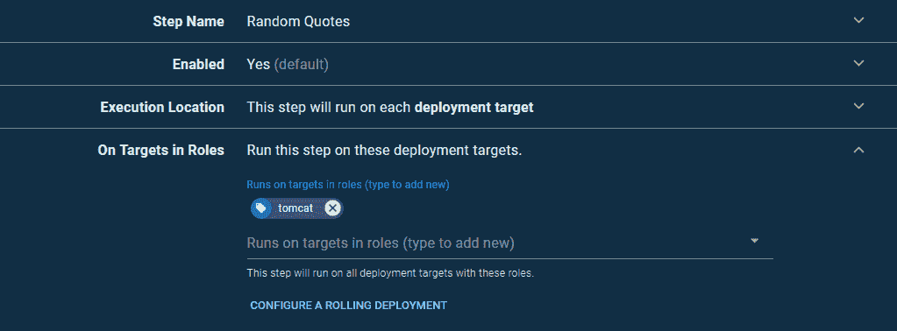](#)

我们从之前设置的 Maven 提要中部署**com . octopus:random quotes**包:

[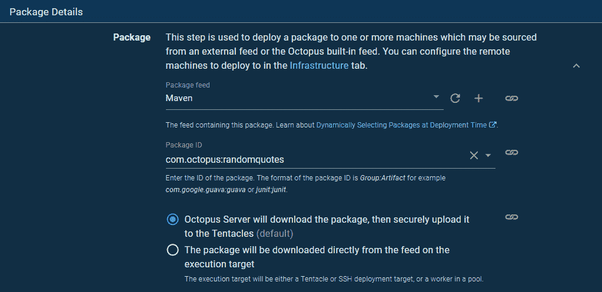](#)

因为触手位于托管 Tomcat 的 VM 上，所以管理器 API 的位置是**http://localhost:8080/Manager**。然后我们提供管理器凭证，这是我们配置 Tomcat 时输入到`tomcat-users.xml`文件中的详细信息:

[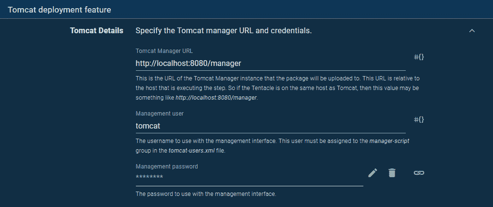](#)

上下文路径构成了 URL 中可访问已部署应用程序的路径。这里我们公开了路径 **/randomquotes** 上的应用程序:

[T31](#)

通过引用输出变量 **#{Octopus，部署版本被设置为上一步生成的时间戳。动作[获取时间戳].输出.时间戳}** :

[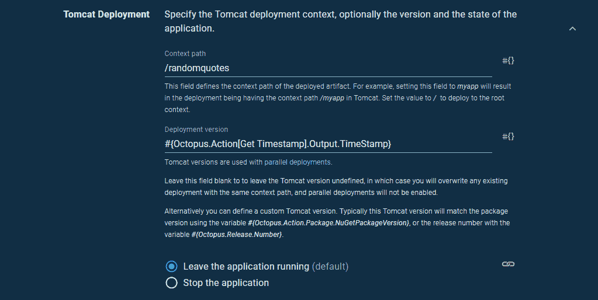](#)

#### 对部署进行冒烟测试

为了验证我们的部署是否成功，我们发出一个 HTTP 请求并检查响应代码。为此，我们使用一个名为 **HTTP - Test URL (Bash)** 的社区步骤模板。

和以前一样，这个步骤将在 Tomcat 实例上运行:

[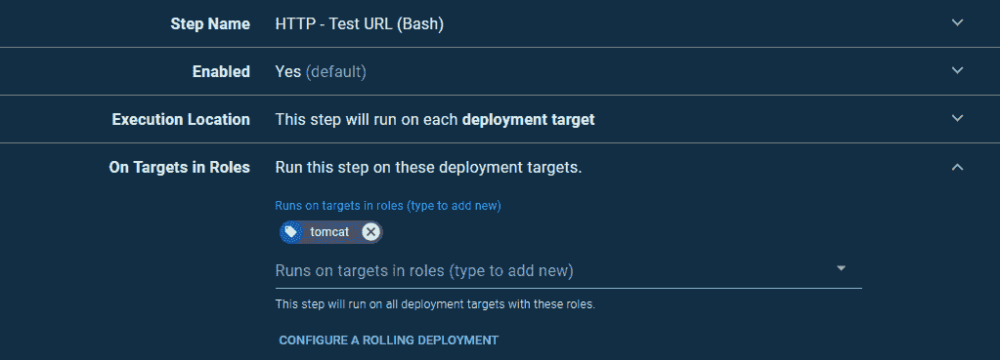](#)

该步骤将尝试从新部署的应用程序中打开`index.html`页面，预期 HTTP 响应代码为 **200** :

[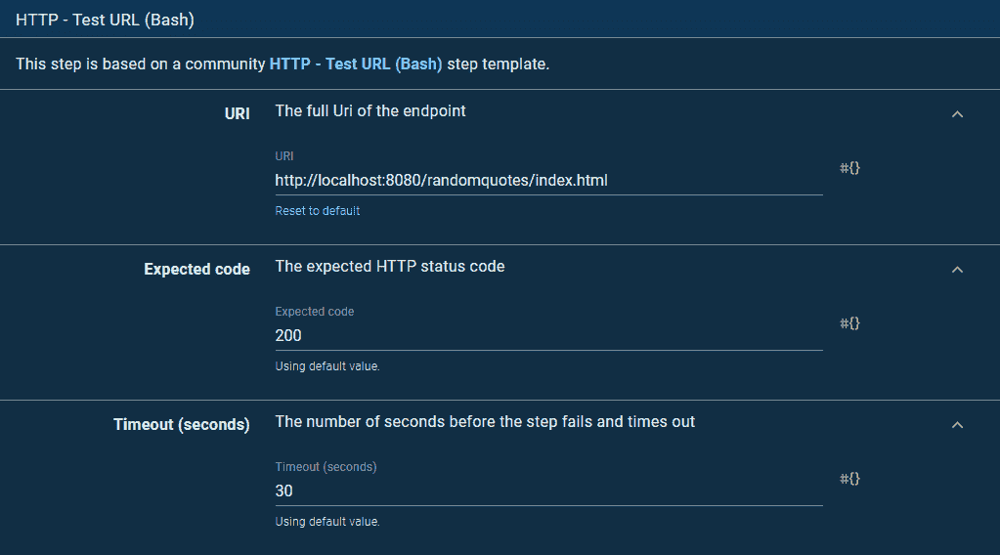](#)

#### 执行初始部署

让我们继续执行初始部署。对于这个部署，我们将特别选择以前版本的随机报价应用程序。版本 **0.1.6.1** 在这种情况下，是我们的倒数第二个工件版本:

[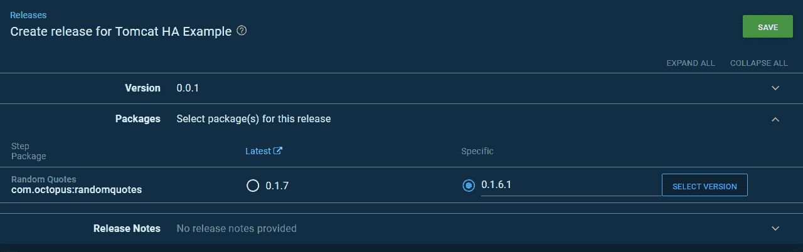](#)

Octopus 然后从 Maven 存储库中下载 WAR 文件，将其推送到 Tomcat 实例，并通过管理器部署到 Tomcat。完成后，运行冒烟测试以确保应用程序可以成功打开:

[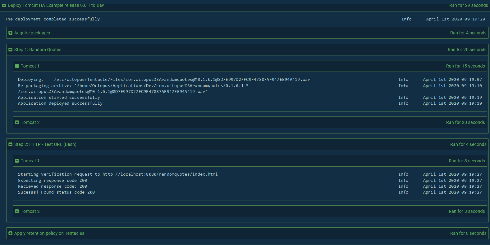](#)

## 通过堆栈检查请求

部署完成后，我们可以通过负载平衡器访问它。

在前面的配置示例中，我们有一个浮动 IP 地址 10.0.0.30，但是对于这些截图，我使用 Keepalived 为负载平衡器分配一个公共 IP 地址。

下面是用 Chrome 开发工具打开的应用程序的屏幕截图:

[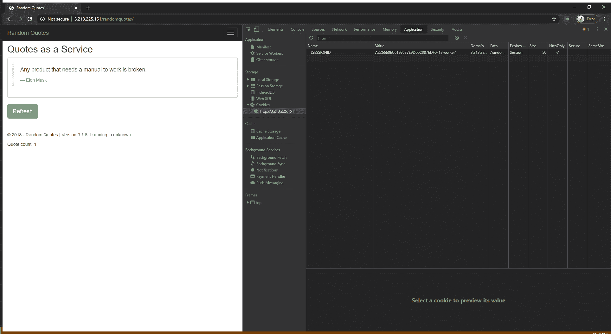](#)

这张截图有三点需要注意:

1.  用一个随机的会话 ID 和响应请求的 Tomcat 实例的名称来设置 JSESSIONID cookie。在这个例子中，其 **jvmRoute** 被设置为 **worker1** 的 Tomcat 实例响应了请求。
2.  我们已经打开了应用程序的 0.1.6.1 版本。
3.  **报价计数**设置为 1，但当我们点击**刷新**按钮时，报价计数将会增加。

让我们通过单击**刷新**按钮来增加**报价计数**。该值保存在 Tomcat 服务器上与 **JSESSIONID** cookie 相关联的会话中:

[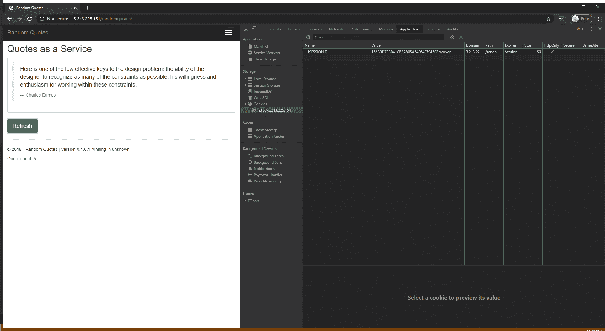](#)

现在让我们关闭 **worker1** Tomcat 实例。关机后，我们再次点击**刷新**按钮:

[](#)

这张截图有三点需要注意:

1.  **JSESSIONID** cookie 上的后缀从 **worker1** 更改为 **worker2** 。
2.  **JSESSIONID** cookie 会话 ID 保持不变。
3.  **报价计数**增加到 6。

当 Tomcat 正常关闭时，它会将所有会话的内容写到数据库中。然后因为 **worker1** Tomcat 实例不再可用，请求被定向到 **worker2** Tomcat 实例。 **worker2** Tomcat 实例从数据库加载会话信息，并增加计数器。jvmroutebendervalve 阀重写了会话 cookie，将当前的 Tomcat 实例名附加到末尾，并且将响应返回给浏览器。

我们现在可以看到，负载平衡器`/etc/libapache2-mod-jk/workers.properties`文件中的工作者名称与分配给`/etc/tomcat9/server.xml`文件中的 **jvmRoute** 的名称相匹配是很重要的，因为匹配这些名称可以实现粘性会话。

因为**引用计数**没有重置回 1，所以我们知道会话被保存到数据库中，并被复制到集群中的其他 Tomcat 实例。我们还知道该请求是由另一个 Tomcat 实例处理的，因为 **JSESSIONID** cookie 显示了一个新的 worker 名称。

即使我们让 **worker1** 重新联机，这个浏览器会话也将继续由 **worker2** 处理，因为负载平衡器通过检查 **JSESSIONID** cookie 来实现粘性会话。这也意味着负载平衡器不需要共享状态，因为它们只需要 cookie 值来引导流量。

我们现在已经展示了 Tomcat 实例支持会话复制和故障转移，使它们高度可用。

为了演示负载平衡器的故障转移，我们只需要重新启动 Keepalived 指定为主服务器的实例。然后，我们可以使用以下命令查看备份实例上的事件:

```
journalctl -u keepalived -f 
```

很快，我们将看到这些消息出现在备份上，因为它承担了主角色:

```
Apr 01 03:15:00 ip-10-0-0-21 Keepalived_vrrp[32485]: VRRP_Instance(loadbalancer2) Transition to MASTER STATE
Apr 01 03:15:01 ip-10-0-0-21 Keepalived_vrrp[32485]: VRRP_Instance(loadbalancer2) Entering MASTER STATE 
```

承担主服务器角色后，负载平衡器将被分配虚拟 IP 地址，并像前一个主服务器一样分配流量。

在之前的主实例重新启动后，它将重新承担主角色，因为它配置了更高的优先级，并且虚拟 IP 地址将被分配回去。

整个过程是无缝的，上游客户端永远不需要知道发生了故障转移和故障恢复。因此，我们已经演示了负载平衡器可以进行故障转移，从而使它们高度可用。

总而言之:

*   JSESSIONID cookie 包含会话 ID 和处理请求的 Tomcat 实例的名称。
*   负载平衡器基于附加到 **JSESSIONID** cookie 的工作者名称来实现粘性会话。
*   当一个 Tomcat 实例接收到它原本不负责的会话的流量时，`JvmRouteBinderValve` valve 重写 **JSESSIONID** cookie。
*   如果主负载平衡器脱机，Keepalived 会将一个虚拟 IP 分配给备用负载平衡器。
*   当主负载平衡器重新联机时，它会重新承担虚拟 IP。
*   基础设施栈可以在失去一个 Tomcat 实例和一个负载平衡器的情况下生存，并且仍然保持可用性。

## 零停机部署

我们现在已经成功地将 web 应用程序的版本 *0.1.6.1* 部署到 Tomcat。这个版本的应用程序使用一个非常简单的表结构来保存引用者的姓名，将名字和姓氏放在一个名为`AUTHOR`的列中。

该表结构最初是由 Flyway 数据库脚本使用以下 SQL 创建的:

```
create table AUTHOR
(
    ID INT auto_increment,
    AUTHOR VARCHAR(64) not null
); 
```

我们应用程序的下一个版本将把名字分成`FIRSTNAME`和`LASTNAME`列。我们使用包含以下 SQL 的新 Flyway 脚本添加这些列:

```
ALTER TABLE AUTHOR
ADD FIRSTNAME varchar(64);

ALTER TABLE AUTHOR
ADD LASTNAME varchar(64); 
```

此时，我们必须考虑如何以向后兼容的方式进行这些更改。零停机部署策略的基石要求共享数据库同时支持应用程序的当前版本和新版本。不幸的是，没有提供这种兼容性的灵丹妙药，作为开发人员，我们有责任确保我们的更改不会破坏任何现有的会话。

在这个场景中，我们必须保留旧的`AUTHOR`列，并将它保存的数据复制到新的`FIRSTNAME`和`LASTNAME`列中:

```
UPDATE AUTHOR SET FIRSTNAME = 'Rob', LASTNAME = 'Siltanen' WHERE ID = 1;
UPDATE AUTHOR SET FIRSTNAME = 'Albert', LASTNAME = 'Einstein' WHERE ID = 2;
UPDATE AUTHOR SET FIRSTNAME = 'Charles', LASTNAME = 'Eames' WHERE ID = 3;
UPDATE AUTHOR SET FIRSTNAME = 'Henry', LASTNAME = 'Ford' WHERE ID = 4;
UPDATE AUTHOR SET FIRSTNAME = 'Antoine', LASTNAME = 'de Saint-Exupery' WHERE ID = 5;
UPDATE AUTHOR SET FIRSTNAME = 'Salvador', LASTNAME = 'Dali' WHERE ID = 6;
UPDATE AUTHOR SET FIRSTNAME = 'M.C.', LASTNAME = 'Escher' WHERE ID = 7;
UPDATE AUTHOR SET FIRSTNAME = 'Paul', LASTNAME = 'Rand' WHERE ID = 8;
UPDATE AUTHOR SET FIRSTNAME = 'Elon', LASTNAME = 'Musk' WHERE ID = 9;
UPDATE AUTHOR SET FIRSTNAME = 'Jessica', LASTNAME = 'Hische' WHERE ID = 10;
UPDATE AUTHOR SET FIRSTNAME = 'Paul', LASTNAME = 'Rand' WHERE ID = 11;
UPDATE AUTHOR SET FIRSTNAME = 'Mark', LASTNAME = 'Weiser' WHERE ID = 12;
UPDATE AUTHOR SET FIRSTNAME = 'Pablo', LASTNAME = 'Picasso' WHERE ID = 13;
UPDATE AUTHOR SET FIRSTNAME = 'Charles', LASTNAME = 'Mingus' WHERE ID = 14; 
```

此外，新的 JPA 实体类需要忽略旧的`AUTHOR`列(通过`@Transient`注释)。然后，`getAuthor()`方法返回`getFirstName()`和`getLastName()`方法的组合值:

```
@Entity
public class Author {
    @Id
    @GeneratedValue(strategy= GenerationType.AUTO)
    private Integer id;
    @Column(name = "FIRSTNAME")
    private String firstName;
    @Column(name = "LASTNAME")
    private String lastName;

    @OneToMany(
            mappedBy = "author",
            cascade = CascadeType.ALL,
            orphanRemoval = true
    )
    private List<Quote> quotes = new ArrayList<>();

    protected Author() {

    }

    public Integer getId() {
        return id;
    }

    @Transient
    public String getAuthor() {
        return getFirstName() + " " + getLastName();
    }

    public List<Quote> getQuotes() {
        return quotes;
    }

    public String getFirstName() {
        return firstName;
    }

    public String getLastName() {
        return lastName;
    }
} 
```

虽然这是一个简单的例子，但由于`AUTHOR`表是只读的，所以很容易实现，它演示了如何以向后兼容的方式实现数据库更改。有可能就维护向后兼容性的策略写一整本书，但是出于本文的目的，我们将把这个讨论留在这里。

在我们执行下一次部署之前，请重新打开现有应用程序并刷新一些报价。这将针对现有的 *0.1.6.1* 版本创建一个会话，我们将使用它来测试我们的零停机部署策略。

通过以向后兼容的方式编写迁移脚本，我们可以部署应用程序的新版本。为了方便起见，这个新版本已经作为版本 *0.1.7* 推送到 Maven Central:

[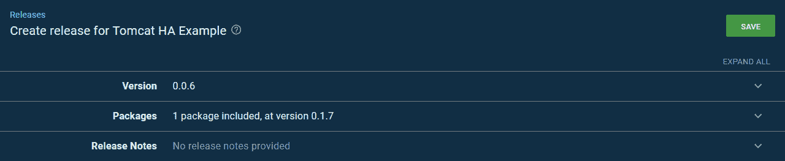](#)

部署完成后，在`http://tomcatip:8080/manager/html`打开管理器应用程序。注意，虽然您可以通过负载平衡器访问管理器，但是您不能选择要管理哪个 Tomcat 实例，因为负载平衡器会为您选择一个 Tomcat 实例。这意味着最好直接连接到 Tomcat 实例，绕过负载平衡器:

[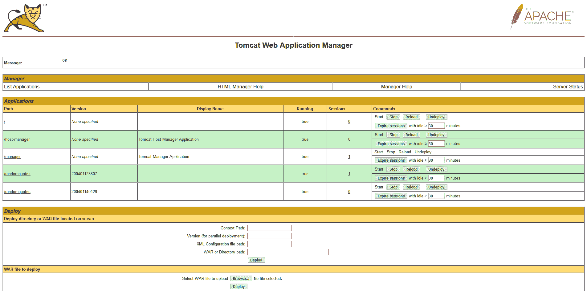](#)

这张截图有两点需要注意:

1.  我们在路径`/randomquotes`下有两个应用程序，每个都有一个唯一的版本。
2.  早期版本的应用程序有一个与之关联的会话。这是我们在部署版本 *0.1.7* 之前通过访问版本 *0.1.6.1* 创建的会话。

如果我们回到打开应用程序版本 *0.1.6.1* 的浏览器，我们可以继续刷新报价。计数器如我们预期的那样增加，页脚中显示的版本号仍然是版本 *0.1.6.1* 。

如果我们在私人浏览窗口中重新打开应用程序，我们可以保证不会重用旧的会话 cookie，并且我们会被定向到应用程序的版本 *0.1.7* :

[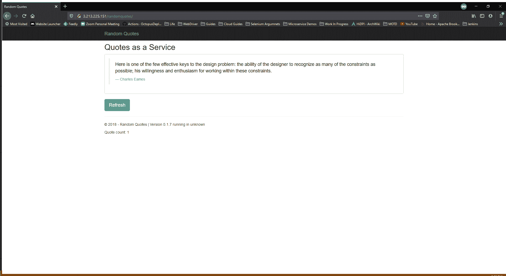](#)

因此，我们展示了零停机部署。因为我们的数据库迁移被设计成向后兼容的，所以应用程序的版本 *0.1.6.1* 和版本 *0.1.7* 可以使用 Tomcat 并行部署并行运行。最重要的是，旧部署的会话仍然可以在 Tomcat 实例之间转移，因此我们可以在并行部署的同时保持高可用性。

## 回滚策略

只要应用程序的最新版本和当前版本(在本例中是版本`0.1.6.1`和`0.1.7`)之间保持了数据库兼容性，回滚就像用应用程序的先前版本创建一个新部署一样简单。

因为 Tomcat 版本有一个在部署时计算的时间戳，部署应用程序的版本`0.1.6.1`再次导致它处理任何新的流量，因为它有一个更高的版本。

注意，由于 Tomcat 的并行部署，版本`0.1.7`的任何现有会话都将自然终止。如果这个版本必须离线(例如，如果有一个关键问题，它不能继续使用)，我们可以使用 Tomcat 步骤中的**开始/停止应用程序来停止一个已部署的应用程序。**

我们将创建一个运行手册来运行这一步骤，因为这是一个维护任务，可能需要应用于任何环境来推出一个坏版本。

我们首先添加一个提示变量，该变量将填充与我们想要关闭的部署相对应的 Tomcat 版本时间戳:

[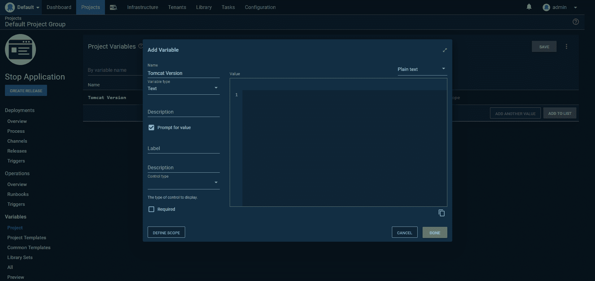](#)

然后，使用 Tomcat 步骤中的**启动/停止应用程序配置运行手册。**部署版本**设置为提示变量的值:**

[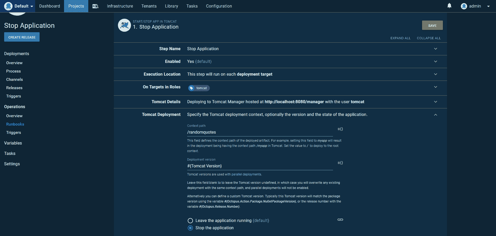](#)

运行 runbook 时，系统会提示我们输入要停止的应用程序的时间戳版本:

[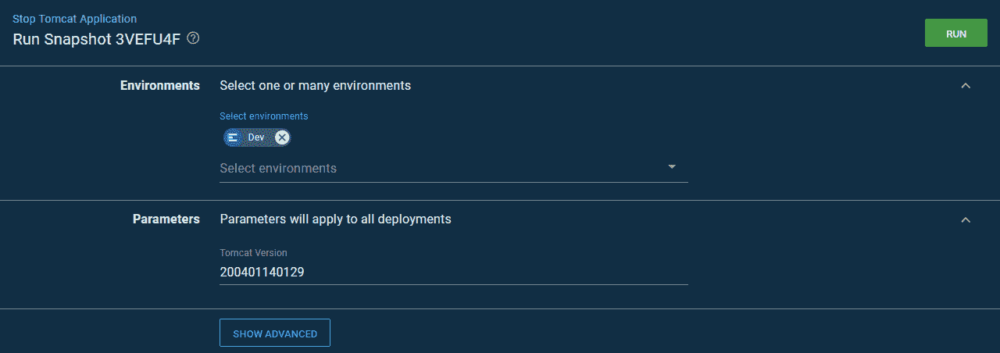](#)

运行手册完成后，我们可以通过打开管理器控制台来验证应用程序是否已停止。在下面的截图中，你可以看到版本 **200401140129** 没有运行。此版本不再响应请求，所有将来的请求将被定向到应用程序的最新版本:

[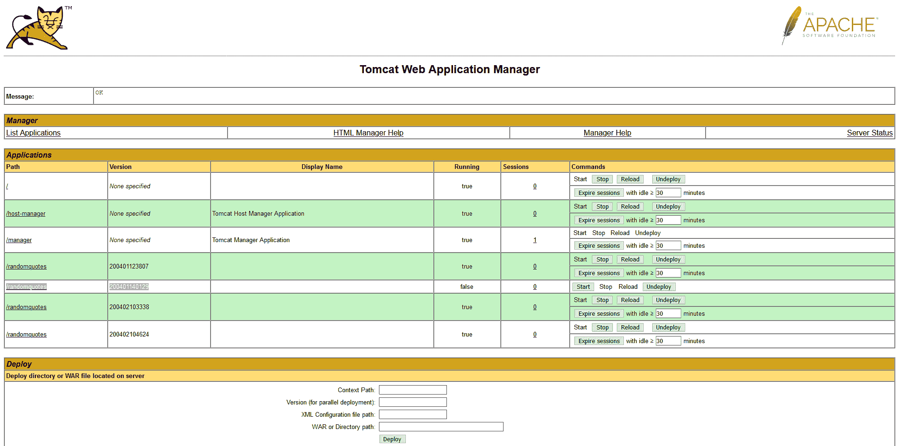](#)

## 功能分支部署

一个常见的开发实践是在一个单独的 SCM 分支中完成一个特性，称为特性分支。

CI 服务器通常会观察特性分支的存在，并根据提交的代码创建一个可部署的工件。

这些特性分支工件然后被版本化，以指示它们是从哪个分支构建的。GitVersion 是一个流行的工具，用于生成版本以匹配 Git 中的提交和分支，他们提供了这个示例，展示了作为 GitHub 流的一部分而创建的[版本:](https://gitversion.net/docs/git-branching-strategies/githubflow-examples)

[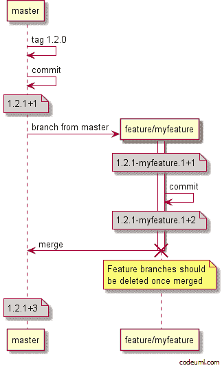](#)

从上图可以看出，对一个名为 **myfeature** 的特性分支的提交生成了一个类似于 **1.2.1-myfeature.1+1** 的版本。这又会产生一个文件名类似于`myapp.1.2.1-myfeature.1+1.zip`的工件。

尽管像 GitVersion 这样的工具会生成 SemVer 版本字符串，但同样的格式也可以用于 Maven 工件。然而，有一个问题。

SemVer 将订购一个功能分支低于没有任何预发布组件的版本。例如， **1.2.1** 被认为是比 **1.2.1-myfeature** 更高的版本号。这是预期的顺序，因为功能分支最终将合并回主分支。

当一个特性分支被附加到 Maven 版本时，它被认为是一个限定符。Maven 允许任何限定符，但也识别一些特殊的限定符，如**快照**、**最终**、 **ga** 等。完整的列表可以在博文 [Maven 版本解释](https://octopus.com/blog/maven-versioning-explained)中找到。带有无法识别的限定符的 Maven 版本(特性分支名称是无法识别的限定符)被视为比未限定版本更高的版本。

这意味着 Maven 认为版本 **1.2.1-myfeature** 将比 **1.2.1** 更晚发布，而这显然不是特性分支的意图。您可以在一个托管在 [GitHub](https://github.com/mcasperson/MavenVersionTest/blob/master/src/test/java/org/apache/maven/artifact/versioning/VersionTest.java#L122) 上的项目中通过下面的测试来验证这种行为。

然而，由于 Octopus 中的通道功能，我们可以确保 SemVer 预发布和 Maven 限定符都按照预期的方式进行过滤。

这是我们应用程序部署的默认通道。注意，**预发布标签**字段的正则表达式 **^$** 。这个正则表达式只匹配空字符串，这意味着默认通道将只部署没有预发布或限定符字符串的工件:

[T31](#)

接下来，我们有特征分支通道，它定义了一个正则表达式**。+** 用于**预发布标签**字段。这个正则表达式只匹配非空字符串，这意味着功能分支通道将只部署带有预发布或限定符字符串的工件:

[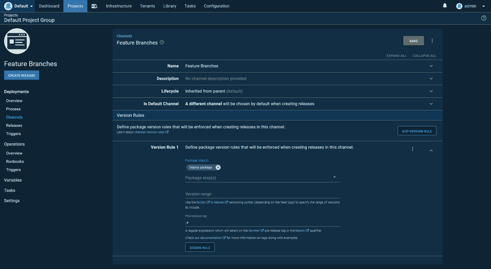](#)

以下是 Octopus 允许在默认频道中发布的版本列表。注意，显示的唯一版本没有限定符，这意味着它是主版本:

[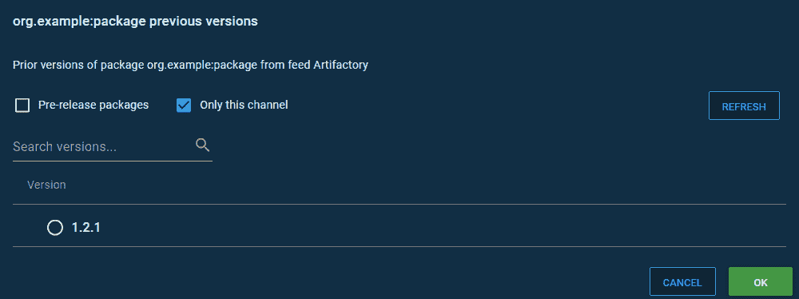](#)

以下是 Octopus 允许使用功能分支通道创建的版本列表。所有这些版本都有一个嵌入特性分支名称的限定符:

[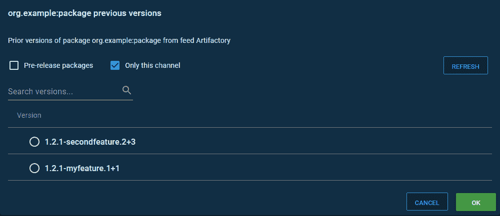](#)

这些渠道的最终结果是，像 **1.2.1-myfeature** 这样的版本将永远不会与像 **1.2.1** 这样的版本进行比较，这消除了功能分支版本号被认为是后续版本的模糊性。

最后一步是将这些特性分支包部署到唯一的上下文中，这样就可以在单个 Tomcat 实例上并排访问它们。为此，我们将**上下文路径**修改为:

```
/randomquotes#{Octopus.Action.Package.PackageVersion | Replace "^([0-9\.]+)((?:-[A-Za-z0-9]+)?)(.*)$" "$2"} 
```

在版本`1.2.1-myfeature.1+1`上使用上面的正则表达式将执行以下操作:

*   `^([0-9\.]+)`将版本开头的所有数字和句点分组为第 1 组，与`1.2.1`匹配。
*   `((?:-[A-Za-z0-9]+)?)`将前导破折号和任何后续字母数字字符(如有)分组为第 2 组，匹配`-myfeature`。
*   `(.*)$`将任何后续字符(如果有)分组为组 3，它匹配`.1+1`。

这个变量过滤器将导致完整的预发布或限定符字符串被正则表达式中的第二组替换。这会产生以下上下文路径:

*   版本`1.2.1-myfeature.1+1`生成`/randomquotes-myfeature`的上下文路径。
*   版本`1.2.1`生成`/randomquotes`的上下文路径。

下面是应用了新上下文路径的 Tomcat 部署步骤的屏幕截图:

[](#)

SemVer 项目提供了一个更加健壮的正则表达式[来可靠地捕获 SemVer 版本中的组。](https://semver.org/#is-there-a-suggested-regular-expression-regex-to-check-a-semver-string)

带有命名捕获组的正则表达式为:

```
^(?P<major>0|[1-9]\d*)\.(?P<minor>0|[1-9]\d*)\.(?P<patch>0|[1-9]\d*)(?:-(?P<prerelease>(?:0|[1-9]\d*|\d*[a-zA-Z-][0-9a-zA-Z-]*)(?:\.(?:0|[1-9]\d*|\d*[a-zA-Z-][0-9a-zA-Z-]*))*))?(?:\+(?P<buildmetadata>[0-9a-zA-Z-]+(?:\.[0-9a-zA-Z-]+)*))?$ 
```

没有命名组的正则表达式是:

```
^(0|[1-9]\d*)\.(0|[1-9]\d*)\.(0|[1-9]\d*)(?:-((?:0|[1-9]\d*|\d*[a-zA-Z-][0-9a-zA-Z-]*)(?:\.(?:0|[1-9]\d*|\d*[a-zA-Z-][0-9a-zA-Z-]*))*))?(?:\+([0-9a-zA-Z-]+(?:\.[0-9a-zA-Z-]+)*))?$ 
```

## 公共证书管理

为了完成基础设施的配置，我们将通过负载平衡器启用 HTTPS 访问。我们可以编辑 Apache web 服务器虚拟主机配置来启用 SSL，并指向我们为我们的域获得的密钥和证书。

### 获得证书

在这篇文章中，我获得了一个由我们的 DNS 提供商生成的加密证书。生成 HTTPS 证书的确切过程不是我们在这里要讨论的，但是您可以参考您的 DNS 或证书提供商以获得具体的指导。

在下面的截图中，您可以看到下载证书的各种选项。注意，虽然为 Apache 提供了说明和下载，但我们下载的是 IIS 说明下提供的 PFX 文件。PFX 文件在一个文件中包含公钥、私钥和证书链。我们需要这个文件将证书上传到 Octopus。在这里，我们下载了`octopus.tech`域名的 PFX 文件:

[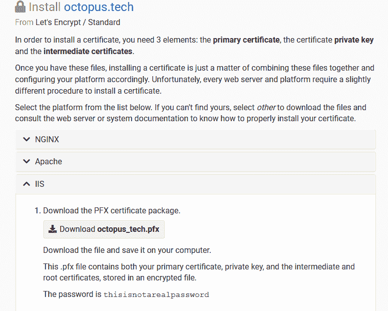](#)

### 在 Octopus 中创建证书

部署证书是一项持续的操作。特别是，Let's Encrypt 提供的证书每三个月就会过期，因此需要经常刷新。

这使得部署证书成为 runbooks 的一个很好的用例。与常规部署不同，runbooks 不需要在环境中进行，您也不需要创建部署。我们将创建一个 runbook 来将证书部署到 Apache 负载平衡器。

首先，我们需要上传由 DNS 提供商生成的 PFX 证书。在下面的截图中，您可以看到上传到八达通证书商店的加密证书:

[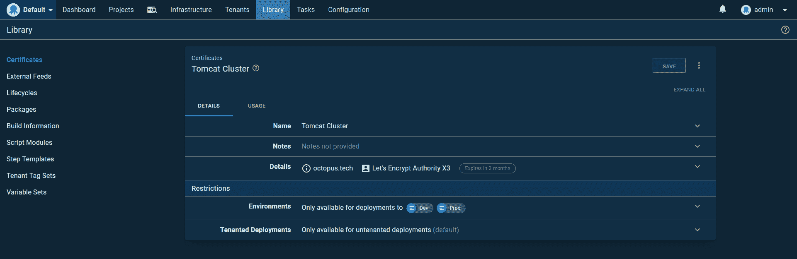](#)

### 部署证书

在 Octopus 中创建一个新项目，并添加我们刚刚上传的证书作为变量:

[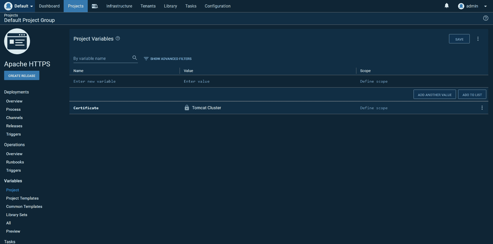](#)

接下来，创建一个包含单个**运行脚本**步骤的运行手册。

脚本的第一步是使用命令启用 **mod_ssl** :

```
a2enmod ssl 
```

然后创建一些目录来保存证书、证书链和私钥:

```
[ ! -d "/etc/apache2/ssl" ] && mkdir /etc/apache2/ssl
[ ! -d "/etc/apache2/ssl/private" ] && mkdir /etc/apache2/ssl/private 
```

然后，证书变量的内容作为文件保存到上述目录中。证书是一种特殊的变量，它通过扩展属性公开组成证书的各个组件。我们需要访问三个属性:

*   `Certificate.CertificatePem`，也就是公证。
*   `Certificate.PrivateKeyPem`，也就是私钥。
*   `Certificate.ChainPem`，也就是证书链。

我们将这些变量的内容打印到三个文件中:

```
get_octopusvariable "Certificate.CertificatePem" > /etc/apache2/ssl/octopus_tech.crt
get_octopusvariable "Certificate.PrivateKeyPem" > /etc/apache2/ssl/private/octopus_tech.key
get_octopusvariable "Certificate.ChainPem" > /etc/apache2/ssl/octopus_tech_bundle.pem 
```

如果你还记得，在这篇文章的前面，我们用以下内容创建了文件`/etc/apache2/sites-enabled/000-default.conf`:

```
<VirtualHost *:80>
  ErrorLog ${APACHE_LOG_DIR}/error.log
  CustomLog ${APACHE_LOG_DIR}/access.log combined
  JkMount /* loadbalancer
</VirtualHost> 
```

我们想修改这个文件，就像这样:

```
<VirtualHost *:443>
  ErrorLog ${APACHE_LOG_DIR}/error.log
  CustomLog ${APACHE_LOG_DIR}/access.log combined
  JkMount /* loadbalancer
  SSLEngine on
  SSLCertificateFile /etc/apache2/ssl/octopus_tech.crt
  SSLCertificateKeyFile /etc/apache2/ssl/private/octopus_tech.key
  SSLCertificateChainFile /etc/apache2/ssl/octopus_tech_bundle.pem
</VirtualHost> 
```

这是通过将所需的文本回显到文件`/etc/apache2/sites-enabled/000-default.conf`中来实现的:

```
{
cat << EOF
<VirtualHost *:443>
  ErrorLog ${APACHE_LOG_DIR}/error.log
  CustomLog ${APACHE_LOG_DIR}/access.log combined
  JkMount /* loadbalancer
  SSLEngine on
  SSLCertificateFile /etc/apache2/ssl/octopus_tech.crt
  SSLCertificateKeyFile /etc/apache2/ssl/private/octopus_tech.key
  SSLCertificateChainFile /etc/apache2/ssl/octopus_tech_bundle.pem
</VirtualHost>
EOF
} > /etc/apache2/sites-enabled/000-default.conf 
```

最后一步是重启`apache2`服务来加载变更:

```
systemctl restart apache2 
```

以下是完整的脚本供参考:

```
a2enmod ssl

[ ! -d "/etc/apache2/ssl" ] && mkdir /etc/apache2/ssl
[ ! -d "/etc/apache2/ssl/private" ] && mkdir /etc/apache2/ssl/private
get_octopusvariable "Certificate.CertificatePem" > /etc/apache2/ssl/octopus_tech.crt
get_octopusvariable "Certificate.PrivateKeyPem" > /etc/apache2/ssl/private/octopus_tech.key
get_octopusvariable "Certificate.ChainPem" > /etc/apache2/ssl/octopus_tech_bundle.pem

{
cat << EOF
<VirtualHost *:443>
  ErrorLog ${APACHE_LOG_DIR}/error.log
  CustomLog ${APACHE_LOG_DIR}/access.log combined
  JkMount /* loadbalancer
  SSLEngine on
  SSLCertificateFile /etc/apache2/ssl/octopus_tech.crt
  SSLCertificateKeyFile /etc/apache2/ssl/private/octopus_tech.key
  SSLCertificateChainFile /etc/apache2/ssl/octopus_tech_bundle.pem
</VirtualHost>
EOF
} > /etc/apache2/sites-enabled/000-default.conf
systemctl restart apache2 
```

[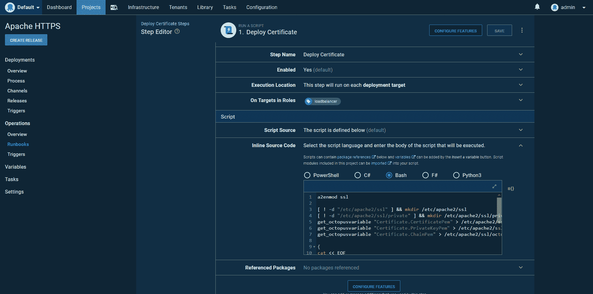](#)

运行手册完成后，我们可以验证应用是否通过 HTTPS 公开:

[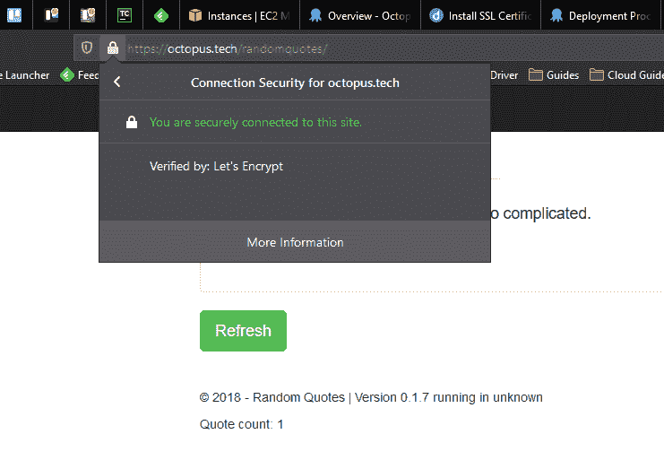](#)

## 内部证书管理

正如我们所看到的，在使用管理器控制台时，直接连接到 Tomcat 实例是非常有用的。此连接传输凭据，应该通过安全连接完成。为了支持这一点，我们为 Tomcat 配置了自签名证书。

### 创建自签名证书

因为我们的 Tomcat 实例不是通过主机名[公开的，所以我们没有为它们获取证书的选项](https://cabforum.org/internal-names/)。要启用 HTTPS，我们需要创建自签名证书，这可以通过 OpenSSL 来实现:

```
openssl genrsa 2048 > private.pem
openssl req -x509 -new -key private.pem -out public.pem -days 3650
openssl pkcs12 -export -in public.pem -inkey private.pem -out mycert.pfx 
```

### 将证书添加到 Tomcat

使用**Deploy a certificate to Tomcat**步骤在 Tomcat 中配置证书。

**Tomcat CATALINA_HOME 路径**被设置为`/usr/share/tomcat9`，而 **Tomcat CATALINA_BASE 路径**被设置为`/var/lib/tomcat9`。

[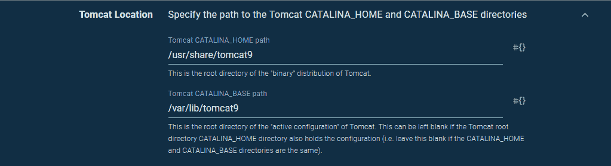](#)

我们为**选择证书变量**字段引用一个证书变量。 **Catalina** 的缺省值对于 **Tomcat 服务名**是合适的。

对于 Tomcat 如何处理证书，我们有几个选择。一般来说，**阻塞 IO** 、**非阻塞 IO** 、**非阻塞 IO 2** 和 **Apache Portable Runtime** 选项的性能越来越高。Apache Portable Runtime 是 Tomcat 可以利用的一个额外的库，它是由我们和`apt-get`一起安装的 Tomcat 包提供的，所以使用这个选项是有意义的。

[T32](#)

为了允许 Tomcat 使用新的配置，我们需要使用以下命令通过脚本步骤重新启动服务:

```
systemctl restart tomcat9 
```

我们现在可以从`https://tomcatip:8443/manager/html`加载管理器控制台。

## 纵向扩展到多个环境

到目前为止，我们创建的基础设施现在可以用作其他测试或生产环境的模板。我们在此展示的内容都不是特定于环境的，这意味着所有流程和基础架构都可以根据需要扩展到任意多个环境。

通过将分配给新 Tomcat 和负载平衡器实例的触角与 Octopus 中的其他环境相关联，我们获得了将部署推向生产的能力:

[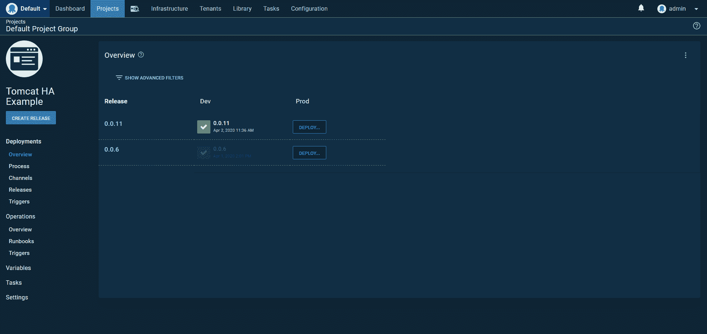](#)

## 结论

如果你已经到了这一步，恭喜你！建立一个零停机部署、分支、回滚和 HTTPS 的高可用性 Tomcat 集群并不适合胆小的人。最终用户仍然需要结合多种技术来实现这一结果，但是我希望这篇博客文章中的说明能够揭示出现实世界中 Java 部署的一些神奇之处。

总而言之，在这篇文章中，我们:

*   配置了带有 PostgreSQL 数据库的 Tomcat 会话复制和带有`JvmRouteBinderValve`阀的会话 cookie 重写。
*   使用 mod_jk 插件配置 Apache web 服务器作为负载平衡器。
*   通过 Keepalived 在负载平衡器之间实现高可用性。
*   利用 Tomcat 的并行部署特性和 Flyway 执行向后兼容的数据库迁移，执行零停机部署。
*   Smoke 用 Octopus 中的社区步骤测试了部署。
*   实现了特性分支部署，考虑到了使用 Octopus 通道的 Maven 版本控制策略的局限性。
*   了解了如何回滚应用程序或使其退出服务。
*   向 Apache 添加了 HTTPS 证书。
*   对多种环境重复该过程。