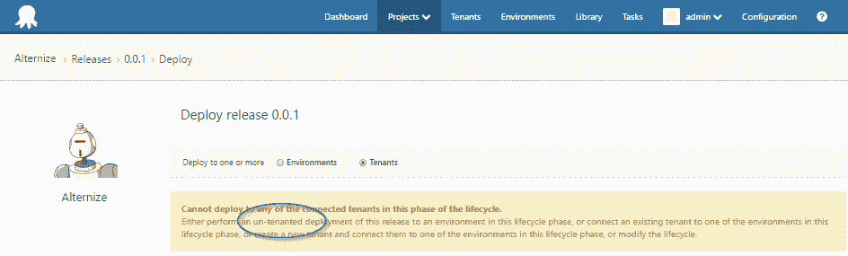
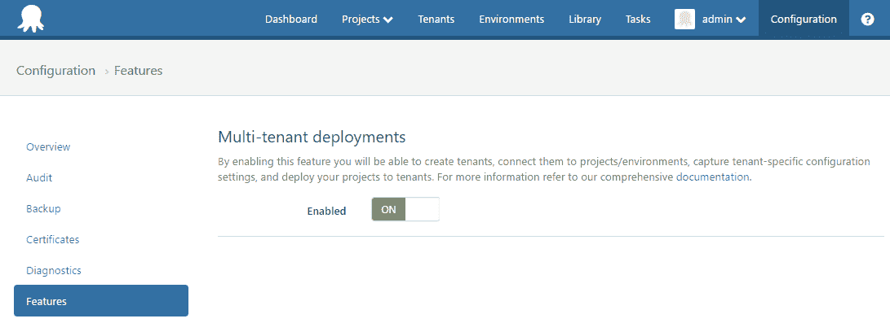
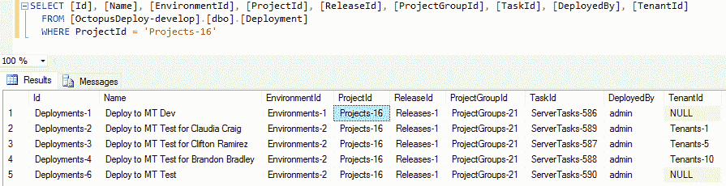

# 3.4 中的未租赁部署是什么？-章鱼部署

> 原文：<https://octopus.com/blog/un-tenanted-deployment>

这篇文章是我们 Octopus 3.4 博客系列的一部分。在我们的[博客](https://octopus.com/blog/octopus34-blog-series-kickoff)或我们的[推特](https://twitter.com/OctopusDeploy)上关注它。

* * *

在 Octopus `3.4.0`中启用多租户部署，您可能已经在几个不同的地方注意到了术语“未租赁部署”。那么交易是什么？我以为我开启了多租户部署功能！请放心，非租用部署是您已经在做的事情。

## 最小惊奇路径

支持多租户部署为部署等式增加了另一个维度。一个环境中的同一个版本现在可以为不同的租户部署，将他们自己的变量、机器和权限的整个上下文带入流程。如果您想要单独管理您的 web 应用程序在您自己的 100 多个客户中的生产部署，这比以往任何时候都更容易。

在提供这一新功能时，我们努力确保它不是一种全有或全无的方法。有 1000 多个项目和更多环境需要启动，我们希望尽可能无缝地过渡到使用租户。当您最初启用多租户部署时，您可以继续部署您的现有项目，而无需任何进一步的更改。在您开始添加租户或标签之前，您可能根本不会注意到太多的变化。别担心，这是设计好的！

## 人工添加剂

多租户部署是 Octopus Deploy 的附加特性。当您开始创建租户标记集时，您会看到它们开始出现在整个系统的机器、步骤、变量甚至(最终)权限上。您现有的项目将和以前一样工作，您可以继续管理、创建和部署发布，而不必学习任何新概念。当您在没有任何租户的情况下使用传统流程进行部署时，这被认为是一个未租用的版本。

出于安全原因，您可能会决定将您的一些机器限定在特定的租户范围内，因为它们只被批准用于特定的租户。也许这些机器可以通过不同的标签集进行分组，以便在一个环境中对它们进行资源管理。类似地，您可以开始添加电子邮件步骤以仅触发 VIP 租户，或者在项目中添加包部署步骤以仅触发接收特定模块的租户。只有当您启用并开始使用这些新特性时，您的项目才会变得更加灵活。

所有这一切的要点是，只有当您*需要*并开始*使用*租户时，我们才会向您展示允许您真正创建符合您需求的高级部署流程的开关和拨号盘。对于其他不需要使用管理租户带来的额外复杂性的人来说，应该完全隐藏起来，一切照常。

这不应该强迫你学习新的东西去做你已经在做的事情。

## 好吧好吧...但是为什么不创建一个默认租户呢？

在设计阶段，有人建议只创建一个默认租户，该租户可以链接到部署，并用于没有连接显式租户的环境。对于那些已经熟悉频道特性的人来说，你可能已经注意到在从`3.1.x`升级到`3.2.0`的过程中，作为引入频道概念的一部分，我们自动为你的所有项目添加了一个默认频道。今后，所有新项目也有自己的默认通道，最初连接到默认的生命周期。这里的区别是通道是由拥有的*，而*只影响它们所连接的*特定项目。*

然而，多租户部署在整个 Octopus 部署体验的基础上增加了一个新的层，其结果会影响部署过程的各个部分，例如涉及哪些机器或帐户，或者全局变量如何被包括在整个部署中。

应该在什么时候创建默认租户，是在创建项目时还是仅在连接另一个租户时？自动创建默认租户，即使它是在幕后抽象出来的，当行为不能被抽象出来时，也会导致混乱。在最坏的情况下，它可能潜在地冒着阻塞用户现有项目发布的风险，因为在继续之前需要理解(甚至纠正)新的概念。默认租户是按项目创建还是全局创建？我们推断，更好的解决方案是将不包含租户的部署视为未租赁的部署。

在数据库中，我们用一个`null` tenantId 来记录这个部署。

## 章鱼部署和奶酪

我们在提供任何新功能时的口号是:

> 升级应该避免移动你的奶酪(即使我们试图用一个借口来包装“奶酪移动”,比如我们已经将你的普通品牌奶酪片升级为一些你不会发音的花哨的欧洲风格的奶酪。)

最少惊喜的**途径**意味着，对于那些不需要立即使用多租户部署功能的人来说，他们可以继续部署，而不必学习任何新东西。对于那些多租户部署解决了他们一直面临的部署架构问题的人来说，他们可以放心地慢慢升级到完全租用的部署。最终，我们预计许多使用多租户部署的团队可能会将他们的所有项目切换到*需求*租赁版本，以便对部署生命周期进行更细粒度的控制。