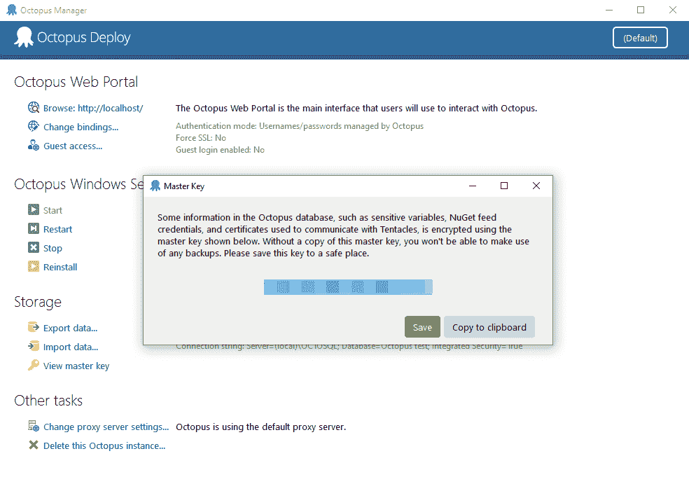
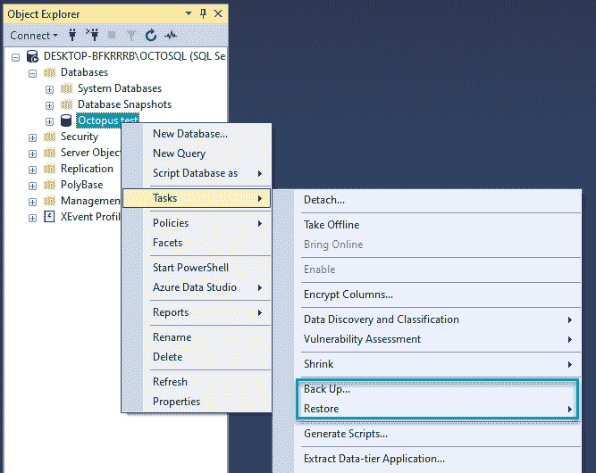
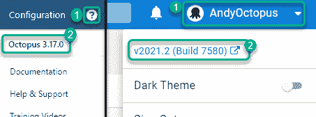
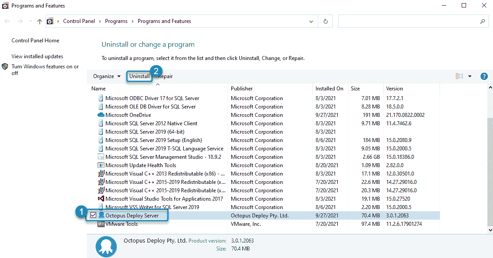
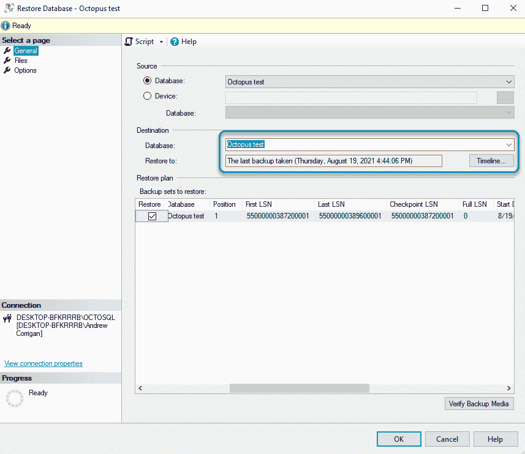

# 从 Octopus 3.x 升级比你想象的要容易——Octopus Deploy

> 原文：<https://octopus.com/blog/upgrading-octopus-3-easier-than-you-think>

“如果它没坏，就不要修理它”这句话在发展的世界里并不总是有效的。Octopus 也不例外，这就是为什么我们的目标是通过我们自己的主要版本来改进您发布版本的方式。如果您没有更新 Octopus，您可能会错过一些使部署更容易、更高效并帮助您的团队进行协调的功能。

也就是说，我们理解为什么有些人更喜欢老版本的 Octopus。您可能觉得您当前的版本可以满足您的需求，或者公司政策可能会要求您保留几个版本以避免风险。也许你落后于更新，担心时间和资源来获得最新的。

特别是对于最后一类人，让我们看看我们是否能减轻你的恐惧。有了规划和适合您业务的正确方法，您可以对从我们最古老的“现代”版本升级充满信心。

在这篇文章中，我浏览了:

*   您因不升级而错过的功能
*   升级前要备份什么，以及其他注意事项
*   规划升级时避免风险的方法
*   从 3.x 就地升级到我们最新版本的示例
*   如果出现问题，如何回滚
*   如果您有任何疑问或问题，我们如何帮助您

## 自 Octopus 3.1 以来我们引入的功能

如果还在 3.x 版本上，你会错过 Octopus 的发展以及现代部署标准，还有一堆新特性。

以下是我们在 Octopus 3.1 和 2021.2 之间添加的内容:

*   改进的用户界面——新的流程编辑器、黑暗模式和全局搜索
*   对配置文件的改进，包括对 JSON、XML、YAML 和属性文件的内置支持
*   空间(Spaces)-不同团队只能看到和使用他们需要的东西
*   [操作手册](https://octopus.com/docs/runbooks) -允许您自动执行日常维护和紧急操作任务
*   [租户](https://octopus.com/docs/tenants) -为软件即服务(SaaS)或多区域部署创建客户特定的渠道
*   [项目导出和导入](https://octopus.com/docs/projects/export-import) -导出一个或多个项目以导入到其他空间或实例中
*   [代码为](https://octopus.com/docs/projects/version-control)的配置 Octopus 项目的版本控制(这是早期访问预览)

我们还增加了新的平台集成，包括支持:

*   主要云提供商——微软 Azure、亚马逊网络服务(AWS)和谷歌云平台(GCP)
*   Kubernetes 和 AWS 弹性集装箱服务(ECS)
*   Linux 上的自托管 Octopus
*   Linux、ARM 和 ARM64 的触角
*   Chocolatey、Homebrew、APT 和 YUM 的 Octopus 命令行(CLI)
*   插件用于:

## 要备份什么以及如何备份

### 万能钥匙

主密钥是一个独特的安全字符串，用于保护 Octopus Deploy 数据库中的敏感数据。没有它，您无法在干净的操作系统上恢复备份。

除了数据库，这是升级前最重要的备份。我们无法找回丢失的万能钥匙。

要备份主密钥:

1.  在你的服务器上打开 Octopus Manager
2.  点击**存储**标题下的**查看主密钥**
3.  在这里，您可以单击:
    *   **保存**将主密钥保存在文本文件中
    *   **复制到剪贴板**粘贴到某个安全的地方，比如密码管理器

[](#)

### 许可密钥

您还需要许可证密钥来恢复实例。

要备份许可证密钥，请执行以下操作:

1.  打开 Octopus 门户网站，点击顶部菜单中的**配置**。
2.  从左侧菜单中选择**许可证**。从 XML 框中复制所有文本并粘贴到安全的地方。

如果您找不到或不知道您的许可证密钥，[请发送电子邮件给我们的客户成功团队](mailto:customersuccess@octopus.com)，我们可以帮助您找回它。

### 数据库ˌ资料库

在升级 Octopus 之前，您应该备份您的数据库。大多数数据库管理工具都有向导来帮助您。

例如，在微软的 SQL Server Management Studio (SSMS)中备份数据库:

1.  在数据库服务器上展开**数据库**文件夹
2.  右击数据库，选择**任务**，点击**备份…**
3.  使用**目的地**部分设置您想要存储备份的位置，并点击**确定**

[](#)

对于那些喜欢使用 T-SQL 命令的人，您可以使用以下命令将备份保存到 NAS 或文件共享:

```
BACKUP DATABASE [OctopusDeploy]
          TO DISK = '\\SomeServer\SomeDrive\OctopusDeploy.bak'
             WITH FORMAT; 
```

如果不确定，请咨询您的数据库管理员。

### 数据文件夹

复制并存储下列文件夹及其所有数据:

*   c:\章鱼\神器
*   c:\八达通\套餐
*   c:\章鱼\任务日志

### 下载你已经在使用的相同版本的 Octopus

你需要现有的八达通版本:

要检查您的版本，请打开 Octopus 门户网站，然后单击 Octopus 右上角的问号。版本号位于下拉列表的顶部。

然后前往我们的[下载档案库](https://octopus.com/downloads/previous)重新下载该版本。

【T2 

## 升级前需要考虑的其他事项

### 八达通牌照

您可以在 3 个不同的实例上使用您的 Octopus 许可证(由它连接的数据库决定)。如果您认为您将超出您的 Octopus 实例限制，[发送电子邮件给我们的客户成功团队](mailto:customersuccess@octopus.com)询问您的选择。

### 不要一次做太多

虽然利用 Octopus 升级的停机时间来完成其他任务(比如更改 Octopus 服务器的操作系统或转移到高可用性实例)很有诱惑力，但我们建议只关注升级。

这样做将:

*   确保升级尽可能平稳运行
*   防止其他任务使升级复杂化
*   减少对八达通用户的影响
*   如果您已经使用了我们的最新版本，那么让其他任务变得简单一点

## 规避风险的策略

升级 Octopus 时，有两种推荐的方法可以避免风险。两者都很简单，但是你应该在开始之前考虑哪一个最适合你的生意。

我们来分解一下选项。

### 方法 1:克隆您的实例并升级

克隆实例并升级克隆是我们推荐的方法，因为它允许您:

*   测试时保持主实例可用
*   在承诺升级之前，对升级有充分的信心
*   不用担心出错时会回滚

该方法的主要步骤是:

1.  将实例置于维护模式
2.  备份数据库
3.  使实例退出维护
4.  将备份作为新数据库恢复到所需的 SQL Server 上
5.  下载与主实例相同版本的 Octopus，并将其安装在新的服务器上
6.  配置新实例以指向数据库的新副本
7.  从主实例的备份文件夹中复制所有文件
8.  可选:禁用所有部署目标
9.  升级克隆的实例
10.  测试克隆的实例，然后检查所有 API 脚本、CI 集成和部署工作
11.  决定是迁移到新实例，还是执行新备份并升级主实例

阅读我们的升级文档，更详细地了解这个方法的步骤。

#### 此方法的注意事项

虽然这是平稳过渡的最佳选择，但这种方法非常耗时，而且在迁移过程中需要停机。它的成本也很高，因为您必须克隆整个环境。这意味着硬件、许可或云服务的成本翻倍。

当团队在测试期间继续使用主实例时，您也有“漂移”的风险。如果你认为你需要一周以上的时间来理清事情，你可以:

*   请选择方法 2
*   找出克隆实例上的任何问题，然后在合适的时候在新实例上重启

### 方法 2:创建一个新的实例来测试流程，然后放心地更新

一些客户可能没有时间或资源来完成第一种方法。相反，您可以用几个项目创建一个小的测试实例，以便在主实例上升级之前获得信心。

这种方法:

*   节省时间和资源
*   停机时间更短
*   消除漂移的风险
*   如果出现问题，很容易回滚

该方法的主要步骤是:

1.  下载与主实例相同版本的 Octopus，并将其安装在新的虚拟机上
2.  从主实例中导出一些项目，并将它们导入到测试实例中
3.  下载最新版本的八达通
4.  备份测试实例数据库
5.  将测试实例升级到最新的 Octopus 版本
6.  测试并验证测试实例
7.  将主实例置于维护模式
8.  备份主实例上的数据库
9.  备份主实例上的所有文件夹
10.  对主实例进行就地升级
11.  测试升级后的主实例
12.  将主实例退出维护模式

阅读我们的升级文档，更详细地了解该方法的步骤。

#### 此方法的注意事项

对于旧版本的 Octopus，您只能使用 Octopus Manager 导出所有数据，尽管您可以通过命令行获得部分导出。对您想要导出进行测试的每个项目运行以下命令:

```
Octopus.Migrator.exe partial-export --instance=OctopusServer --project=AcmeWebStore --password=5uper5ecret --directory=C:\Temp\AcmeWebStore --ignore-history --ignore-deployments --ignore-machines 
```

### 升级高可用性 Octopus 设置

升级 Octopus 的高可用性实例与普通升级没有什么不同，但是由于额外的节点，需要注意一些事情。

在升级其他节点之前，您必须只升级一个节点。Octopus 安装程序会更新数据库，因此一次升级所有节点会导致数据库问题。

高可用性升级的主要步骤是:

1.  下载最新版本的八达通
2.  启用维护模式
3.  停止所有节点
4.  备份数据库和 Octopus 文件夹
5.  升级 1 个节点
6.  升级剩余节点
7.  启动所有停止的节点
8.  测试升级的实例
9.  禁用维护模式

由于高可用性，Octopus 数据文件夹也可能存储在网络驱动器上，而不是节点上。升级前，您需要知道此位置才能备份文件。请记住，您应该备份的文件夹是:

*   史前古器物
*   包装
*   任务日志

## 从 3.1 就地升级的示例

无论是在克隆、测试还是生产实例上，Octopus 的就地升级都是一样的。

如果从 a 3 升级。x 版本，您应该升级到 3.17，然后再跳转到我们的最新版本。这提供了最可靠的升级途径，因为 3.1 版和 3.17 版之间有很大的差异。

谢天谢地，不管你运行的是哪个版本的 Octopus，升级过程都不会花很长时间。

### 开始之前

对于此升级示例，您应该:

### 步骤 1:启用维护模式

一旦所有东西都备份好了，您应该将实例置于维护模式。这意味着只有 Octopus 管理员可以部署。

要设置维护模式，点击顶部菜单中的**配置**，从左侧选择**维护**。在上将**维护模式**切换到**，点击**保存**。**

### 第二步:安装八达通 3.17

1.  关闭八达通管理器和八达通门户网站。
2.  运行 Octopus 3.17 的安装程序，完成后点击**完成**。
3.  八达通将自动更新您的配置和 SQL 数据库，然后打开八达通管理器。
4.  打开 Octopus 门户网站，点击右上角的问号，查看版本是否为 3.17。版本在菜单的顶部。
5.  运行一个测试部署来检查一切是否正常。

### 第三步:安装最新版本的八达通

1.  关闭八达通管理器和八达通门户网站。
2.  运行 Octopus 最新版本的安装程序，完成后点击**完成**。
3.  八达通将自动更新您的配置和 SQL 数据库，然后打开八达通。
4.  打开 Octopus 门户网站，点击右上角的用户名，检查版本是否是最新的。版本在菜单的顶部。
5.  运行一个测试部署来检查一切是否正常。

### 第四步:让 Octopus 退出维护模式

要解除维护模式，点击顶部菜单中的**配置**并从左侧选择**维护**。点击**禁用维护模式**。

## 出错时回滚

虽然我们对 Octopus 从现代版本的升级过程充满信心，但我们知道问题仍然会发生，特别是复杂的设置。

如果发生意外，您可以轻松回滚到旧版本的 Octopus。

### 第一步:卸载新的八达通版本

1.  关闭八达通门户网站和八达通管理器
2.  在 Windows 开始菜单中找到 Octopus Manager 或使用任务栏进行搜索，右键单击并选择**卸载**
3.  从应用程序列表中选择 Octopus 并点击**卸载**

[](#)

### 步骤 2:恢复数据库

使用您的数据库管理工具将数据库恢复到原始状态(例如，使用微软的 SSMS):

1.  在数据库服务器上展开**数据库**文件夹。
2.  右击数据库，选择**任务**，**恢复**，选择**数据库**。
3.  使用向导选择正确的备份或文件。在我的情况下，它默认为我的最后一次备份。准备好后点击**确定**。
4.  在弹出的**数据库恢复成功**上点击**确定**完成。

[](#)

### 步骤 3:恢复 Octopus 文件夹

如果在原始服务器上回滚，我们建议您在恢复原始文件夹之前将升级的 Octopus 文件夹复制到新位置。一旦知道回滚成功，就可以删除它们。

要恢复原始版本:

1.  删除以下文件夹的内容:
    *   c:\章鱼\神器
    *   c:\八达通\套餐
    *   c:\章鱼\任务日志
2.  将旧版本的文件复制回相同的位置

如果恢复到一个干净的服务器，你只需要复制文件夹到 C:\Octopus。

### 第四步:重新安装之前版本的 Octopus

你现在可以重新安装你的原始版本的八达通。

1.  运行你原来的章鱼版本的安装程序，完成后点击**完成**。如果回滚到干净的操作系统，Octopus 安装向导将在安装前提示您输入许可证密钥和主密钥。
2.  Octopus Manager 应该会自动打开。您可能需要手动启动 Octopus 服务器-只需点击左侧的**启动**。
3.  打开八达通门户网站。重新安装后第一次打开 Web 门户时，可能会出现与缓存相关的错误。如果发生这种情况，刷新标签，八达通应该加载罚款。
4.  运行部署以检查一切是否仍然正常。

## 下一步是什么？

升级完 Octopus 实例后，可以选择为将来的升级节省一些工作。

首先是自动升级八达通卡。这使得 Octopus 能够为自己部署新版本，执行所有必要的步骤并减少停机时间。

如果 Octopus 服务器的本地实例不是业务需求，您可以[迁移到 Octopus Cloud](https://octopus.com/docs/octopus-cloud/migrations) 。使用 Octopus Cloud 意味着您永远不必担心升级，并且您可以在我们的所有新功能可用时立即访问它们。

## 我们可以帮忙

如果您有任何问题或需要帮助规划您的最佳升级方法，我们随时恭候。我们的客户成功团队可以针对规划或升级后的问题提供实例审查和支持——我们距离[只有一封电子邮件](mailto:customersuccess@octopus.com)的距离。

愉快的部署！