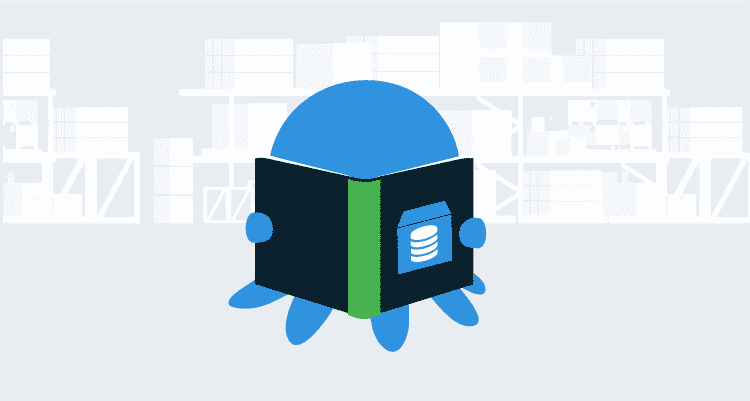

# 自动化数据库部署流程:案例研究- Octopus 部署

> 原文：<https://octopus.com/blog/use-case-for-designing-db-deployment-process>

在加入 Octopus Deploy 之前，我是试点团队的首席开发人员，负责自动化数据库部署，将每次部署的时间从 2 到 4 小时缩短到 10 分钟。当我开始的时候，我认为我们应该自动化现有流程中的步骤，并且我开始实现工具来实现这一点。我一点也不知道，整个过程将会改变。

本文是上一篇文章的延续:[如何设计自动化的数据库部署过程](/blog/designing-db-deployment-process)，如果您愿意，您可以跳到下一篇文章，在那里我为[提供了使用 Octopus Deploy](/blog/implementing-db-deployment-process) 实现数据库部署过程的分步指南。

我们所有的数据库部署文章都可以在[这里](https://octopus.com/database-deployments)找到。

## 在这篇文章中

## 设计数据库部署流程的快速概述

如果你跳过了[上一篇文章](/blog/designing-db-deployment-process)，这里有一篇 TL；DR；

*   创建一个小团队或工作组来定义流程。包括来自每个部署阶段的代表(开发人员、数据库管理员等。).工作组不应超过 4 至 6 人。
*   确定要包含在工作组中的试验团队或应用程序。
*   召开为期 1 至 2 天的会议，启动工作组。
    *   写下现有的流程，确定关键人员、难点和需要改变的内容。
    *   起草理想的部署流程。
    *   研究工具。
    *   在启动结束时，试点团队应该知道需要实施什么以及使用什么工具。
*   试点团队实施新流程。
    *   一直部署到生产。
    *   迭代流程。
    *   在这个过程成功一段时间后，看看是否有人愿意成为早期采用者。
    *   与早期采用者团队一起迭代流程。
*   普遍采用。
    *   专注于建立对流程的信任。
    *   推广到多个团队。
    *   找到痛点就迭代。

## 组建工作组

该公司的一位 DBA 总结得很好，他们说:“我们的数据库部署过程是西部大开发。”我们每个月都有更多的开发人员加入公司，新的团队不断形成，每天都有更多的代码被部署，数据库部署的问题必须停止。

是时候成立一个工作组了。

DBA 和数据库架构师都喜欢使用 Redgate 的工具，所以他们向 Redgate 寻求帮助。雷德盖特同意帮忙，以换取一个案例研究。他们会派两个人飞过来和我们的工作组会面几天。当我写这篇文章时，我 99%确定他们不会一直这样做。我们本可以在正确的时间抓住他们。

数据库管理员确定了在工作组中代表他们的数据库管理员。最后决定的是试点团队。这是我参与的时候，因为我的团队被选为试点团队。

天真的我期望 Redgate 帮助我们在现有的流程中实现他们的工具，所以我开始着手做了。然而，工作组扔掉了我大约 75%的工作。这没什么大不了的。这是一次很好的学习经历，因为它让我对数据库部署工具如何工作有了更好的基本理解，这有助于我为启动会议做出贡献。

### 启动会议

我的团队中的数据库开发人员，一个 DBA，一个数据库架构师，两个 Redgaters，我见了两天。第一天的重点是设计我们的理想流程。最终目标是有一个流程部署到`development`、`test`、`staging`，并一直部署到`production`。

首先，我们浏览了现有的流程，如下所示:

1.  一个开发者在`test`做了一个改变。所有开发者在`test`都有 sysadmin 权限。他们应该在`development`中进行更改，但是`test`有所有的数据来验证他们的更改，所以这是他们的代码指向的服务器。
2.  开发人员在 SSMS 更改连接，并对`development`进行更改。在`development`中所有开发者都有 sysadmin 权限。
3.  数据库开发人员或首席开发人员运行 [Redgate SQL Compare](https://www.red-gate.com/products/sql-development/sql-compare/) 来生成`test`和`staging`之间的增量脚本。任何复杂的数据库更改(移动列、合并列等。)被删除并手动编写脚本。脚本保存在共享文件夹中。除了 DBA 之外的每个人都拥有对`staging`的只读权限。数据库管理员必须运行脚本。
4.  通过电子邮件通知 DBA 运行`staging`上共享文件夹中的脚本。它们运行脚本并将输出发送给请求者。
5.  在转到`production`之前，可以将多个变更推送到`staging`。因此，数据库开发人员或首席开发人员会在`staging`和`production`之间生成一个新的 Redgate SQL 比较增量脚本。就像以前一样，任何复杂的数据库更改(移动列、合并列等。)被删除并手动编写脚本。脚本保存在共享文件夹中。除了 DBA 之外，每个人都对`production`拥有只读权限。
6.  DBA 通过变更请求得到通知，在`production`中运行一组脚本。他们运行脚本，将结果保存到变更请求系统，该系统会向请求者发送电子邮件。

我们接下来解决了这些问题:

1.  谁参与了这个过程？**回答**:开发人员、数据库开发人员、首席开发人员、DBA。
2.  他们有什么权限？**回答**:开发人员、数据库开发人员、首席开发人员都有`development`和`test`的 sysadmin 权限。DBA 拥有`development`、`test`、`staging`和`production`的系统管理员权限。
3.  他们为什么会参与进来？**回答**:开发人员、首席开发人员和数据库开发人员对`development`和`test`进行修改。数据库开发人员和首席开发人员使用 Redgate SQL Compare 创建增量脚本。DBA 将增量脚本部署到`staging`和`production`。
4.  哪些环境有不同的流程？**答**:有三个流程，一个是部署到`development`和`test`的，而`staging`和`production`的流程相似但略有不同。`Production`涉及一个变更请求系统。
5.  为什么会不一样？**回答**:权限和审核；`staging`从`production`定期刷新，用于暂存和最终验证，因此`staging`需要尽可能靠近`production`以帮助消除意外。对`production`的任何更改都需要一个更改请求，因为这是审计员检查的内容。
6.  脚本运行失败会发生什么？**回答**:在`development`和`test`中，写剧本的人运行了剧本，他们做了必要的调整，重新运行。在`staging`和`production`中，DBA 通知请求者失败。请求者调试脚本并进行必要的调整。然后，他们要求 DBA 再次运行该脚本。
7.  为什么脚本通常会失败？**回答**:失败的发生是因为每个环境都有不同的 delta 脚本。缺少架构更改或迁移脚本。
8.  谁审查脚本，何时审查？**答**:数据库开发人员或首席开发人员在进入`staging`之前审查变更。由于不同的 delta 脚本，DBA 在去`staging`和`production`之前审查脚本。
9.  谁需要参与每次部署？**答**:部署到`development`和`test`只涉及做出改变的人。到`staging`的部署涉及请求者、数据库开发人员或主要开发人员以及 DBA。部署到`production`需要每个人，因为每个环境都有一个独特的增量脚本，任何问题都需要立即修复。
10.  什么不起作用，什么需要改变？**回答**:见下文。

## 需要改变什么

敏锐的读者会注意到这些答案中反复出现的主题。

*   三个不同的过程。
*   每个环境唯一的增量脚本。
*   独特的 delta 脚本意味着很难或者几乎不可能测试。
*   共享开发环境。
*   直到该去`staging`的时候，评论才出现。
*   在`production`部署期间“全体人员准备就绪”。
*   没有谁做了什么更改、何时做的或为什么做的历史记录。
*   通过文档手动跟踪更改。
*   在`development`、`test`或`staging`中没有审计。对`production`的一点点审核。

我的团队负责的应用程序有 700 个表。所有数据库访问都是通过存储过程完成的，包括 CRUD 操作。数据库大约有 5000 个对象(表、存储过程、函数等)。).所有的开发都是在同一个数据库上完成的。当我们发布时，一些改变被推进，而另一些改变被排除。我们记录了要在一张纸上包含哪些更改。这不是 20 年前。这发生在 2014 年。

这些问题导致了 2 到 4 个小时的`production`部署，我们不信任这一过程，这导致了密集的验证过程。实际的部署可以在 30 分钟内完成，但是剩下的 90 分钟要花在验证部署上。这包括 QA、业务所有者、业务分析师、开发人员、首席开发人员和运行各种场景的经理。即使付出了所有的努力，我们仍然错过了一些随机的事情，只有 0.5%的用户遇到过。

> 大约 60%的情况下，由于错过了模式更改，我们不得不在第二天进行紧急修复。

## 理想过程的草稿

起草理想的流程花了相当多的时间。这是由于缺乏工具所能提供的知识造成的。当时，我们知道源代码控制、构建服务器和 Redgate 工具，但是我们都不熟悉部署工具能提供什么。谢天谢地，雷德盖特在那里帮助教育我们。

首先，我们列出了各种工具及其提供的功能:

*   源代码控制
    *   它存储所有的 SQL 脚本。
    *   它是变化的真相中心。
    *   包括为新特征创建分支的能力。
    *   它提供了在合并之前检查变更的能力。
*   数据库工具
    *   它提供了一种在目标数据库上运行源代码管理中存储的脚本的方法。
    *   包括某种*预览*功能，可以生成一个文件供人们在部署期间查看。该文件可以是实际的增量脚本，也可以是总结更改的 HTML 文件。
*   构建服务器
    *   从源代码管理中获取 SQL 脚本并将其打包。
    *   它将包推送到部署服务器。
    *   它可以监视多个分支，并为每个分支构建。
*   部署工具
    *   调用数据库工具来部署数据库更改。
    *   使用数据库工具*预览*功能创建一个文件，以便在部署期间进行审查。
    *   它提供审计和批准。
    *   用于部署到所有环境。
    *   具有允许各种场景的安全特性，例如只允许数据库管理员部署到`production`。

随着工具责任的排除，我们花了大量的时间讨论共享数据库模型和专用数据库模型。专用数据库模型意味着每个开发人员在他们自己的机器上运行数据库服务器。使用共享数据库模型，我们发现:

*   进行了数据库更改，代码更改需要一个小时到几天才能使用新的数据库更改。有时会阻止其他开发人员和 QA 使用应用程序中的特定功能或区域。
*   有两个真实中心，源代码控制和共享数据库，所有的更改都在这里进行，然后保存到源代码控制。如果源代码管理和共享数据库之间有冲突，哪一方会赢？
*   我们无法有效利用分支机构。可以有 1 到 N 个分支，但只能有一个数据库。
*   在审查之前对中央数据库进行了更改，但是审查应该在什么时候进行？
*   每个人都使用相同的测试数据。一个人更改数据会影响团队中的多个人。

我们决定改用专用数据库。对我们来说，这很有意义。我们知道工具是如何工作的，以及哪里会有变化。

是时候勾勒出理想的流程了:

1.  一名开发人员/数据库开发人员/首席开发人员创建了一个分支。
2.  所有数据库更改和代码更改都在该分支上进行。
3.  变更已完成并签入分支。
4.  创建了一个合并请求，这启动了一个构建。构建验证更改是有效的 SQL。
5.  数据库开发人员或首席开发人员审查合并请求中的数据库更改，并提供修复反馈。
6.  分支机构被批准并合并。
7.  构建服务器启动一个构建，验证更改是否是有效的 SQL，如果是，将它们打包并推送到部署服务器。构建服务器告诉部署服务器部署到`development`。
8.  部署服务器部署到`development`。
9.  开发人员/数据库开发人员/首席开发人员告诉部署服务器部署到`test`。
10.  部署服务器部署到`test`。
11.  变更在`test`进行验证。
12.  一个开发人员/数据库开发人员/首席开发人员告诉部署服务器部署到`staging`。部署服务器使用数据库工具为 DBA 生成用于审批的审查文件。
13.  部署服务器通知 DBA 对`staging`的部署请求。他们审查变更并提供修复反馈。
14.  DBA 批准对`staging`的更改。
15.  部署服务器完成部署到`staging`。
16.  开发人员/数据库开发人员/首席开发人员在`staging`中验证变更。
17.  变更请求被提交给 DBA，以将部署服务器中的特定包升级到`production`。
18.  几个小时后，DBA 告诉部署服务器部署到`production`。部署服务器使用数据库工具生成评审文件，供 DBA 评审。
19.  DBA 审查该文件作为最后的完整性检查。
20.  部署服务器完成对`production`的部署。
21.  负责应用程序的团队验证`production`中的变更。

当提出这个过程时，我们有意避免使用工具。直到我们有了流程草案之后，才讨论工具。首先是已经在使用的工具:

*   构建服务器:团队城市正在作为 2012 年 TFS 奥运会的替代项目进行试点。
*   源代码控制:团队城市的试点团队已经转移到 Git。
*   数据库部署:Redgate 的 SQL 变更自动化(当时是这么叫的)。
*   部署服务器:没有，虽然当时我认为构建服务器=部署服务器。

TFS 2012 就要过时了，所以继续使用它没有意义。我的团队是切换到 Git 和 TeamCity 的团队的一部分。

雷德盖特飞过来帮助我们。我们有一个使用他们工具的原型。我们讨论了 SSDT 和 RoundhousE，但他们失败的原因大致相同。95%的人在 SQL Server Management Studio 中更改数据库，太多人忘记将这些更改迁移到 SSDT 或 RoundhousE。我们的讨论以及我们设计的流程导致了对工具的以下关键要求:

1.  可以从 SSMS 保存数据库更改。
2.  自动检测数据库变化。
3.  由该工具处理的大多数更改(添加列、删除列、更改存储过程)能够手动编写和存储复杂的更改(将列移动到新表)。

RoundhousE 满足了 3 个中的 1 个(可以保存来自 SSMS 的数据库更改)，SSDT 满足了 3 个中的 1 个(由该工具处理的大多数复杂更改)。对我们来说，继续在试点项目中使用 Redgate 是有意义的。

我们没有部署服务器，但是在 Redgate 的人解释了 Octopus Deploy 的好处和特性之后，我们使用 TeamCity、Redgate 和 Octopus Deploy 做了一个快速的概念验证。这个概念验证花了大约一个小时才完成，并且显示出了很大的潜力，所以我们决定使用 Octopus Deploy 进行试点。

## 实施流程

使用工具将商定的流程落实到位。让它在`development`和`staging`运行只需要很少的时间。我们确实遇到了一些在动员会上没有预料到的问题:

*   权限:自动化流程能做什么，不能做什么。我们的目标是阻止流程创建新用户并将他们添加到角色中。这样，某人就不能在`production`中给自己 db_owner 权限。
*   解决所有环境之间的差异:在`production`中有模式变化，而在`development`中没有。我们第一次尝试在`production`中运行该流程时，我们几乎将它们消灭。我们很快将这一更改添加到源代码控制中，重新构建包，并通过环境将其推送到`production`。

在解决了这些小问题之后，我们能够将流程部署到`staging`和`production`。

## 加速部署

很快，由于缺少模式更改而导致的紧急修复的数量下降到了零。仅此一项就是巨大的胜利。

因此，我们花在验证上的时间开始减少。

1.  30 分钟部署，90 分钟验证。
2.  25 分钟部署，80 分钟验证。
3.  20 分钟部署，70 分钟验证。
4.  15 分钟部署，60 分钟验证。
5.  10 分钟部署，50 分钟验证。
6.  5-8 分钟部署，40 分钟验证。
7.  5-8 分钟部署，30 分钟验证。

这反过来又让我们想要更频繁地部署。频繁的部署意味着较小的变化。较小的变化意味着较少的验证。更少的验证意味着更快的部署。更快的部署意味着我们希望更频繁地部署。这个循环一直持续到验证也花了 5 到 8 分钟。

## 早期采用者和迭代

其他几个团队(剩下的 9 个团队中的)看到了我们正在做的事情，他们作为早期采用者加入进来。让三个团队使用该流程，找出棘手问题和需要改进的地方:

*   没有部署已批准的项目。我没有正确使用 Redgate 工具。我使用了一个命令来生成预览以供审批。然后我忽略了那个预览，直接使用不同的命令来部署这个包。每 30 个部署中就有 1 个最终发生了意外变化。通过一点研究，找到并实现了正确的命令。
*   **将预览文件保存到文件共享。**不知道章鱼还有把文件存为神器的能力。审批者可以从 Octopus 下载工件。这比在文件共享中找到正确的文件要好。对脚本的一个小调整解决了这个问题。
*   **数据库管理员成为瓶颈。**三个团队部署到`staging`时，数据库管理员经常跟不上。他们也厌倦了在部署期间必须在线才能批准对`production`的部署。我们改变了流程，在部署到`staging`时生成两个文件，一个用于`staging`，一个用于`production`。部署将在`staging`进行，DBA 在事后批准了一切。在`production`中，当部署失败时，我们添加了一个寻呼它们的步骤。
*   **开发人员没有使用他们的专用数据库。**开发人员的数据库中没有测试数据，所以他们指向`test`来测试他们的更改。我们通过在每次部署后在`test`中创建数据库备份来解决这个问题。开发人员可以将该数据库恢复到他们的本地实例，并拥有他们需要的所有数据。

没有一个过程从一开始就是 100%完美的。预计迭代多次。

## 普遍采用

最终，普遍采用的时候到了。我对这种推后感到非常惊讶，特别是来自数据库开发人员的推后。他们花了太多的时间来生成部署脚本，他们相信这就是他们为团队带来价值的方式。人们担心这个过程会让他们失业。事实并非如此。该过程旨在消除所有浪费在生成和调整部署脚本上的时间，从而将他们解放出来，专注于重要的事情，如数据库结构、性能、审查更改以及处理复杂的更改。

事后看来，我应该:

*   与数据库开发人员和团队中的首席开发人员安排一次会议，以完成整个过程。
*   为他们两人安排了另一次会面，以将应用程序的数据库纳入流程。
*   为他们安排了最后一次会议，教他们的团队如何使用该流程，我在后台回答问题。

但我没有那么做。我把所有这些合并成一个大型会议。活到老学到老。

## 结论

为了自动化数据库部署，我们不得不做一些改变。最终，这是值得的。部署到`production`变成了无事件。我在那家公司做的最后一次`production`部署涉及到我自己、企业所有者和我的经理。我们在线了 30 分钟。其中 25 分钟用来讲有趣的故事和糟糕的笑话。部署很顺利地完成了。

在本文中，我重点介绍了我们如何设计自动化数据库部署过程。我没有关注我们实际上做了什么，但是我将在下一篇文章中讨论这个问题。

下次再见，愉快的部署！

如果您喜欢这篇文章，好消息，我们有一个关于自动化数据库部署的完整系列。