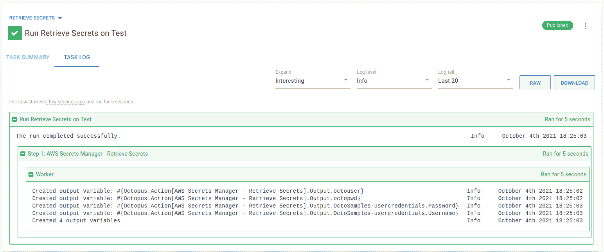

# 使用 AWS Secrets Manager 和 Octopus - Octopus Deploy

> 原文：<https://octopus.com/blog/using-aws-secrets-manager-with-octopus>

我已经编写了几个 step 模板，扩展了 Octopus 的功能，以与秘密管理器集成，最后一个是 [Google Cloud Secret Manager](https://octopus.com/blog/using-google-cloud-secret-manager-with-octopus) 。在这篇文章中，我将介绍另一个主要的云提供商，Amazon Web Services (AWS)。

我浏览了[AWS Secrets Manager-Retrieve Secrets](https://library.octopus.com/step-templates/5d5bd3ae-09a0-41ac-9a45-42a96ee6206a/actiontemplate-aws-secrets-manager-retrieve-secrets)步骤模板，该模板旨在从 AWS Secrets Manager 中检索机密，以便在您的部署或操作手册中使用。

## 入门指南

这篇文章假设读者对定制步骤模板和 Octopus 社区库比较熟悉。

此外，这篇文章没有详细介绍 AWS Secrets Manager 的概念或如何设置 Secrets Manager。你可以通过阅读亚马逊的[用户指南](https://docs.aws.amazon.com/secretsmanager/latest/userguide/intro.html)了解更多信息。

本文中的步骤模板使用 **AWS 命令行接口** (AWS CLI)，从 [AWS 秘密管理器](https://aws.amazon.com/secrets-manager/)中检索秘密，这是一个 AWS 命令行工具。在该步骤能够成功检索机密之前， **AWS CLI** 工具必须在部署目标或工作者上可用。step 模板已经在 Windows 和 Linux 上测试过(安装了 PowerShell 核心)。

## 向 AWS 认证

在从 AWS Secrets Manager 中检索机密之前，您必须通过 AWS 的身份验证。在他们的[认证和访问控制指南](https://docs.aws.amazon.com/secretsmanager/latest/userguide/auth-and-access.html)中，亚马逊描述了他们如何使用 [IAM 权限](https://docs.aws.amazon.com/IAM/latest/UserGuide/introduction.html)来控制对秘密的访问:

> 通过使用 IAM 权限策略，您可以控制哪些用户或服务可以访问您的机密。权限策略描述了谁可以对哪些资源执行哪些操作。

在 Octopus 中，您可以使用具有适当权限的 [AWS 帐户](https://octopus.com/docs/infrastructure/accounts/aws)进行 AWS 认证。

要了解有关使用 AWS Secrets Manager 将 IAM 权限策略附加到机密或身份的更多信息，请查看[权限策略示例](https://docs.aws.amazon.com/secretsmanager/latest/userguide/auth-and-access_examples.html)

## 找回秘密

[AWS 机密管理器-检索机密](https://library.octopus.com/step-templates/5d5bd3ae-09a0-41ac-9a45-42a96ee6206a/actiontemplate-aws-secrets-manager-retrieve-secrets)步骤模板:

*   从 AWS 机密管理器中检索一个或多个机密
*   从每个秘密中提取一个或多个键/值对
*   为检索到的每个键/值对创建敏感的输出变量

像大多数云提供商一样，AWS Secrets Manager 通过使用版本标识符和一个或多个分级标签来支持[版本化的机密](https://docs.aws.amazon.com/secretsmanager/latest/userguide/getting-started.html#term_version)。这是有用的，因为它可以定期轮换你的秘密。

转移标签在循环过程中跟踪不同的版本。AWS 秘密总是有一个带有分级标签`AWSCURRENT`的版本，这是当前的秘密值。

AWS Secrets Manager 中的一个秘密可以存储多个值。Amazon 建议使用带有键/值对的 JSON 文本字符串，例如:

```
{
  "hostname"   : "test01.example-database.net",
  "hostport"   : "3458",
  "user"       : "octo_admin_user",
  "pwd"        : "M4eXT4a$uPeA$3cRetP@s5w0rd!"
} 
```

此步骤模板设计用于从一个或多个机密中检索多个键/值对。

检索单个机密及其键/值对需要:

*   有权访问机密的 AWS 帐户
*   默认 AWS [区域](https://docs.aws.amazon.com/general/latest/gr/rande.html#ec2_region)代码
*   名称和*可选地*秘密的版本和存储在秘密中的特定键/值对的名称，以便为其创建变量

step 模板有一个高级特性，支持一次检索多个秘密。这需要在新的一行中输入每个秘密。

对于检索到的每个秘密和键/值对，创建一个[敏感输出变量](https://octopus.com/docs/projects/variables/output-variables#sensitive-output-variables)用于后续步骤。默认情况下，任务日志中只会显示已创建变量的数量。要查看任务日志中的变量名，将**打印输出变量名**参数更改为`True`。

### 步骤模板参数

步骤模板使用以下参数:

*   **AWS 账户**:一个 [AWS 账户](https://octopus.com/docs/infrastructure/accounts/aws)，有权限从秘密管理器中访问秘密。

*   **AWS 区域**:指定默认区域。查看 [AWS 区域和端点](https://docs.aws.amazon.com/general/latest/gr/rande.html#ec2_region)文档，获取可用区域代码的当前列表。

*   **要检索的机密名称**:指定要从 AWS Secrets Manager 返回的机密名称，格式:`SecretName SecretVersionId SecretVersionStage | KeyNames | OutputVariableName`其中:

    *   **SecretName** :要检索的秘密的名称。您可以指定机密的`Amazon Resource Name (ARN)`或友好名称。
    *   **SecretVersionId** :您想要检索的秘密版本的唯一标识符。如果未指定该值，则检索当前版本。
    *   **SecretVersionStage** :您想要通过附加到版本的 staging 标签检索的秘密版本。如果未指定该值，则使用默认的分段标签值`AWSCURRENT`。*注意:*如果未指定 **SecretVersionId** ，该值将被忽略。
    *   **KeyNames** :存储在您希望检索其值的秘密中的密钥的名称。可以检索由空格分隔的多个字段。或者，您可以使用特殊关键字`all`或`*`指定所有字段。
    *   **OutputVariableName** 是*可选* Octopus [输出变量](https://octopus.com/docs/projects/variables/output-variables)的名称，用于存储秘密值。如果指定了多个键/值对，则将键/值名称附加到该值。

    如果同时指定了 **SecretVersionId** 和 **SecretVersionStage** ，它们必须指向同一个秘密版本，否则 AWS 通常会返回一个`NotFound`错误。

    **注:**通过在新的一行中输入每个秘密，可以检索多个秘密。更多信息参见[示例](#secret-retrieval-examples)。

*   **打印输出变量名**:将章鱼[输出变量名](https://octopus.com/docs/projects/variables/output-variables)写入任务日志。默认:`False`。

[](#)

### 秘密检索示例

让我们以 AWS Secrets Manager 中存储的名为**octo samples-user credentials**的秘密为例，它有两个键/值对:

以下是检索机密及其键/值对的一些方法:

1.  `OctoSamples-usercredentials | Username | octousername`

    这将检索秘密并从名为`Username`的键/值中提取值，并将其保存到名为`octousername`的敏感输出变量中。

2.  `OctoSamples-usercredentials | Username Password | octocreds`

    这将检索秘密，并从名为`Username`和`Password`的键/值中提取值，并将它们保存到名为`octocreds.Username`和`octocreds.Password`的两个敏感输出变量中。

3.  `OctoSamples-usercredentials | * | octocreds`

    这将检索秘密，并从秘密中提取所有键/值，并将它们保存到前缀为的敏感输出变量*中。*

4.  `OctoSamples-usercredentials | all`

    这将检索秘密，并从秘密中提取所有键/值，并将它们保存到前缀为`OctoSamples-usercredentials`的敏感输出变量*。*

### 使用步骤

**AWS 机密管理器-检索机密**步骤以与其他步骤相同的方式添加到[部署和运行手册流程中。](https://octopus.com/docs/projects/steps#adding-steps-to-your-deployment-processes)

将步骤添加到流程后，填写步骤中的参数:

[](#)

填写参数后，您可以在操作手册或部署流程中执行该步骤。在成功执行时，在匹配机密中找到的键/值对中的任何值都被存储为敏感的输出变量。如果将步骤配置为打印变量名，它们会出现在任务日志中:

[](#)

在后续步骤中，创建的输出变量可以在您的部署或 runbook 中使用。

**提示:**对于任何输出变量名，记得用您的步骤名替换`AWS Secrets Manager - Retrieve Secrets`。

## 结论

AWS Secrets Manager-Retrieve Secrets 步骤模板演示了与 AWS Secrets Manager 集成并利用 Octopus 部署或 runbooks 中存储的秘密是很容易的。

愉快的部署！