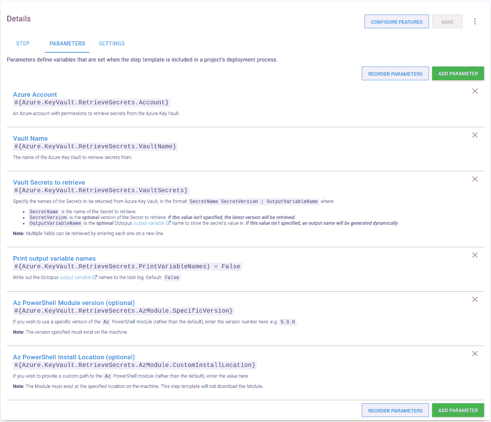
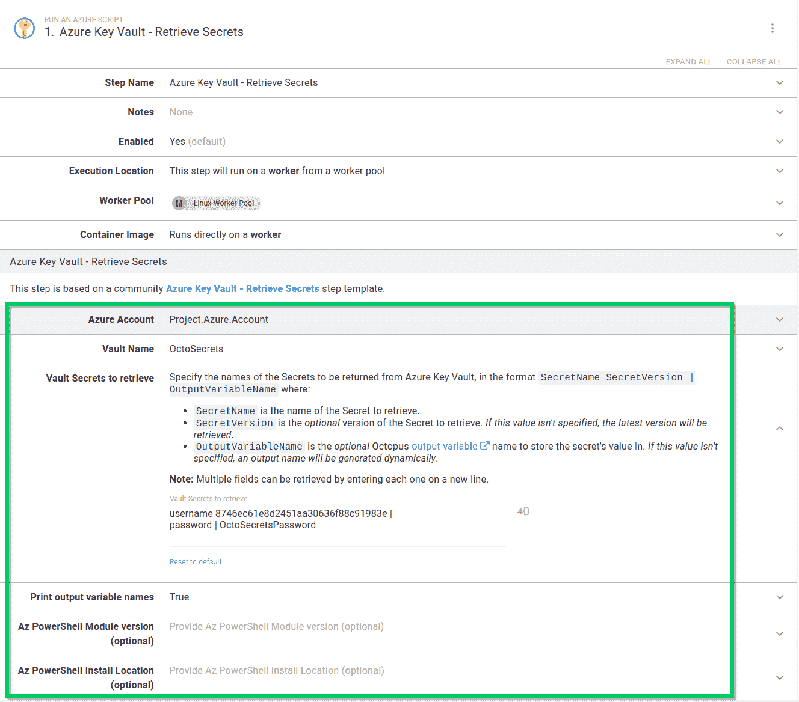
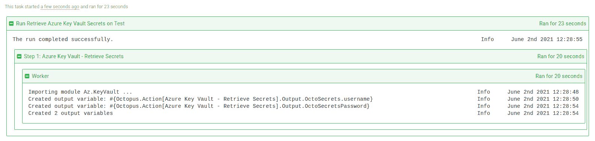

# 使用 Azure Key Vault 和 Octopus - Octopus Deploy

> 原文：<https://octopus.com/blog/using-azure-key-vault-with-octopus>

我最近写了关于使用 step 模板扩展 Octopus 的功能以集成 HashiCorp Vault 的文章。后来，几个人问我是否打算创建 step 模板来与其他 secret managers 集成。

在这篇文章中，我介绍了一个新的步骤模板，[Azure Key Vault-Retrieve Secrets](https://library.octopus.com/step-templates/6f59f8aa-b2db-4f7a-b02d-a72c13d386f0/actiontemplate-azure-key-vault-retrieve-secrets)，它旨在从 Azure Key Vault 中检索机密，以便在您的部署或操作手册中使用。

## 介绍

这篇文章假设读者对定制步骤模板和 Octopus 社区库比较熟悉。

此外，这篇文章没有详细介绍 Azure Key Vault 的概念或如何设置它。你可以通过阅读微软的 Azure Key Vault 基本概念指南来了解更多信息。

本文中的步骤模板使用 [Az 从](https://docs.microsoft.com/en-us/powershell/module/az.keyvault/) [Azure 密钥库](https://azure.microsoft.com/en-gb/services/key-vault/)中检索秘密。KeyVault PowerShell 模块。该模块必须下载并安装在部署目标或工作器上，然后该步骤才能成功检索机密。step 模板已经在 Windows 和 Linux 上测试过了(安装了`PowerShell Core`)。

## 证明

在您可以从 Azure Key Vault 检索机密之前，您必须向 Azure 进行身份验证。在他们的[认证概念文档](https://docs.microsoft.com/en-us/azure/key-vault/general/authentication)中，微软指出:

> 使用 Key Vault 的身份验证与 Azure Active Directory (Azure AD)协同工作，后者负责对任何给定安全主体的身份进行身份验证。

在 Octopus 中，Azure Key Vault 的身份验证可以通过一个 [Azure 帐户](https://octopus.com/docs/infrastructure/accounts/azure)使用服务主体来实现。

除了访问 Azure 中的资源，您的服务主体可能需要配置更多权限来访问和检索 Azure Key Vault 中存储的机密。要了解更多信息，请阅读关于如何使用 Azure 基于角色的访问控制提供对密钥、证书和秘密的访问的 Azure Key Vault RBAC 指南。

## 找回秘密

[Azure Key Vault-Retrieve Secrets](https://library.octopus.com/step-templates/6f59f8aa-b2db-4f7a-b02d-a72c13d386f0/actiontemplate-azure-key-vault-retrieve-secrets)步骤模板从 Azure Key Vault 中检索一个或多个机密，并为每个检索到的机密创建敏感的输出变量。

对于每个秘密，您可以选择检索一个特定的版本，并提供一个定制的输出变量名。

检索一个秘密需要:

*   有权限访问机密的 Azure 帐户。
*   要从中检索机密的 Azure 密钥库的名称。
*   要检索的机密的名称。

step 模板的一个高级特性支持一次检索多个机密。这需要在新的一行中输入每个秘密。

对于检索到的每个秘密，创建一个[敏感输出变量](https://octopus.com/docs/projects/variables/output-variables#sensitive-output-variables)用于后续步骤。默认情况下，任务日志中只会显示已创建变量的数量。要查看任务日志中的变量名，将**打印输出变量名**参数更改为`True`。

### 步骤模板参数

步骤模板使用以下参数:

*   `Azure Account`:一个 Azure 账户，有权限从 Azure Key Vault 中检索机密。

*   `Vault Name`:要从中检索机密的 Azure Key Vault 的名称。

*   `Vault Secrets to retrieve`:指定从 Azure Key Vault 返回的秘密名称，格式:`SecretName SecretVersion | OutputVariableName`其中:

    *   `SecretName`是要检索的秘密的名称。
    *   `SecretVersion`是*可选的*版本的秘密检索。*如果未指定该值，将检索最新版本*。
    *   `OutputVariableName`是*可选* Octopus [输出变量](https://octopus.com/docs/projects/variables/output-variables)的名称，用于存储秘密值。*如果未指定该值，将动态生成一个输出名称*。

    **注意:**通过在新的一行中输入每个字段，可以检索多个字段。

*   `Print output variable names`:将 Octopus [输出变量](https://octopus.com/docs/projects/variables/output-variables)名称写入任务日志。默认:`False`。

*   `Az PowerShell Module version (optional)`:如果您希望使用特定版本的`Az` PowerShell 模块(而非默认版本)，请在此输入版本号。如`5.9.0`。

    **注意:**指定的版本必须存在于机器上。

*   `Az PowerShell Install Location (optional)`:如果您希望为`Az` PowerShell 模块提供自定义路径(而不是默认路径)，请在此输入值。

    **注意:**模块必须存在于机器上的指定位置。此步骤模板不会下载模块。

### 使用步骤

以与其他步骤相同的方式将**Azure Key Vault-Retrieve Secrets**步骤添加到部署和 runbook 流程中。

将步骤添加到流程后，填写步骤中的参数:

填写完参数后，您可以在操作手册或部署流程中执行该步骤。成功执行后，任何匹配的机密都将被存储为敏感的输出变量。如果您已将步骤配置为打印变量名，它们将出现在任务日志中:

在后续步骤中，从匹配密码创建的输出变量可以在您的部署或 runbook 中使用。

**提示:**对于任何输出变量名，记得用您的步骤名替换`Azure Key Vault - Retrieve Secrets`。

## 结论

这篇文章中提到的步骤模板演示了与 Azure Key Vault 集成并利用 Octopus 部署或 runbooks 中存储的秘密是很容易的。

愉快的部署！