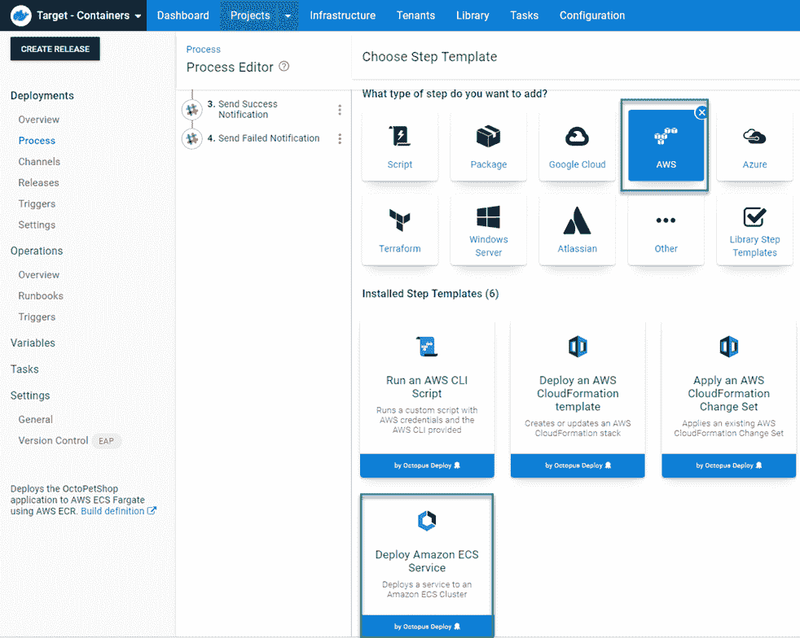
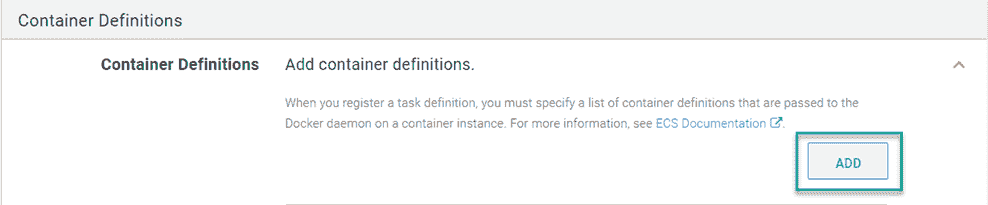
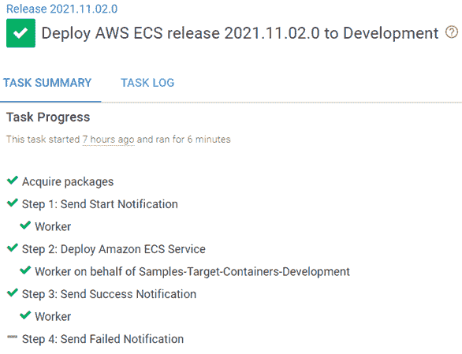
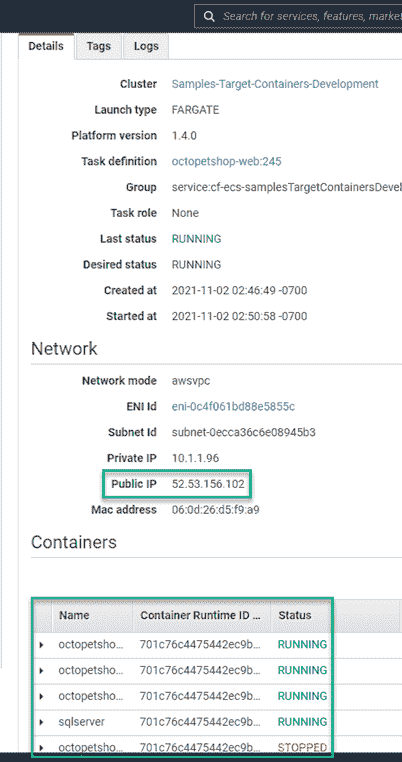
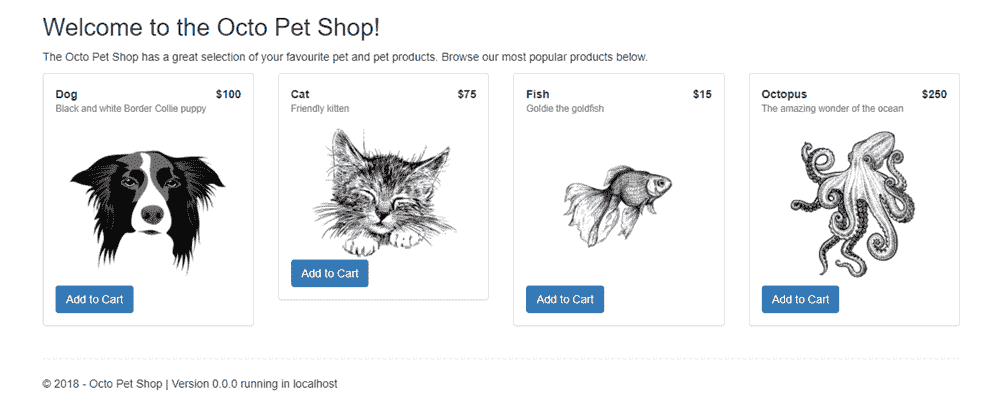

# 使用新的 ECS 部署步骤- Octopus 部署

> 原文：<https://octopus.com/blog/using-ecs-deployment-step>

我之前写过一篇[文章，演示如何使用 Octopus Deploy](https://octopus.com/blog/aws-fargate) 部署到 AWS ECS。我向您展示了如何让它工作，但是使用 AWS CLI 自己编写脚本并不是一种理想的体验。我们[从社区中收集反馈](https://github.com/OctopusDeploy/StepsFeedback/issues/1)，发现我们的客户想要更好的 ECS 支持。从 2021.3 版本开始，Octopus Deploy 包含了一个 ECS 部署步骤，取代了我最初帖子中的所有内容。

在这篇文章中，我将解释如何实现新的 ECS 部署步骤。

## 亚马逊 ECS 目标

首先，您需要创建一个要部署到的 ECS 集群。以下脚本使用 AWS CLI 创建集群:

```
# Get variables
$ecsClusterName = $OctopusParameters['AWS.ECS.Cluster.Name']

# Create cluster
aws ecs create-cluster --cluster-name $ecsClusterName 
```

创建集群后，需要将其作为部署目标添加到 Octopus Deploy 中。创建新目标时，选择 **AWS** 类别，然后选择新的**亚马逊 ECS 集群**目标。

[](#)

这个帖子使用`PetClinic-ECS`作为分配的角色。

与其他目标类型一样，您也可以通过 API 或使用脚本命令来添加目标。

### 应用程序接口

有许多关于如何通过 API 注册目标的例子。然而，ECS 步骤使用了新的**步骤 UI 框架**。ECS 目标的 JSON 文档的`Endpoint`组件不同于其他目标类型。以下示例脚本向您展示了如何通过 API 注册 ECS 目标:

```
# Define parameters
$baseUrl = $OctopusParameters['Global.Base.Url']
$apiKey = $OctopusParameters['Global.Api.Key']
$spaceId = $OctopusParameters['Octopus.Space.Id']
$spaceName = $OctopusParameters['Octopus.Space.Name']
$environmentName = $OctopusParameters['Octopus.Environment.Name']
$environmentId = $OctopusParameters['Octopus.Environment.Id']
$awsAccount = $OctopusParameters['AWS.Account']
$awsECSClusterName = $OctopusParameters['AWS.ECS.Cluster.Name']
$awsRegion = $OctopusParameters['AWS.Region.Name']
$name = $OctopusParameters['AWS.ECS.Cluster.Name']

# Get default machine policy
$machinePolicy = (Invoke-RestMethod -Method Get -Uri "$baseUrl/api/$spaceId/machinepolicies/all" -Headers @{"X-Octopus-ApiKey"="$apiKey"}) | Where-Object {$_.Name -eq "Default Machine Policy"}
Write-Output "Retrieved $($machinePolicy.Name) ..."

# Build JSON payload
$jsonPayload = @{
    Id = $null
    MachinePolicyId = $machinePolicy.Id
    Name = $name
    IsDisabled = $false
    HealthStatus = "Unknown"
    HasLatestCalamari = $true
    StatusSummary = $null
    IsInProcess = $true
    EndPoint = @{
        DeploymentTargetType = "aws-ecs-target"
        DeploymentTargetTypeId = "aws-ecs-target"
        StepPackageId = "aws-ecs-target"
        StepPackageVersion = "1.0.0"
        Inputs = @{
            clusterName = $awsECSClusterName
            region = $awsRegion
            awsAccount = $awsAccount
        }
        RelatedDocumentIds = @($awsAccount)
        Id = $null
        CommunicationStyle = "StepPackage"
        Links = $null
        DefaultWorkerPoolId = ""
    }
    Links = $null
    TenantedDeploymentParticipation = "Untenanted"
    Roles = @(
        "PetClinic-ECS"
    )
    EnvironmentIds = @(
        $environmentId
    )
    TenantIds = @()
    TenantTags = @()
}

# Register the target to Octopus Deploy
Invoke-RestMethod -Method Post -Uri "$baseUrl/api/$spaceId/machines" -Headers @{"X-Octopus-ApiKey"="$apiKey"} -Body ($jsonPayload | ConvertTo-Json -Depth 10) 
```

### 脚本命令

使用 Step UI 框架开发的目标类型利用一个新命令来注册它们的目标类型。下面是如何使用命令通过 PowerShell 或 Bash 注册 ECS 目标的示例:

```
$inputs = @"
{
    "clusterName": "$($OctopusParameters["clusterName"])",
    "region": "$($OctopusParameters["region"])",
    "awsAccount": "$($OctopusParameters["awsAccount"])",
}
"@
New-OctopusTarget -Name $OctopusParameters["target_name"] -TargetId "aws-ecs-target" -Inputs $inputs -Roles $OctopusParameters["role"] 
```

```
read -r -d '' INPUTS <<EOT
{
    "clusterName": "$(get_octopusvariable "clusterName")",
    "name": "$(get_octopusvariable "target_name")",
    "awsAccount": "$(get_octopusvariable "awsAccount")",
}
EOT
new_octopustarget -n "$(get_octopusvariable "target_name")" -t "aws-ecs-target" --inputs "$INPUTS" --roles "$(get_octopusvariable "role")" 
```

## 部署 Amazon ECS 服务步骤

为了向您展示如何使用**部署 Amazon ECS 服务**步骤，这篇文章复制了来自[上一篇文章](https://octopus.com/blog/aws-fargate)的 Octo 宠物店应用程序的容器化版本的部署，使用了新的步骤。

### 添加部署 Amazon ECS 服务步骤

添加**部署亚马逊 ECS 服务**步骤，点击**添加步骤**，选择 **AWS** ，然后**部署亚马逊 ECS 服务**。

[](#)

添加步骤后，使用脚本中的相同信息填充表单字段。没有列出的内容可以留空或使用默认值。

*   名称:`octopetshop-web`
*   期望计数:`1`
*   任务内存(GB): `4 GB`
*   任务 CPU(单位):`0.5 vCPU`
*   安全组 ID:您的 AWS 安全组 ID
*   子事件 id:两个 AWS 子网 id
*   自动分配公共 IP: `Yes`
*   启用 ECS 管理的标签:`No`

点击**添加**按钮，将集装箱添加到 ECS 服务中。

[](#)

*   容器定义:
    *   容器名称:`octopetshop-web`
        *   容器图像:这篇文章从 AWS ACR 中提取 octopetshop-web 图像
        *   容器端口映射:
        *   环境变量
            *   按键:`ProductServiceBaseUrl, Value: http://localhost:5011`
            *   关键词:`ShoppingCartServiceBaseUrl, Value: http://localhost:5012`
    *   容器名称:`octopetshop-productservice`
    *   容器图像:这篇文章从 AWS ACR 中提取 octopetshop-productservice 图像
    *   容器端口映射:
    *   环境变量:
        *   按键:`OPSConnectionString, Value: Database connection string (ie: Data Source=localhost;Initial Catalog=OctoPetShop; User ID=#{Project.Database.User.Name}; Password=#{Project.Database.User.Password}`
    *   容器名称:`octopetshop-shoppingcartservice`
        *   容器图像:这篇文章从 AWS ACR 中提取 octopetshop-web 图像
        *   容器端口映射:
    *   环境变量:
        *   关键:`OPSConnectionString, Value: Database connection string (ie: Data Source=localhost;Initial Catalog=OctoPetShop; User ID=#{Project.Database.User.Name}; Password=#{Project.Database.User.Password})`
    *   容器名称:`sqlserver`
        *   容器映像:这篇文章从微软容器注册表中提取 mssql/server 映像
        *   容器端口映射:
        *   环境变量:
            *   关键:`ACCEPT_EULA, Value: Y`
            *   关键:`SA_PASSWORD, Value: (secure password)`
    *   容器名称:`octopetshop-database`
        *   容器图像:这篇文章从 AWS ACR 中提取 octopetshop 数据库图像
        *   必备:`False`
    *   环境变量:
        *   关键:`DbUpConnectionString, Value: Database connection string (ie: Data Source=localhost;Initial Catalog=OctoPetShop; User ID=#{Project.Database.User.Name}; Password=#{Project.Database.User.Password})`

就是这样！这一步取代了前一篇文章中的自定义脚本。

部署如下所示:

[](#)

## 测试部署

部署完成后，AWS 控制台显示 Fargate 服务正在运行。

[](#)

点击进入集群，您会看到您的容器正在运行，并且分配了一个公共 IP 地址。

[](#)

`octopetshop-database`执行数据库迁移，并被设计为在完成后停止。`STOPPED`状态正常。

octopetshop-web 容器被配置为侦听端口 5000 和 5001。导航到**公共 IP** 地址，端口 5000 将您重定向到 5001 上的 HTTPS。该证书是不受信任的. NET 核心开发证书，因此关于安全风险的对话是正常的。进入该站点后，您会看到 Octo 宠物店应用程序。

[](#)

## 结论

我的[上一篇文章](https://octopus.com/blog/aws-fargate)向您展示了如何使用脚本方法部署到 Amazon ECS。虽然它有效，但体验并不像内置的部署步骤那样简单。这篇文章演示了如何用新的内置 ECS 部署步骤替换脚本方法。

愉快的部署！