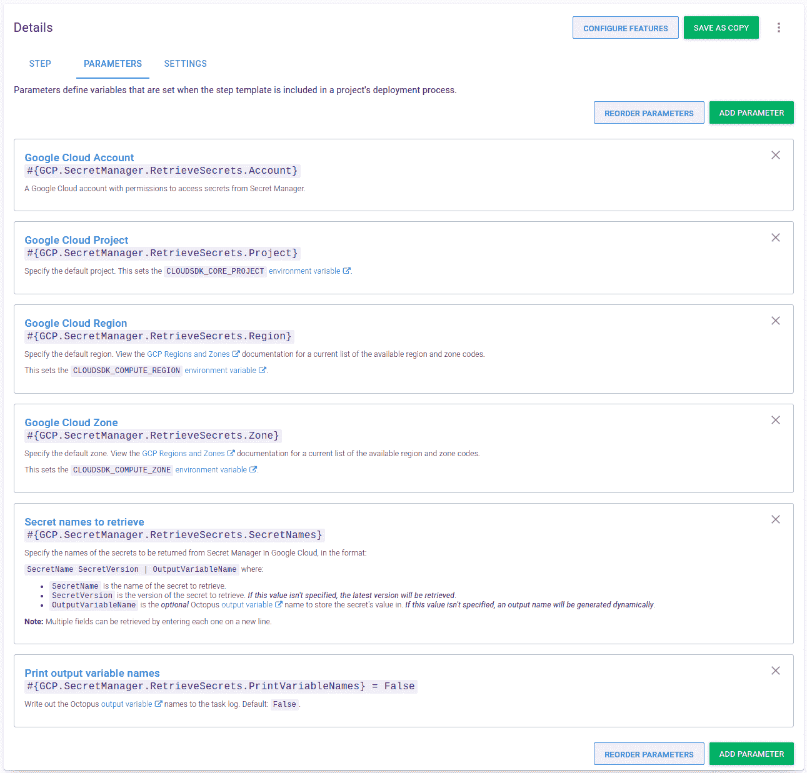
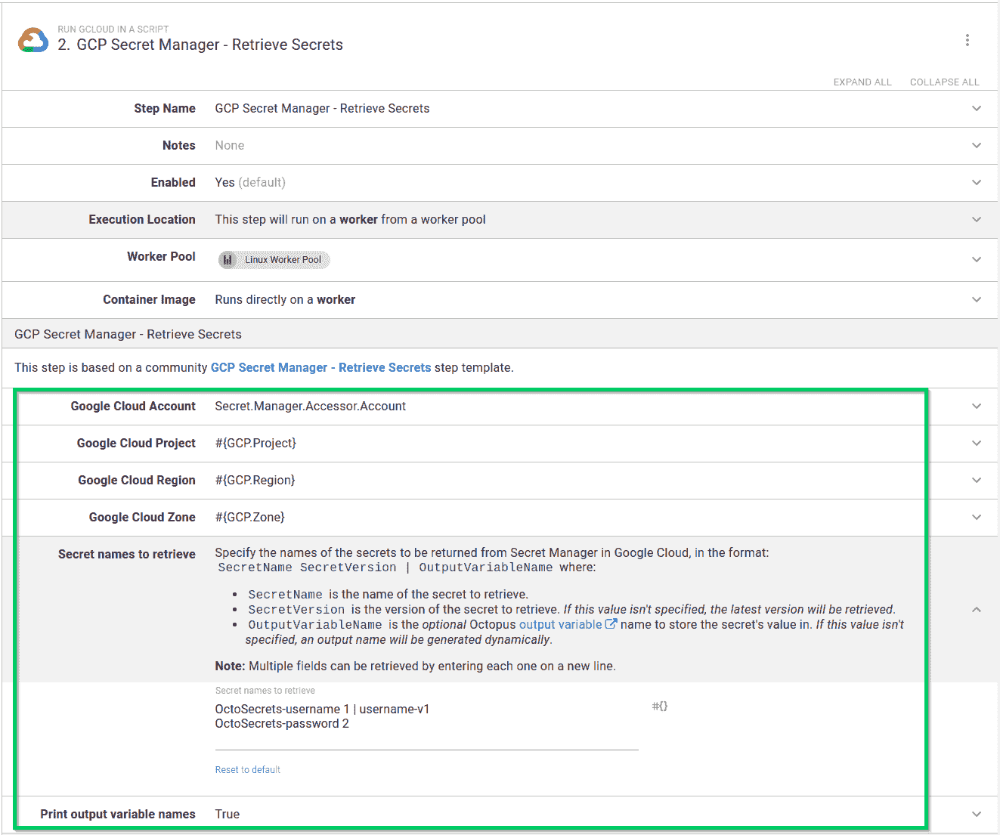
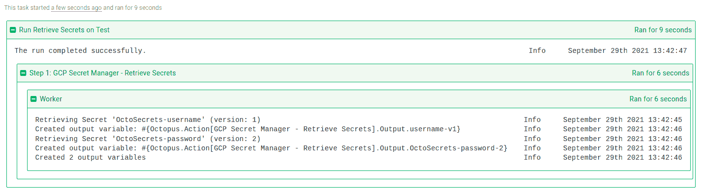
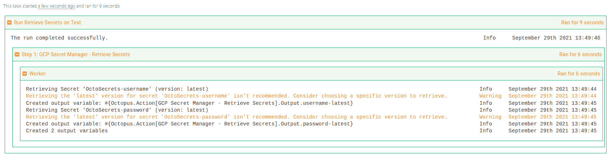

# 使用谷歌云秘密管理器与八达通-八达通部署

> 原文：<https://octopus.com/blog/using-google-cloud-secret-manager-with-octopus>

我以前写过关于使用 step 模板扩展 Octopus 的功能，以与 [HashiCorp Vault](https://octopus.com/blog/using-hashicorp-vault-with-octopus-deploy) 和 [Azure Key Vault](https://octopus.com/blog/using-azure-key-vault-with-octopus) 集成。我们致力于为我们的客户提供许多成功使用 Octopus 的方法，因此我们正在创建更多与其他 secret managers 集成的 step 模板。

在这篇文章中，我将介绍一个新的步骤模板， [GCP 秘密管理器-获取秘密](https://library.octopus.com/step-templates/9f5a9e3c-76b1-462f-972a-ae91d5deaa05/actiontemplate-gcp-secret-manager-retrieve-secrets)。此步骤模板从 Google 云平台(GCP)上的 Secret Manager 中检索机密，以便在您的部署或操作手册中使用。

## 入门指南

这篇文章假设读者对定制步骤模板和 Octopus 社区库比较熟悉。

此外，这篇文章没有详细介绍秘密管理器的概念或如何设置秘密管理器。你可以通过阅读谷歌的 [Secret Manager 快速入门指南](https://cloud.google.com/secret-manager/docs/quickstart)了解更多。

本文中的步骤模板使用 GCP 命令行工具 [gcloud](https://cloud.google.com/sdk/gcloud) 从[秘密管理器](https://cloud.google.com/secret-manager)中检索秘密。必须在部署目标或工作者上安装 gcloud 工具版本 **338.0.0** 或更高版本，步骤才能成功检索机密。

这一步还需要 Octopus **2021.2** 或更新版本，因为它利用了我们最近添加的对[谷歌云平台](https://octopus.com/blog/google-cloud-platform-integration)的内置支持。step 模板已经在 Windows 和 Linux 上测试过(安装了 PowerShell 核心)。

## 证明

在您可以从 Secret Manager 中检索机密之前，您必须通过 Google 认证。在他们关于创建和访问机密的[文档](https://cloud.google.com/secret-manager/docs/creating-and-accessing-secrets)中，Google 描述了访问机密的角色:

> 访问机密版本需要机密、项目、文件夹或组织的**机密管理员机密访问者**角色(`roles/secretmanager.secretAccessor`)。不能在秘密版本上授予 IAM 角色。

要了解更多关于您可以在 Secret Manager 中使用的不同角色，请阅读关于如何提供访问敏感密码、证书和其他机密的权限的[访问控制文档](https://cloud.google.com/secret-manager/docs/access-control)。

在 Octopus 中，您可以使用我们在版本 **2021.2** 中添加的[谷歌云账户](https://octopus.com/docs/infrastructure/accounts/google-cloud)与谷歌云平台进行认证

## 找回秘密

[GCP 秘密管理器-检索秘密](https://library.octopus.com/step-templates/9f5a9e3c-76b1-462f-972a-ae91d5deaa05/actiontemplate-gcp-secret-manager-retrieve-secrets)步骤模板从秘密管理器中检索一个或多个秘密，并为每个检索到的秘密创建敏感的输出变量。

对于每个秘密，您必须提供一个要检索的秘密版本，并且可以选择提供一个自定义输出变量名。

**始终选择特定的机密版本**
Google 建议，对于生产应用程序，您应该始终使用特定版本来检索机密，而不是使用*最新的*版本说明符。

检索一个秘密需要:

*   一个允许访问机密的 Google Cloud 帐户，包括默认的[项目](https://g.octopushq.com/GCPDefaultProject)、[区域和区域](https://g.octopushq.com/GCPDefaultRegionAndZone)的详细信息
*   要检索的机密的名称

step 模板的一个高级特性支持一次检索多个机密。这需要在新的一行中输入每个秘密。

对于检索到的每个秘密，创建一个[敏感输出变量](https://octopus.com/docs/projects/variables/output-variables#sensitive-output-variables)用于后续步骤。默认情况下，任务日志中只会显示已创建变量的数量。要查看任务日志中的变量名，将**打印输出变量名**参数更改为`True`。

### 步骤模板参数

步骤模板使用以下参数:

*   **Google Cloud Account** :一个 [Google Cloud account](https://octopus.com/docs/infrastructure/accounts/google-cloud) ，有权限访问 Secret Manager 的秘密。

*   **Google Cloud 项目**:指定默认项目。这将设置`CLOUDSDK_CORE_PROJECT`环境变量。

*   **谷歌云区域**:指定默认区域。这将设置`CLOUDSDK_COMPUTE_REGION`环境变量。

*   **Google Cloud Zone** :指定默认区域。这将设置`CLOUDSDK_COMPUTE_ZONE`环境变量。

*   **要检索的秘密名称**:指定要从 Google Cloud 中的 Secret Manager 返回的秘密名称，格式:`SecretName SecretVersion | OutputVariableName`其中:

    *   `SecretName`是要检索的机密的名称。
    *   `SecretVersion`是秘密检索的版本。*如果未指定该值，将检索最新版本*。
    *   `OutputVariableName`是*可选* Octopus [输出变量](https://octopus.com/docs/projects/variables/output-variables)的名称，用于存储秘密值。*如果未指定该值，将动态生成一个输出名称*。

    **注意:**通过在新的一行中输入每个字段，可以检索多个字段。

*   **打印输出变量名**:将章鱼[输出变量名](https://octopus.com/docs/projects/variables/output-variables)写入任务日志。默认:`False`。

[](#)

### 使用步骤

**GCP 机密管理器-检索机密**步骤以与其他步骤相同的方式添加到[部署和运行手册流程中。](https://octopus.com/docs/projects/steps#adding-steps-to-your-deployment-processes)

将步骤添加到流程后，填写步骤中的参数:

[](#)

填写参数后，您可以在操作手册或部署流程中执行该步骤。成功执行后，任何匹配的机密都将被存储为敏感的输出变量。如果您将步骤配置为打印变量名，它们会出现在任务日志中:

[](#)

在后续步骤中，从匹配密码创建的输出变量可以在您的部署或 runbook 中使用。

**提示:**对于任何输出变量名，记得用您的步骤名替换`GCP Secret Manager - Retrieve Secrets`。

尽管不建议这样做，但还是有可能检索到秘密的最新版本。您可以从机密名称参数中省略版本，如下所示:

```
OctoSecrets-username | username-latest 
```

或者，您可以使用*最新的*版本说明符，如下所示:

```
OctoSecrets-password latest | password-latest 
```

在这两种情况下，步骤模板都会向任务日志发送警告:

[](#)

## 结论

**GCP 秘密管理器-检索秘密**步骤模板演示了与 Google Cloud Secret Manager 集成并利用 Octopus 部署或 runbooks 中存储的秘密是很容易的。

愉快的部署！