# 通过 Octopus - Octopus 部署使用 HashiCorp Vault

> 原文：<https://octopus.com/blog/using-hashicorp-vault-with-octopus-deploy>

在 Octopus Deploy 中存储敏感值解决了许多问题。但是，如果您的组织已经标准化了机密管理器，这可能意味着将敏感值存储两次，从而使机密管理更加复杂。

自 [Octopus 2.0](https://octopus.com/blog/new-in-2.0/sensitive-variables) 以来，Octopus 一直支持[敏感变量](https://octopus.com/docs/projects/variables/sensitive-variables)的概念，但客户经常询问对秘密管理器的支持。一个特别的例子是[哈希公司的金库](https://www.vaultproject.io/)。

在这篇文章中，我将介绍一些我们介绍过的 HashiCorp Vault 步骤模板,这些模板旨在从 Vault 中检索机密，用于您的部署或操作手册。

截至 2022 年 11 月，我们 HashiCorp Vault 的外部秘密存储模板由 HashiCorp 认证，使 Octopus 部署了一个[认证的 HashiCorp 合作伙伴](https://www.hashicorp.com/partners/tech/octopus-deploy#all)。

## 在这篇文章中

## 介绍

这篇文章假设你知道[自定义步骤模板](https://octopus.com/docs/projects/custom-step-templates)和章鱼[社区库](https://octopus.com/docs/projects/community-step-templates)。要了解更多，你可以阅读 Ryan Rousseau 的关于创建自己的 step 模板并将其发布到库的两部分系列文章。

此外，这篇文章没有详细介绍 Vault 服务器的概念或如何配置 Vault 服务器。

本文中介绍的步骤模板为版本 1 和 2 的[键值(kv)](https://www.vaultproject.io/docs/secrets/kv) 秘密引擎执行[保险库认证](https://www.vaultproject.io/docs/concepts/auth)和秘密检索。

所有的步骤模板都利用了 Vault [HTTP API](https://www.vaultproject.io/api-docs) ，因此除了连接到您的 Vault 服务器之外，没有其他依赖项可以使用它们。它们都已经使用 Vault 版本 **1.11.3** 进行了测试，包括对[名称空间](https://www.vaultproject.io/docs/enterprise/namespaces)(Vault Enterprise 的一项功能)的支持，并且可以在安装了`Powershell Core`的 Windows 和 Linux 上运行。

## 证明

在与 Vault 交互之前，您必须根据验证方法进行验证。Vault 提供了许多不同的身份验证选项。已创建以下步骤模板来支持 Vault 身份验证:

AppRole 方法是使用 Vault for servers 进行身份验证的推荐方法。

通过 Vault 验证后，会生成一个[令牌](https://www.vaultproject.io/docs/concepts/tokens)，可用于与 Vault 的进一步交互。

### LDAP 登录步骤

[HashiCorp Vault - LDAP 登录](https://library.octopus.com/step-templates/de807003-3b05-4649-9af3-11a2c7722b3f/actiontemplate-hashicorp-vault-ldap-login)步骤模板使用 [LDAP](https://www.vaultproject.io/docs/auth/ldap) 认证方法向 Vault 服务器进行认证。这允许 Vault 集成，而无需复制用户名或密码配置。

如果您已经有可用的 LDAP 服务器，您可以选择使用 LDAP 进行鉴定，并使用服务帐户来控制对敏感信息的访问。

认证后，来自保险库响应的`client_token`将作为名为`LDAPAuthToken`的[敏感输出变量](https://octopus.com/docs/projects/variables/output-variables#sensitive-output-variables)在其他步骤中使用。

#### LDAP 登录参数

步骤模板具有以下参数:

*   `Vault Server URL`:您正在连接的 Vault 实例的 URL，包括端口(默认为`8200`)。
*   `API version`:从下拉列表中选择要使用的 API 版本。目前只有一个选项:`v1`。
*   `Namespace` : *可选*要使用的[命名空间](https://www.vaultproject.io/docs/enterprise/namespaces)。可以提供嵌套的名称空间，例如`ns1/ns2`。**注意:**名称空间仅在 [Vault Enterprise](https://www.hashicorp.com/products/vault) 上受支持。
*   `LDAP Auth Login path`:LDAP 方法[挂载到](https://www.vaultproject.io/api-docs/auth/ldap)的路径。默认是`/auth/ldap`。
*   `Username`:LDAP 用户名。
*   `Password`:LDAP 密码。

[T31](#)

#### 使用 LDAP 登录步骤

**LDAP 登录**步骤以与其他步骤相同的方式添加到[中的部署和 runbook 流程中。](https://octopus.com/docs/projects/steps#adding-steps-to-your-deployment-processes)

将步骤添加到流程后，填写步骤中的参数:

[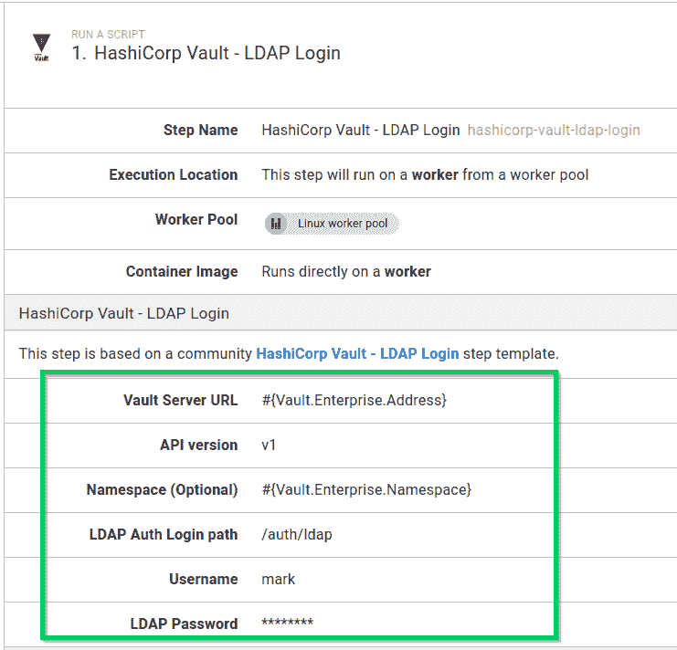](#)

然后，您可以在操作手册或部署流程中执行该步骤。成功执行后，包含该令牌的敏感输出变量名将显示在任务日志中:

[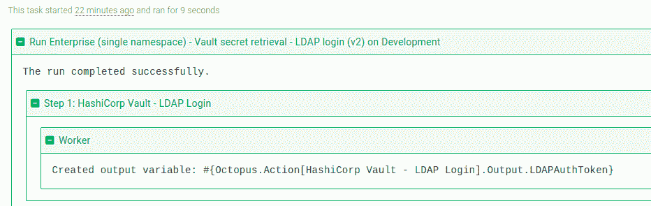](#)

在后续步骤中，输出变量`#{Octopus.Action[HashiCorp Vault - LDAP Login].Output.LDAPAuthToken}`可用于认证和检索秘密。

**提示:**对于任何输出变量名，记得用您的步骤名替换`HashiCorp Vault - LDAP Login`。

### JWT 登录步骤

[哈希公司 Vault - JWT 登录](https://library.octopus.com/step-templates/d49bc861-cd36-4624-960c-77613a54b139/actiontemplate-hashicorp-vault-jwt-login)步骤模板使用 [JWT](https://www.vaultproject.io/docs/auth/ldap) 认证方法向 Vault 服务器进行认证。这允许使用一个 [JSON Web 令牌](https://en.wikipedia.org/wiki/JSON_Web_Token)进行保险库集成。

如果您的组织中已经使用了 JWT 身份验证方法，您可以选择使用该方法进行身份验证。当通过 HTTP 发出请求时，这是一个很好的选择，因为它是一个自包含的令牌，可以在任何地方生成。

**生成 JWT**
Octopus 有两个现有的步骤模板来生成一个用私钥签名的 JWT，但它们不在本文讨论范围之内。有关更多信息，请参见步骤模板描述:

认证后，来自保险库响应的`client_token`作为一个名为`JWTAuthToken`的[敏感输出变量](https://octopus.com/docs/projects/variables/output-variables#sensitive-output-variables)可用于其他步骤。

#### JWT 登录参数

步骤模板具有以下参数:

*   `Vault Server URL`:您正在连接的 Vault 实例的 URL，包括端口(默认为`8200`)。
*   `API version`:从下拉列表中选择要使用的 API 版本。目前只有一个选项:`v1`。
*   `Namespace` : *可选*要使用的[命名空间](https://www.vaultproject.io/docs/enterprise/namespaces)。可以提供嵌套的名称空间，例如`ns1/ns2`。**注意:**名称空间仅在 [Vault Enterprise](https://www.hashicorp.com/products/vault) 上受支持。
*   `JWT Auth Login path`:在安装 [JWT 方法的路径。默认为`/auth/jwt`。](https://www.vaultproject.io/api-docs/auth/jwt)
*   `JWT role`:跳马 [JWT 角色](https://www.vaultproject.io/api-docs/auth/jwt#create-role)。
*   `JWT Token`:已签名的 [JSON Web 令牌](https://tools.ietf.org/html/rfc7519) (JWT)用于登录。

[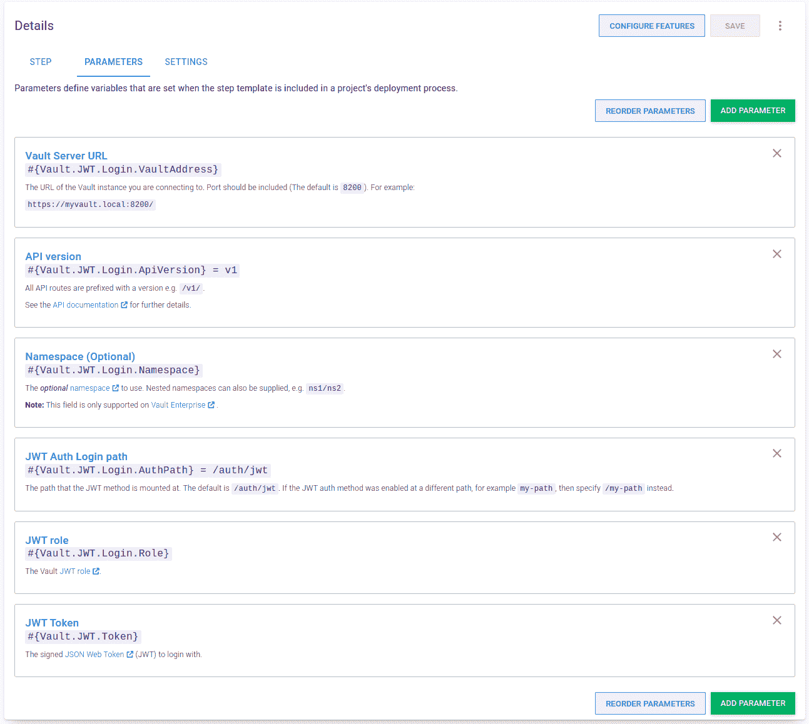](#)

#### 使用 JWT 登录步骤

以与其他步骤相同的方式将 **JWT 登录**步骤添加到[部署和运行手册流程中。](https://octopus.com/docs/projects/steps#adding-steps-to-your-deployment-processes)

将步骤添加到流程后，填写步骤中的参数:

[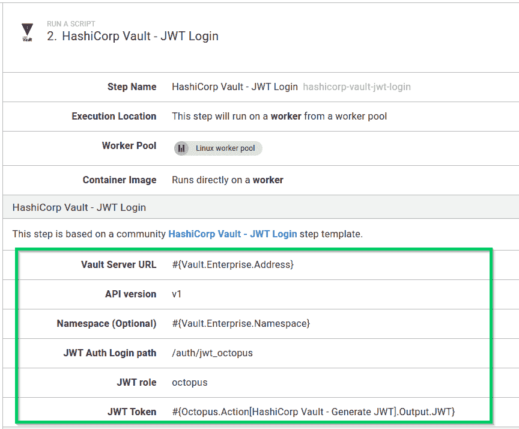](#)

然后，您可以在操作手册或部署流程中执行该步骤。成功执行后，包含该令牌的敏感输出变量名将显示在任务日志中:

[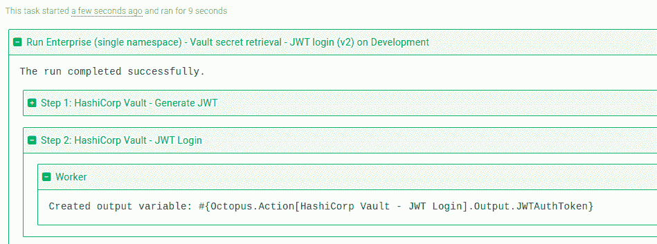【](#)

在后续步骤中，输出变量`#{Octopus.Action[HashiCorp Vault - JWT Login].Output.JWTAuthToken}`可用于认证和检索秘密。

**提示:**对于任何输出变量名，记得用您的步骤名替换`HashiCorp Vault - JWT Login`。

### 适当的登录步骤

[HashiCorp Vault - AppRole 登录](https://library.octopus.com/step-templates/e04a9cec-f04a-4da2-849b-1aed0fd408f0/actiontemplate-hashicorp-vault-approle-login)步骤模板使用 [AppRole](https://www.vaultproject.io/docs/auth/approle) 认证方法向 Vault 服务器进行认证。这非常适合与章鱼一起使用。HashiCorp 建议将其用于机器或应用程序:

> 这种身份验证方法面向自动化工作流(机器和服务)，对人工操作员用处不大。

使用 AppRole，机器可以使用以下方式登录:

*   `RoleID`，将此视为认证对中的用户名。
*   `SecretID`，把这个当做认证对中的密码。

**不要存储 SecretID:**
将 RoleID 作为敏感变量存储在 Octopus 中是一种很好的方法，可以确保它在需要之前保持加密状态。

然而，同样是**不推荐**给 SecretID。

秘密就像密码一样，是为过期而设计的。存储 SecretID 还可以提供检索所有秘密的能力，因为 RoleID 和 SecretID 都是可用的。

我们建议您使用更安全的 [Get wrapped SecretID](#get-wrapped-secretid) 和[unwrapped SecretID 和 Login](#unwrap-secretid-login) 步骤模板，因为它们使用了[最佳实践](#approle-best-practices)、**响应包装**之一。

如果您使用适当的登录步骤模板，我们建议您在执行时使用敏感的[提示变量](https://octopus.com/docs/projects/variables/prompted-variables)提供 SecretID。

经过认证后，来自保险库响应的`client_token`将作为一个名为`AppRoleAuthToken`的[敏感输出变量](https://octopus.com/docs/projects/variables/output-variables#sensitive-output-variables)在其他步骤中使用。

#### 合适的登录参数

步骤模板具有以下参数:

*   `Vault Server URL`:您正在连接的 Vault 实例的 URL，包括端口(默认为`8200`)。
*   `API version`:从下拉列表中选择要使用的 API 版本。目前只有一个选项:`v1`。
*   `Namespace` : *可选*要使用的[命名空间](https://www.vaultproject.io/docs/enterprise/namespaces)。可以提供嵌套的名称空间，例如`ns1/ns2`。**注意:**名称空间仅在 [Vault Enterprise](https://www.hashicorp.com/products/vault) 上受支持。
*   `App Role Path`:安装 [approle auth 方法的路径](https://www.vaultproject.io/api-docs/auth/approle)。
*   `Role ID`:批准的[角色](https://www.vaultproject.io/docs/auth/approle#roleid)。
*   `Secret ID`:批准的[secret](https://www.vaultproject.io/docs/auth/approle#secretid)。

[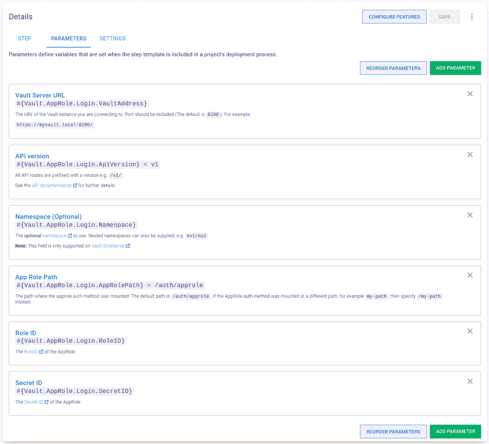](#)

#### 使用适当的登录步骤

**批准登录**步骤以与其他步骤相同的方式添加到[部署和运行手册流程中。](https://octopus.com/docs/projects/steps#adding-steps-to-your-deployment-processes)

将步骤添加到流程后，填写步骤中的参数:

[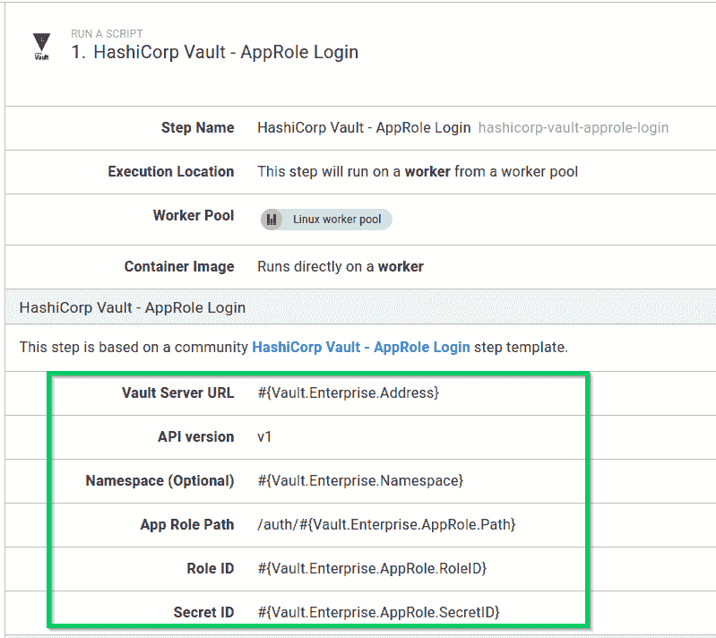](#)

然后，您可以在操作手册或部署流程中执行该步骤。成功执行后，包含该令牌的敏感输出变量名将显示在任务日志中:

[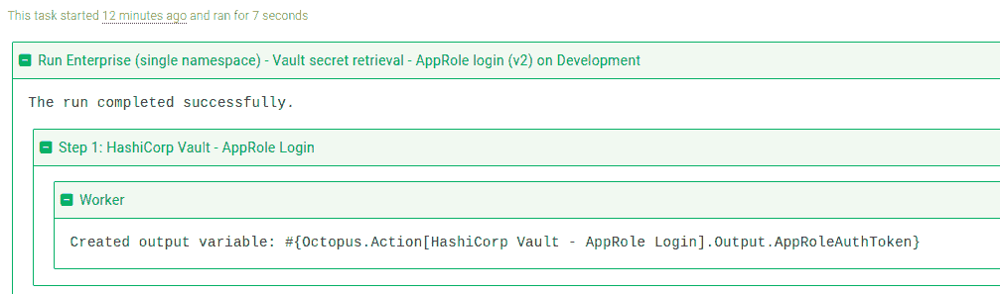](#)

在后续步骤中，输出变量`#{Octopus.Action[HashiCorp Vault - AppRole Login].Output.AppRoleAuthToken}`可用于认证和检索秘密。

**提示:**对于任何输出变量名，记得用您的步骤名替换`HashiCorp Vault - AppRole Login`。

### 合适的最佳实践

[AppRole](https://www.vaultproject.io/docs/auth/approle) 认证方法被认为是*可信代理*方法。这意味着信任的责任在于作为客户机(通常是 Octopus 部署目标)和 Vault 之间的认证中介的系统(即*代理*)。

一个重要的最佳实践是避免存储合适的机密。相反，使用[响应包装](https://www.vaultproject.io/docs/concepts/response-wrapping)来提供一个[包装令牌](https://www.vaultproject.io/docs/concepts/response-wrapping#response-wrapping-tokens)，它将提供一个访问机制来在需要时检索 SecretID。这种获取 SecretID 的方法也称为[拉模式](https://www.vaultproject.io/docs/auth/approle#pull-and-push-secretid-modes),因为它需要从 AppRole 中获取 SecretID 或*拉取*。

保险库文件包含使用适当认证时的[推荐模式](https://learn.hashicorp.com/tutorials/vault/pattern-approle?in=vault/recommended-patterns)。

以下是这些建议的摘要:

*   使用安全的系统作为代理来检索包装的 SecretID。
*   使用[响应包装](https://www.vaultproject.io/docs/concepts/response-wrapping)获得 SecretID。
*   限制 SecretID 的使用次数和生存时间(TTL)值，以防止过度使用。
*   避免[反模式](https://learn.hashicorp.com/tutorials/vault/pattern-approle?in=vault/recommended-patterns#anti-patterns)，比如让代理检索秘密。

**保护代理:**
由于信任依赖于代理，我们建议使用 Octopus 服务器的[内置工作器](https://octopus.com/docs/infrastructure/workers#built-in-worker)，或者高度安全的[外部工作器](https://octopus.com/docs/infrastructure/workers#external-workers)来充当代理。它将负责检索包装好的 SecretID，并将该值传递给通过 Vault 进行身份验证的机器(客户端)。

为了支持这些推荐的实践，创建了三个额外的`AppRole`步骤模板:

### 接近包装的秘密步骤

[hashi corp Vault-AppRole Get Wrapped Secret ID](https://library.octopus.com/step-templates/76827264-af27-46d0-913a-e093a4f0db48/actiontemplate-hashicorp-vault-approle-get-wrapped-secret-id)步骤模板为 [AppRole](https://www.vaultproject.io/docs/auth/approle) 认证方法生成一个[响应包装的](https://www.vaultproject.io/docs/concepts/response-wrapping) SecretID。

step 模板使用令牌通过 Vault 服务器进行身份验证，以检索包装的 SecretID。响应包含一个[包装令牌](https://www.vaultproject.io/docs/concepts/response-wrapping#response-wrapping-tokens)和其他元数据，比如令牌的创建路径。

该值可用于验证[未发生不当行为](https://www.vaultproject.io/docs/concepts/response-wrapping#response-wrapping-token-validation)。包装令牌随后可用于检索实际的 SecretID 值。

用于进行身份验证以检索包装的 SecretID 的令牌应该具有有限的范围，并且应该只允许检索包装的 SecretID。考虑创建一个长期存储令牌，因为这只会带来较小的风险。

从 Vault 服务器收到响应后，创建 2 个[敏感输出变量](https://octopus.com/docs/projects/variables/output-variables#sensitive-output-variables)用于其他步骤:

*   `WrappedToken`这是从响应中包装的`token`，用于检索实际的 SecretID 值。
*   `WrappedTokenCreationPath`这是令牌的创建路径。它允许您验证[没有发生不当行为](https://www.vaultproject.io/docs/concepts/response-wrapping#response-wrapping-token-validation)。

#### AppRole Get Wrapped SecretID 参数

步骤模板使用以下参数:

*   `Vault Server URL`:您正在连接的 Vault 实例的 URL，包括端口(默认为`8200`)。
*   `API version`:从下拉列表中选择 API 版本。目前只有一个选项:`v1`。
*   `Namespace` : *可选*要使用的[命名空间](https://www.vaultproject.io/docs/enterprise/namespaces)。可以提供嵌套的名称空间，例如`ns1/ns2`。**注意:**名称空间仅在 [Vault Enterprise](https://www.hashicorp.com/products/vault) 上受支持。
*   `App Role Path`:安装 [AppRole auth 方法的路径](https://www.vaultproject.io/api-docs/auth/approle)。
*   `Role Name`:审批[的角色名称](https://www.vaultproject.io/api/auth/approle)。
*   `Time-to-live (TTL)`:以秒为单位的[响应包装令牌](https://www.vaultproject.io/docs/concepts/response-wrapping#response-wrapping-tokens)本身的 TTL。默认为:`120s`
*   `Auth Token`:用于向 Vault 认证的[令牌](https://www.vaultproject.io/docs/auth/token)，生成[响应包装的](https://www.vaultproject.io/docs/concepts/response-wrapping) SecretID。

[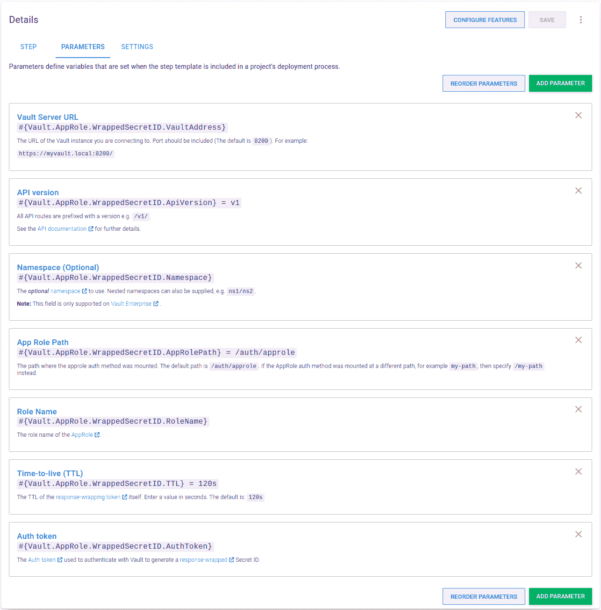](#)

#### 使用适当的获取包装机密步骤

以与其他步骤相同的方式将 **Get Wrapped SecretID** 步骤添加到部署和 runbook 流程中。

将步骤添加到流程后，填写步骤中的参数:

然后，您可以在操作手册或部署流程中执行该步骤。成功执行后，敏感的输出变量名会显示在任务日志中:

[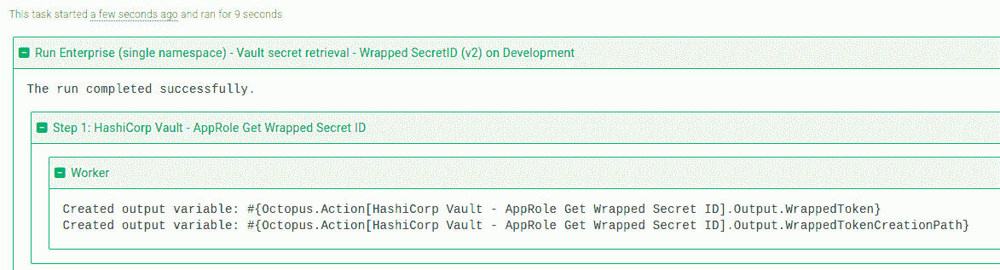](#)

在后续步骤中，输出变量可用于验证和检索实际的 SecretID 值:

*   `#{Octopus.Action[HashiCorp Vault - AppRole Get Wrapped Secret ID].Output.WrappedToken}`
*   `#{Octopus.Action[HashiCorp Vault - AppRole Get Wrapped Secret ID].Output.WrappedTokenCreationPath}`

**提示:**对于任何输出变量名，记得用您的步骤名替换`HashiCorp Vault - AppRole Get Wrapped Secret ID`。

### 近似展开秘密步骤

[hashi corp Vault-AppRole Unwrap Secret ID](https://library.octopus.com/step-templates/c1f56030-0bcd-458d-bc70-b4f43ec0d30f/actiontemplate-hashicorp-vault-approle-unwrap-secret-id)步骤模板使用[包装令牌](https://www.vaultproject.io/docs/concepts/response-wrapping#response-wrapping-tokens)检索并解开 [AppRole](https://www.vaultproject.io/docs/auth/approle) 的 Secret ID。

来自保险库响应的`secret_id`将作为名为`UnwrappedSecretID`的[敏感输出变量](https://octopus.com/docs/projects/variables/output-variables#sensitive-output-variables)用于其他步骤。

#### 适当的展开保密参数

步骤模板使用以下参数:

*   `Vault Server URL`:您正在连接的 Vault 实例的 URL，包括端口(默认为`8200`)。
*   `API version`:从下拉列表中选择要使用的 API 版本。目前只有一个选项:`v1`。
*   `Namespace` : *可选*要使用的[命名空间](https://www.vaultproject.io/docs/enterprise/namespaces)。可以提供嵌套的名称空间，例如`ns1/ns2`。**注意:**名称空间仅在 [Vault Enterprise](https://www.hashicorp.com/products/vault) 上受支持。
*   `Wrapped Token`:包装令牌，用于从金库中检索实际的秘密 ID。
*   `Token Creation Path` : *可选*包装令牌的创建路径。如果提供了该值，步骤模板将执行[回绕查找](https://www.vaultproject.io/api-docs/system/wrapping-lookup)以[验证没有发生不当行为](https://www.vaultproject.io/docs/concepts/response-wrapping#response-wrapping-token-validation)。

[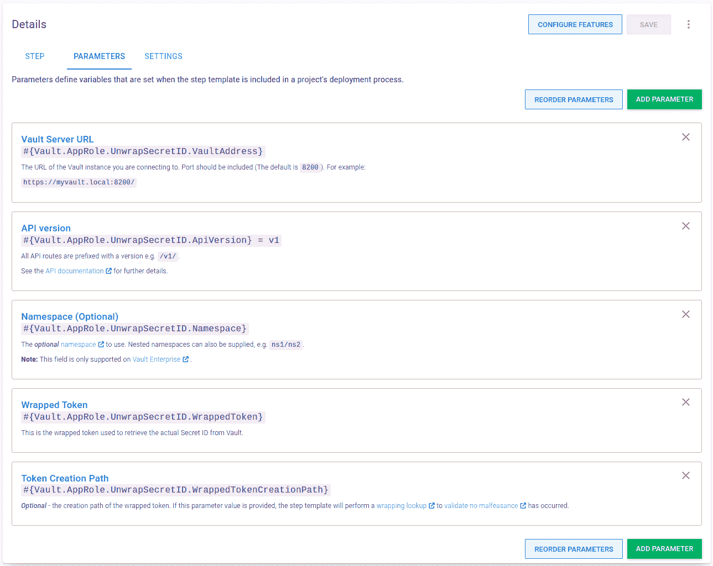](#)

#### 使用展开秘密步骤

与其他步骤一样，在[中将**展开 SecretID** 步骤添加到部署和 runbook 流程中。](https://octopus.com/docs/projects/steps#adding-steps-to-your-deployment-processes)

将步骤添加到流程后，填写步骤中的参数:

[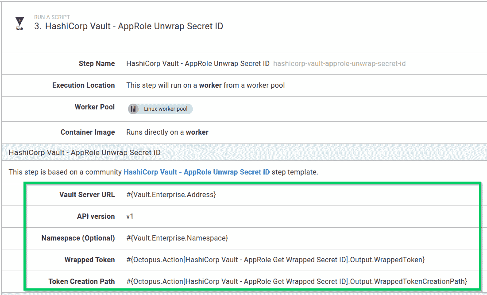【](#)

然后，您可以在操作手册或部署流程中执行该步骤。成功执行后，敏感的输出变量名会显示在任务日志中:

[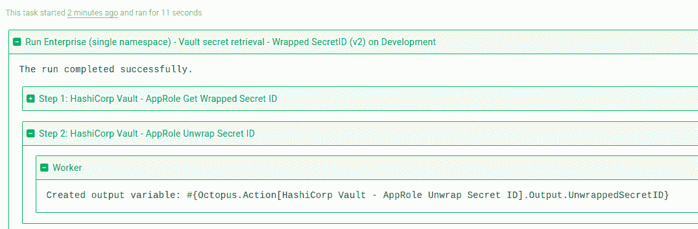](#)

在后续步骤中，输出变量`#{Octopus.Action[HashiCorp Vault - AppRole Unwrap Secret ID].Output.UnwrappedSecretID}`可用于向 Vault 进行身份验证，并接收一个令牌，该令牌可用于检索机密。

**提示:**对于任何输出变量名，记得用您的步骤名替换`HashiCorp Vault - AppRole Unwrap Secret ID`。

### 适当的解密和登录步骤

[hashi corp Vault-AppRole Unwrap Secret ID and log in](https://library.octopus.com/step-templates/aa113393-e615-40ed-9c5a-f95f471d728f/actiontemplate-hashicorp-vault-approle-unwrap-secret-id-and-login)步骤模板是将 Vault 使用的两个步骤模板合并为一个的便捷方法:

它是 Vault 两步工作流程的第二部分:

1.  使用[AppRole Get wrapped SecretID](#get-wrapped-secretid)步骤模板获取包装的 SecretID。
2.  提供从第一步到此步骤模板的敏感输出变量中存储的包装的 SecretID，以进行解包装和身份验证。

经过认证后，来自保险库响应的`client_token`就可以作为一个名为`AppRoleAuthToken`的[敏感输出变量](https://octopus.com/docs/projects/variables/output-variables#sensitive-output-variables)用于其他步骤。

#### AppRole 展开 SecretID 和登录参数

步骤模板使用以下参数:

*   `Vault Server URL`:您正在连接的 Vault 实例的 URL，包括端口(默认为`8200`)。
*   `API version`:从下拉列表中选择要使用的 API 版本。目前只有一个选项:`v1`。
*   `Namespace` : *可选*要使用的[命名空间](https://www.vaultproject.io/docs/enterprise/namespaces)。可以提供嵌套的名称空间，例如`ns1/ns2`。**注意:**名称空间仅在 [Vault Enterprise](https://www.hashicorp.com/products/vault) 上受支持。
*   `App Role Path`:安装 [AppRole auth 方法的路径](https://www.vaultproject.io/api-docs/auth/approle)。
*   `Role ID`:批准的[角色 ID](https://www.vaultproject.io/docs/auth/approle#roleid) 。
*   `Wrapped Token`:用于从金库中检索实际秘密 ID 的[包装令牌](https://www.vaultproject.io/docs/concepts/response-wrapping#response-wrapping-tokens)。
*   `Token Creation Path` : *可选*包装令牌的创建路径。如果提供了该值，步骤模板将执行[回绕查找](https://www.vaultproject.io/api-docs/system/wrapping-lookup)以[验证没有发生不当行为](https://www.vaultproject.io/docs/concepts/response-wrapping#response-wrapping-token-validation)。

[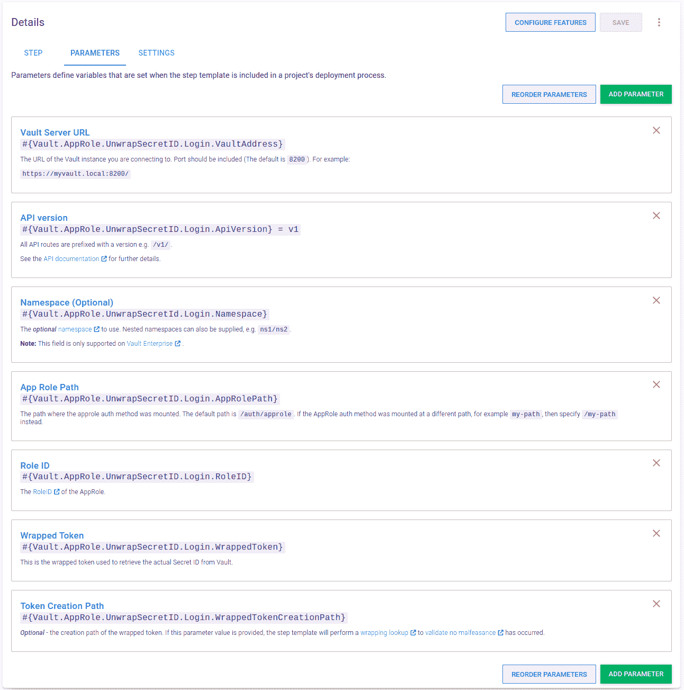](#)

#### 使用展开 SecretID 和登录步骤

**解开 SecretID 并登录**步骤以与其他步骤相同的方式添加到[部署和 runbook 流程中。](https://octopus.com/docs/projects/steps#adding-steps-to-your-deployment-processes)

将步骤添加到流程后，填写步骤中的参数:

[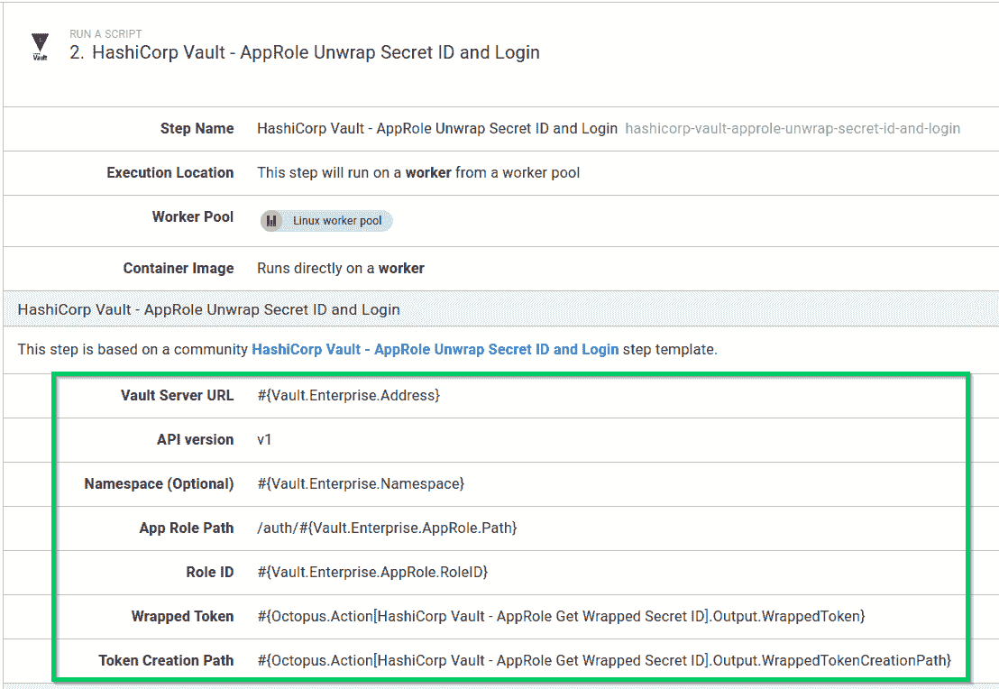](#)

然后，您可以在操作手册或部署流程中执行该步骤。成功执行后，敏感的输出变量名会显示在任务日志中:

[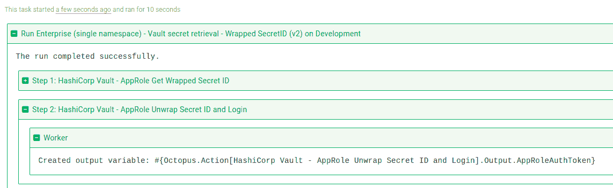](#)

在后续步骤中，输出变量`#{Octopus.Action[HashiCorp Vault - AppRole Unwrap Secret ID and Login].Output.AppRoleAuthToken}`可用于认证和检索秘密。

**提示:**对于任何输出变量名，记得用您的步骤名替换`HashiCorp Vault - AppRole Unwrap Secret ID and Login`。

## 找回秘密

使用 Vault 进行身份验证后，您会收到一个可用于检索机密的身份验证令牌。Vault 中的机密存储在一个[机密引擎](https://www.vaultproject.io/docs/secrets)中，该引擎有许多不同的类型。

为支持检索机密而创建的步骤模板关注于[键值(kv)](https://www.vaultproject.io/docs/secrets/kv) 机密引擎，因为它是一个通用的键值存储，用于存储任意机密:

### 检索 KV (v1)机密步骤

[HashiCorp 保险库密钥值(v1)检索机密](https://library.octopus.com/step-templates/9aab9522-25e0-4539-841c-8b726e6b1520/actiontemplate-hashicorp-vault-key-value-(v1)-retrieve-secrets)步骤模板检索存储在`v1`密钥值机密引擎中的一个或多个机密。

检索一个秘密需要:

*   通往秘密的道路。
*   有权限访问机密的身份验证令牌。
*   *可选的*，要检索的字段名列表。

step 模板的一个高级特性支持一次检索多个机密。这需要将**机密检索方法**参数更改为`Multiple vault keys`。

递归检索秘密也是可能的。当您想要检索给定路径的所有秘密时，这很有用。

对于检索到的每个秘密，创建一个[敏感输出变量](https://octopus.com/docs/projects/variables/output-variables#sensitive-output-variables)用于后续步骤。默认情况下，任务日志中只会显示已创建变量的数量。要查看任务日志中的变量名，将**打印输出变量名**参数更改为`True`。

#### 检索 KV (v1)秘密参数

步骤模板使用以下参数:

*   `Vault Server URL`:您正在连接的 Vault 实例的 URL，包括端口(默认为`8200`)。
*   `API version`:从下拉列表中选择要使用的 API 版本。目前只有一个选项:`v1`。
*   `Namespace` : *可选*要使用的[命名空间](https://www.vaultproject.io/docs/enterprise/namespaces)。可以提供嵌套的名称空间，例如`ns1/ns2`。**注意:**名称空间仅在 [Vault Enterprise](https://www.hashicorp.com/products/vault) 上受支持。
*   `Auth Token`:用于认证检索秘密的[令牌](https://www.vaultproject.io/docs/auth/token)。
*   `Secrets Path`:您要检索的机密的完整路径。该值应该包括安装机密引擎的路径以及机密本身的路径。
*   `Secrets retrieval method`:选择检索单个秘密或多个秘密。检索单个秘密相当于使用 [Get](https://www.vaultproject.io/api-docs/secret/kv/kv-v1#read-secret) 方法的`vault kv get`命令。检索多个秘密相当于组合使用[列表](https://www.vaultproject.io/api-docs/secret/kv/kv-v2#list-secrets)方法的`vault kv list`命令和针对每个秘密的后续`vault kv get`命令。
*   `Recursive retrieval`:如果正在检索多个秘密，是否也应该枚举和检索任何子文件夹？默认为:`False`。
*   `Field names`:从已识别的机密中选择要检索的特定字段。当您只想从一个或多个机密中检索特定字段时，这很有用。您可以选择包含输出变量的名称。
*   `Print output variable names`:将 Octopus 输出变量名写入任务日志。默认为:`False`。

[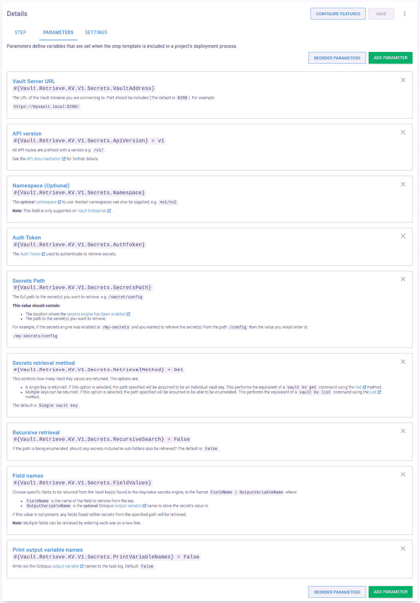](#)

#### 使用检索 KV (v1)机密步骤

以与其他步骤相同的方式将**键值(v1)检索机密**步骤添加到[部署和 runbook 流程中。](https://octopus.com/docs/projects/steps#adding-steps-to-your-deployment-processes)

将步骤添加到流程后，填写步骤中的参数:

[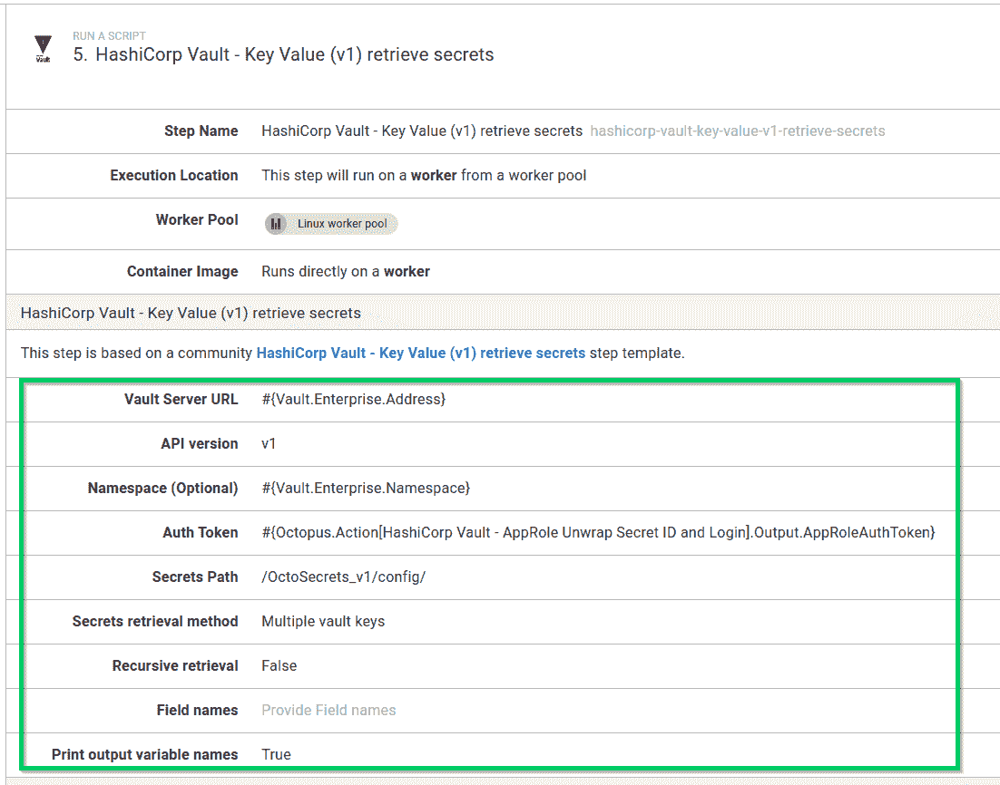](#)

填写参数后，您可以在操作手册或部署流程中执行该步骤。在成功执行时，任何匹配的机密都被存储为敏感的输出变量。如果将步骤配置为打印变量名，它们会出现在任务日志中:

[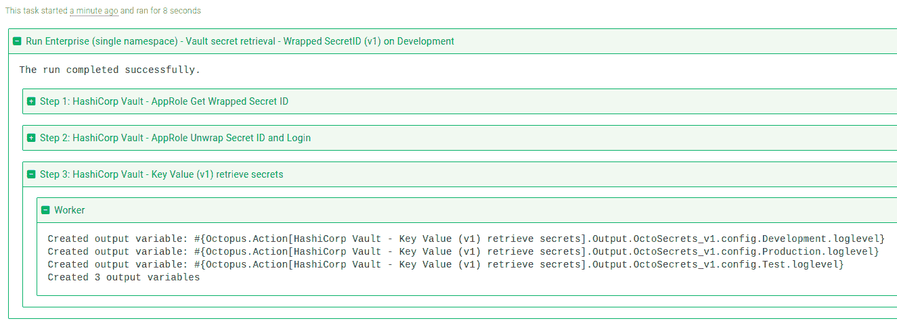](#)

在后续步骤中，从匹配密码创建的输出变量可以在您的部署或 runbook 中使用。

**提示:**对于任何输出变量名，记得用您的步骤名替换`HashiCorp Vault - Key Value (v1) retrieve secrets`。

### 检索 KV (v2)机密步骤

[hashi corp Vault-Key Value(v2)retrieve secrets](https://library.octopus.com/step-templates/337f1b67-cdb0-4f33-9e08-6bf804f672d2/actiontemplate-hashicorp-vault-key-value-(v2)-retrieve-secrets)步骤模板检索存储在`v2` Key-Value secrets 引擎中的一个或多个机密。

`v2`键值机密引擎的关键优势之一是它支持[版本化机密](https://learn.hashicorp.com/tutorials/vault/versioned-kv)。如果您需要在意外丢失数据的情况下回滚机密，这将非常有用。

检索一个秘密需要:

*   通往秘密的道路
*   具有访问机密的权限的身份验证令牌
*   *可选的*，要检索的字段名列表

此步骤模板提供了高级功能:

1.  支持一次检索多个秘密。这需要将**机密检索方法**参数改为`Multiple vault keys`。递归检索秘密也是可能的。这对于检索给定路径的所有秘密非常有用。
2.  支持检索特定版本的秘密。这仅在检索单个机密时受支持。

对于检索到的每个秘密，创建一个[敏感输出变量](https://octopus.com/docs/projects/variables/output-variables#sensitive-output-variables)用于后续步骤。默认情况下，任务日志中只会显示已创建变量的数量。要查看任务日志中的变量名，将**打印输出变量名**参数更改为`True`。

#### 检索 KV (v2)秘密参数

步骤模板使用以下参数:

*   `Vault Server URL`:您正在连接的 Vault 实例的 URL，包括端口(默认为`8200`)。
*   `API version`:从下拉列表中选择要使用的 API 版本。目前只有一个选择:`v1`。
*   `Namespace` : *可选*要使用的[名称空间](https://www.vaultproject.io/docs/enterprise/namespaces)。可以提供嵌套的名称空间，例如`ns1/ns2`。**注意:**名称空间仅在 [Vault Enterprise](https://www.hashicorp.com/products/vault) 上受支持。
*   `Auth Token`:用于认证取回机密的[令牌](https://www.vaultproject.io/docs/auth/token)。
*   `Secrets Path`:您想要检索的机密的完整路径。该值应该包括安装机密引擎的路径以及机密本身的路径。
*   `Secrets retrieval method`:选择检索单个秘密或多个秘密。检索一个秘密相当于使用 [Get](https://www.vaultproject.io/api-docs/secret/kv/kv-v1#read-secret) 方法的`vault kv get`命令。检索多个秘密相当于使用 [List](https://www.vaultproject.io/api-docs/secret/kv/kv-v2#list-secrets) 方法的`vault kv list`命令和随后针对每个秘密的`vault kv get`命令的组合。
*   `Recursive retrieval`:如果正在检索多个机密，是否也应该枚举和检索任何子文件夹？默认为:`False`。
*   `Secret Version` : *可选*检索单个秘密时，选择要检索的秘密版本。例如，如果您希望所有字段值的版本 2 处于保密状态，请输入值`2`。
*   `Field names`:选择要从已识别的机密中检索的特定字段。当您只想从一个或多个机密中检索特定字段时，这很有用。您可以选择包含输出变量的名称。
*   `Print output variable names`:将 Octopus 输出变量名写入任务日志。默认为:`False`。

[T32](#)

#### 使用检索 KV (v2)机密步骤

**键值(v2)检索机密**步骤以与其他步骤相同的方式添加到[中的部署和 runbook 流程中。](https://octopus.com/docs/projects/steps#adding-steps-to-your-deployment-processes)

将步骤添加到流程后，填写步骤中的参数:

[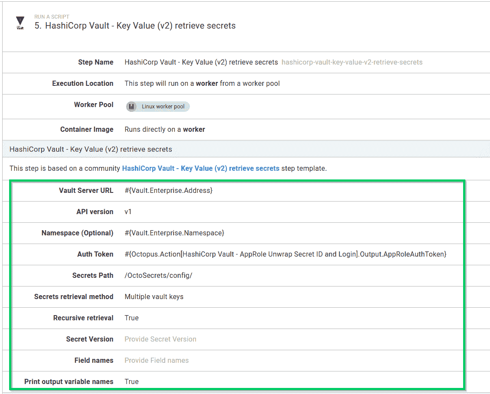](#)

填写参数后，您可以在操作手册或部署流程中执行该步骤。在成功执行时，任何匹配的机密都被存储为敏感的输出变量。如果将步骤配置为打印变量名，它们会出现在任务日志中:

[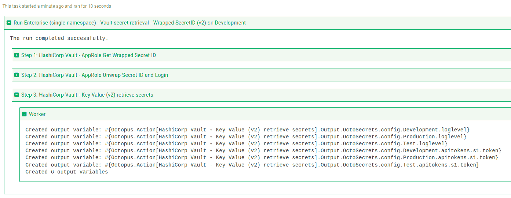](#)

在后续步骤中，从匹配密码创建的输出变量可以在您的部署或 runbook 中使用。

**提示:**对于任何输出变量名，记得用您的步骤名替换`HashiCorp Vault - Key Value (v2) retrieve secrets`。

## 结论

本文中的模板展示了如何扩展 Octopus 的功能，从 Vault 或任何其他 secrets manager 中检索机密，并在您的部署或 runbooks 中使用它们。请务必在我们的[示例实例](https://samples.octopus.app/app#/Spaces-822)的秘密管理空间中查看它们。

## 了解更多信息

有关更多信息，您可以阅读:

愉快的部署！