# 使用 Jenkins 管道和 Octopus - Octopus 部署

> 原文：<https://octopus.com/blog/using-jenkins-pipelines>

[](#)

Octopus Jenkins 插件最近的更新增加了对管道的支持，允许创建包并将其推送到 Octopus，创建和部署发布，以及将提交消息等元数据与包相关联。

在本文中，我们将介绍创建一个简单的 Jenkins 管道来部署一个示例 Java 应用程序的过程。

## 安装和配置插件

Octopus 插件可通过 Jenkins 插件管理器获得:

[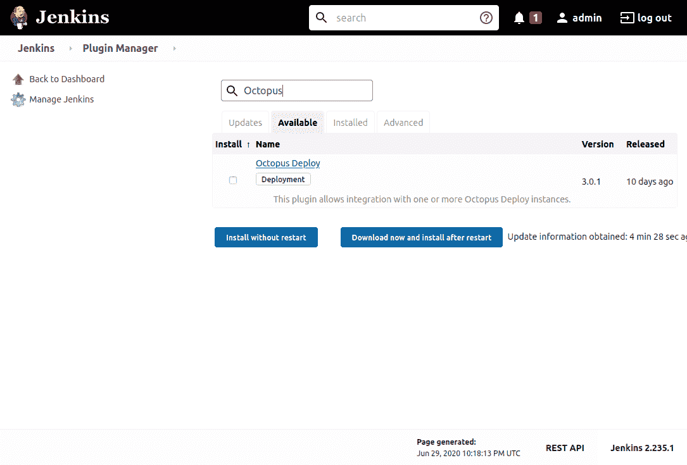](#)

这个插件通过调用 Octopus CLI 来工作。CLI 可以单独安装，但在本例中，我们将让 Jenkins 通过自定义工具插件下载并安装 CLI:

[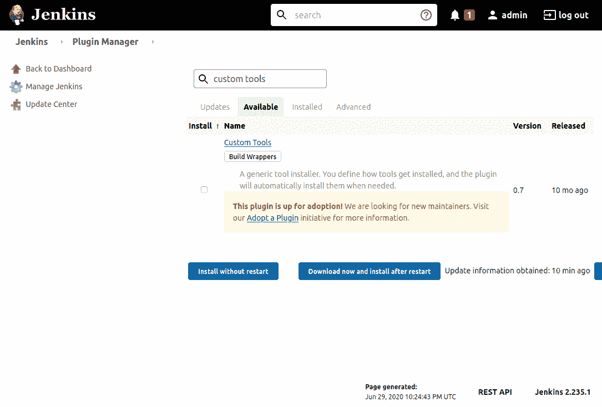](#)

安装 Octopus 和自定义工具插件后，打开 Jenkins **全局工具配置**页面，点击**添加自定义工具**按钮。

给新工具命名为**Octopus CLI**，并为二进制归档字段的**下载 URL 提供 [Octopus CLI 下载路径](https://octopus.com/downloads/octopuscli#linux)，它将是一个类似于[https://Download . Octopus deploy . com/Octopus-tools/7 . 4 . 0/Octopus tools . 7 . 4 . 0 . Linux-x64 . tar . gz](https://download.octopusdeploy.com/octopus-tools/7.4.0/OctopusTools.7.4.0.linux-x64.tar.gz)的 URL(最新版本请访问[下载页面](https://octopus.com/downloads/octopuscli#linux)):**

[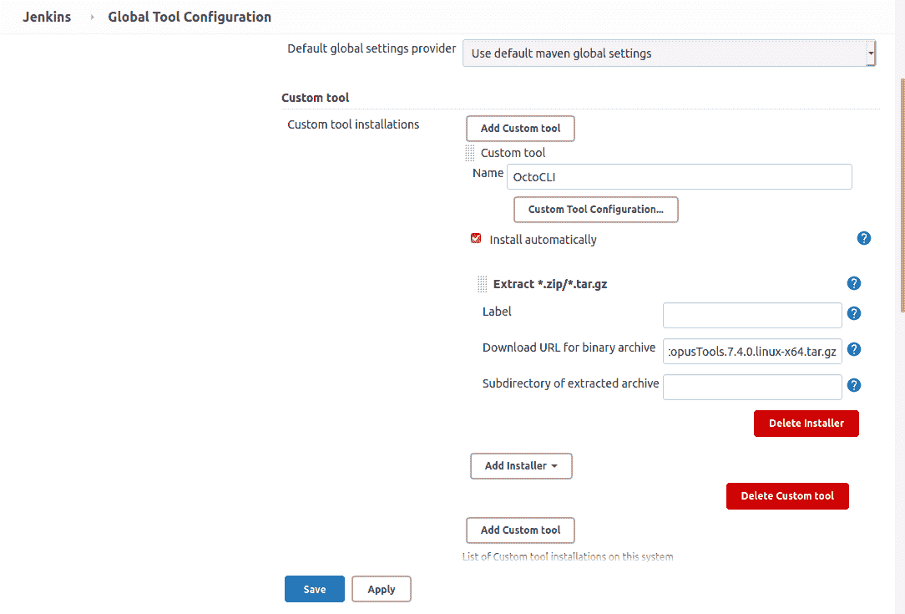](#)

当我们在管道中引用一个定制工具时，Jenkins 会将工具的归档内容下载、提取并复制到一个类似于`/var/lib/jenkins/tools/com.cloudbees.jenkins.plugins.customtools.CustomTool`的目录中(根据 Jenkins 主目录，`/var/lib/jenkins`可能会因代理而异)。在本例中，Jenkins 将 Octopus CLI 可执行文件提取到`/var/lib/jenkins/tools/com.cloudbees.jenkins.plugins.customtools.CustomTool/OctoCLI/octo`。

事先知道了这条路径，我们就可以在 Jenkins 中定义 Octopus CLI 工具了。在 **Octopus Deploy CLI** 部分，将**默认**工具的路径设置为`/var/lib/jenkins/tools/com.cloudbees.jenkins.plugins.customtools.CustomTool/OctoCLI/octo`。可以忽略该警告，因为当我们引用先前定义的定制工具运行管道时，该路径将是可用的:

[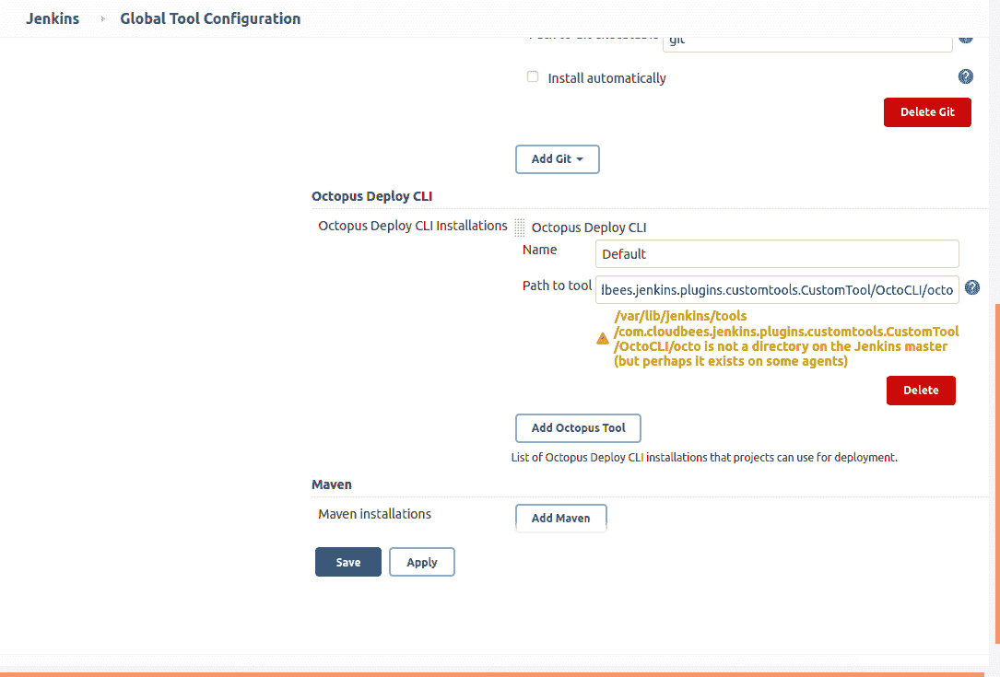](#)

要连接到 Octopus 服务器，我们需要创建一个 API 密钥:

[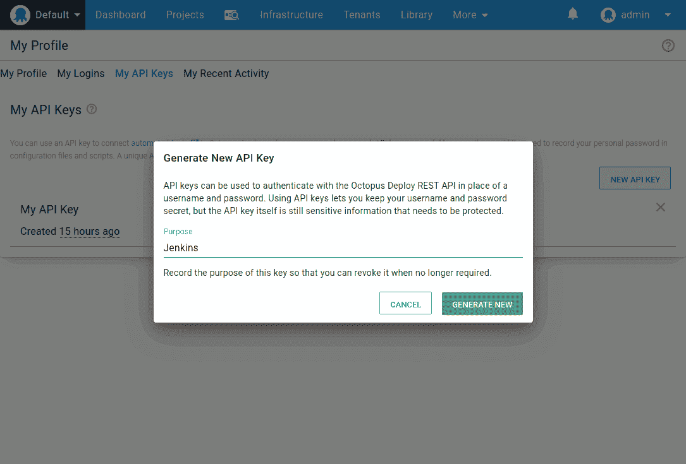](#)

然后在 Jenkins **配置系统**屏幕中配置 Octopus URL 和 API 密钥:

[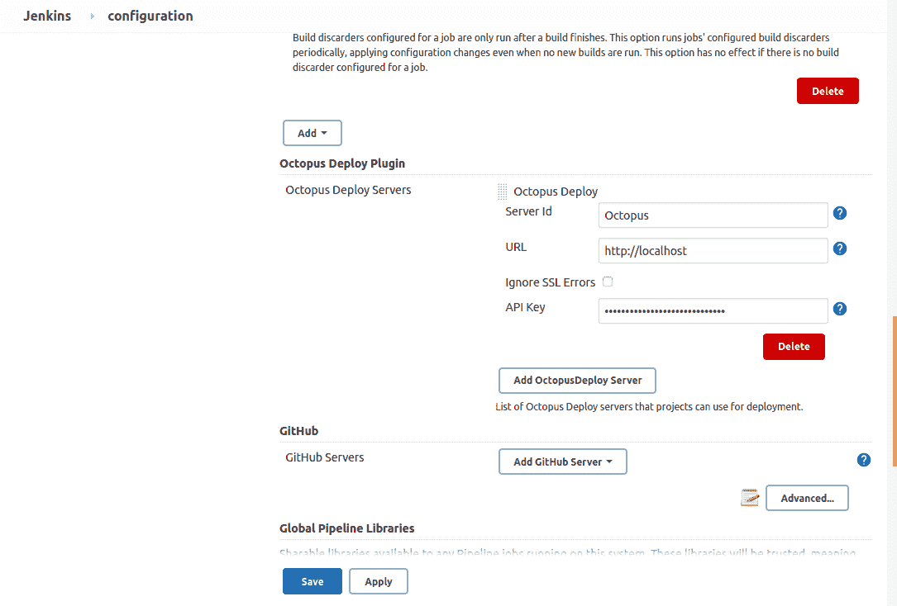](#)

我们现在已经配置了所需的设置来支持 Octopus 插件。然而，我们将构建的示例 Java 应用程序需要另外两个工具:Maven 和 JDK。这些在 Jenkins **全球工具配置**页面中进行配置。

在过去，获得 JDK 最简单的方法是从 Oracle 下载。但是现在，许可已经改变，这意味着大多数开发人员将使用 OpenJDK 构建。许多公司都提供 OpenJDK 版本，对于这个例子，我们将使用由 [AdoptOpenJDK](https://adoptopenjdk.net) 提供的版本。

我们将配置一个名为 **Java** 的 JDK 工具，并从[https://github . com/adopt open JDK/open JDK 14-binaries/releases/download/JDK-14 . 0 . 1% 2b 7/open JDK 14 u-JDK _ x64 _ Linux _ hotspot _ 14 . 0 . 1 _ 7 . tar . gz](https://github.com/AdoptOpenJDK/openjdk14-binaries/releases/download/jdk-14.0.1%2B7/OpenJDK14U-jdk_x64_linux_hotspot_14.0.1_7.tar.gz)下载归档文件。解压子目录 **jdk-14.0.1+7** (这就是 AdoptOpenJDK 在归档中打包路径的方式):

[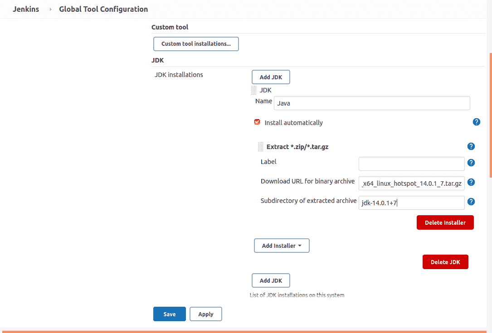](#)

然后创建了一个名为 **Maven 3** 的新 Maven 工具，它可以下载最新版本:

[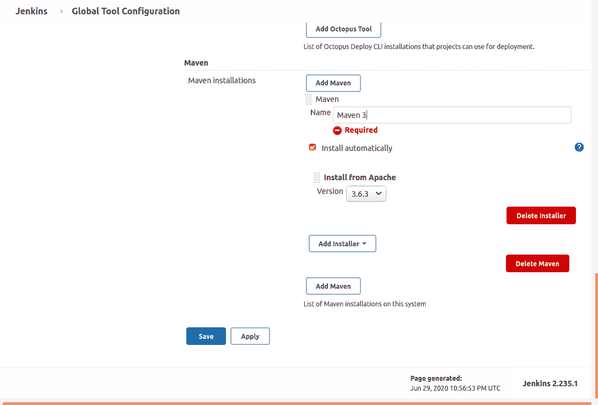](#)

有了这些设置，我们就可以创建我们的第一个管道了。

## 一个示例流水线

Jenkins 有两种类型的管道:[脚本式](https://www.jenkins.io/doc/book/pipeline/syntax/#scripted-pipeline)和[声明式](https://www.jenkins.io/doc/book/pipeline/syntax/#declarative-pipeline)。通常推荐使用声明性管道，这是我们将在示例管道中使用的格式。

我们将构建一个名为 Random Quotes 的示例应用程序，它可以在 [GitHub](https://github.com/OctopusSamples/RandomQuotes-Java) 上找到。管道在名为 [Jenkinsfile](https://github.com/OctopusSamples/RandomQuotes-Java/blob/master/Jenkinsfile) 的文件中定义。Jenkinsfile 的副本如下所示:

```
pipeline {
    //  parameters here provide the shared values used with each of the Octopus pipeline steps.
    parameters {
        // The space ID that we will be working with. The default space is typically Spaces-1.
        string(defaultValue: 'Spaces-1', description: '', name: 'SpaceId', trim: true)
        // The Octopus project we will be deploying.
        string(defaultValue: 'RandomQuotes', description: '', name: 'ProjectName', trim: true)
        // The environment we will be deploying to.
        string(defaultValue: 'Dev', description: '', name: 'EnvironmentName', trim: true)
        // The name of the Octopus instance in Jenkins that we will be working with. This is set in:
        // Manage Jenkins -> Configure System -> Octopus Deploy Plugin
        string(defaultValue: 'Octopus', description: '', name: 'ServerId', trim: true)
    }
    /*
        These are the tools we need for this pipeline. They are defined in Manage Jenkins -> Global Tools Configuration.
    */
    tools {
        maven 'Maven 3'
        jdk 'Java'
    }
    agent any
    stages {
        /*
            The OctoCLI tool has been defined with the Custom Tools plugin: https://plugins.jenkins.io/custom-tools-plugin/
            This is a convenient way to have a tool placed on an agent, especially when using the Jenkins Docker image.
            This plugin will extract a .tar.gz file (for example https://download.octopusdeploy.com/octopus-tools/7.3.7/OctopusTools.7.3.7.linux-x64.tar.gz)
            to a directory like /var/jenkins_home/tools/com.cloudbees.jenkins.plugins.customtools.CustomTool/OctoCLI/Octo.
            This directory is then specified as the default location of the Octo CLI in Jenkins under
            Manage Jenkins -> Global Tools Configuration -> Octopus Deploy CLI.
        */
        stage ('Add tools') {
            steps {
                sh "echo \"OctoCLI: ${tool('OctoCLI')}\""
            }
        }
        stage('build') {
            steps {
                // Update the Maven project version to match the current build
                sh(script: "mvn versions:set -DnewVersion=1.0.${BUILD_NUMBER}", returnStdout: true)
                // Package the code
                sh(script: "mvn package", returnStdout: true)
            }
        }
        stage('deploy') {
            steps {                
                octopusPack additionalArgs: '', includePaths: "${env.WORKSPACE}/target/randomquotes.1.0.${BUILD_NUMBER}.jar", outputPath: "${env.WORKSPACE}", overwriteExisting: false, packageFormat: 'zip', packageId: 'randomquotes', packageVersion: "1.0.${BUILD_NUMBER}", sourcePath: '', toolId: 'Default', verboseLogging: false
                octopusPushPackage additionalArgs: '', overwriteMode: 'FailIfExists', packagePaths: "${env.WORKSPACE}/target/randomquotes.1.0.${BUILD_NUMBER}.jar", serverId: "${ServerId}", spaceId: "${SpaceId}", toolId: 'Default'
                /*
                    Note that the gitUrl param is passed manually from the environment variable populated when this Jenkinsfile is downloaded from Git.
                    This is from the Jenkins "Global Variable Reference" documentation:
                    SCM-specific variables such as GIT_COMMIT are not automatically defined as environment variables; rather you can use the return value of the checkout step.
                    This means if this pipeline checks out its own code, the checkout method is used to return the details of the commit. For example:
                    stage('Checkout') {
                        steps {
                            script {
                                def checkoutVars = checkout([$class: 'GitSCM', userRemoteConfigs: [[url: 'https://github.com/OctopusSamples/RandomQuotes-Java.git']]])
                                env.GIT_URL = checkoutVars.GIT_URL
                                env.GIT_COMMIT = checkoutVars.GIT_COMMIT
                            }
                            octopusPushBuildInformation additionalArgs: '', commentParser: 'GitHub', overwriteMode: 'FailIfExists', packageId: 'randomquotes', packageVersion: "1.0.${BUILD_NUMBER}", serverId: "${ServerId}", spaceId: "${SpaceId}", toolId: 'Default', verboseLogging: false, gitUrl: "${GIT_URL}", gitCommit: "${GIT_COMMIT}"
                        }
                    }
                */
                octopusPushBuildInformation additionalArgs: '', commentParser: 'GitHub', overwriteMode: 'FailIfExists', packageId: 'randomquotes', packageVersion: "1.0.${BUILD_NUMBER}", serverId: "${ServerId}", spaceId: "${SpaceId}", toolId: 'Default', verboseLogging: false, gitUrl: "${GIT_URL}", gitCommit: "${GIT_COMMIT}"
                octopusCreateRelease additionalArgs: '', cancelOnTimeout: false, channel: '', defaultPackageVersion: '', deployThisRelease: false, deploymentTimeout: '', environment: "${EnvironmentName}", jenkinsUrlLinkback: false, project: "${ProjectName}", releaseNotes: false, releaseNotesFile: '', releaseVersion: "1.0.${BUILD_NUMBER}", serverId: "${ServerId}", spaceId: "${SpaceId}", tenant: '', tenantTag: '', toolId: 'Default', verboseLogging: false, waitForDeployment: false
                octopusDeployRelease cancelOnTimeout: false, deploymentTimeout: '', environment: "${EnvironmentName}", project: "${ProjectName}", releaseVersion: "1.0.${BUILD_NUMBER}", serverId: "${ServerId}", spaceId: "${SpaceId}", tenant: '', tenantTag: '', toolId: 'Default', variables: '', verboseLogging: false, waitForDeployment: true
            }
        }
    }
} 
```

让我们把这个文件分解一下。

所有声明性管道都以`pipeline`开头:

```
pipeline { 
```

为了使我们的 Jenkinsfile 通用，我们将所有 Octopus 特定变量作为参数公开。Jenkins 第一次执行这个管道时，将使用默认值。然后运行管道将这些属性添加到 Jenkins 项目中，这意味着当第二次手动触发构建时，将通过 web UI 提示您输入这些属性:

```
 //  parameters here provide the shared values used with each of the Octopus pipeline steps.
    parameters {
        // The space ID that we will be working with. The default space is typically Spaces-1.
        string(defaultValue: 'Spaces-1', description: '', name: 'SpaceId', trim: true)
        // The Octopus project we will be deploying.
        string(defaultValue: 'RandomQuotes', description: '', name: 'ProjectName', trim: true)
        // The environment we will be deploying to.
        string(defaultValue: 'Dev', description: '', name: 'EnvironmentName', trim: true)
        // The name of the Octopus instance in Jenkins that we will be working with. This is set in:
        // Manage Jenkins -> Configure System -> Octopus Deploy Plugin
        string(defaultValue: 'Octopus', description: '', name: 'ServerId', trim: true)
    } 
```

我们在前面部分配置的 Maven 和 Java 工具通过`tools`部分包含在这个管道中:

```
 tools {
        maven 'Maven 3'
        jdk 'Java'
    } 
```

这个构建将在任何代理上运行，这用`agent`设置来表示:

```
 agent any 
```

然后，我们定义管道将经过的`stages`:

```
 stages { 
```

第一阶段回显名为 **OctoCLI** 的自定义工具的位置。有趣的是，自定义工具插件并没有在`tools`部分定义。本期[詹金斯刊](https://issues.jenkins-ci.org/browse/JENKINS-30680)有关于这一限制的细节。但是通过调用`tool('OctoCLI')`，定制工具作为管道的一部分被安装:

```
 stage ('Add tools') {
            steps {
                sh "echo \"OctoCLI: ${tool('OctoCLI')}\""
            }
        } 
```

构建阶段调用 Maven CLI(由于前面提到的 Maven 工具，它现在位于`PATH`上)来设置项目的版本并打包它:

```
 stage('build') {
            steps {
                // Update the Maven project version to match the current build
                sh(script: "mvn versions:set -DnewVersion=1.0.${BUILD_NUMBER}", returnStdout: true)
                // Package the code
                sh(script: "mvn package", returnStdout: true)
            }
        } 
```

最后一个阶段是用 Octopus 部署软件包:

```
 stage('deploy') {
            steps { 
```

我们首先将 JAR 文件打包成一个 ZIP 文件。我们不会使用生成的 ZIP 文件，因为 Java 部署通常直接使用 JAR 或 WAR 文件，将这些文件嵌套在第二个 ZIP 存档中是多余的。但是此处包含的步骤是作为使用`octopusPack`步骤的示例:

```
 octopusPack additionalArgs: '', includePaths: "${env.WORKSPACE}/target/randomquotes.1.0.${BUILD_NUMBER}.jar", outputPath: "${env.WORKSPACE}", overwriteExisting: false, packageFormat: 'zip', packageId: 'randomquotes', packageVersion: "1.0.${BUILD_NUMBER}", sourcePath: '', toolId: 'Default', verboseLogging: false 
```

`octopusPushPackage`步骤将 JAR 文件推送到 Octopus 内置提要。请注意我们是如何引用先前定义为`${ServerId}`和`${SpaceId}`的参数的:

```
 octopusPushPackage additionalArgs: '', overwriteMode: 'FailIfExists', packagePaths: "${env.WORKSPACE}/target/randomquotes.1.0.${BUILD_NUMBER}.jar", serverId: "${ServerId}", spaceId: "${SpaceId}", toolId: 'Default' 
```

除了应用程序包，我们还将使用`octopusPushBuildInformation`步骤推送一个元数据包，其中包括 GIT 提交消息和链接。稍后我们将在 Octopus 中看到这些信息:

```
 octopusPushBuildInformation additionalArgs: '', commentParser: 'GitHub', overwriteMode: 'FailIfExists', packageId: 'randomquotes', packageVersion: "1.0.${BUILD_NUMBER}", serverId: "${ServerId}", spaceId: "${SpaceId}", toolId: 'Default', verboseLogging: false, gitUrl: "${GIT_URL}", gitCommit: "${GIT_COMMIT}" 
```

这里需要注意的一点是，`GIT_URL`和`GIT_COMMIT`环境变量只有在 Jenkins 从 GIT 中提取包含 Jenkinsfile 的项目时才可用。如果管道直接进入 Jenkins 项目，您负责使用`checkout`步骤从 GIT 中检查代码，并根据返回对象中的属性创建`GIT_URL`和`GIT_COMMIT`环境变量:

```
 script {
                    def checkoutVars = checkout([$class: 'GitSCM', userRemoteConfigs: [[url: 'https://github.com/OctopusSamples/RandomQuotes-Java.git']]])
                    env.GIT_URL = checkoutVars.GIT_URL
                    env.GIT_COMMIT = checkoutVars.GIT_COMMIT
                } 
```

通过`octopusCreateRelease`步骤在 Octopus 中创建一个发布。我们再次引用了类似`${EnvironmentName}`、`${ProjectName}`、`${ServerId}`和`${SpaceId}`的参数:

```
 octopusCreateRelease additionalArgs: '', cancelOnTimeout: false, channel: '', defaultPackageVersion: '', deployThisRelease: true, deploymentTimeout: '', environment: "${EnvironmentName}", jenkinsUrlLinkback: false, project: "${ProjectName}", releaseNotes: false, releaseNotesFile: '', releaseVersion: "1.0.${BUILD_NUMBER}", serverId: "${ServerId}", spaceId: "${SpaceId}", tenant: '', tenantTag: '', toolId: 'Default', verboseLogging: false, waitForDeployment: false 
```

最后，我们用`octopusDeployRelease`步骤部署发布:

```
 octopusDeployRelease cancelOnTimeout: false, deploymentTimeout: '', environment: "${EnvironmentName}", project: "${ProjectName}", releaseVersion: "1.0.${BUILD_NUMBER}", serverId: "${ServerId}", spaceId: "${SpaceId}", tenant: '', tenantTag: '', toolId: 'Default', variables: '', verboseLogging: false, waitForDeployment: true
            }
        }
    }
} 
```

## 创建詹金斯项目

在 Jenkins 中，构建来源于 GIT 存储库的管道非常容易。新建一个**管道**项目，从 SCM 中选择**管道脚本选项，将**库 URL** 设置为[https://github.com/OctopusSamples/RandomQuotes-Java.git](https://github.com/OctopusSamples/RandomQuotes-Java.git):**

[T32](#)

然后，您可以触发构建。注意第一次运行构建时，不会提示您输入任何参数。参数通过管道添加到项目中，因此管道需要先运行一次。第一次运行后，您可以选择**使用参数**构建，并显示管道参数提示:

[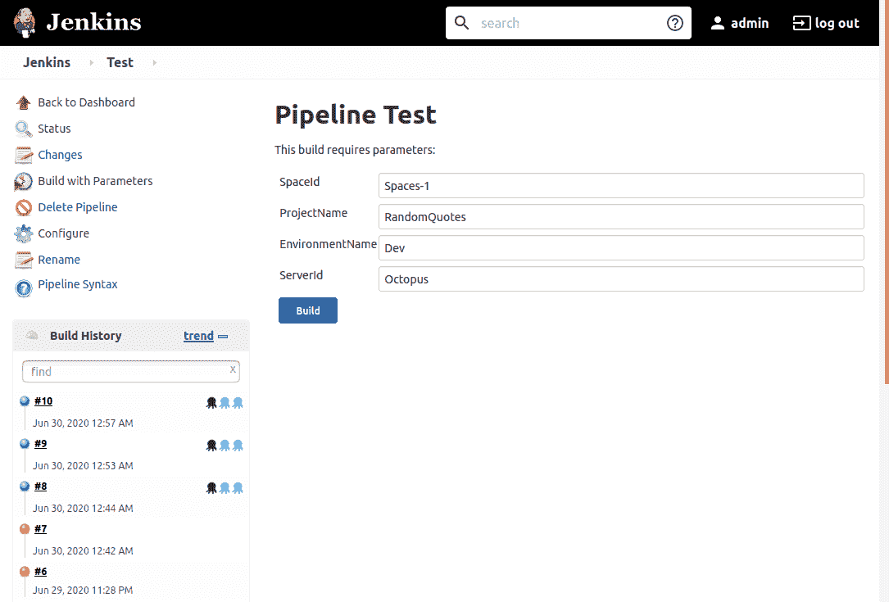](#)

## 查看构建信息

上面的管道推了两个包给章鱼。第一个是 Maven 创建的 JAR 文件。第二个是通过调用`octopusPushBuildInformation`推送的，创建并推送一个构建信息包。这个包包含关于包的元数据，包括返回到 Jenkins 构建和 GIT 提交信息的链接。

如果我们看一下被推送到内置提要的 JAR 包，我们会看到它有一个**构建信息**部分，指出这个包是由 Jenkins 构建的，还有一个链接指向 Jenkins 构建:

[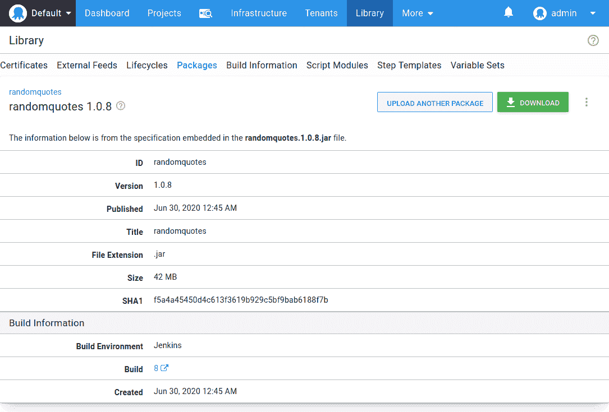](#)

但是请注意，没有关于 GIT 提交的信息。您将只能看到关于两次构建之间提交的信息，因为在 Jenkins 构建之间 GIT 存储库中没有发生任何变化，所以没有提交被记录。为了演示与元数据打包在一起的提交历史，我们将提交并在 Jenkins 中重建项目。现在，构建信息包含了 Jenkins 构建之间提交的链接:

[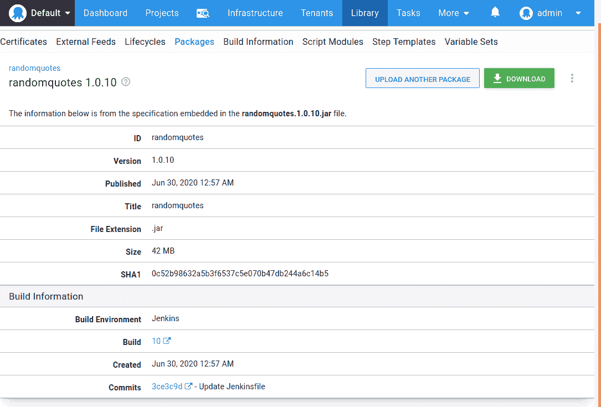](#)

你可以在我们的文档中找到更多关于构建信息的信息。

## 蓝色海洋中的管道

[蓝色海洋](https://www.jenkins.io/projects/blueocean/)是詹金斯建造体验的再现。它作为插件安装:

[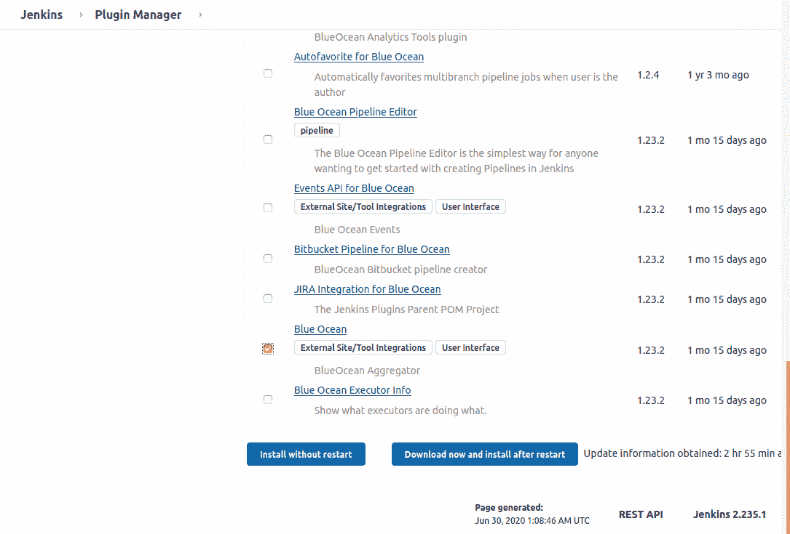](#)

蓝海界面通过直观的交互式用户界面可视化管道。虽然旧的自由式詹金斯项目可以在蓝海观看，但体验已针对管道进行了大量优化:

[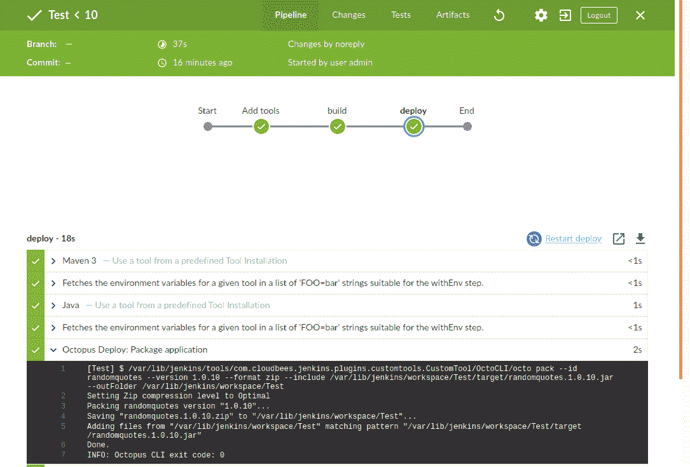](#)

## 结论

Jenkins 管道是创建和共享可重复应用构建的强大工具。它们本身是有用的，当与像 [Blue Ocean](https://www.jenkins.io/projects/blueocean/) 这样的 Jenkins 插件结合时，提供了现代构建体验的基础。有了 Octopus Jenkins 插件中的新功能，部署可以通过 Jenkins 管道进行管理，步骤组合与自由式项目中相同。

如果你正在寻找一种快速测试 Jenkins 和 Octopus 的方法，可以看看[项目 TestDrive](https://octopus.com/testdrive?utm_campaign=nav&utm_content=resources-testdrive) ，该项目通过预装 Jenkins 和 Octopus 的 vagger 提供了多个虚拟机。