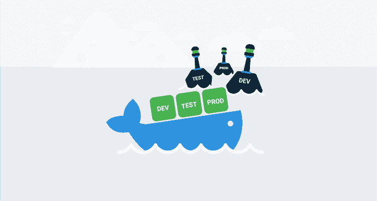
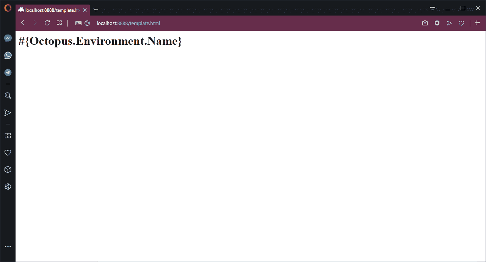
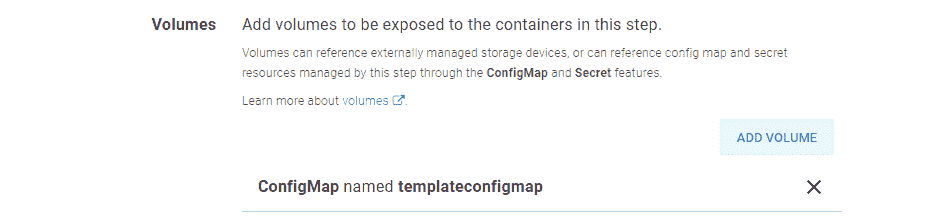
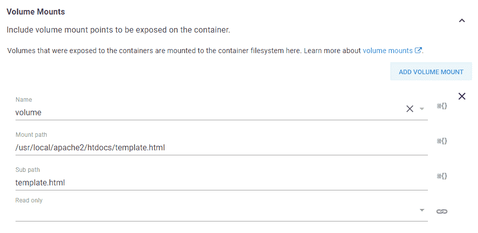
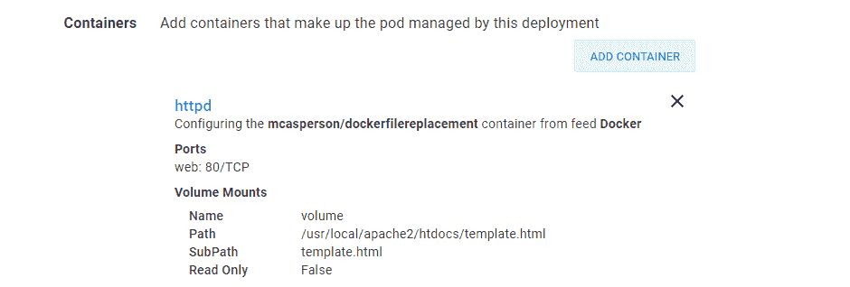
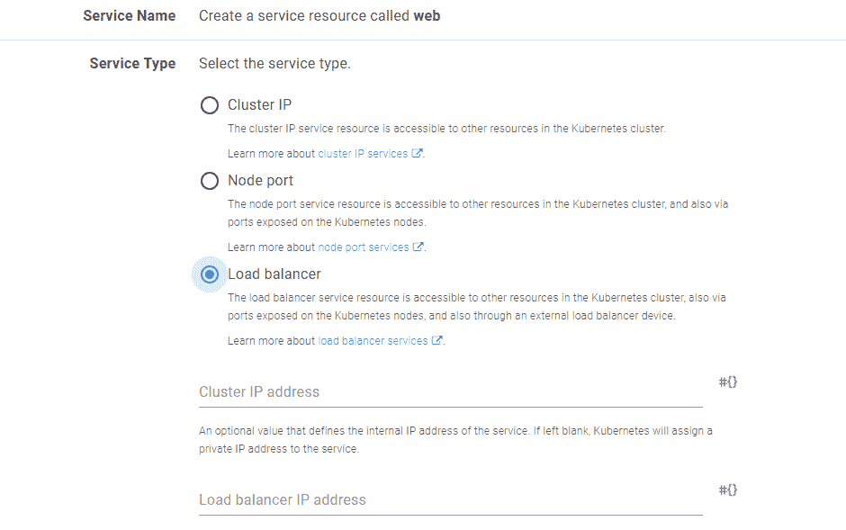
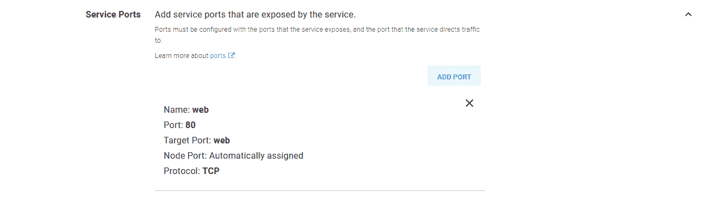
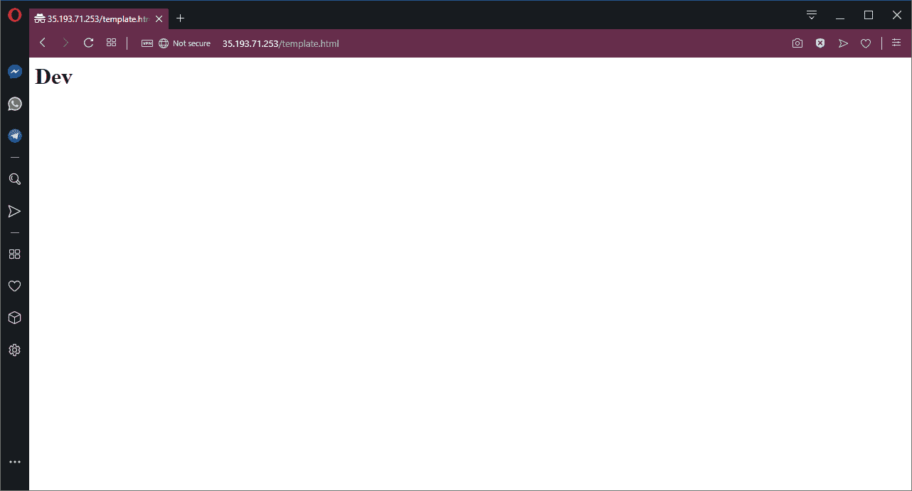
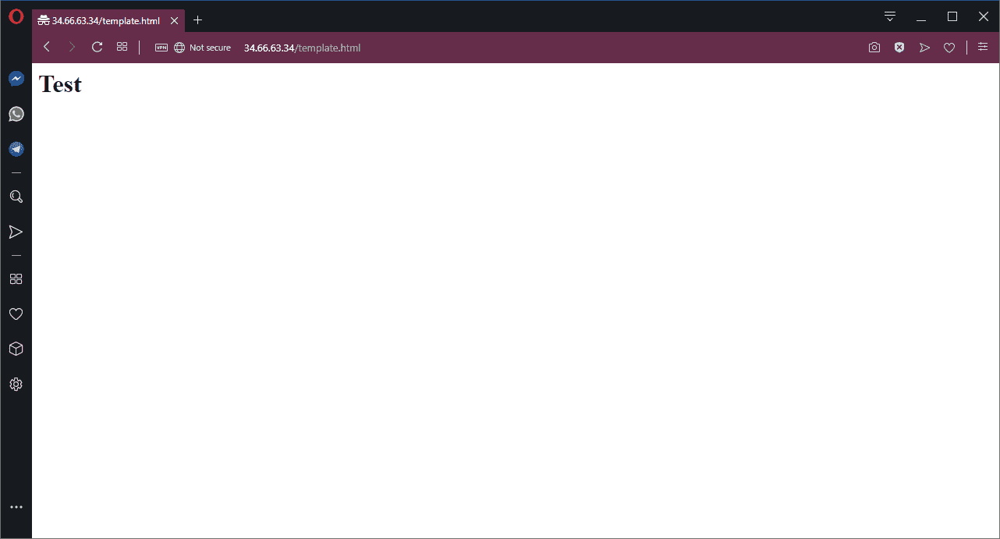

# 在 Kubernetes - Octopus Deploy 中使用模板文件

> 原文：<https://octopus.com/blog/using-template-files-in-kubernetes>

[](#)

如果您以前在 Octopus 中部署过应用程序，那么您可能已经在文件中使用了变量替换，作为一种在部署期间获取通用应用程序包并注入特定于环境的配置的方式。这个过程很方便，因为您可以生成单个应用程序工件，然后每个环境负责对其进行定制，以匹配本地基础设施。

替换应用程序包(如 ZIPs 或 NUPKGs)中的文件是非常简单的，因为这些文件是标准的归档文件，在从工件存储库下载之后、部署到最终目标之前可以很容易地修改。

Docker 图像文件不太容易处理。首先，在构建层的方式上有一些魔法，以确保新的和删除的文件都受到尊重，这意味着解包 Docker 图像文件不像解包各个层那么简单。第二，Kubernetes 希望直接从存储库中下载图像，这样就可以将 Octopus 从分发定制工件的管道中移除。

好消息是，我们可以利用社区创建的一些开源工具来下载和解包 Docker 图像，然后使用 Kubernetes 中的本机功能将单个文件挂载到 Pods 中，以实现与部署修改后的包几乎相同的最终结果。

## 示例应用程序

为了演示模板文件处理，我们有一个非常简单的基于 HTTPD 的 Docker 图像，它将显示一个带有当前环境名称的 HTML 页面。这张图片的代码可以在 [GitHub](https://github.com/OctopusDeploy/DockerFileReplacementDemo) 上找到，并已作为图片[mcasperson/docker file replacement](https://hub.docker.com/r/mcasperson/dockerfilereplacement)发布。

Docker 应用程序显示的 HTML 文件如下所示。一旦使用 Octopus 完成部署，字符串`#{Octopus.Environment.Name}`将被替换为环境的名称:

```
<html>
<body>
<h1>#{Octopus.Environment.Name}</h1>
</body>
</html> 
```

为了查看这个 Docker 映像的运行情况，我们将使用以下 Docker run 命令在本地运行 Docker 映像:

```
docker run -p 8888:80 mcasperson/dockerfilereplacement:0.0.1 
```

如您所料，在本地运行这个 Docker 映像会以未处理的形式显示 web 页面。

[](#)

*当由 Docker 直接运行时，web 服务器暴露原始模板文件。*

## 处理 Docker 图像，不使用 Docker

当我们将部署转移到 Octopus 时，第一步是下载并解压缩 Docker 映像。通常，与 Docker 映像和存储库的交互是通过`docker` CLI 工具完成的。尽管总是运行 Docker 守护进程并不十分有效，但是已经开发了额外的第三方工具来处理 Docker 守护进程之外的 Docker 映像。

第一个工具叫做 [skopeo](https://github.com/containers/skopeo) 。我们将使用`skopeo`下载一个 Docker 映像，并将其作为一个独立的文件保存在本地磁盘上。

第二个工具叫做 [umoci](https://umo.ci/) 。我们将使用`umoci`来解包`skopeo`下载的文件，允许我们访问由 Docker 映像中所有单独层创建的最终目录结构。

虽然这两个工具都是开源的，但是获得二进制版本可能是一个挑战。在这个练习中，我使用 SUSE Linux VM(即 SUSE Linux Enterprise Server)作为一个 [Octopus worker](https://octopus.com/docs/infrastructure/workers) 。SUSE 创建了`umoci`，并从 GitHub 发布页面提供[二进制下载，而标准的 SUSE 包存储库包含一个`skopeo`版本，这意味着我们不必经历尝试自己构建这些工具的痛苦。](https://github.com/openSUSE/umoci/releases)

## 下载并提取 Docker 图像

让我们看看由 Octopus `Run a script`步骤运行的 bash 脚本，它将从 Docker 映像下载、提取和保存文件内容:

```
read_file () {
  CONTENTS=""
  while read -r line || [ -n "$line" ]; do
    CONTENTS="${CONTENTS}${line}";
  done < ${1}
  printf -v "${2}" '%s' "${CONTENTS}"
}

skopeo copy docker://mcasperson/dockerfilereplacement:0.0.1 oci:image:latest
umoci unpack --image image --rootless bundle

cd bundle/rootfs/usr/local/apache2/htdocs
read_file template.html TemplateHtml
echo -e $TemplateHtml

set_octopusvariable "TemplateHtml" ${TemplateHtml} 
```

我们从一个 bash 函数开始，它逐行读取文件的内容，作为第一个参数提供。然后将结果字符串保存回一个全局变量中，该变量的名称作为第二个参数传入(因为 bash 函数只能返回整数退出代码)，使用`printf`:

```
read_file () {
  CONTENTS=""
  while read -r line || [ -n "$line" ]; do
    CONTENTS="${CONTENTS}${line}";
  done < ${1}
  printf -v "${2}" '%s' "${CONTENTS}"
} 
```

Docker 映像由`skopeo`下载，并保存在名为`image`的开放容器倡议(OCI)包中:

```
skopeo copy docker://mcasperson/dockerfilereplacement:0.0.1 oci:image:latest 
```

然后用`umoci`解压这个文件:

```
umoci unpack --image image --rootless bundle 
```

此时，我们已经在本地提取了构成 Docker 映像的文件。我们感兴趣的模板文件是`/usr/local/apache/htdocs/template.html`。使用我们之前创建的 bash 函数，这个文件的内容被读入一个名为`TemplateHtml`的变量。我们还使用`echo`将该变量的内容转储到屏幕上，以确认我们得到了预期的内容:

```
cd bundle/rootfs/usr/local/apache2/htdocs
read_file template.html TemplateHtml
echo -e $TemplateHtml 
```

一旦我们有了文件的内容，我们将它保存为一个[输出变量](https://octopus.com/docs/deployment-process/variables/output-variables):

```
set_octopusvariable "TemplateHtml" ${TemplateHtml} 
```

## 创建 Kubernetes 配置图

将文件内容保存为 Octopus 变量后，下一步是创建一个 Kubernetes ConfigMap 来保存处理后的值。我们将通过 Octopus 中的`Deploy raw Kubernetes YAML`步骤来实现这一点。

以下是该步骤将部署以创建配置图的 Kubernetes YAML:

```
apiVersion: v1
kind: ConfigMap
metadata:
  name: templateconfigmap
data:
  template.html: "#{Octopus.Action[Extract File].Output.TemplateHtml}" 
```

`template.html`字段是这个配置图的重要部分。这个键定义了我们要替换的文件名，而`"#{Octopus.Action[Extract File].Output.TemplateHtml}"`的值将导致我们在上一步中提取的文件内容被处理，然后分配给这个键。重要的是，这意味着变量`Octopus.Action[Extract File].Output.TemplateHtml`中的任何嵌套变量引用都将被替换。

最终结果是一个 ConfigMap，它保存了`template.html`文件的原始内容，但是执行了任何变量替换。

## 安装 Kubernetes 配置图

最后一步是从 Kubernetes ConfigMap 获取值，并将其装载回 Kubernetes Pod，从而替换原始的、未处理的文件。我们将通过 Octopus 中的`Deploy Kubernetes containers`步骤来实现这一点。

这是通过定义一个引用上一步中创建的配置图的卷来实现的。

[](#)

*库本内特斯卷的概要。*

[](#)

*库伯内特卷的细节。*

然后将配置图安装到 Pod 中。这里的技巧是将`Mount path`设置为要被替换的单个文件的完整路径，并将`Sub path`设置为 ConfigMap 中包含该文件内容的条目。

使用此配置，我们将在 Pod 中装入一个包含配置图中的值的文件，替换原始的通用文件。

[](#)

*一个 Kubernetes 卷挂载，向 Kubernetes 容器添加一个文件。*

为了完整起见，这是来自`Deploy Kubernetes containers`步骤的容器部分。您可以看到，我们正在部署映像`mcasperson/dockerfilereplacement`，公开端口 80，并将配置图挂载为一个卷。

[](#)

*Kubernetes 容器配置概要。*

为了方便起见，这个 Pod 将由负载平衡器服务直接公开。这为我们提供了一个公共 IP 地址，我们可以使用它与 Pod 进行交互。

[](#)

*Pod 由负载平衡器服务公开。*

[](#)

*该服务从 Pod 公开端口 80。*

## 处理结果

一旦部署完成，我们将拥有一个公共 IP，可以用来访问 web 服务器。现在，当我们打开`template.html`页面时，我们得到的是替换了变量的 HTML 模板文件。这意味着我们现在可以在网页正文中看到环境的名称。

[](#)

在开发环境中，HTTPD 展示了经过处理的 template.html 文件。

如果我们将这个部署推进到下一个环境，我们可以看到新创建的负载平衡器公开了一个将环境名`Test`放入`template.html`的 Pod。

[](#)

*相同的 template.html 文件在部署后被推送到测试环境中。*

## 结论

文件变量替换是创建可部署到任何环境的通用包的一种便捷方式。尽管还需要一些额外的步骤，但是同样的工作流也可以应用到 Kubernetes 部署中。

通过利用`skopeo`和`umoci`下载和提取 Docker 映像，然后在 Kubernetes 中使用 ConfigMaps 作为卷挂载，我们可以实现在部署期间替换模板化文件的效果，而不必发布特定于环境的 Docker 映像。