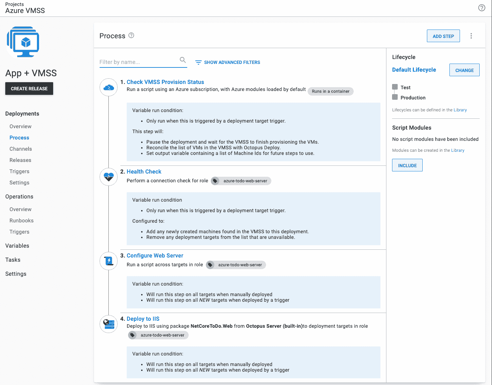
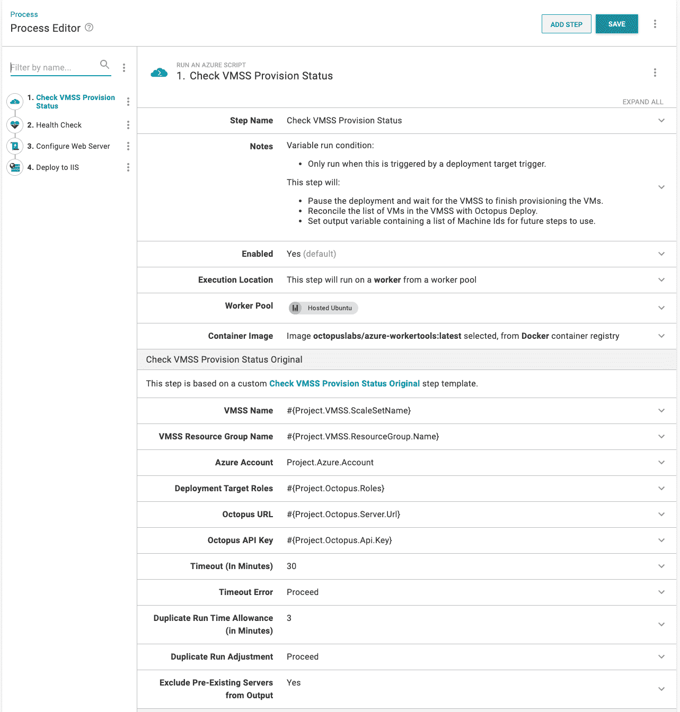
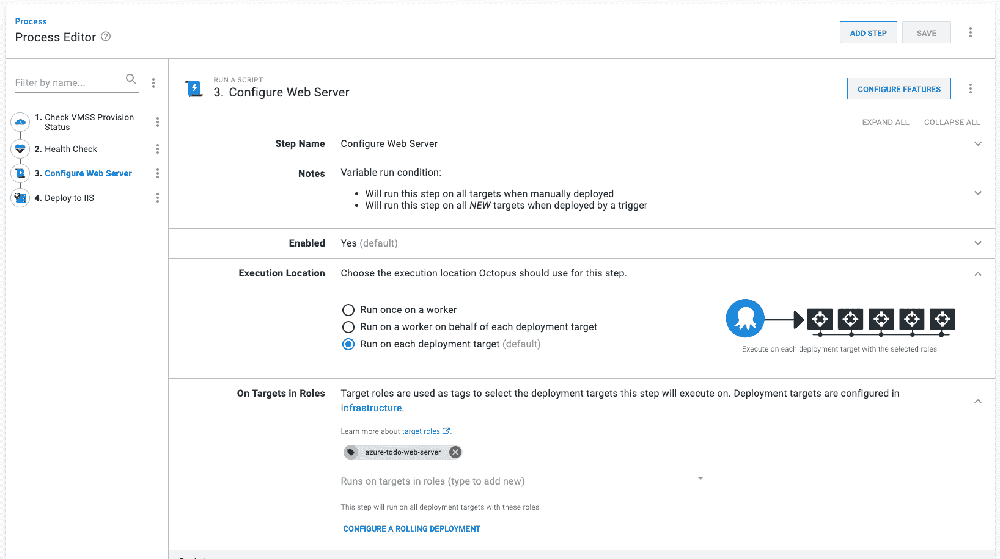
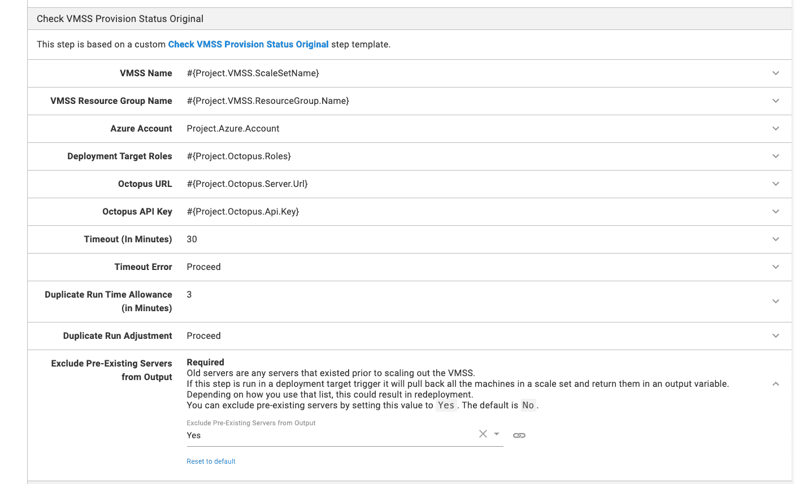
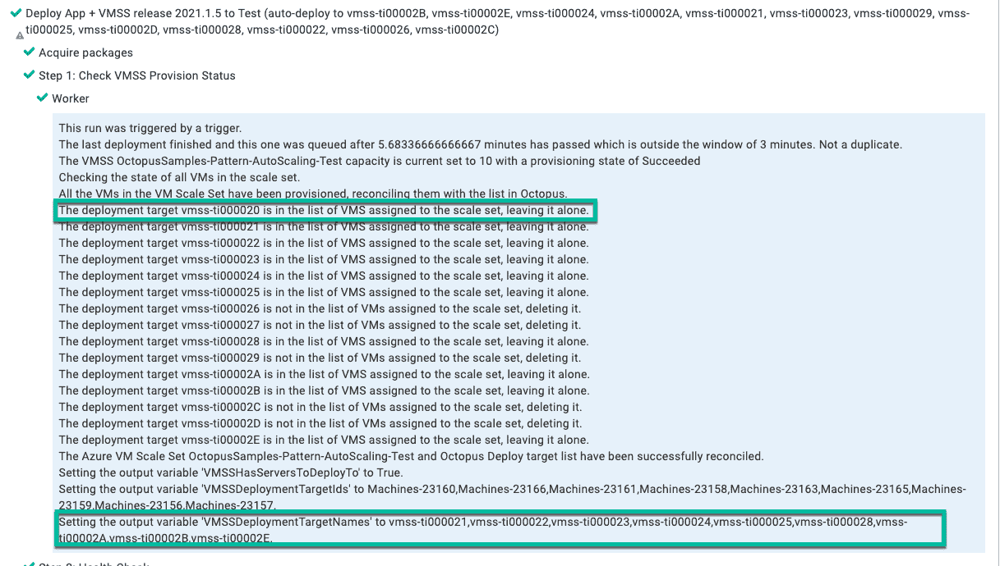
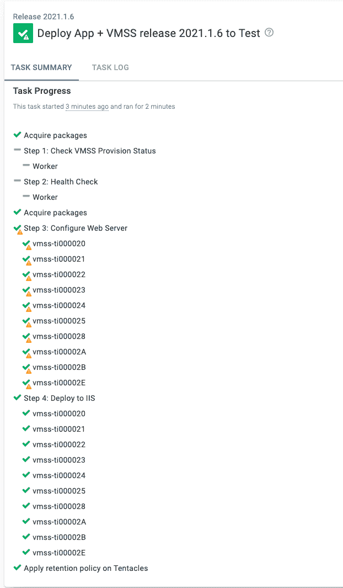
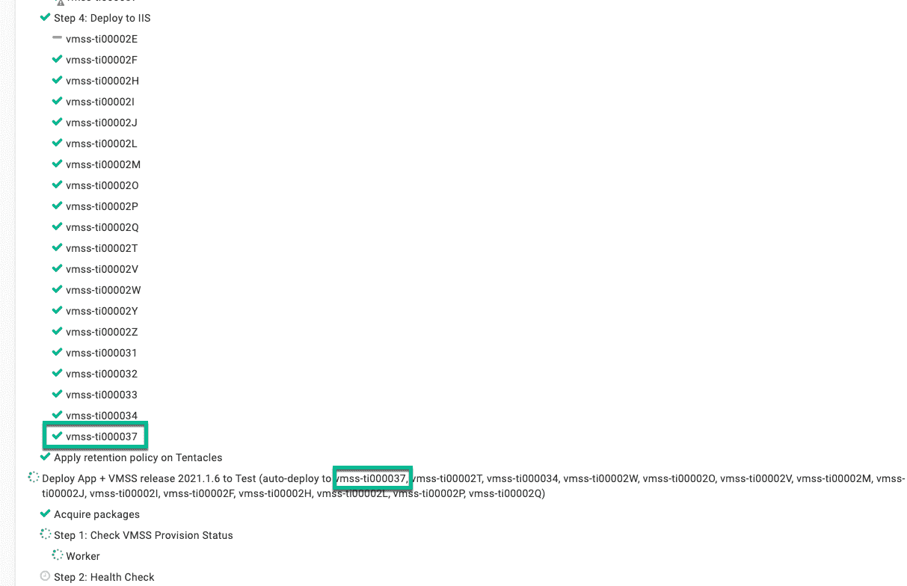
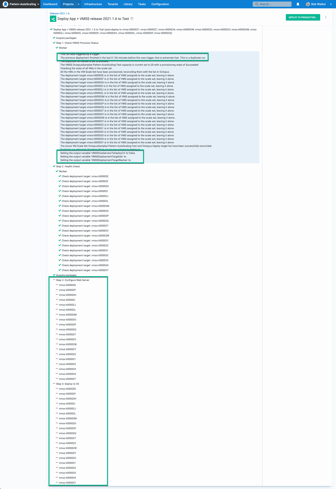

# 使用新的 Octostache 过滤器创建动态运行条件- Octopus Deploy

> 原文：<https://octopus.com/blog/variable-run-conditions-with-octostache>

我喜欢使用的 Octopus Deploy 的一个特性是[可变运行条件](https://octopus.com/docs/projects/steps/conditions#variable-expressions)。可变运行条件允许您根据业务逻辑跳过步骤。当与[输出变量](https://octopus.com/docs/projects/variables/output-variables)结合时，它们是一个强大的工具。

在我们的 2021.2 版本中，过滤器`Match`和`Contains` [被添加到 Octostache](https://octopus.com/docs/projects/variables/variable-filters#VariableSubstitutionSyntax-ComparisonFilters) 中。

在我们的[发布公告](https://octopus.com/blog/octopus-release-2021-q3)中了解更多关于 Octopus 2021.2 (Q3)发布的信息。

在这篇文章中，我将带您了解如何将可变运行条件与输出变量和新的`Contains`过滤器结合起来。

## 场景

我一直在帮助一个客户使用 Octopus 部署了 [Azure 虚拟机规模集](https://docs.microsoft.com/en-us/azure/virtual-machine-scale-sets/overview)。可以按计划或根据指标添加或删除虚拟机。基于指标的规则的一个示例是，如果 10 分钟内 CPU 使用率为 60%，则添加更多虚拟机。

对于我们客户的场景，需要注意的事项有:

*   晚上，他们会缩减规模集中的虚拟机数量
*   早上，他们向规模集添加了 10 多台虚拟机
*   它们使用标准映像，但每个应用程序都要安装和配置额外的后端软件(IIS、MSMQ、。网等。)

客户使用[部署目标触发器](https://octopus.com/docs/projects/project-triggers/deployment-target-triggers)，在添加新的部署目标时触发部署。

## 要解决的问题

从远处看，一切看起来都很棒，并且正常工作，但是放大看，就有一个时间问题:

*   虚拟机规模集无法同时完成所有虚拟机的设置。
*   Octopus Deploy 不知道虚拟机规模集；它获取一批新的部署目标并进行部署。
*   每个应用程序需要 30 多分钟来完成后端软件的安装和配置。
*   默认情况下，Azure 虚拟机规模集启用了过度配置。要求增加 10 台虚拟机，最初创建了 14 台。10 台虚拟机成功运行后，另外 4 台将被删除。但是这 4 个用 Octopus Deploy 注册了自己。

每天早上，扩展虚拟机数量都要花费两倍或三倍的时间。例如，如果他们将虚拟机数量从 5 台增加到 25 台，就会出现这种情况:

1.  Azure 创建了 27 个新的虚拟机(而不是 20 个),并开始供应过程。
2.  虚拟机上线并以分散的方式向 Octopus Deploy 注册。
3.  Octopus Deploy 中的部署目标触发器选择 5 到 8 台虚拟机并开始部署。
4.  部署开始安装附加软件。
5.  90–180 秒后，剩余的虚拟机完成资源调配。
6.  Azure 移除了额外的 7 个虚拟机。
7.  第一次部署变慢是因为这 7 个虚拟机中有一个在第一批中。Octopus 正在等待超时发生。
8.  第一次部署在 30 分钟后完成。
9.  部署目标触发器选择剩余的机器。
10.  第二次部署在虚拟机添加到虚拟机规模集后一个多小时完成。

因此，客户在早上很早就开始横向扩展。他们需要确保在工作日开始时有足够的虚拟机。

## 解决方案要求

等待一个多小时是不可接受的。虽然可以调整时间表，但由于意外负载，仍然存在伸缩问题。这时，客户问:

> 在虚拟机规模集完成所有新虚拟机的配置时，配置 Octopus 以暂停部署有多难？

经过讨论，我们确定了这些要求:

*   Octopus 应该暂停并等待虚拟机规模集完成配置。
*   应该同时配置和部署所有新的虚拟机。
*   应该跳过所有现有的虚拟机。
*   单个部署流程应该处理手动部署和由部署目标触发器创建的部署。

## 解决方案

我知道解决这个问题将使用新的[检查 VMSS 供应状态](https://library.octopus.com/step-templates/e04c5cd8-0982-44b8-9cae-0a4b43676adc/actiontemplate-check-vmss-provision-status-(deployment-targets))步骤模板(我编写该模板是为了帮助解决这个客户的问题)、[健康检查步骤](https://octopus.com/docs/projects/built-in-step-templates/health-check)和[可变运行条件](https://octopus.com/docs/projects/steps/conditions#variable-expressions)。

简化的部署流程是:

1.  **检查 VMSS 供应状态**:仅在部署目标导致部署时运行
2.  **健康检查步骤**:仅在部署目标导致部署时运行
3.  **配置网络服务器**
4.  部署应用程序

[](#)

此部署流程中的所有步骤都使用可变的运行条件。只有当部署目标触发器导致部署时，才需要运行步骤 1 和 2。我将在下一节介绍第 3 步和第 4 步。

```
#{unless Octopus.Deployment.Error}#{if Octopus.Deployment.Trigger.Name}True#{/if}#{/unless} 
```

### 检查 VMSS 设置状态

**检查 VMSS 供应状态**是一个新的步骤模板，具有以下功能:

*   它会一直等待，直到 VMSS 完成对规模集中所有虚拟机的资源调配。
*   VMSS 完成资源调配后，它会使用 Octopus Deploy 来协调规模集中的虚拟机列表。任何其他部署目标注册都将被删除。
*   设置包含计算机名、计算机 id 和一个布尔值的输出变量，该值指示是否添加了新的部署目标。

将该步骤添加到部署流程的顶部。

不要忘记将运行条件设置为之前的值。

【T2 

### 健康检查步骤

**健康检查步骤**将所有新虚拟机添加到部署中。**运行状况检查步骤**是我们如何将添加到规模集的所有新虚拟机部署到*，而不仅仅是那些导致部署目标触发器触发的虚拟机。*

设置以下选项:

*   **关于角色**中的目标:与部署目标相同的角色。
*   **运行状况检查类型**:执行仅连接测试(由机器策略执行的初始运行状况检查已经完成了完整的运行状况检查，因此无需再次执行)。
*   **健康检查错误**:跳过不可用的部署目标。
*   **新部署目标**:在部署中包含新的部署目标。

[](#)

## 跳过现有虚拟机

**运行状况检查步骤**会将*规模集中的所有*虚拟机添加到部署中。这是一个问题，因为一个要求是在部署过程中应该跳过所有现有的虚拟机。简而言之，这种情况会发生:

1.  虚拟机规模集中的虚拟机数量从 5 个增加到 25 个。
2.  部署目标触发器将看到 7 个新的部署目标并开始部署。
3.  “检查 VMSS 预配状态”步骤将一直等到添加了剩余的 13 个部署目标。
4.  运行状况检查步骤将添加新的 15 个部署目标和先前存在的 5 个部署目标。

**健康检查步骤**将触发器的部署目标数量从 7 个增加到 25 个，而不是 20 个(新虚拟机的数量)。我需要跳过其中的 5 个部署目标。

关于可变运行条件的一个鲜为人知的事实是，当一个步骤被配置为在一个角色上执行时，它们为每个部署目标运行。

[](#)

这意味着当我有 25 个部署目标时，它运行变量 run 条件 25 次。每当变量 run condition 返回`False,`时，它就会跳过那个部署目标。

父/子步骤或滚动部署也是如此。为了简单起见，滚动部署不在本文讨论范围之内。

获取部署目标 ID 很简单；使用`#{Octopus.Machine.Id}`。我需要一份*新*虚拟机的列表，以便与该 ID 进行比较。

这就是[检查 VMSS 供应状态](https://library.octopus.com/step-templates/e04c5cd8-0982-44b8-9cae-0a4b43676adc/actiontemplate-check-vmss-provision-status-(deployment-targets))步骤模板的用武之地。如上所述，它创建了一个输出变量，其中包含添加到虚拟机规模集的所有部署目标 id 的列表。

[](#)

在这个运行示例中，虚拟机`vmss-ti000020`已经存在，它从输出变量中排除了它。

[](#)

现在，我有了一个新创建的部署目标列表和要部署到的特定部署目标。最后一块拼图是可变运行条件。这就是新的`Contains` [可变滤波器](https://octopus.com/docs/projects/variables/variable-filters#VariableSubstitutionSyntax-ComparisonFilters)的用武之地。

`Contains`过滤器检查一个字符串是否包含另一个字符串。`Match`以同样的方式工作，但是它使用正则表达式。对于我的用例，正则表达式是多余的。

以下是完整的运行条件:

```
#{unless Octopus.Deployment.Error}
    #{if Octopus.Deployment.Trigger.Name}
        #{Octopus.Action[Check VMSS Provision Status].Output.VMSSDeploymentTargetIds | Contains #{Octopus.Machine.Id} }
     #{else}
        True
     #{/if}
#{/unless} 
```

运行条件是:

1.  如果有错误，那么不要运行这一步。
2.  进行手动部署时，然后部署到所有部署目标。
3.  当触发器导致部署时，检查当前部署目标是否在步骤模板的输出变量中。如果不是，则跳过该部署目标。

继续看前面的截图，我们可以看到`vmss-ti000020`被跳过了。

[](#)

手动部署将跳过步骤 1 和 2，并在所有部署目标上运行步骤 3 和 4。

[](#)

## 最后一个问题

在我的一些实践部署中，部署目标触发器会在完成第一次部署后的一分钟内运行第二次部署。尽管之前的部署已经部署到所有机器上，但还是发生了这种情况。

[](#)

那是有问题的；您不想重新部署并导致停机。谢天谢地[检查 VMSS 供应状态](https://library.octopus.com/step-templates/e04c5cd8-0982-44b8-9cae-0a4b43676adc/actiontemplate-check-vmss-provision-status-(deployment-targets))处理。它通过计算当前部署的队列时间减去前一个部署的完成时间的差值来检测重复运行。如果差值小于 3 分钟，则重复运行。您可以配置步骤模板来取消当前部署或让其继续进行。

但是这不是必需的。我们在前面配置了该步骤来删除预先存在的机器。预先存在的部署目标是在触发器触发前 3 分钟就存在的目标。除非您的部署花费的时间少于 3 分钟，否则将排除第一次运行中的所有现有部署目标。

[](#)

我们预先存在的新变量过滤器与输出变量和运行条件的组合无需额外配置即可处理这种情况。对你来说，这可能是一个有争议的问题。当我在测试中向一个虚拟机规模集添加超过 10 个虚拟机时，往往会发生这种情况。

## 结论

当您将八进制、输出变量和运行条件结合起来时，您会得到一个健壮的部署过程。Octostache 中添加了`Contains`和`Match`滤镜，使得这一组合更加强大。您可以使用更容易维护的`Contains`比较，而不是索引匹配或循环。

如果您对如何在您的部署流程中组合八进制、输出变量和运行条件有任何疑问，请联系位于[customersuccess@octopus.com](mailto:customersuccess@octopus.com)的客户成功团队。我们很乐意帮忙。

愉快的部署！