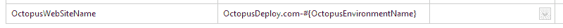

# Octopus 1.2.2 中的变量替换- Octopus 部署

> 原文：<https://octopus.com/blog/variable-substitutions>

Octopus 1.2.2 支持[变量替换](https://trello.com/card/variable-substitutions/4e907de70880ba000079b75c/12)，允许一个变量的一部分引用另一个变量。

例如，在 Octopus 1.2.2 之前，我定义了这个变量:

升级到 1.2.2 后，我现在可以使用引用预定义变量之一[的单个变量。](http://octopusdeploy.com/documentation/features/variables)

## 解决

变量可以引用其他变量，其他变量可以引用其他变量，依此类推。在部署过程中，Octopus 服务器将选择“范围内”的变量(基于部署到的环境等)。)并把它们推到触手处。然后触手会设置一些额外的特殊变量(比如`OctopusOriginalPackageDirectoryPath`)，然后它会通过应用任何替换来解析所有变量的值。在此过程中，它将检查循环依赖关系，如果检测到循环，将抛出异常。

## 自定义替换的工作方式

如果一个变量引用另一个未定义的变量，默认行为是抛出。您可以通过将特殊变量`OctopusIgnoreMissingVariableTokens`设置为`true`来进行定制，从而忽略该表达式。

如果您想完全退出该功能，请将`OctopusNoVariableTokenReplacement`设置为`true`。

默认情况下，Octopus 期望变量采用`#{Name}`的形式。如果该语法不适合您，您可以通过在变量`OctopusVariableTokenRegex`中设置一个自定义正则表达式来定制它。默认使用的正则表达式是`\#\{(?<variable>.+?)\}`。

如果您需要检查您的变量是否被正确替换，将两个特殊变量`PrintVariables`和`PrintEvaluatedVariables`设置为`true`，以打印解析前/后的值。

希望这个特性能让定义变量变得更加容易。